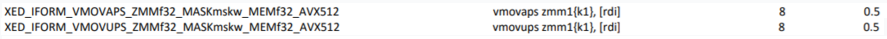

# CPU 指令二则

## aligned load & unaligned load

看 CPU 指令手册的时候，会看到有两条指令：`vmovups` 和 `vmovaps`，这两条指令都是为了 `mov packed single point data between memory/AVX register`。不一样的地方是就一个是 `u`，一个是 `a`。`u` 的意思是 `unaligned`，`a` 的意思是 `aligned`。这里的 `aligned` 的意思是什么呢？ 经过查阅，发现它是指内存地址与 `AVX register` 的长度 `align`（如 AVX2 的话就是 32 byte align，AVX512 的话就是 64 byte align etc.）。那这两条指令的 performance 有什么区别呢？答案是：自 Nehalem 以后，没有什么区别了。Intel 对两条指令进行了优化，消除了 `vmovups`的性能 penalty。可以看下手册里两条指令的 latency 和 throughput 加深一下印象（8 是 latency，0.5 是 reciprocal throughput）。结论就是在任何场合可以直接使用 `vmovups` 就 OK 了。

## non-temporal store（streaming store）

`vmovntps` 中的 `nt` 指的是 non-temporal，意思就是说告诉 CPU，我现在写的这个数据不遵守时间局部性，写完后不会读它，所以就不要遵循原来 “读进 cache（Read For Ownership） $\rightarrow$ 写 cache $\rightarrow$ 写 memory” 的规则了，直接写 memory 就行了，免得污染 cache，反而把那些需要用 cache 的程序的数据驱逐出去。这种方式也叫 `write around`，即绕过 cache 写内存。如果 cache policy 是 `write through` 的话，如果遇到大块的写操作，`write around` 肯定是比 `write through` 好的。但现在 Xeon 的 cache policy 是 `write back`，这个有没有好处就需要实验来确定了。

## 参考文献

1. [Nehalem - Everything You Need to Know about Intel's New Architecture](https://www.anandtech.com/show/2594)
2. [SKX Instruction Set Latency and Throughput Manual](https://software.intel.com/sites/default/files/managed/ad/dc/Intel-Xeon-Scalable-Processor-throughput-latency.pdf)
3. [A case for the non-temporal store](https://blogs.fau.de/hager/archives/2103)