# CPU AMX 详解

## 概述
2016 年开始，随着 NV GPU AI 能力的不断加强，隐隐感觉到威胁的 Intel 也不断在面向数据中心的至强系列 CPU 上堆砌计算能力，`增加 core count` 、`提高 frequency` 、`增强向量协处理器计算能力`三管其下。几乎每一代 CPU 都在 AI 计算能力上有所增强或拓展，从这个方面来讲，如果我们说它没认识到**势**，没有采取行动，也是不公平的。

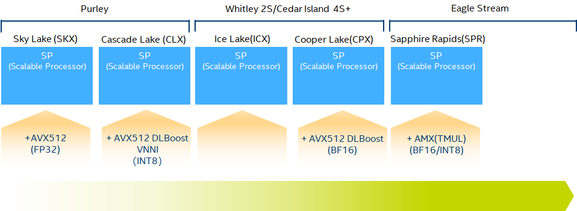

从上图不难看到，2015 年的 `Sky Lake` 首次引入了 `AVX512（Advanced Vector eXtensions）`向量协处理器，与上一代 `Broadwell` 的 `AVX2` 相比， 每个向量处理器单元的单精度浮点乘加吞吐翻倍。接着的 `Cascade Lake` 和 `Cooper Lake`又拓展了 `AVX512`，增加了对 `INT8` 和 `BF16` 精度的支持，奋力想守住 inference 的基本盘。一直到 `Sapphire Rapids`，被市场和客户用脚投票，前有狼（`NVIDIA`）后有虎（`AMD`），把自己的食盆都快拱翻了，终于意识到在 AI 的计算能力上不能在按摩尔定律线性发育了，最终也步 `Google` 和 `NVIDIA` 的后尘，把 `AVX` 升一维成了 `AMX（Advanced Matrix eXtension）`，即矩阵协处理器了。充分说明一句老话，你永远叫不醒一个装睡的人，要用火烧他。不管怎么样，这下总算是赛道对齐了，终于不是拿长矛对火枪了。

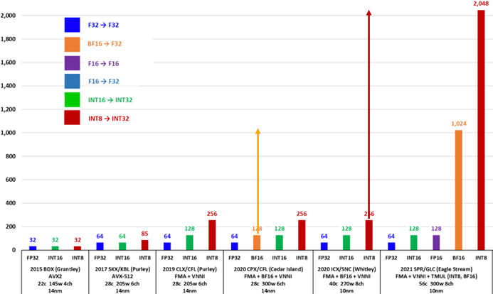

## 算力如何
AI 工作负载 Top-2 的算子：
- Convolution
- MatMul/Fully Connected 

这俩本质上都是矩阵乘。怎么计算矩阵乘，有两种化归方法：
- 化归成向量点积的组合，在 CPU 中对应 `AVX`
- 化归成分块矩阵乘的组合，在 CPU 对应 `AMX`

我们展开讲讲。

### 问题定义
假设有如下矩阵乘问题：
$$𝑪_{𝒎 \times 𝒏} += 𝑨_{𝒎×𝒌} 𝑩_{𝒌×𝒏}$$

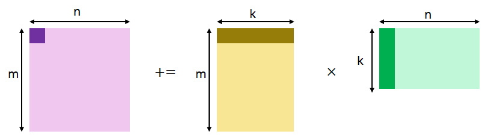

### `AVX` 如何解决矩阵乘问题

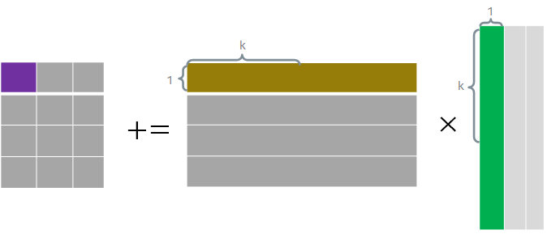

`AVX` 把向量作为一等公民，每次计算一个输出元素 $C[i, j]$，而该元素等于 $A$ 的第 $i$ 行与 $B$ 的第 $j$ 列的点积，即有：

$$C[i, j] += A[i, :] \times B[:, j]$$

不就化归成向量点积了嘛。那向量的长度是可以任意指定的，但硬件是有固定长度的，怎么办？很简单，就把每个向量切成每个长度为 $k$ 的块，多做几次就好了。这个 $k$ 就是区分 AVX 各代的主要因素。下面以 `AVX2` 为例浅释一下。
> **`AVX2` FP32 (k=8)**
> `AVX2` 使用的寄存器长度为 256 bit，也就是 8 个 FP32 数，此时 $k=8$。`AVX` 的乘加指令操作示意如下：
> 
> 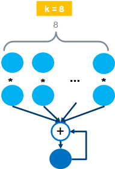
> 
> 一个时钟周期可以完成两个 8 维向量的点积操作，也叫 `FMA（Fused Multiply Add`）操作。因此每个 `AVX` 单元的 `FLOPS` 为：16 FLOPS/cycle。

以 `FP32/BF16` 为例，`AVX` 算力的代际演进如下，可以看出相邻代际增长是平平无奇的 2 倍。
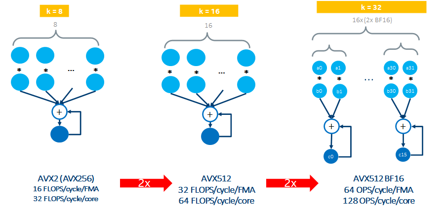

### `AMX` 如何解决矩阵乘问题

以 `BF16` 为例，`AMX` 把矩阵乘操作化归为若干个 $C_{16 \times 16} += A_{16 \times 32} \times B_{32\times16}$ 的分块矩阵乘的组合，如下所示。

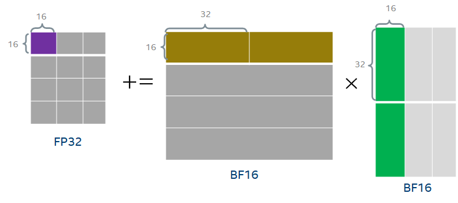

需要注意的是整个操作需要 16 个 cycle 完成，因此不难计算每个 `AMX` 单元的 `FLOPS` 为：$1024\ OPS/cycle$。这下单 `AMX` 单元与单 `AVX` 单元的每时钟周期的算力提高了 16 倍，有点像样了。目前 `Sapphire Rapids` 每个核有一个 `AMX` 单元，而有两个 `AVX` 单元，因此每核的每时钟周期算力提高倍数为 8 倍。

> 如何计算含有 `AMX` CPU 的 peak `TFLOPS`
> 公式：
>> $BF16\_peak\_FLOPS = core\_count \times frequency \times ops\_per\_cycle$

> 假设你有一个 56 核，每核有 1 个 `AMX` 单元，且 `AMX` 频率为 `1.9 GHz` 的 CPU。其 BF16 peak `TFLOPS` 应为：
> $BF16\_peak\_FLOPS = \frac{56 \times (1.9 \times 10^9) × 1024}{10^{12}} = 108.9$

## 如何实现的
AMX围绕矩阵这个一等公民的支持分为计算和数据两个部分。

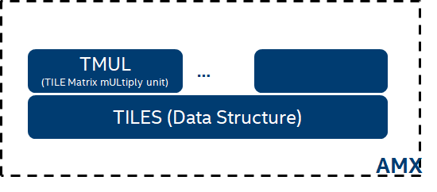

- 计算部分：目前仅有矩阵乘支持，由称为 `TMUL（Tile Matrix mULtiply Unit）` 的模块来实现。但也为后面支持其他的矩阵运算留了想像。
- 数据部分：由一组称为 `TILES` 的二维寄存器来承担。

其系统框图如下：
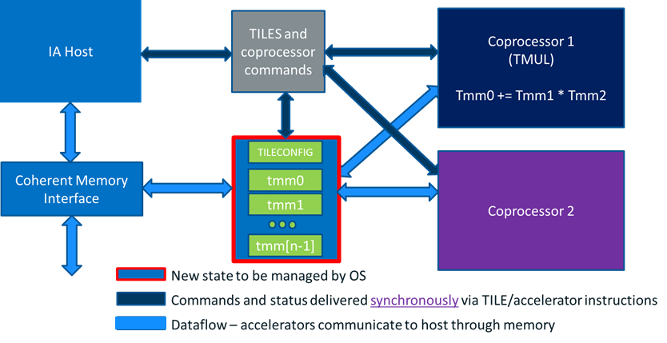

### 计算部分
`TMUL` 硬件层面的实现也比较直观，是一个典型的 `systolic array` 设计。比较好的是 array 的每一行都复用了原来的 `AVX512` 的设计，堆叠了 16 个 `AVX512` `FMA` 单元，在一个 cycle 内完成了一个 $C_{1 \times 16} += A_{1 \times 32} \times B_{32\times16}$ 的运算，因此完成整个 $C_{16 \times 16} += A_{16 \times 32} \times B_{32\times16}$ 的计算需要 16 个 cycle。

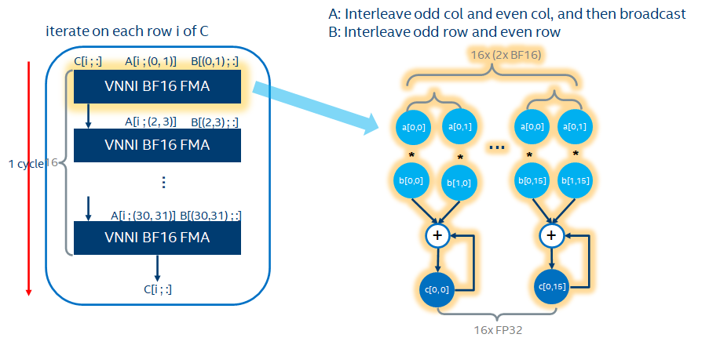

Systolic 形式的逻辑图如下，可以看出每个 cycle 输出 $C$ 的一行结果。

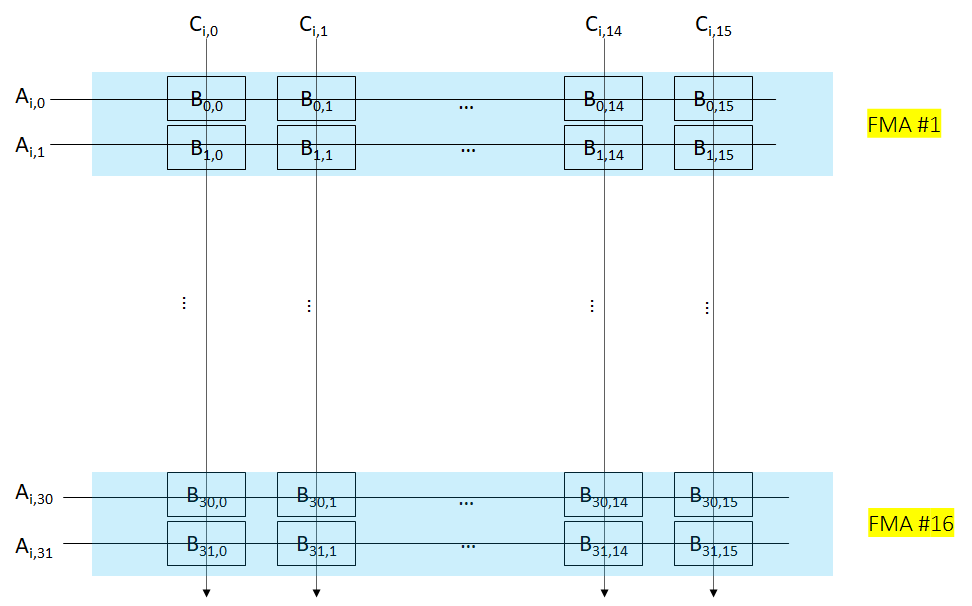

### 数据部分
每个 `AMX` 单元共有 8 组 `TILES` 寄存器，`TILES` 寄存器可以存放一个二维矩阵的子矩阵，有专门的 `load/store` 指令。

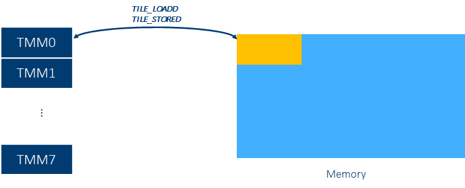

每个 `TILES` 寄存器容量为：16 行 $\times$ 64 bytes，因此可用于存放：
- $16 \times 16$ 的 FP32 矩阵
- $16 \times 32$ 的 BF16 矩阵
- $16 \times 64$ 的 INT8 矩阵 

## 路才开始

迈出脚只是路的开始，后面路(*问题*)还很长：
- HW
	- `TILES` 和 memory 之间的 `load` 和 `store` 带宽与 `TMUL` 计算能力的匹配度
	- AI workload 一般都是矩阵操作（matmul，conv等）与向量操作混杂，而向量操作有分为 `element-wise` 操作和 `reduce` 操作
		- 这 3 类操作算力的匹配度
		- 矩阵寄存器与向量寄存器之间的 data path 通畅度如何
	- ...
- SW
	- 如何提高 SW efficiency
	- 如何摆平 AI 框架要求的 `plain data layout` 与 AMX 硬件要求的 `block data layout` 之间的 `re-layout` 开销
	- ...

这些都要边走边看！