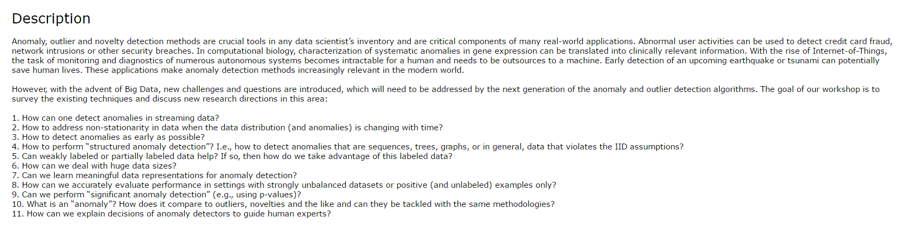
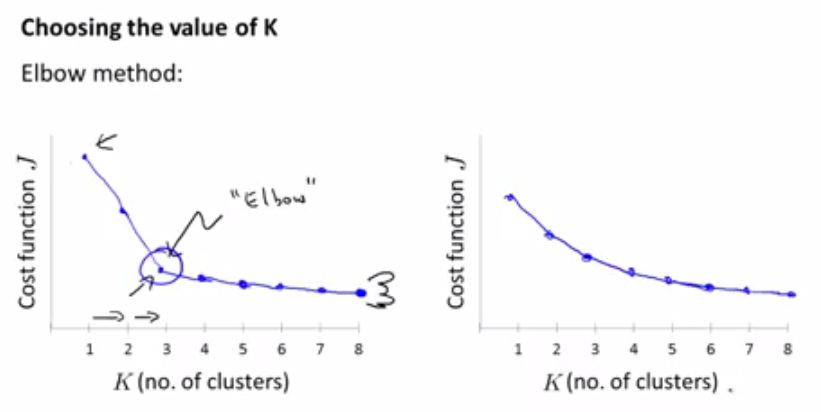
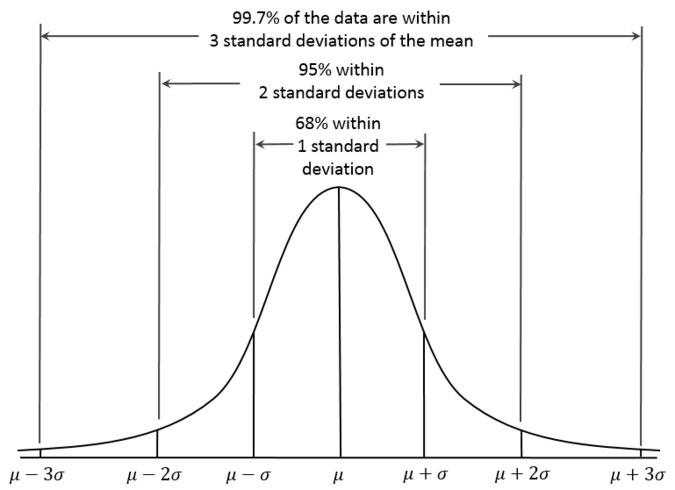
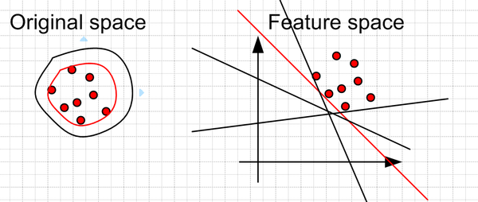
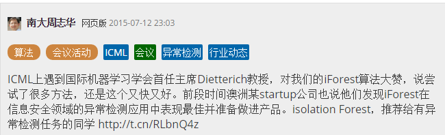

# Anomaly Detection

## Foreword
ICML'2016(International Conference on Machine Learning) set up a Anomaly Detection Workshop to better summarize and discuss how the anomaly detection is going on and where should it go on the new IoT and big data context.

## Definition

>An anomaly is *few* observation that deviates so much from most of observations so as to arouse suspicious that it is generated by a *different* mechanism.

简要归纳下，异常数据的关键特征就是：**few and different**。

根据数据的形态，我们可以把异常分为三类：
- **点异常**
	- **上下文无关的点异常**
	- **上下文相关的点异常**
- **序列异常**
	- **整序列异常**
	- **部分序列异常**
- **图异常**
 
根据数据的标注情况，我们采用的方法也分为三种：
- 无监督方法：我们手头上的数据都没有标注过，我们也不知道什么是正常数据什么是异常数据。但有一点可以肯定：正常数据的数量一定远大于异常数据。
- 半监督方法：我们手头上只有正常数据，这种情况下通常使用半监督方法。
- 有监督方法：我们手头上正常数据和异常数据都是标注过的。但是在绝大多数情况下，正常数据的体量是远大于异常数据的，所以这是一个典型的**非平衡数据集**的有监督学习问题。
 
## Point Anomaly

### 无/半监督方法

#### Metric Data Oriented Method

**Metric data oriented** methods are considered that use the concept of "metric" data(such as the distance between objects, the correlation between them, and the distribution of data) to measure the "difference".

##### Distance Based
###### 方法
- kMeans
  
    kMeans 的主要问题在于如何确定 k。工程中比较实用的是肘法（Elbow Method）。

    

###### 距离
- Euclidean Distance
- Locality based Distance
	- LOF（Local Outlier Factor）  

##### Distribution Based

认为正常数据产生于某个分布如高斯分布或者是混合高斯分布（GMM），而异常数据并不是。所以自然地，异常数据在该分布下的概率很低。可以用 `EM 算法`来训练到这个分布。广而言之，只要是生成模型（generative model）都可用于基于分布的异常检测。

#### Classification Based Method
这里我们还是想借助分类的想法划一个分隔面来把正常数据和异常数据分开。因为我们不知道什么是异常数据，所以一个合理的假设就是：我们拿一个曲面把所有正常数据包起来，新来的数据只要是落在这个曲面里面的都是正常的，外面的就是异常的。如何得到这个曲面？有一个方法就是 `one class SVM`。

##### One Class SVM
One class SVM 把我们要找的这个曲面叫做 SVDD（Support Vector Domain Description）。

实际工作中，我们一般使用 `libsvm` 包。

#### Partition Based Method
Few and Different，从分隔的角度来讲就是你不合群。那么如果我们作树形分隔时，到达异常点的路径会比正常点短。

##### Isolation Forest

## References
1. Improving isolation forest with relative mass
2. Support Vector Method for Novelty Detection
3. Estimating the Support of a High-Dimensional Distribution

*写于 2016 年 7 月* 