# 辅助式文本生成 - 文本生成新范式

## 引言
LLM 要跨越从早期采用者到大众市场的鸿沟，其必要条件是价格大众化，也就是降低每词元的价格。

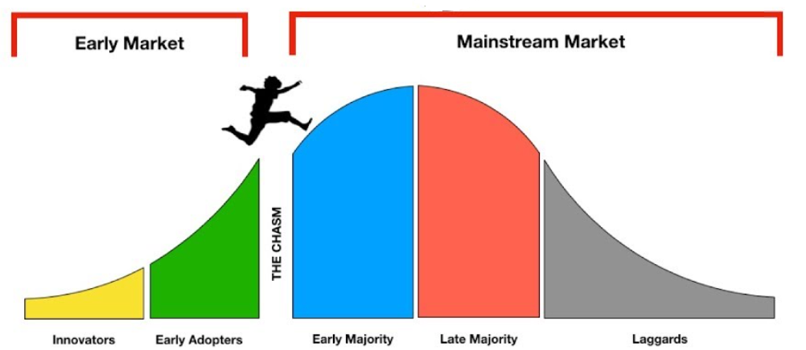

这种降低最好是“免费”的降低，而不是“讨价还价”的降低。拿电价打比方，这种降低最好是直接的电费降低，而不是使用“省电小妙招”带来的降低，这样才能真正做到大众化。在这种语境下，prompt 压缩、模型量化这类优化就是“讨价还价”型优化，它们要么需要用户具备某些专家性的知识、要么需要用户放弃一些生成质量的一致性要求，总之是需要用户付出一些成本。

> **模型量化不是“免费”的降价**
> 
> 以 `BLOOM-176B` 为例，对提示 _Once upon a time, there existed a little girl, who liked to have adventures. She wanted to go to places and meet new people and have fun._
> 
> 原始 BF16 模型的生成为：_She wanted to see the world, and she wanted to be a part of it. She wanted to make a difference, and she wanted to make the world_
> 
> 直接量化后的 INT8 模型生成为：_She wanted to learn new things. She wanted to do things she had never done before. She wanted to do things she had never done before. She wanted to_
> 
> INT8 量化模型结巴了！

辅助式文本生成带来了这种可能性，不需要“头秃”去做 prompt 压缩，也不需要小心翼翼地对模型进行量化以使质量损失控制在可接受的范围内，它通过引入一个“起草 + 审阅”的新范式，引入了一个无损的模型加速范式。其原理如下图所示：

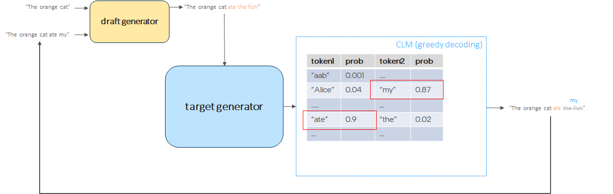

假设要对 `BLOOM-176B` 模型进行加速，在辅助式文本生成的范式中，我们把它叫做 `target generator`（蓝色框）。我们给它配一个小弟，就叫它 `draft generator`（黄色框），顾名思义，就是负责给它起草回答的。这样，班子就搭起来了，工作模式就变成了：小弟负责起草，大哥负责审阅。这种范式的好处很直白：

- 速度快。我们知道，目前的 LLM 几乎全部都是 `decoder-only` 架构的，其本质是自回归模型，也就是输出需要一个字一个字地生成，这也是 LLM 生成很难加速的本质原因，因为有 `step-wise dependency`。辅助式文本生成将 `step-wise dependency` 乾坤大挪移给了开销小的 `draft model`，而 `target model` 只需要负责验证的部分，而验证是一个典型的 `CLM(Causal Language Modeling)` 工作负载，一把头就可以全部验证完。举个实际的例子：用 `LLaMA-2-13B` 在 `A100 GPU` 上生成 `128` 个词元的时间所花的时间是对同样长度的序列做 `CLM` 前向所花时间的约 `100` 倍 $^{[1]}$。因此可以想见，`step-wise dependency` 的转移，释放了速度的潜能。

- 生成一致。因为最终输出结果是由 `target model` 审定的，在使用“精确匹配”的审定策略时，可以做到输出一致，无需生成质量的任何折衷。

完美切中我们的诉求。

我们以上图为例，我们过一遍辅助式生成范式的工作流程：

- 第一步：由 `draft model` 为提示 `"The orange cat"` 生成 `K` 个补全词。本例中, `K` 为 3，`draft model` 生成了 3 个补全词 `ate the fish`。

- 第二步：将 `The orange cat ate the fish` 送给 `target model` 执行前向 logit 计算。`target model` 算得第 2 个补全词 `the` 的 logit 并非最大，而是 `my` 最大，因此拒绝了 `draft model` 生成的第 2 个词及其之后的词，也即其接受了 $\frac{1}{3}$ 的补全词，最终本轮的输出补全词为 `ate my`，词数为 2。

- 第三步：确定是否满足结束条件，如满足结束生成；如不满足，提示变成 `"The orange cat ate my"` 返回第一步，继续生成。

在上述流程中：`K` 为草稿窗口，即每次打草稿生成多少个词，也叫 `look ahead window`；$\frac{1}{3}$ 为接受率，我们用 $\alpha$ 表示；最终经 `target model` 审定后输出的词数为 $\alpha K+1$，我们叫它`压缩率（compression ratio）`。

由此，我们可以得到一个辅助式文本生成的经验加速公式：
$acc\_ratio=\frac{l_t \times (\alpha K+1)}{Kl_d + l_t}=\frac{\alpha K+1}{K\frac{l_d}{l_t}+1}$
其中 $l_d$ 为 `draft model` 的每词元延迟，$l_t$ 为 `target model` 的每词元延迟。

可以看到，想要获得好的加速需要提高接受率 $\alpha$、降低 $\frac{l_d}{l_t}$，这两者有时是正相关的，因此需要折衷。

> **What-If 分析**
> - 设 K=4，𝛼=0.75, 如需获得 2 倍加速，需有 $\frac{l_d}{l_t} \le \frac{1}{4}$;
> - 设 K=4，𝛼=0.5, 如需获得 2 倍加速，需有 $\frac{l_d}{l_t} \le \frac{1}{8}$;

注意这里 `K` 可以不是固定值，而是根据 $\alpha$ 联动的动态值；审定策略也未必一定是精确匹配，也可以是软匹配。但这些战术上的微调，都不影响范式层面的大结论。

范式确立以后，下面就是看基于这个范式有哪些方法了。

## 现有方法

### vanilla

最直观的方法就是使用一个小模型（SLM，Small Language Model）为 LLM 打草稿了，如下图所示。该方法也是 `Hugging Face transformers` 默认的方法。

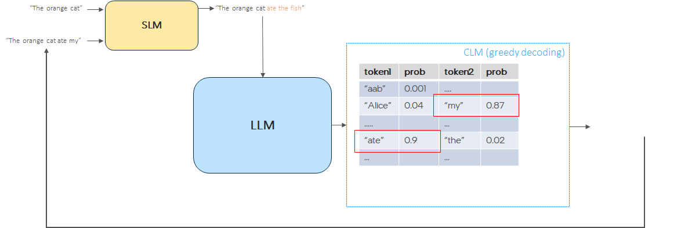

我们做一个实验看一下效果如何，实验设置如下：

> - `target model`
> opt-66b (AutoTP 跑在 8 张 A100)
> - `draft model`
> opt-125m (单张 A100 或 单路 SPR CPU)
> - IO
> 
>  input tokens: 32
> 
>  new_tokens: 32
> 
>  data type: bf16
> - 其他设置
> K：动态取值。初始值为1，如所有的 `target model` 接受了 `draft model` 所有的草稿，则 K 加 1；否则，K 减 1。

结果如下：

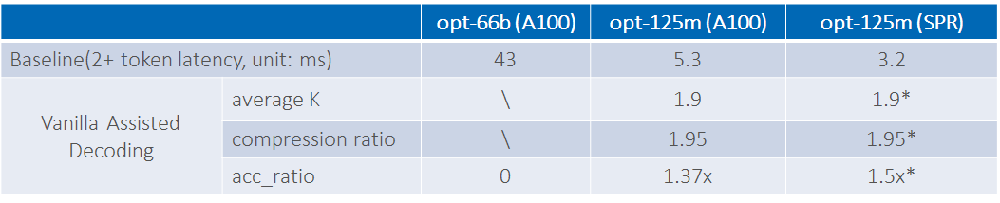

可以看到，在 `Hugging Face transformers` 下 `opt-66b` 的每词元延迟是 `43ms`，使用了 `opt-125m` 作为 `draft model` 并采用辅助式文本生成架构后，加速比达 `1.37`。甚至可以做异构辅助式文本生成，将  `opt-125m` 放到机头的 CPU 上运行，在我们的测试环境中，加速比达 `1.5`，还实现了整机硬件的充分利用。
在尝试 `vanilla` 方法的过程中，我们还发现了一些有趣的事情：

- 不同模型在相同的 `K`  下的 `compression ratio` 有较大的差异。下图是 `bloom-560m + bloom-176b` 的 `compression ratio`，可以看到其比上图的 `opt-125m + opt-66b` 低不少。我们的直觉是觉得这是由于 `bloom` 系列模型比 `opt` 系列模型词表大很多的缘故（`bloom`  为 `250880` vs `opt`  为 `50272`）。

    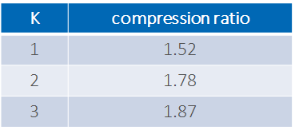

-  dynamic `K` 比较有用，免去设超参的烦恼，拯救头皮！下图给出了 `bloom-560m + bloom-176b` 在固定 `K` 和 dynamic `K` 下的 `compression ratio` 表现，可以看出效果基本与 `K=2` 相当。

    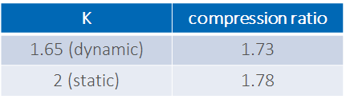

- 软匹配对提高接受率有明显的效果。对于使用 `top-K` 或者 `top-P` 这类带有随机性的生成策略的场景而言，可以不使用精确匹配，而使用软匹配。

> **软匹配策略**
> 对 `draft model` 生成的每个词元，比较 `draft model` 计算的 logit `q` 以及 `target model` 计算的 logit `p`:
> 若 `q < p`，则接受该词元
> 否则：
> - 若 $1 - \frac{p}{q} > \beta$，则接受该词元
> - 否则，拒绝该词元

看下软匹配策略的效果，以 `bloom-560m + bloom-176b` 和 `bloom-1b7 + bloom-176b` 为例，如下图，可见其显著提高了接受率。

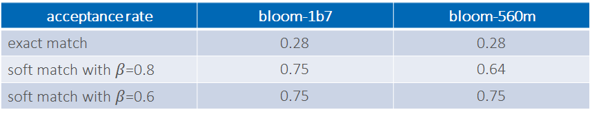

### 自投机解码
起初，在选择 `draft model` 时，一般选择同家族中的小尺寸模型，这些模型是基于同一个训练集训练出来的，且共享同一个词表，因此不难假设其与 `target model` 的对齐性较好。自投机方法的想法就是为何不直接在 `target model` 中选一些层组成小模型呢，反正 LLM 也就是一组同规格的 transformer block 的堆叠，跳过一些层并不会导致数据尺寸不兼容。由此，作者使用了贝叶斯优化方法对每个注意力层和 MLP 层选择跳过或不跳过，以最终决定抽取哪些层组成 `draft model`。这一整套路数复用的是之前 `NAS` 的套路，以在 $l_d$ 和接受率之间求得最优解。

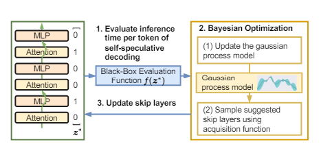

以上是事实，以下是观点。

这一套虽然很好看，但如果从工程的角度看，个人并不十分感冒。贝叶斯这一顿裁是基于某个校准数据集的，因此裁剪出的模型不管是性能（如提示长度、生成长度等）还是生成质量其实都是基于这个数据集的最优，泛化性始终都是打问号的。招子比较花，但是实用性有限。自投机的方向，个人还是觉得如果能不跳层，选前 N 层作为 `draft model` 是最好的，这样：
1) 可轻易地实现端云协同，既拆分，又能联合在线学习。
2) 前 N 层的 KV-cache 可复用，进一步加速 `target model`。
3) 在端云场景，原生支持隐私计算，可不将用户数据传给云端，只传 N 层的输出给云端。

以上仅为个人观点。

### SpecInfer

基本架构已经搭成，下面就是如何进一步加速了。从上文的估算公式可以看出，从算法上来看，提速的关键在于提高接受率 $\alpha$。那么如何提高接受率呢？关键在于审定机制，上述方法的做法是：`draft model` 在每个时间步都只起草一个词元供 `target model` 审定。这种方法对 `draft model` 和 `target model` 的 `top-1` 对齐能力有很高的要求。我们知道，一旦当前时间步 `top-1` 不对齐，后面所有的预测都作废了，因此极大限制了接受率的提高。而解脱之道就在其中！我们知道：

1）大小模型的 `top-1` 对齐肯定是不能指望太多的，否则小模型的能力其实就跟大的差不多了，不需要大的了；

2）但我们也知道，这俩能力相差也不会太大，大模型的输出在小模型的 `top-k` 中的概率肯定不会低。至此，SpecInfer 就应运而出了！

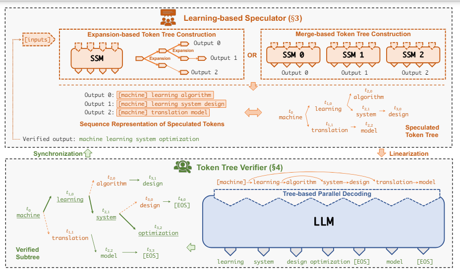

如上图所示，SpecInfer 采用 beam search 的方法（expansion based）或 ensemble 方法（merge based） 生成草稿，其目的就是为每个时间步生成多个候选词，以提高接受率。他还做了一件事情，就是把生成的多份草稿整理成一棵树的形式，以充分利用它们之间重叠的词，减少计算量，加速 $l_t$。思路很简单，也很合理。

以下是 `opt-125m + opt-13b` 在固定 `K=5` 设定下的实验结果。可以看到增加 beam width 到 8， `compression ratio` 有明显提高，再 ensemble 5 个 模型，又有进一步提高，验证了上述说法。 

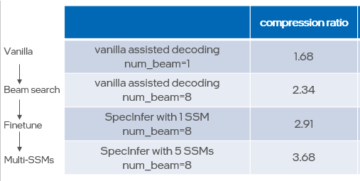

总结一下，SpecInfer 的架构如下：

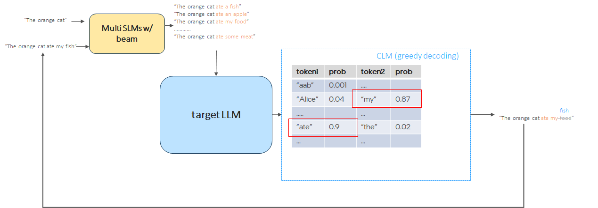

### LADE

扪心自问一下：`draft model` 就必须就是个 LLM 的小兄弟吗？好像也不见得，只要能输出接受率较高，管它是不是个有参的 LM。话说到这儿就引入了 `LADE（Look Ahead DEcoding）`。`LADE` 做得比较绝，如下图所示，它用了一个无参的、在线学习的 `n-gram` LM 作为 `draft model`。

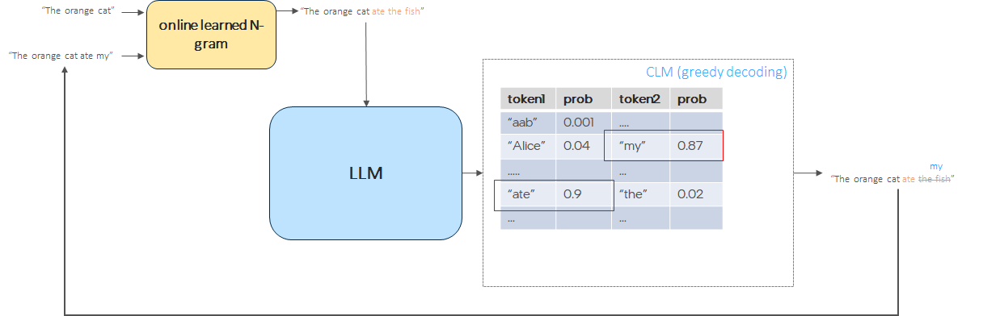

其流程如下：

> 1. 用提示中的最后一个词元为键去从 n-gram 模型找它的 `n-1` 个补全词。有可能找到多个，此时最多用  `G` 个；也有可能没有，此时随机补全
> 2. LLM 审定
> 4. 将 LLM 审定通过的新 n-gram 更新入 n-gram 模型
> 5. 如生成完成，退出；否则，返回第 1 步

下图以 `2-gram` 为例展示了该流程：

我们做个简单的实验，`7-gram + TinyLlama-1.1B-Chat-v0.3`，且 `K` 设为 20，输入长度为 32， 输出长度为 256 时，性能如下：

可以看到在 A100 单卡下，性能有 1.58 倍的提升。

## 总结

以上介绍了辅助式文本生成范式，该范式为“免费”降低文本生成每词元成本提供了可能性。同时还介绍了该范式下的四种典型算法。个人认为这一范式是深具潜力的，原因之一正如开篇所讲，其提供了无损的透明加速范式，使得用户可以专注于应用本身，而不是花很多时间、金钱和资源用于压缩模型，权衡收益。其二是其范式构型的灵活性，可以适应多种部署设计：全部部署在加速器上？可以! 异构部署，`draft model` 部署在 CPU 上， `target model` 部署在加速器上？ 也行！端云协同，`draft model` 部署在端侧， `target model` 部署在云侧？ 未尝不可！想象的画卷正在展开......

## 参考文献

1. [Fast Inference from Transformers via Speculative Decoding](https://arxiv.org/pdf/2211.17192)
2. [Draft & Verify: Lossless Large Language Model Acceleration via Self-Speculative Decoding](https://arxiv.org/pdf/2309.08168.pdf)
3. [SpecInfer: Accelerating Generative Large Language Model Serving with Tree-based Speculative Inference and Verification](https://arxiv.org/pdf/2305.09781.pdf)
4. [Break the Sequential Dependency of LLM Inference Using Lookahead Decoding](https://lmsys.org/blog/2023-11-21-lookahead-decoding/)
 