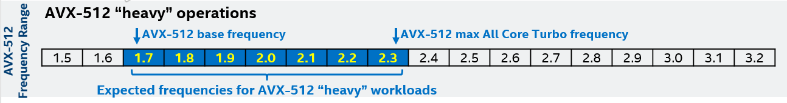
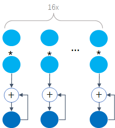
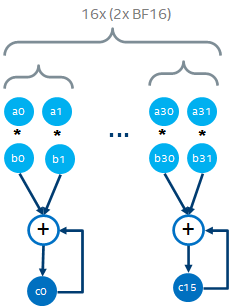
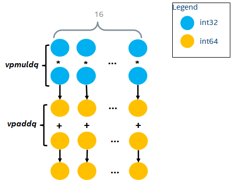
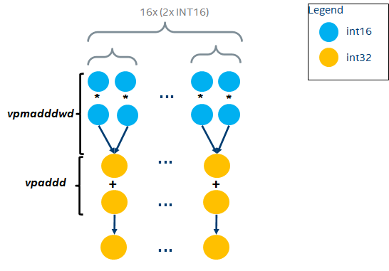
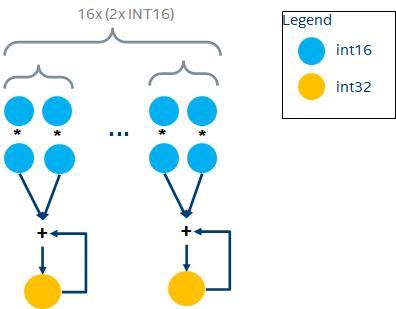
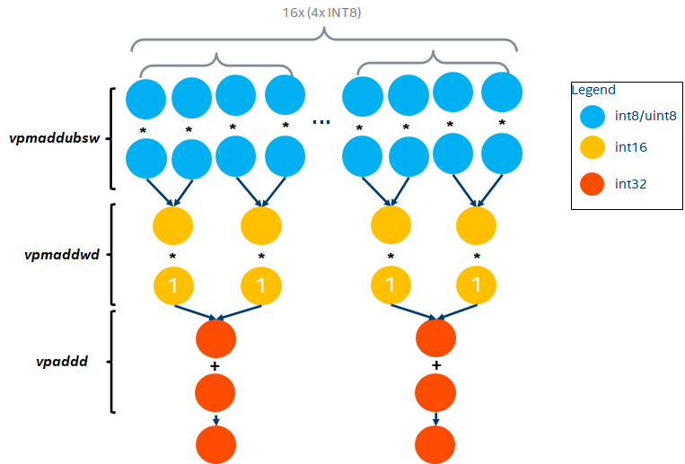
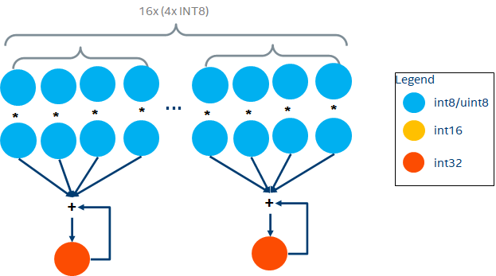

# CPU AVX 峰值算力计算

深度学习等计算密集型任务很关注设备的峰值算力，落实到具体指标，就是大家都很关心 `T(FL)OPS（Tera (FLoat) OPerations per Second）`。这里，operations 具体指的就是乘加操作。该指标在 GPU 上是明确标示供查的，但 CPU 目前并不会在 spec 中暴露 `T(FL)OPS` 指标。

一种方法可以通过跑 BLAS 的 benchmark 来测量的，这种方法有两个问题：一是需要一定的操作成本，二是受软件优化的影响（所以，如果出了问题就容易不知道这是硬件能力不行还是软件优化没到位）。因此，需要一个对硬件能力的直接估计。

这里提供一个计算 CPU 峰值算力的公式来解决这个问题。

$$T(FL)PS = socket\_num \times core\_num \times frequency \times operations\_per\_cycle$$

CPU 使用 SIMD 协处理器（co-processor）来加速 FP32 乘加运算，如 SSE、AVX2、AVX512。更具体地，是由协处理器的 `FMA（Fused Multiply-Add）`单元完成的。所以 CPU 的 `T(FL)OPS` 主要取决于 `FMA` 的计算能力。

## 浮点算力

### FP64 TFLOPS 计算
#### AVX FP64 FMA

FP64 FMA 乘加指令 `vfmadd132pd` 执行以下操作：

$$\vec{o} = \vec{a} \odot \vec{b} + \vec{c}$$

这里，向量的长度由 AVX 寄存器长度决定。

如: 一个 AVX512 寄存器可以存放 8 个 FP64（$512\ bits\ /\ (8 \times 8) = 8$）那么 $\vec{o}$，$ \vec{a}$，$ \vec{b}$ 和 $\vec{c}$ 的长度就均为 8，一个 AVX512 FMA 每个 clock cycle 可以做 8 个乘加操作，如下：

因此，FP64 的 $operations\_per\_cycle$ 可以计算如下：

$$operations\_per\_cycle = fma\_num \times (8 \times 2) = fma\_num \times 16$$

这里，乘法和加法各算一个操作，所以 8 需要乘 2。

#### 举个栗子
Xeon SkyLake 8180，一个 socket 有 28 个 core，每个 core 有一个AVX512 协处理器，每个 AVX512 协处理器配有 2 个 FMA。因此：

$$operations\_per\_cycle = 2 \times 16= 32$$

frequency 可以通过查 spec 得到，这里需要取 AVX512 max all core Turbo frequency，即 2.3 GHz。

所以，一个双路（dual-socket）SkyLake 8180 系统的 FP64 峰值 `TFLOPS` 为：

$$TFLOPS = 2 \times 28 \times (2.3 \times 10^9)  \times 32 \times 10^{-12} = 4.1216$$

### FP32 TFLOPS 计算

#### AVX FP32 FMA

FP32 FMA 乘加指令 `vfmadd132ps` 执行以下操作：

$$\vec{o} = \vec{a}\odot\vec{b} + \vec{c}$$

一个 AVX512 寄存器可以存放 16 个 FP32（$512\ bits\ /\ (8 \times 4) = 16$），因此 $\vec{o}$，$\vec{a}$，$\vec{b}$ 和 $\vec{c}$ 的长度均为 16，一个 AVX512 FMA 每个 clock cycle 可以做 16 个乘加操作，如下：

因此，FP32 的 $operations\_per\_cycle$ 可以计算如下：

$$operations\_per\_cycle = fma\_num \times (16 \times 2) = fma\_num \times 32$$

#### 举个栗子
Xeon SkyLake 8180，一个 socket 有 28 个 core，每个 core 有一个 AVX512 协处理器，每个 AVX512 协处理器配有 2 个 FMA。因此：

$$operations\_per\_cycle = 2 \times 32= 64$$

又因为 8180 AVX-512 max all core Turbo frequency = 2.3GHz，则一个双路 SkyLake 8180 系统的 FP32 峰值 TFLOPS 为：

$$TFLOPS = 2 \times 28 \times (2.3 \times 10^9)  \times 64 \times 10^{-12} = 8.2432$$

### FP16 TFLOPS 计算
#### Using AVX FP32 FMA

Xeon CPU 在 SapphirRapids（SPR）之前不支持 FP16 的原生 FMA 运算，需要先通过 `vcvtph2ps` 指令将 FP16 转换成 FP32，再通过 FP32 的 FMA 运算来完成。此时，FP16 的峰值 TFLOPS 与 FP32 的峰值 TFLOPS 是相等的。

#### AVX FP16 FMA
从 SPR 开始，AVX512 引入了 `vfmadd132ph` 指令用于 FP16 的 FMA 运算。凡是 CPU Flag 中有 `AVX512_FP16` 的 CPU 均支持原生 FP16乘加。一个 AVX512 寄存器可以存放 32 个 FP16（$512\ bits\ /\ (8 \times 2) = 32$），一个 AVX512 FMA 每个 clock cycle 可以做 32 个乘加操作，如下：

此时，FP16 的 $operations\_per\_cycle$ 可以计算如下：

$$operations\_per\_cycle = fma\_num \times (32 \times 2) = fma\_num \times 64$$

### BF16 TFLOPS 计算

Xeon CPU 从 CooperLake（CPX）开始支持 BF16 的乘加运算，凡是 CPU Flag 中有 `AVX512_BF16` 的 CPU 均支持原生 BF16 乘加。但因为其复用了 FP32 的 FMA，所以暴露出来的 BF16 指令并不是标准的 FMA，而是 DP（Dot Product）。

#### AVX BF16 DP

BF16 DP 指令 `vdpbf16ps` 操作如下：

一个 AVX512 寄存器可以存放 32 个 BF16（$512\ bits\ /\ (8 \times 2) = 32$）。因此，一个 AVX512 BF16 DP 每个 clock cycle 可以做 32 个乘加操作。

因此，$operations\_per\_cycle$ 可以计算如下：

$$operations\_per\_cycle = fma\_num \times (32 \times 2) = fma\_num \times 64$$

## 整型算力

### INT32 TOPS 计算

#### AVX INT32 MA

CPU 通过两条指令 `vpmuldq + vpaddq` 完成 INT32 的乘加操作，如下：

一个 AVX512 寄存器可以存放 16 个 INT32（$512\ bits\ /\ (8 \times 4) = 16$）。因此，一个 AVX512 FMA 每 2 个 clock cycle 可以做 16 个 INT32 乘加操作，即平均每个 clock cycle 可以做 8 个 INT32 乘加操作。

因此，$operations\_per\_cycle$ 可以计算如下：

$$operations\_per\_cycle = fma\_num \times (8 \times 2) = fma\_num \times 16$$

### INT16 TOPS 计算
#### pre-VNNI MA

在支持VNNI（Vector Neural Network Instructions）指令前，CPU 通过两条指令 `vpmaddwd + vpaddd` 完成 INT16 的 DP 操作（原因也是为了复用 INT32 的 FMA，所以选择不支持 INT16 的 FMA，而只支持 Multiply Add），如下：

一个 AVX512 寄存器可以存放 32 个 INT16（$512\ bits\ /\ (8 \times 2) = 32$）。因此，每 2 个 clock cycle 可以做 32 个 INT16 乘加操作，即平均每个 clock cycle 做 16 个 INT16 乘加操作。

因此，$operations\_per\_cycle$ 可以计算如下：

$$operations\_per\_cycle = fma\_num \times (16 \times 2) = fma\_num \times 32$$

#### post-VNNI DP

在支持 VNNI 指令后，CPU 通过一条指令 `vpdpwssd` 完成 INT16 的乘加操作，如下：

因此，一个 AVX512 FMA 每个 clock cycle 可以做 32 个 INT16 乘加操作，$operations\_per\_cycle$ 可以计算如下：

$$operations\_per\_cycle = fma\_num \times (32 \times 2) = fma\_num \times 64$$

### INT8 TOPS 计算

#### pre-VNNI MA

在支持 VNNI 指令前，CPU 通过三条指令 `vpmaddubsw + vpmaddwd + vpaddd` 完成 INT8 的 DP 操作，如下：

一个 AVX512 寄存器可以存放 64 个 INT8（$512\ bits\ /\ (8 \times 1) = 64$）。因此，一个 AVX512 FMA 每 3 个 clock 可以做 64 个 INT8 乘加操作，即平均每个 clock 做 $64 / 3$ 个 INT8 乘加操作。

因此，$operations\_per\_cycle$ 可以计算如下：

$$operations\_per\_cycle = fma\_num \times (64\ /\ 3 \times 2) = fma\_num \times 128 \ / \ 3$$

#### post-VNNI DP
在支持 VNNI 指令后，CPU 通过一条指令 `vpdpbusd` 完成 INT8 的 DP 操作，如下：

一个 AVX512 寄存器可以存放 64 个 INT8（$512\ bits\ /\ (8 \times 1) = 64$）。因此，一个 AVX512 FMA 每个 clock cycle 可以做 64 个 INT8 乘加操作。

因此，$operations\_per\_cycle$ 可以计算如下：

$$operations\_per\_cycle = fma\_num \times (64 \times 2) = fma\_num \times 128$$

## References
1. [Intel® Intrinsics Guide](https://www.intel.com/content/www/us/en/docs/intrinsics-guide/index.html)
2. [Intel®AVX512-FP16 Architecture Specification](http://kib.kiev.ua/x86docs/Intel/misc/347407-001.pdf)
3. [CUDA Toolkit Document - The Fused Multiply-Add (FMA)](https://docs.nvidia.com/cuda/floating-point/index.html#fused-multiply-add-fma)
4. [Native Code Performance on Modern CPUs: A Changing Landscape](http://video.ch9.ms/sessions/build/2014/4-587.pptx)
5. [Wiki: Multiply–accumulate operation](https://en.wikipedia.org/wiki/Multiply%E2%80%93accumulate_operation)
6. [PTX ISA: Half Precision Floating Point Instructions: fma](https://docs.nvidia.com/cuda/parallel-thread-execution/index.html#half-precision-floating-point-instructions-fma)