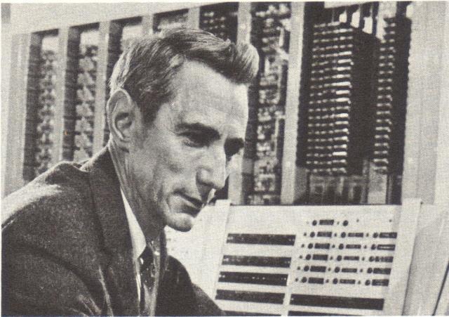

# 读后感 - 《极简算法史》

> 不认识整体就不可能认识局部，同样，不认识局部也不可能认识整体。 - Blaise Pascal

这本书，不是一部算法简史，而是一部**计算科学**简史。或者如副标题所言，讲的是“从数学到机器的故事”。作者从历史的角度，把数学、逻辑学和计算机这三个学科，溯源追流，统一到**计算**这个核心命题上。

## 计算机出现以前的故事

第一部分从数学和逻辑学两大基础学科的起源和演进开始，到莱布尼茨之梦的破碎结束。

自源头以降，通过三次成功的抽象化运动，人类创造并完善了一个令爱因斯坦为之惊叹的“人类创造的、独立于所有经验的数学”。
- 第一次抽象运动，我们从各种各样的具体事物中抽象出了“数”。
- 第二次抽象运动，我们抽象出了“几何”。
- 第三次抽象运动，我们抽象出了“代数”。

而在古希腊，亚里士多德也成功地为逻辑学抽象出了三段论，进而演化出三种截然不同的形式推理：
- 从一般到特殊 - 演绎法
- 从特殊到一般 - 归纳法
- 从特殊到特殊 - 溯因法

自此，人类拥有了两种推理方式：演绎法成为基于理性的数学工具，归纳法成为基于经验的科学研究工具。这两种推理方式，也分别成为了指导科学研究和工程实践的两大经典范式：理论范式和经验范式。

而在当时被冷落的溯因法，在数据和信息泛滥的今天，也成了第四范式-数据驱动范式的基础，被行为主义者更名为“贝叶斯推断”。

各自领域抽象运动的成功，以及对数学和逻辑学共同之处的认识，推动了调和数学与逻辑的高涨热情。莱布尼茨说他有一个理想：所有科学的思想，能化归为较少的、简单的、不可分解的思想，利用它们能定义所有其他思想。这是个多么恢弘的理想啊！如果这个理想得以实现的话，那么我们就可以通过分解和组合各种思想来达到分析和发现新思想的目的，一切如同数学中的演算过程中一样。

然而，历史从来不相信所谓的顺理成章。哥德尔在 1931 年，以不完备定理为槌，击碎了莱布尼茨之梦。他告诉人们：完备性和一致性两者不可兼得。如巴别塔一样，人类把数学作为可对一切科学思想进行理性推演的普遍文字的理想也不可能实现。

## 计算机出现以后的故事

后面的故事，更多关于数学世界与物理世界联姻的故事（或者叫异类联想（bissociation）），联姻的产物是计算机。而其中三次重要的联姻成就了计算机科学史上的三大丰碑。
- 托马斯-贝叶斯左手挽起溯因法，右手挽起互联网。在大数据的汹涌大潮下，勇敢放弃了因果推断，认真攻克“如果用户上次买了鞋子，这次会买帽子的可能性”的问题，把相关性和行为主义的功夫玩得炉火纯青，成为今天几乎所有互联网系统的核心大脑。

     

- 香农用信息论让二进制计算和电子电路成功牵手，成功把比特（bit）扶上信息论的王座，奠定了信息时代和数据时代长久繁荣的基础。

    

- 维纳用控制论串联起计算与电子电路，教会人们在这个混沌的、不确定的物理世界，放弃预测，**快速响应才是最好的预测**，以及怎么去做。
  
    

这些，不仅重新塑造了我们所处的这个世界，也重塑了我们的思维。现在，信息论、控制论、系统论以及贝叶斯推理已经成为我们在信息时代和智能时代分析和解决问题的必备思维模型。

## 关于现在，关于将来

当我们把目光从过去，移到现在和未来，我们正面临一个“大”世界。吴军说过计算机思维和传统人类思维最基础的区别是“小大之辨”。我们面临的这个世界，数据和信息量其量之大、变化之快亘古未有，超越人类的进化速度，所以进化论不能帮我们解决这个问题。于是，我们借助于贝叶斯推理、信息论和控制论，更进一步地，借助于物化的计算机和算法来帮助我们处理信息，我们致力于可计算化。所以，最近十几年来，我们有“计算广告”、“计算摄影”、“计算设计”......，这份越来越长的“计算 xx”名单，背后是越来越多的责任让渡。

但计算机和算法只能帮助我们做出事实判断，无法做出价值判断。计算机结合大数据产生的力量在不断增长，帮助我们做到了原本无法做到的事。而硬币的另一面是，我们不仅无法做到，也无法理解计算机是如何做到的，因为无法理解，所以也很难干预。我们好像正在跟一个情商幼稚但能力惊人的舞伴共舞，我们还没准备好。

计算机和算法不会制造偏见，但它会传播偏见，以前所未有的速度。当人类输入带有价值偏见的信息后，计算机会把它们当作事实！书中举的一个例子：如果你在搜索引擎中输入“科学教”三个字，大多数搜索引擎提供的网站信息都是对其有利的。这并不是巧合，因为大多数互联网用户都是在研究自己感兴趣的主题，所以他们先入为主地对搜索话题抱有积极的想法。你看，计算机和算法误把人们的偏见性输入当成了事实，最终成为了传播偏见的帮凶。在事情本身是什么和人们所相信的”事情是什么“之间，计算机和算法挡了一块屏幕 —— 一块切实的屏幕。

但我们没有退路，我们唯有前行，唯有相信技术能解决技术带来的问题，不忘人类走到此处的初心，并尝试更多的抽象和异类联想，努力解决问题。

莫虑前途远，开航逐便风。