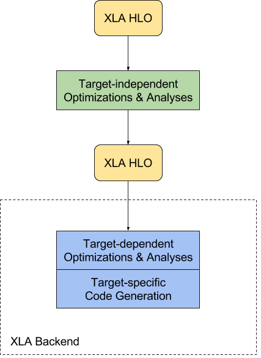
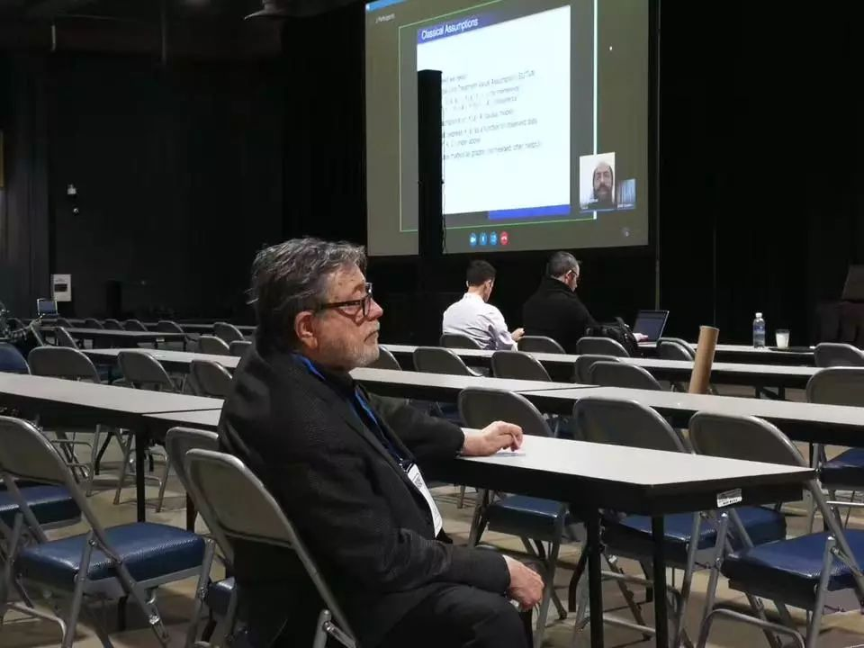

# 深度学习框架演进简史

> 以古为鉴，可以知兴替。-《新唐书 魏征传》

本文主要从设计思路上分析，不考虑生态、分布式等其他应用角度。

## 第一代 - 要有光

一言以蔽之，以 `Caffe` 为主要代表的第一代框架把神经网络建模为 **`a sequence of layers`**。我妄加揣测一下，这是由当时的历史条件和发起者的背景所共同决定的：

1. 当时 Deep Learning 发迹于计算机视觉领域，其主要算法为 CNN，而典型 CNN 的各模块是单入单出（Single Input Single Output），这种情况下用 pipeline 来描述就足够了。

2. 即便后续出现了 `GoogleNet` 这种宽拓扑以及 `ResNet`这种含 shortcut 的拓扑，因为 CNN 的每层都比较 heavy，使得 layer 间的并行从计算平台层面来讲尚不能获得什么好处，所以把 layer flat 成 pipeline 也还不失为不错的选择。

3. 而 `Caffe` 的发起者贾扬清来自 Berkeley 视觉实验室，对做计算机视觉的而言，pipeline 是一个再自然不过的选择。

随着 Deep Learning 从计算机视觉滥觞，发扬到 NLP 和 Speech 领域，以及 CNN 出现了越来越多的非 pipeline 型拓扑，第一代架构暴露出越来越多的问题，其中两个最大的槽点是：

1. pipeline 型架构显然不是建模 Deep Learning 拓扑的最好表达，越来越多的、各式各样的拓扑结构（如RNN，attention mechanism）呼唤一个更好的表达：graph。

2. layer 粒度太粗，使得每想出一个新的拓扑，几乎都需要自己写一个或几个 layer。算法科学家需要下载、编译、加代码、再编译、debug......太折腾人了也太考验算法科学家的编程能力了。时代呼唤一个粒度更细的算子的框架，使得算法科学家可以灵活地用提供的那些算子搭出一个新的层。

于是，第二代框架应运而生。

## 第二代 - 要有图

如上所述，以 TensorFlow/MxNet/Caffe2 为代表的第二代深度学习框架的核心设计思路就是 **`a graph of operators`**, 如果要加一个形容词的话, 那就是 `a static graph of operators`。其主要特点是:

1. 把深度神经网络拓扑建模成一个DAG（Directed Acyclic Graph），以解决 RNN 类拓扑的 layer 间并行问题。

2. 包含很多各个粒度的算子，既有 `max` 这种底层算子（兼顾灵活度）也有 `conv` 这种高层算子（兼顾效率），这种实现是一种费力的讨好，算是一种 practice 而不是 design。同时，也造成了用户对 TensorFlow API 凌乱的印象和使用上的困惑。

为了解决第二个问题，即如何对外暴露最细的 operator 但同时保持 efficiency，再往大了讲，即如何让用户只关心逻辑而让框架来解决优化问题，大家的探索方向集中于设计一个 `domain specific compiler` 上。典型的有 TensorFlow 的 XLA（Accelerated Linear Algebra），DMLC 的 TVM（Tensor VM）。下面借用 TensorFlow XLA 的一张图来描述该想法，图中 HLO 指 High Level Optimizer。



这个想法的基本要义我曾在 Neural Network Virtual Machine 一文中做过阐述，下面从流程上阐述。具体地说 XLA 会接受用户的图定义作为输入，该图定义会首先经过一个 target independent 的 optimizer，在这里做一下与底层设备无关的、普适的分析和优化工作（如 Common Subexpression Elimination，operator fusion，buffer analysis for allocating runtime memory for computation 等），生成一个中间表示（IR，Intermediate Representation）；然后对该中间表示针对特定硬件做 target dependent 的优化；最后生成特定于该硬件的目标代码。可见，这是一个典型 LLVM 架构。既然是 VM，我们就要考虑第二步的工作采用 JIT（Just-In-Time）式（runtime编译）还是 AOT（Ahead-Of-Time）式（编译时编译好，runtime 只使用）。TensorFlow XLA 两者都支持。我倾向于把它称为 2.5 代框架。

## 第三代 - 要自由

历史的车轮滚滚向前，转眼到了人人高喊 AI 民主化的大跃进时代。Bayes 之父的 NIPS 演讲都没人听了，所有的人都在为 AI 疯狂打 call。民主化的本质是傻瓜化。也就是，下至黄口小儿上至黄髫老翁，只要想玩 AI，分分钟能加入，是民主化的最高目标。



前两代框架总体上来讲还是为效率而生、面向工程师设计的，因此采用了声明式的编程范式（Declarative Program Paradigm or Symbolic Program Paradigm），这种范式的典型编程模式如下：

```
1. define a graph(definition graph)
2. init a session with the definition graph
3. compile the graph in session to find best runtime configuration
4. run the session
```

这种编程模式可以称为`专家模式`（典型的 follow 专家模式设计的东西有：单反相机、Latex），它的优点是效率高、速度快；缺点就是“所见非所得”，debug比较困难，需要你对做的事情比较了解不然容易抓瞎。民主化呼唤“所见即所得”的`傻瓜模式`系统（典型的傻瓜模式的东西有：傻瓜相机、Word），为普罗大众而设计，于是第三代框架诞生了，它以“所见即所得”为设计目标，以 `imperative program paradigm` 为主要设计手段，以 pyTorch、 TensorFlow Eager、MxNet Gluon 为主要代表。它们的主要特点是：

1. Fast debugging with immediate run-time errors。不需要 `tf.Print` 了，直接 `print` 就可以啦。
2. Support dynamic models。可以根据上一个 operator 的 runtime 输出决定下一个 operator 用哪个。

我们把第三代框架总结为：**`a dynamic graph of operators`**。

## 故事没有结束......

如我们所知，世上没有免费的午餐，`flexibility is often at odds with performance`。第三代框架以牺牲性能为代价来换取灵活性，怎么在提供灵活性的同时获得更多性能，MxNet Gluon 提供了 Hybridize 接口，相信 pyTroch 这些也会有所行动，如名所示，我们正走在微妙地平衡 2.0 和 3.0 的道路上。

*写于 2017 年 12 月*