# 有趣的Cache创新 @ HotChips'33

当前流行的计算架构（包括 CPU、GPU 等）主要还是遵循冯-诺依曼架构，如下：

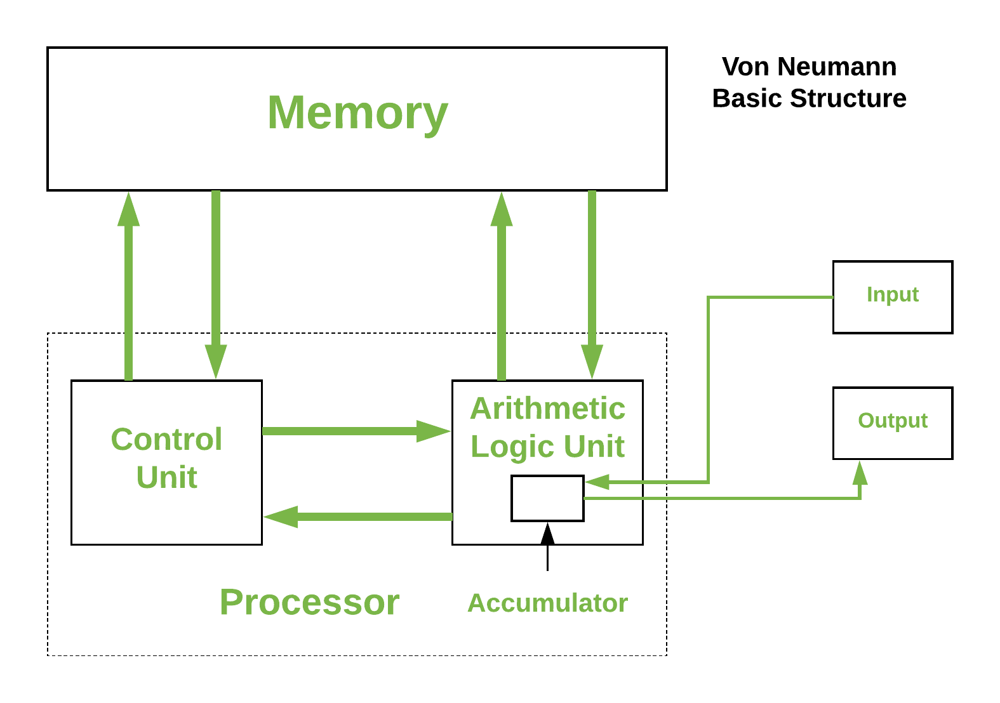

冯-诺依曼体系结构用 `(processor, memory, IO)` 三元组来建模计算架构，三者配合开展工作，因此会受到短板效应的影响，一般叫`冯-诺伊曼 bottleneck`。随着工艺技术和应用（如 AI 等计算密集型应用）的推进，行业在 processor 的计算能力上取得了摩尔以及超摩尔的进展，而 memory 的进展以 density 为主，在带宽上远远没赶上 processor 的脚步。

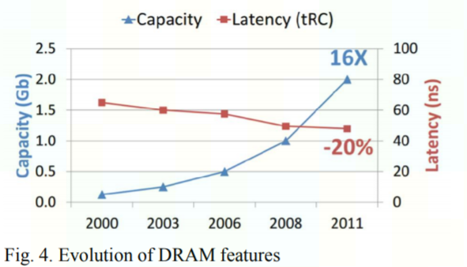

下面这个图告诉我们：HW FLOPS 20 年提高了 90,000 倍，而 memory 带宽仅有 30 倍，连脚拇指都没摸上。因此，memory 带宽越来越成为冯-诺依曼结构释放系统性能的瓶颈，称为 `memory wall`。

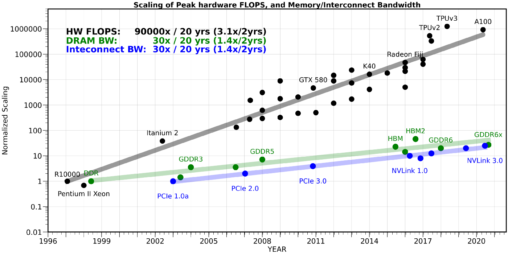

冯-诺依曼系统在设计时其实已经加入了 `memory hierarchy`，来缓解 `memory wall`：

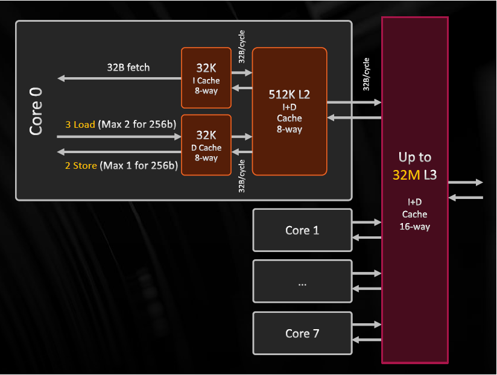

基于这个 hierarchy，继续缓解 `memory wall` 有两种方法：
- 提高 memory 带宽。这个近几年在 `HBM -> HBM2 -> HBM3` 的演进中有所进展，但仍不能独力满足需求。

- 提高 memory access 的 cache bound，充分利用 cache 的高带宽优势。提高 cache bound 对算法、系统、微架构都有一定的要求，这里只谈对微架构的要求，主要是提高 cache 的 capacity。

知易行难，由于 `Moore 定律`的放缓，使得增加 die size 或者减少逻辑电路面积变得越来越难，因此暂时堵住了暴力增加 on-die SRAM 来增加 cache capacity 的路。

从 HotChips'33 CPU track 的 presentations 来看，工业界花了很多心思在如何解决这个问题上，`innovate more on Cache than IPC(Instructions Per Cycle)`。AMD，Intel，IBM都提出了自己的方法。
	
## **AMD - Zen 3**

### `V-Cache（Vertical Cache）`

`V-Cache` expands L3 cache size through advanced **package** innovation, since the slow-down of Moore's Law makes increasing die sizes and/or shrinking logic circuits hard. 

具体示意图如下：

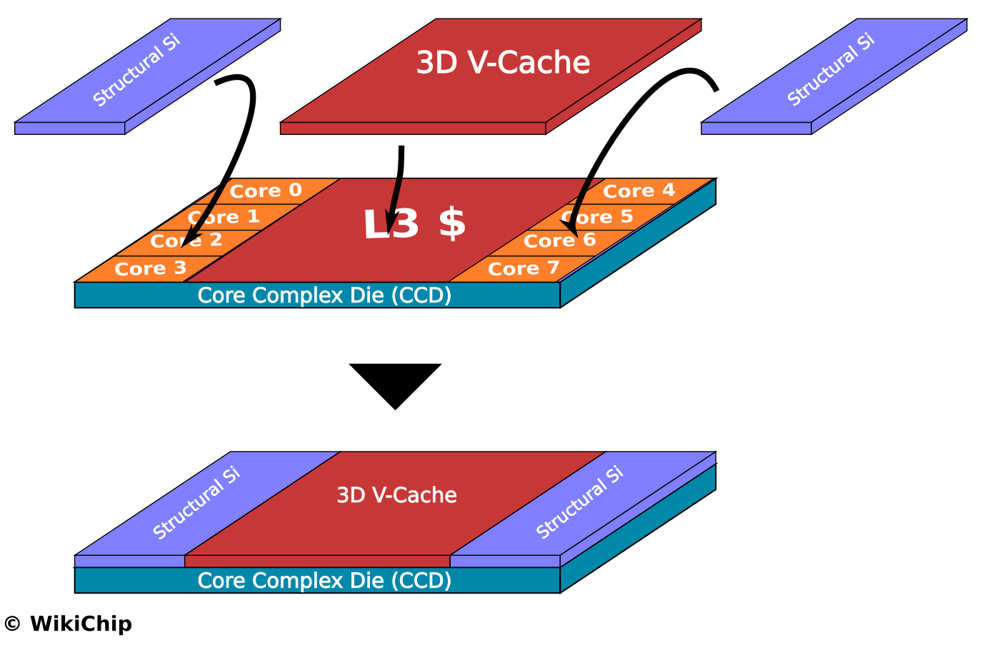

通过 `V-Cache` 封装技术，`L3$` 的 capacity 得到了增加：
- **per CCD（Core Complex Die）**
	`32 MiB L3 Cache + **64 MiB V-Cache** = 96 MiB`
- **per core**
	`96 / 8 MiB = 12 MiB`

[Chips and Cheese](https://chipsandcheese.com/) 测试了 `V-Cache`对 data access latency 和 bandwidth 带来的影响。如下：
- Latency

	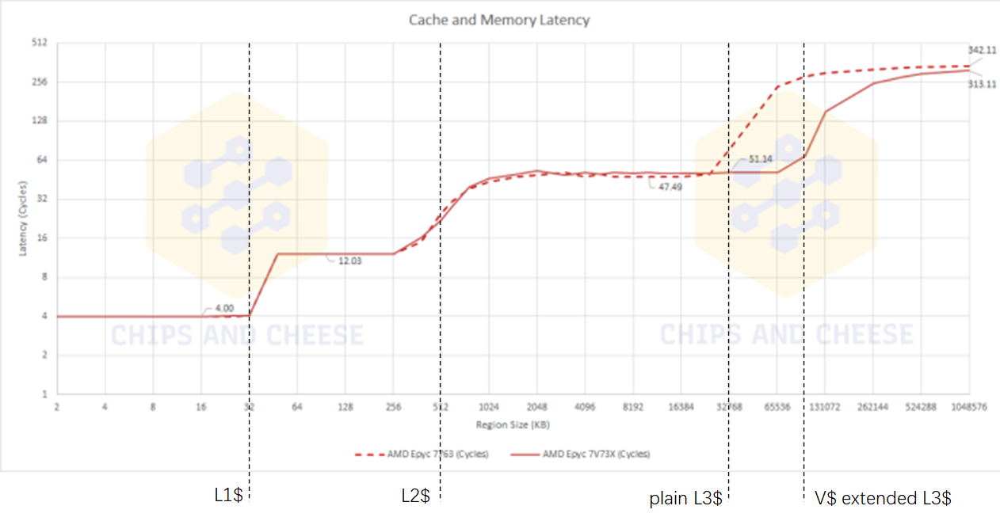
- Bandwidth

	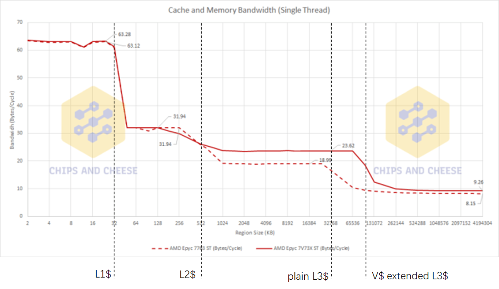

由上述测试数据，可以得到一些观察：

1. `V-Cache` 和 on-die 的 `L3$` 是统一编址使用的，因此在 on-die L3$ 能 cover 的区域内，数据访问延时有 3~4 个 cycles 的增加，但 3~4 个 cycles 已经是一个很小的数字了。

2. `V-Cache` 增加了 cache capacity，减少了 32M~256MB 大小数据的 access latency。且由于增加了 cache 命中率，增加了实际的数据访问带宽。

### L3 Fabric

AMD claim 了：`bi-directional ring bus, 156.8 GB/s per CCD@4.9GHz`。

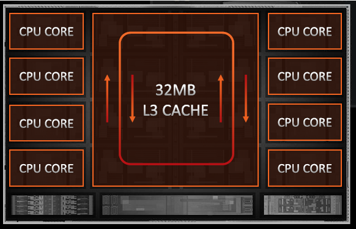

这个就还好吧，core 少的时候采用 ring 作为 NOC 感觉算是个公认的 practice，没有 get 到点。

## **Intel - CPU and GPU**

### `Rambo Cache`

`Rambo Cache` 与 `V-Cache` 思路相同，但使用了不同的封装技术。从已公开的资料看，与 `V-Cache` 采用 cache 3D stacking 方法不一样，`Rambo Cache` 使用了 2.5D stacking 的 interposer 方法（与 HBM 与计算器件连接的思路相似），区别是`Rambo Cache` 使用了 `Foveros Interposer`。具体看如下两张图便知：

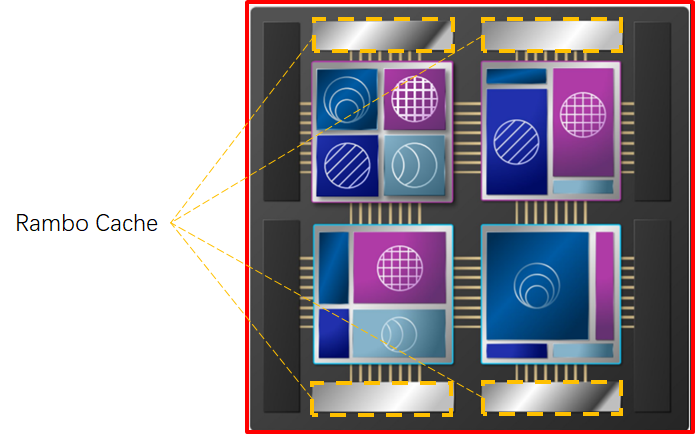

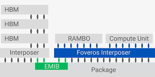

目前尚无公开的 `Rambo Cache` 第三方测试数据，只有一张 Intel 自己展示的 projection 效果展示，如下：

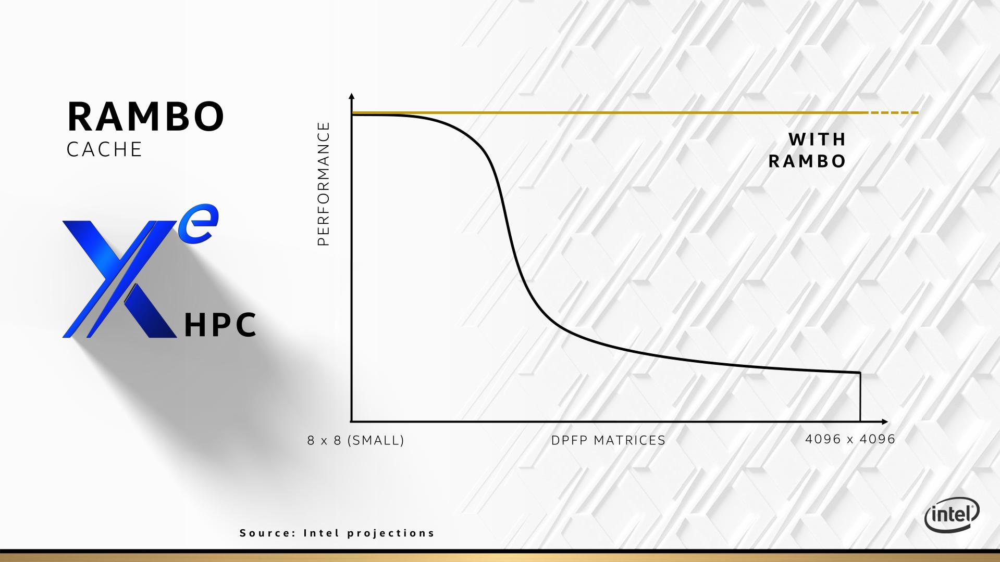

## **IBM - Telum**

### `Virtual Cache`

AMD 和 Intel 的做法是延续性创新：不改变目前的 memory hierarchy 组成，通过封装工艺来增大 cache size，以解决当前 on-die cache size 无法增大的问题。

IBM 的 `Virtual Cache` 玩的是颠覆式创新，想玩一把大的，改变当前通行做法，即：`L2$` 和 `L3$` 是分离的物理器件。它取消了物理的 `L3$`（及 `L4$`，若有），而是使用 chip 内 `L2$` 作为 `virtual L3$`，机箱内 `L2$` 作为 `virtual L4$`，妥妥的 `cache pooling` 的想法。

具体做法为：
- 首先，直接把 `L2$` size 扩大到 `32MB`，这是别人 `L3$` 的 size；
- 然后，取消 `L3$`，把同一个 chip 内的其他 core 的 `L2$` 作为当前 core 的 `L3$`；
- 最后，把同一个 drawer（即机箱）内的其他 chip 的 core 的 `L2$` 作为当前 core 的 `L4$`。

对一个 `4-socket`的 drawer（如下图所示）而言，每个 drawer 有 4 个 sockets，每个 socket 有 2 个 chips，每个 chip 有 8 个 cores。

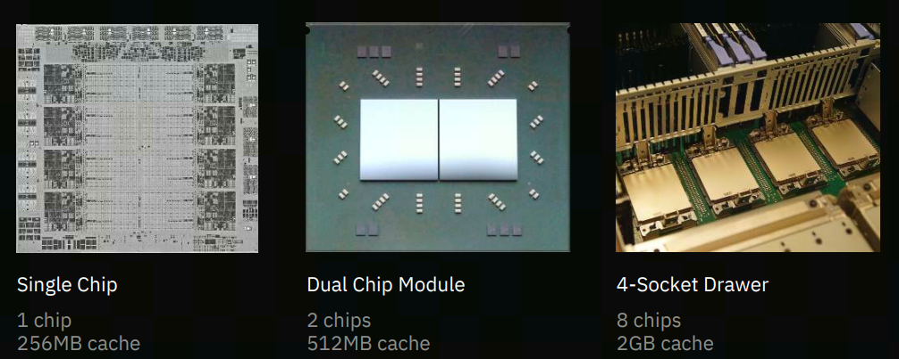

对每个 core，有：
- `32MB` 的 private `L2$`（19-cycle latency）
- `224MB`（`32MB * 8 - 32MB`）的 on-chip shared virtual `L3$` （`+12ns` latency）
- `7936MB`（`256MB * 8 - 256MB`）的 off-chip shared virtual `L4$`

具体 spec 如下：

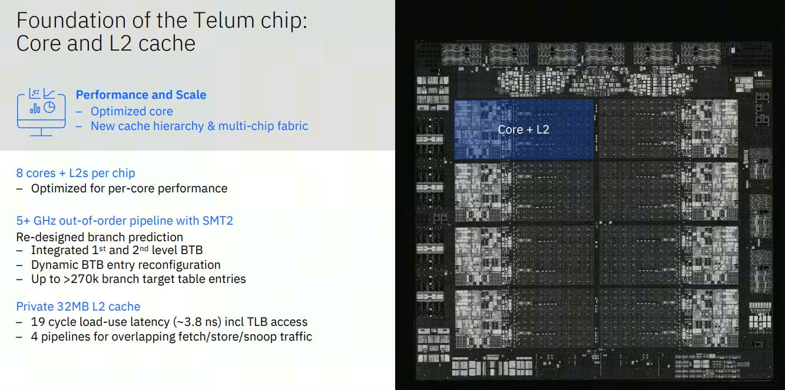

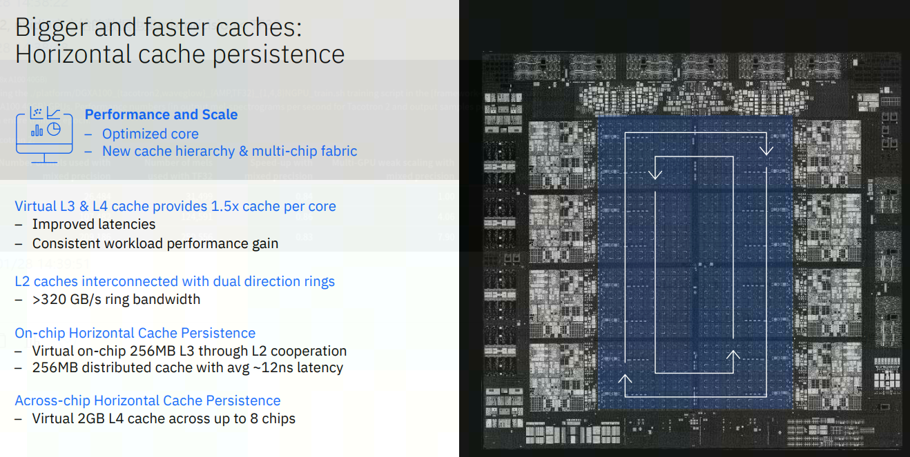

目前尚无公开的第三方测试数据，IBM 自称 `using this virtual cache system, there is the equivalent of 1.5x more cache per core than the IBM z15, but also improved average latencies for data access. Overall there is a per-socket performance improvement of >40%`。

想法很酷，但魔鬼总是在执行细节中，需要时间来告诉我们答案。

## 参考文献
1. HotChips'33 slides
2. [AMD’s V-Cache Tested: The Latency Teaser](https://chipsandcheese.com/2022/01/14/amds-v-cache-tested-the-latency-teaser/)
3. [Deep Diving Zen 3 V-Cache](https://chipsandcheese.com/2022/01/21/deep-diving-zen-3-v-cache/)
4. [Did IBM Just Preview The Future of Caches](https://www.anandtech.com/show/16924/did-ibm-just-preview-the-future-of-caches)
5. [Hitting the Memory Wall: Implications of the Obvious](https://www.eecs.ucf.edu/~lboloni/Teaching/EEL5708_2006/slides/wulf94.pdf)
6. [AI and Memory Wall](https://medium.com/riselab/ai-and-memory-wall-2cb4265cb0b8)
7. [Ten Lessons From Three Generations Shaped Google’s TPUv4i](https://www.gwern.net/docs/ai/2021-jouppi.pdf)
8. [45-year CPU evolution: one law and two equations](https://arxiv.org/ftp/arxiv/papers/1803/1803.00254.pdf)

*写于 2022 年 1 月*