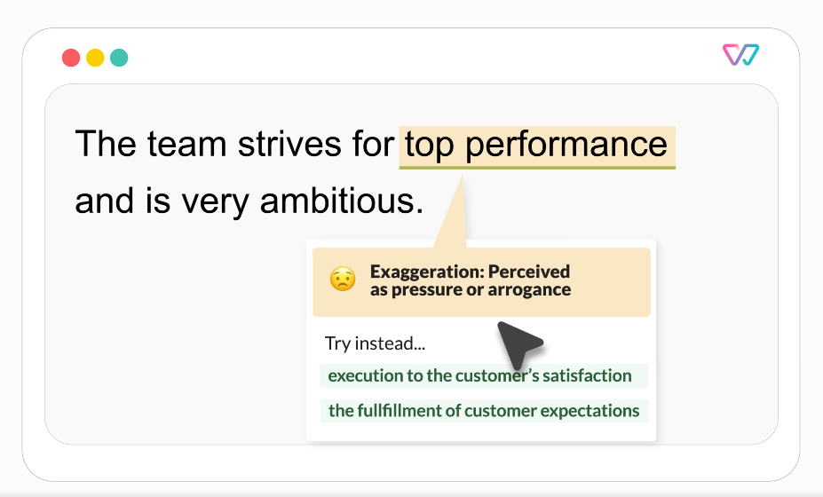

<html>
<head>
<h1> 案例：利用 Hugging Face 进行复杂文本分类 </h1>
<h2> Witty 与 Hugging Face 专家加速计划的成功案例 </h2>
</head>
<body>

*如果你对如何更快构建 ML 解决方案感兴趣，请访问 [专家加速计划](https://huggingface.co/support?utm_source=blog-post&utm_medium=blog-post&utm_campaign=blog-post-classification-use-case) 登陆页面并通过 [此处](https://huggingface.co/support?utm_source=blog-post&utm_medium=blog-post&utm_campaign=blog-post-classification-use-case#form) 联系我们！*

### 业务背景
随着 IT 技术不断地在发展并重塑我们的世界，在行业内创造一个更加多样化和包容性的环境势在必行。旨在应对这一挑战，[Witty Works](https://www.witty.works/) 于 2018 年成立了。 Witty Works 起初是一家为组织提供多元化建议的咨询公司，主要帮助这些组织使用包容性语言撰写招聘广告。为了进一步拓展这项工作，Witty Works 在 2019 年构建了一个网络应用程序，以帮助用户用英语、法语和德语编写包容性的招聘广告。其写作助手可以作为浏览器扩展程序使用，从而迅速扩大了使用范围，人们可方便用它来自动修复和解释电子邮件、Linkedin 帖子、招聘广告等内容中的潜在偏见。该程序为内部和外部沟通提供了一种解决方案，通过一种循序渐进方式，高亮出有偏见的词语和短语并解释其存在的潜在偏见，从而促进文化变革。

<p align="center">
    <br>
    <em>Witty Works 写作助理的建议示例 </em>
</p>

### 首次实验

Witty Works 起初选择了一种基础的机器学习方法来从头开始构建他们的助手。对预训练的 spaCy 模型进行迁移学习，通过此方法，助手可以：
- 分析文本并将单词转换为词干，
- 进行语言学分析，
- 从文本中提取语言学特征（复数和单数形式、性别）、词性标签（代词、动词、名词、形容词等）、词依存标签、命名实体识别等。

通过使用语言学特征并用特定知识库来检测和过滤所有单词，助手可以高亮非包容性词汇并实时建议替代方案。

### 挑战

Witty Works建立了一个词汇表，其中德语和英语两种语言各有大约 2300 个非包容性的词汇和短语。上述基础方法对 85% 的词汇有效，但对上下文相关的词汇无效。因此，需要构建一个上下文相关的非包容性词分类器。这样的挑战（理解上下文而不是仅识别语言学特征）使得使用 Hugging Face transformers 变得必要。
  
```diff
上下文相关的非包容性词示例：
  Fossil fuels are not renewable resources. V.S. He is an old fossil. 两句中的 fossil。
  You will have a flexible schedule. V.S. You should keep your schedule flexible. 两句中的 flexible。
```

### [Hugging Face 专家计划](https://huggingface.co/support?utm_source=blog-post&utm_medium=blog-post&utm_campaign=blog-post-classification-use-case) 提供的解决方案

- #### **获取如何正确选择 ML 方法的指导**
最初选择的方法是使用基本版 transformers 模型（用于提取特定非包容性词的嵌入）。 Hugging Face 专家建议从上下文相关的词嵌入切换到上下文相关的句子嵌入。在该方法中，句子中每个词的表示取决于其上下文。

Hugging Face 专家建议使用 [Sentence Transformers](https://www.sbert.net/) 架构为整个句子生成嵌入。使用该方法，语义相似的句子间的距离小，而语义差距大的句子间的距离也大。

在该方法中，Sentence Transformers 使用 Siamese 网络和三元组网络结构来修改预训练的 transformer 模型，以生成 “语义上有意义” 的句子嵌入。

生成的句子嵌入作为基于 KNN 或逻辑回归的经典分类器的输入，以构建上下文相关的非包容性词分类器。

```diff
Witty Works 首席数据科学家 Elena Nazarenko：
“我们根据每个词的句内上下文生成上下文相关的嵌入向量（BERT 嵌入）。然后，我们只保留 “目标” 词元的嵌入，然后计算最小角度（余弦相似度）”
```

要微调一个基于基本版 transformers 的分类器（例如简单的 BERT 模型），Witty Works 需要大量标注数据。每个类别的目标词都需要数百个样本。然而，这样的注释过程既昂贵又耗时，Witty Works 无法承受。

- #### **获取如何正确选择 ML 库的指导**

Hugging Face 专家建议使用 Sentence Transformers Fine-tuning 库（又名 [SetFit](https://github.com/huggingface/setfit)），这是一个对 Sentence Transformers 模型进行少样本微调的有效框架。结合对比学习和语义句子相似度，SetFit 在标注数据很少的文本分类任务上实现了高精度。

```diff
Hugging Face 的首席布道官 Julien Simon：
“用于文本分类任务的 SetFit 是一个值得添加到 ML 工具箱中的好工具。”
```

Witty Works 团队发现每个特定词汇只需 15-20 个标注句子，精度就足够了。

``` 差异
Witty Works 首席数据科学家 Elena Nazarenko：
“最终，因为不需要创建一个大型标注数据集，我们节省了时间和金钱。”
```

减少句子数对于确保模型训练快速和高效至关重要。同时，出于另一个原因，这也是必要的：Witty Works 采用了一个明晰的、高度受监督的、基于规则的方法来 [积极管理偏见](https://www.witty.works/en/blog/is-chatgpt-able-to-generate-inclusive-language)。减少句子数对于减少人工审核训练集中句子的工作量非常重要。

- #### **获取如何正确选择 ML 模型的指导**
Witty Works 面临的一个主要挑战是模型部署后需要达到低延迟。没有人能容忍等待 3 分钟才能获得改进文本的建议！ Hugging Face 和 Witty Works 双方均试验了多个 sentence transformer 模型，最终选择了 [mpnet-base-v2](https://huggingface.co/sentence-transformers/all-mpnet-base-v2)，将其与逻辑回归和 KNN 结合使用。

在 Google Colab 上进行首次测试后，Hugging Face 专家指导 Witty Works 在 Azure 上部署该模型。由于模型本身已经足够快，因此无需额外的优化。

```diff
Witty Works 首席数据科学家 Elena Nazarenko：
“与 Hugging Face 合作为我们节省了大量时间和金钱。
在实施复杂的文本分类用例时，人们可能会感到迷茫。
由于它是最受欢迎的任务之一，因此 Hub 上有很多模型。
Hugging Face 专家指导我从大量基于 transformer 的模型中选择出最合适的模型。
另外，模型部署过程中我也得到了很好的支持。”
```
  
### **结果和结论**

训练集中句子的数量从每个单词 100-200 个减少到每个单词 15-20 个。 Witty Works 最终获得了 0.92 的准确度，并以最少的 DevOps 工作量成功地在 Azure 上部署了自定义模型！

```diff
Lukas Kahwe Smith 首席技术官兼 Witty Works 联合创始人：
“独自从事 IT 项目可能具有挑战性，即使是做一个尝鲜版（Early Access Product, EAP）对初创企业来说是一项很大的投资，Hugging Face 专家计划是一个便宜且有意义的获取陪练和指导的途径。”
```

在 Hugging Face 专家的指导下，Witty Works 以 Hugging Face 的方式实施了新的 ML 工作流程，节省了时间和金钱。

```diff
Hugging Face 的首席布道管 Julien Simon：
“Hugging Face 式的工作流建立法：
找到开源的预训练模型，
立即评估它们，
看看哪些有效，哪些无效。
通过迭代，你上手新东西会更快”
```
---


🤗 如果你或你的团队有兴趣通过 Hugging Face 专家计划加速你的 ML 路线图，请访问 [hf.co/support](https://huggingface.co/support?utm_source=blog-post&utm_medium=blog-post&utm_campaign=blog-post-classification-use-case) 了解更多信息。

</body>
</html>

> 英文原文: <url> https://huggingface.co/blog/classification-use-cases </url>
> 原文作者：Julien Simon，Violette Lepercq，Florent Gbelidji，Elena Nazarenko，Lukas Kahwe Smith
> 译者: Matrix Yao (姚伟峰)，英特尔深度学习工程师，工作方向为 transformer-family 模型在各模态数据上的应用及大规模模型的训练推理。