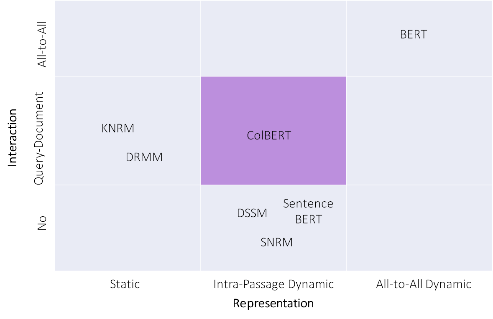
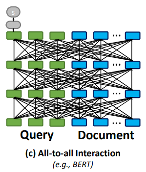
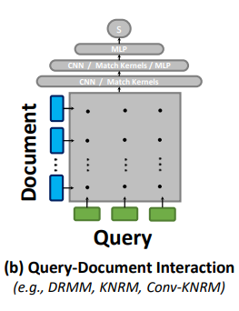
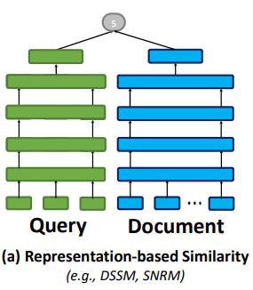
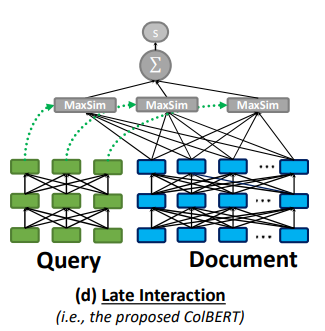
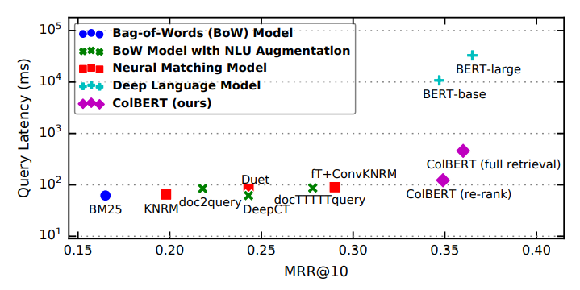
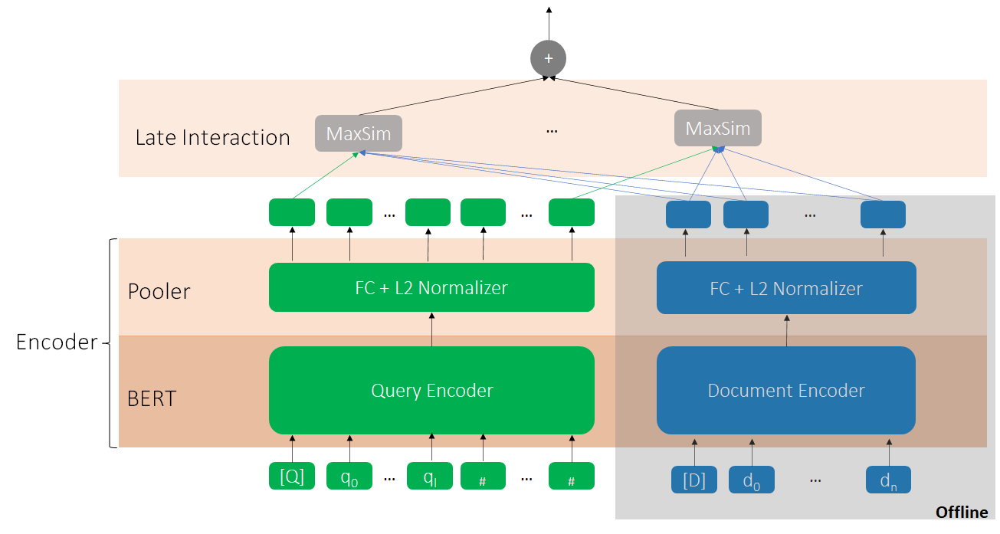
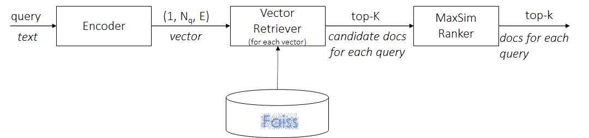
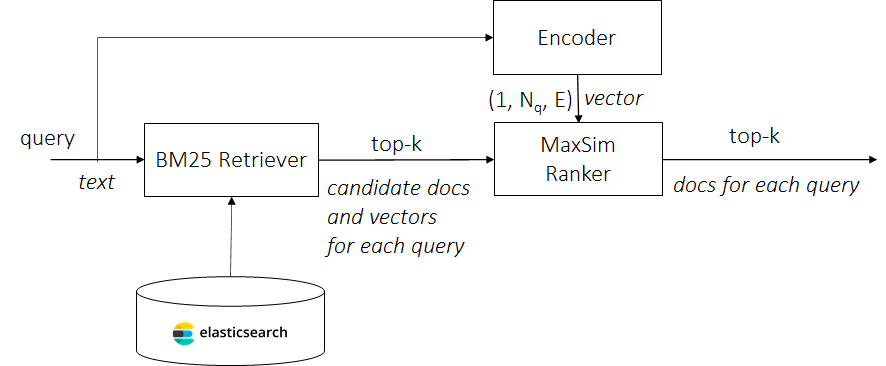
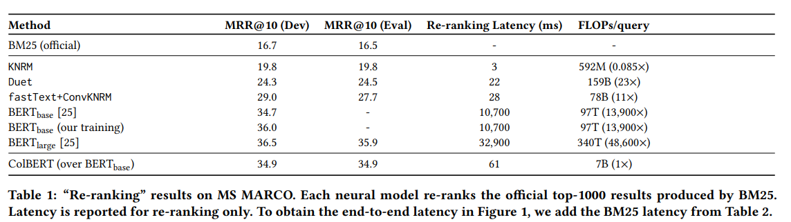

# ColBERT

## Evaluation Metrics for NLP based IR and QA
### Order-Unaware Metrics
#### Recall@K

$$ Recall@K = \frac{\# \ of\ passages\ @K\ that\ are\ relevant}{total\ \# \ of\ relevant\ passages} $$

### Order-Aware Metrics

#### MRR@K

MRR means Mean Reciprocal Rank.

$$MRR = \frac{1}{|Q|}\sum_{i=1}^{|Q|}\frac{1}{rank_{i}}$$

where:
$|Q|$ denotes the total number of queries;
$rank_{i}$ denotes the rank of the first relevant result;

## Fundamental Concepts

### static word embedding vs. dynamic(contextualized) word embedding

They are both embedding, which means we use a low-dimension vector to represent a word. We call the embedding is **static** in the sense that it will not change with the context *once been learned*; while **dynamic** or **contextualized** embedding represents a word among its contexts.

> **Example**
> In two sentences: “Apple sells phones” and “I eat an apple”, **dynamic embeddings** will represent “apple” differently according to the contexts, while **static embedding** can not distinguish the semantic difference between two “apples”. 

## Algorithm Evolution

### ColBERT-v1

#### Info Card
> - **full name**
>  `Co`ntextualized `l`ate interaction over `BERT`
> - **paper**
> [ColBERT: Efficient and Effective Passage Search via Contextualized Late Interaction over BERT](https://arxiv.org/pdf/2004.12832.pdf)
> - **year**
> 2020 (SIGIR'20)
> - **from**
> Stanford
> - **GitHub**
> https://github.com/stanford-futuredata/ColBERT

#### Basic Idea
Trade-off between Effectiveness and Efficiency. ColBERT is in the center of below compromise matrix.

- The Most Effective, but Least Efficiency
Fully dynamic in both **representation** and **interaction** between every word of query and document.
	- All-to-All Dynamic Representation, All-to-All Interaction (cross-encoder)

        
- The Compromises
	- Static Representation, Query-Document Interaction

    	
	- Intra-Passage Dynamic Representation, No Interaction (single-encoder)

    	
	- **Intra-Passage Dynamic Representation, Query-Document Interaction** (multi-encoder)

    	
- The Comparison

ColBERT attains similar MRR w/ BERT while `10~100x` better latency.

#### How Does It Work?

- Topology

    

- Scoring Metric

$$S_{q,d} = \sum_{i \in[|E_q|]}\max_{j \in [|E_d|]} E_{q_i} \cdot E^T_{d_j}$$

- Hyper-parameters
	- encoder: BERT-base-uncased
	- FC: `out-dim = 128`, `in-dim = 768`
	- Query Max Len = 32

- Data Layout

    `(N, S, E)`, `N` is batch size, `S` is sequence length, `E` is embedding size

#### How It Can Be Used?

##### As an end-to-end Retriever

Each query is encoded into $N_q$ vectors with dimension as $E$; for each vector of the query, it will retrieve top-$k'$  from doc vector database(in this paper $k'= k$), that means we will get $K \le N_q \times k'$ candidate for one query; then MaxSim will be used to rank the similarity between the query and $K$ candidate docs and get the final top-$k$. In the paper, FAISS IVFPQ indexing is used to index the document vector database.

##### As a Re-ranker

To decrease retriever time consumption, can use sparse retriever to do the first-round filtering, and ColBERT do the re-ranking based on the much smaller set generated by retriever, a typical `coarse-to-fine` idea.

Yet, we need to pay attention to the recall of the sparse retriever, once true candidates are missed, we cannot get it back in re-ranker.

#### Effects and Efficiency

##### Re-ranking

Greatly better latency than all-to-all models, greatly better MRR than static models and no-interaction models.

##### E2E

Good MRR and Recall lifting, at the expense of latency increase.

Another interesting observation: While to `Recall@1000`, we can see that ColBERT re-ranker's recall is bounded by its precedent BM25 retriever, it can only get to `81.4%` which is `BM25`'S `recall@1000`, even we can see ColBERT retriever can get `96.8%` which is much better.

### ColBERT-v2
#### Info Card
> - **paper**
> [ColBERTv2: Effective and Efficient Retrieval via Lightweight Late Interaction](https://arxiv.org/pdf/2112.01488.pdf)
> - **year**
> 2021 (NAACL'22)
> - **from**
> Stanford
> - **GitHub**
> https://github.com/stanford-futuredata/ColBERT

#### Basic Idea
ColBERT-v2 is an end-2-end retriever.

### PLAID
TBF
## References
1. [Evaluation Metrics For Information Retrieval](https://amitness.com/2020/08/information-retrieval-evaluation/)
2. [Introduction to Information Retrieval: Evaluation](https://web.stanford.edu/class/cs276/handouts/EvaluationNew-handout-1-per.pdf)
3. [ColBERT: Efficient and Effective Passage Search via Contextualized Late Interaction over BERT(slides)](https://nlp.csie.ntust.edu.tw/files/meeting/colbert.pdf)