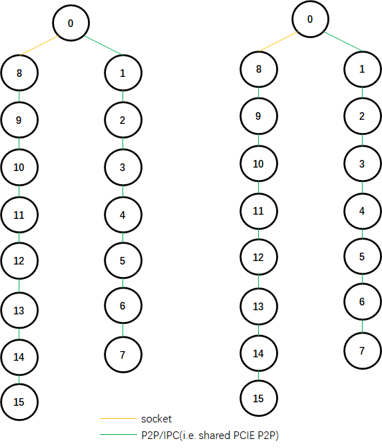
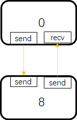
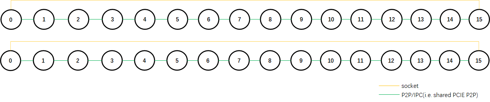
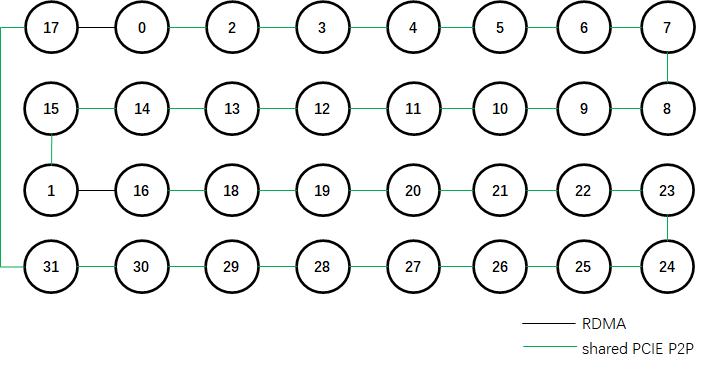
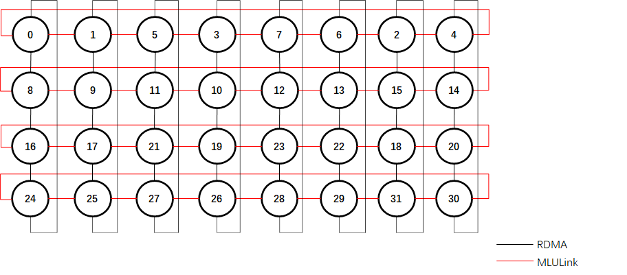
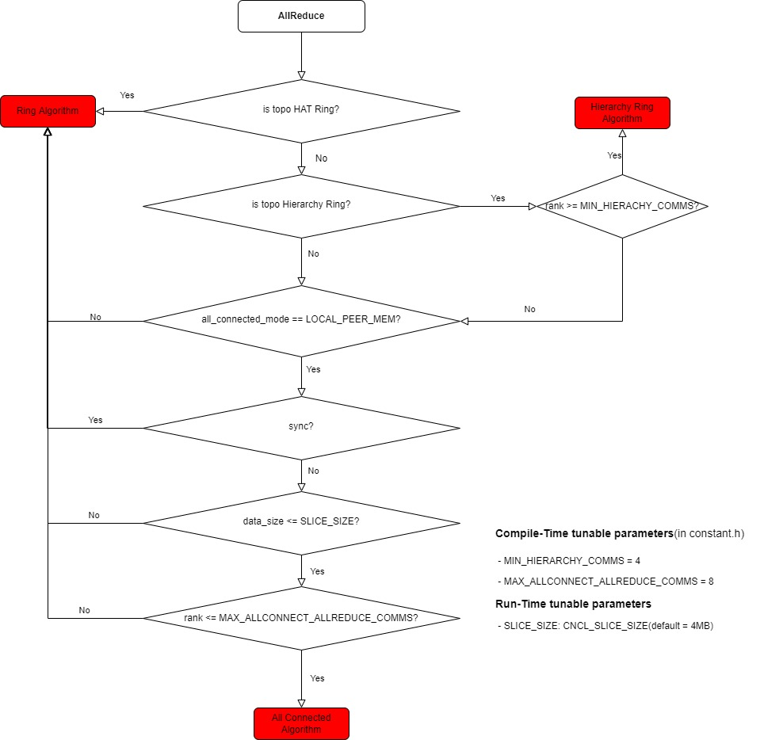
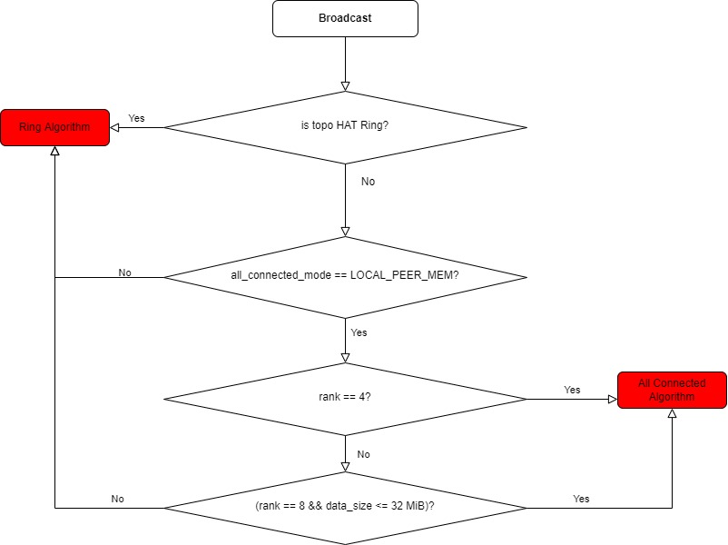

# 集合通信行为分析 - 基于 NCCL 和 CNCL

## Phases
> *from $^{[7]}$*
> **Phase 1 - Bootstrap Phase**: Initiate all nodes and then all ranks in a collective. It makes sure all ranks know about all other ranks, so any rank is able to communicate with any other rank.
> **Phase 2 - Topology Phase**: Each node detects and maps out what hardware is located on the machine. Hardware includes CPUs, GPUs, NICs and interconnect types. Each node then creates an intra-machine graph, connects hardware with PCIe or NVLink interconnect, and evaluates the graph. When the intra-machine topology is decided, the system will decide what pattern to use for the whole system. The two main patterns are a tree or a ring. While the topology is evaluated, NCCL is also tuning it by performing tests. This allows each rank to pre-compute thresholds for message sizes.
> **Phase 3 - Collective Phase**: A user can dispatch many collective operations using the same topology.

## NCCL

### Topology Phase

#### Build Physical Topology (i.e. System Topology)
建立 rank 间的邻接表。

##### Transport Types

``` cpp
#define TRANSPORT_P2P 0
#define TRANSPORT_SHM 1
#define TRANSPORT_NET 2
```
#### Build Logical Topology (i.e. Graph Topology)

> 以 2 机 16 卡，NCCL 2.8.4 为例

NCCL会构建 tree，ring graph。

##### Tree Logical Topology

###### log

``` cpp
10.0.2.11: 2be7fa6883db:57976:58906 [5] NCCL INFO Trees [0] 14/-1/-1->13->12 [1] 14/-1/-1->13->12
10.0.2.11: 2be7fa6883db:57977:58920 [6] NCCL INFO Trees [0] 15/-1/-1->14->13 [1] 15/-1/-1->14->13
10.0.2.11: 2be7fa6883db:57978:58913 [7] NCCL INFO Trees [0] -1/-1/-1->15->14 [1] -1/-1/-1->15->14
10.0.2.11: 2be7fa6883db:57975:58907 [4] NCCL INFO Trees [0] 13/-1/-1->12->11 [1] 13/-1/-1->12->11
10.0.2.11: 2be7fa6883db:57974:58908 [3] NCCL INFO Trees [0] 12/-1/-1->11->10 [1] 12/-1/-1->11->10
10.0.2.11: 2be7fa6883db:57971:58905 [0] NCCL INFO Trees [0] 9/-1/-1->8->0 [1] 9/0/-1->8->-1
10.0.2.11: 2be7fa6883db:57973:58909 [2] NCCL INFO Trees [0] 11/-1/-1->10->9 [1] 11/-1/-1->10->9
10.0.2.11: 2be7fa6883db:57972:58904 [1] NCCL INFO Trees [0] 10/-1/-1->9->8 [1] 10/-1/-1->9->8
10.0.2.12: 94f182076445:82266:83142 [5] NCCL INFO Trees [0] 6/-1/-1->5->4 [1] 6/-1/-1->5->4
10.0.2.12: 94f182076445:82263:83145 [2] NCCL INFO Trees [0] 3/-1/-1->2->1 [1] 3/-1/-1->2->1
10.0.2.12: 94f182076445:82262:83144 [1] NCCL INFO Trees [0] 2/-1/-1->1->0 [1] 2/-1/-1->1->0
10.0.2.12: 94f182076445:82267:83151 [6] NCCL INFO Trees [0] 7/-1/-1->6->5 [1] 7/-1/-1->6->5
10.0.2.12: 94f182076445:82265:83143 [4] NCCL INFO Trees [0] 5/-1/-1->4->3 [1] 5/-1/-1->4->3
10.0.2.12: 94f182076445:82261:83141 [0] NCCL INFO Trees [0] 1/8/-1->0->-1 [1] 1/-1/-1->0->8
10.0.2.12: 94f182076445:82268:83149 [7] NCCL INFO Trees [0] -1/-1/-1->7->6 [1] -1/-1/-1->7->6
10.0.2.12: 94f182076445:82264:83150 [3] NCCL INFO Trees [0] 4/-1/-1->3->2 [1] 4/-1/-1->3->2
10.0.2.12: 94f182076445:82263:83145 [2] NCCL INFO Channel 00 : 2[1d000] -> 1[1b000] via P2P/IPC
10.0.2.12: 94f182076445:82265:83143 [4] NCCL INFO Channel 00 : 4[3d000] -> 3[1e000] via P2P/IPC
10.0.2.12: 94f182076445:82264:83150 [3] NCCL INFO Channel 00 : 3[1e000] -> 2[1d000] via P2P/IPC
10.0.2.12: 94f182076445:82262:83144 [1] NCCL INFO Channel 00 : 1[1b000] -> 0[1a000] via P2P/IPC
10.0.2.11: 2be7fa6883db:57976:58906 [5] NCCL INFO Channel 00 : 13[3e000] -> 12[3d000] via P2P/IPC
10.0.2.11: 2be7fa6883db:57973:58909 [2] NCCL INFO Channel 00 : 10[1d000] -> 9[1b000] via P2P/IPC
10.0.2.11: 2be7fa6883db:57975:58907 [4] NCCL INFO Channel 00 : 12[3d000] -> 11[1e000] via P2P/IPC
10.0.2.11: 2be7fa6883db:57972:58904 [1] NCCL INFO Channel 00 : 9[1b000] -> 8[1a000] via P2P/IPC
10.0.2.11: 2be7fa6883db:57974:58908 [3] NCCL INFO Channel 00 : 11[1e000] -> 10[1d000] via P2P/IPC
10.0.2.11: 2be7fa6883db:57977:58920 [6] NCCL INFO Channel 00 : 14[40000] -> 13[3e000] via P2P/IPC
10.0.2.12: 94f182076445:82261:83141 [0] NCCL INFO Channel 00 : 8[1a000] -> 0[1a000] [receive] via NET/Socket/0
10.0.2.11: 2be7fa6883db:57978:58913 [7] NCCL INFO Channel 00 : 15[41000] -> 14[40000] via P2P/IPC
10.0.2.12: 94f182076445:82267:83151 [6] NCCL INFO Channel 00 : 6[40000] -> 5[3e000] via P2P/IPC
10.0.2.12: 94f182076445:82266:83142 [5] NCCL INFO Channel 00 : 5[3e000] -> 4[3d000] via P2P/IPC
10.0.2.12: 94f182076445:82261:83141 [0] NCCL INFO Channel 00 : 0[1a000] -> 8[1a000] [send] via NET/Socket/0
10.0.2.12: 94f182076445:82268:83149 [7] NCCL INFO Channel 00 : 7[41000] -> 6[40000] via P2P/IPC
10.0.2.11: 2be7fa6883db:57971:58905 [0] NCCL INFO Channel 00 : 0[1a000] -> 8[1a000] [receive] via NET/Socket/0
10.0.2.11: 2be7fa6883db:57971:58905 [0] NCCL INFO Channel 00 : 8[1a000] -> 0[1a000] [send] via NET/Socket/0
10.0.2.12: 94f182076445:82263:83145 [2] NCCL INFO Channel 01 : 2[1d000] -> 1[1b000] via P2P/IPC
10.0.2.12: 94f182076445:82265:83143 [4] NCCL INFO Channel 01 : 4[3d000] -> 3[1e000] via P2P/IPC
10.0.2.12: 94f182076445:82264:83150 [3] NCCL INFO Channel 01 : 3[1e000] -> 2[1d000] via P2P/IPC
10.0.2.12: 94f182076445:82262:83144 [1] NCCL INFO Channel 01 : 1[1b000] -> 0[1a000] via P2P/IPC
10.0.2.11: 2be7fa6883db:57976:58906 [5] NCCL INFO Channel 01 : 13[3e000] -> 12[3d000] via P2P/IPC
10.0.2.11: 2be7fa6883db:57973:58909 [2] NCCL INFO Channel 01 : 10[1d000] -> 9[1b000] via P2P/IPC
10.0.2.11: 2be7fa6883db:57975:58907 [4] NCCL INFO Channel 01 : 12[3d000] -> 11[1e000] via P2P/IPC
10.0.2.11: 2be7fa6883db:57972:58904 [1] NCCL INFO Channel 01 : 9[1b000] -> 8[1a000] via P2P/IPC
10.0.2.11: 2be7fa6883db:57974:58908 [3] NCCL INFO Channel 01 : 11[1e000] -> 10[1d000] via P2P/IPC
10.0.2.11: 2be7fa6883db:57977:58920 [6] NCCL INFO Channel 01 : 14[40000] -> 13[3e000] via P2P/IPC
10.0.2.11: 2be7fa6883db:57978:58913 [7] NCCL INFO Channel 01 : 15[41000] -> 14[40000] via P2P/IPC
10.0.2.12: 94f182076445:82267:83151 [6] NCCL INFO Channel 01 : 6[40000] -> 5[3e000] via P2P/IPC
10.0.2.12: 94f182076445:82266:83142 [5] NCCL INFO Channel 01 : 5[3e000] -> 4[3d000] via P2P/IPC
10.0.2.12: 94f182076445:82261:83141 [0] NCCL INFO Channel 01 : 8[1a000] -> 0[1a000] [receive] via NET/Socket/0
10.0.2.12: 94f182076445:82261:83141 [0] NCCL INFO Channel 01 : 0[1a000] -> 8[1a000] [send] via NET/Socket/0
10.0.2.12: 94f182076445:82268:83149 [7] NCCL INFO Channel 01 : 7[41000] -> 6[40000] via P2P/IPC
10.0.2.11: 2be7fa6883db:57971:58905 [0] NCCL INFO Channel 01 : 0[1a000] -> 8[1a000] [receive] via NET/Socket/0
10.0.2.11: 2be7fa6883db:57971:58905 [0] NCCL INFO Channel 01 : 8[1a000] -> 0[1a000] [send] via NET/Socket/0
```

###### 解析

- 拓扑 log 格式

> IP: hostname:pid:tid [`cudaDev`] NCCL INFO Trees [`channel ID`] `down0 rank`/`down1 rank`/`down2 rank`->`current rank`->`up rank`
>
> 如下面 log：
> 
> 10.0.2.11: 2be7fa6883db:57976:58906 [`5`] NCCL INFO Trees [`0`] `14`/`-1`/`-1`->`13`->`12` [`1`] `14`/`-1`/`-1`->`13`->`12`
> 
> 可以解读为 `10.0.2.11` 上的设备 `5`，其 rank 为 `13`，有两棵树，分别为 channel `0` 和 channel `1`: channel `0` 的子节点只有 `14`，父节点为 `12`；channel `1` 一样。

- channel log 格式

> IP: hostname:pid:tid [`cudaDev`] NCCL INFO Channel [`channel ID`] `current rank[bus ID]`->`successor rank[bus ID]` via `transport type`
> 
> 如下面 log：
> 10.0.2.11: 2be7fa6883db:57976:58906 [5] NCCL INFO Channel 00 : 13[3e000] -> 14[40000] via P2P/IPC
> 
> 可以解读为 `10.0.2.11` 上的设备 `5`（rank 为 `13`，bus ID为`3e000`），其channel `0` 连接至rank `14`，传输方式为 `P2P/IPC`。

######  结果

依此解析，可得两棵一样的 tree，逻辑拓扑如下：


其中 socket 双工通道建立如下（双工为 1 个 channel）：



##### Ring Logical Topology

###### log

``` cpp
10.0.2.12: 94f182076445:82261:83141 [0] NCCL INFO Channel 00/02 :    0   1   2   3   4   5   6   7   8   9  10  11  12  13  14  15
10.0.2.12: 94f182076445:82261:83141 [0] NCCL INFO Channel 01/02 :    0   1   2   3   4   5   6   7   8   9  10  11  12  13  14  15
10.0.2.12: 94f182076445:82263:83145 [2] NCCL INFO Channel 00 : 2[1d000] -> 3[1e000] via P2P/IPC
10.0.2.11: 2be7fa6883db:57978:58913 [7] NCCL INFO Channel 00 : 15[41000] -> 0[1a000] [send] via NET/Socket/0
10.0.2.12: 94f182076445:82261:83141 [0] NCCL INFO Channel 00 : 15[41000] -> 0[1a000] [receive] via NET/Socket/0
10.0.2.12: 94f182076445:82266:83142 [5] NCCL INFO Channel 00 : 5[3e000] -> 6[40000] via P2P/IPC
10.0.2.12: 94f182076445:82265:83143 [4] NCCL INFO Channel 00 : 4[3d000] -> 5[3e000] via P2P/IPC
10.0.2.12: 94f182076445:82262:83144 [1] NCCL INFO Channel 00 : 1[1b000] -> 2[1d000] via P2P/IPC
10.0.2.11: 2be7fa6883db:57976:58906 [5] NCCL INFO Channel 00 : 13[3e000] -> 14[40000] via P2P/IPC
10.0.2.12: 94f182076445:82264:83150 [3] NCCL INFO Channel 00 : 3[1e000] -> 4[3d000] via P2P/IPC
10.0.2.12: 94f182076445:82267:83151 [6] NCCL INFO Channel 00 : 6[40000] -> 7[41000] via P2P/IPC
10.0.2.11: 2be7fa6883db:57977:58920 [6] NCCL INFO Channel 00 : 14[40000] -> 15[41000] via P2P/IPC
10.0.2.12: 94f182076445:82268:83149 [7] NCCL INFO Channel 00 : 7[41000] -> 8[1a000] [send] via NET/Socket/0
10.0.2.11: 2be7fa6883db:57971:58905 [0] NCCL INFO Channel 00 : 7[41000] -> 8[1a000] [receive] via NET/Socket/0
10.0.2.12: 94f182076445:82261:83141 [0] NCCL INFO Channel 00 : 0[1a000] -> 1[1b000] via P2P/IPC
10.0.2.11: 2be7fa6883db:57972:58904 [1] NCCL INFO Channel 00 : 9[1b000] -> 10[1d000] via P2P/IPC
10.0.2.11: 2be7fa6883db:57974:58908 [3] NCCL INFO Channel 00 : 11[1e000] -> 12[3d000] via P2P/IPC
10.0.2.11: 2be7fa6883db:57975:58907 [4] NCCL INFO Channel 00 : 12[3d000] -> 13[3e000] via P2P/IPC
10.0.2.11: 2be7fa6883db:57973:58909 [2] NCCL INFO Channel 00 : 10[1d000] -> 11[1e000] via P2P/IPC
10.0.2.11: 2be7fa6883db:57971:58905 [0] NCCL INFO Channel 00 : 8[1a000] -> 9[1b000] via P2P/IPC
10.0.2.11: 2be7fa6883db:57974:58908 [3] NCCL INFO Channel 01 : 11[1e000] -> 12[3d000] via P2P/IPC
10.0.2.11: 2be7fa6883db:57976:58906 [5] NCCL INFO Channel 01 : 13[3e000] -> 14[40000] via P2P/IPC
10.0.2.12: 94f182076445:82263:83145 [2] NCCL INFO Channel 01 : 2[1d000] -> 3[1e000] via P2P/IPC
10.0.2.12: 94f182076445:82266:83142 [5] NCCL INFO Channel 01 : 5[3e000] -> 6[40000] via P2P/IPC
10.0.2.12: 94f182076445:82265:83143 [4] NCCL INFO Channel 01 : 4[3d000] -> 5[3e000] via P2P/IPC
10.0.2.12: 94f182076445:82262:83144 [1] NCCL INFO Channel 01 : 1[1b000] -> 2[1d000] via P2P/IPC
10.0.2.12: 94f182076445:82264:83150 [3] NCCL INFO Channel 01 : 3[1e000] -> 4[3d000] via P2P/IPC
10.0.2.12: 94f182076445:82267:83151 [6] NCCL INFO Channel 01 : 6[40000] -> 7[41000] via P2P/IPC
10.0.2.11: 2be7fa6883db:57978:58913 [7] NCCL INFO Channel 01 : 15[41000] -> 0[1a000] [send] via NET/Socket/0
10.0.2.12: 94f182076445:82261:83141 [0] NCCL INFO Channel 01 : 15[41000] -> 0[1a000] [receive] via NET/Socket/0
10.0.2.12: 94f182076445:82261:83141 [0] NCCL INFO Channel 01 : 0[1a000] -> 1[1b000] via P2P/IPC
10.0.2.11: 2be7fa6883db:57977:58920 [6] NCCL INFO Channel 01 : 14[40000] -> 15[41000] via P2P/IPC
10.0.2.12: 94f182076445:82268:83149 [7] NCCL INFO Channel 01 : 7[41000] -> 8[1a000] [send] via NET/Socket/0
10.0.2.11: 2be7fa6883db:57972:58904 [1] NCCL INFO Channel 01 : 9[1b000] -> 10[1d000] via P2P/IPC
10.0.2.11: 2be7fa6883db:57975:58907 [4] NCCL INFO Channel 01 : 12[3d000] -> 13[3e000] via P2P/IPC
10.0.2.11: 2be7fa6883db:57973:58909 [2] NCCL INFO Channel 01 : 10[1d000] -> 11[1e000] via P2P/IPC
10.0.2.11: 2be7fa6883db:57971:58905 [0] NCCL INFO Channel 01 : 7[41000] -> 8[1a000] [receive] via NET/Socket/0
10.0.2.11: 2be7fa6883db:57971:58905 [0] NCCL INFO Channel 01 : 8[1a000] -> 9[1b000] via P2P/IPC
```
###### 解析

- 拓扑 log 格式

> IP: hostname:pid:tid [`cudaDev`] NCCL INFO Channel `ring_ID`/`ring_number`: `rank0` `rank1` ... `last_rank`
> 如下面 log：
> 
> 10.0.2.12: 94f182076445:82261:83141 [0] NCCL INFO Channel 00/02 :    0   1   2   3   4   5   6   7   8   9  10  11  12  13  14  15
> 
> 可以解读为：建成了 `02` 个 ring，其中第 `0` 个ring的成员有：`0   1   2   3   4   5   6   7   8   9  10  11  12  13  14  15`，该 ring 共由 16 个 rank 组成。

- channel log 格式
与 tree 拓扑的格式一致。

######  结果
依此解析，可得两个一样的 ring，逻辑拓扑如下：



### Collective Phase

用户调用 NCCL 支持的集合通信原语进行通信：
- 集合通信原语
	- AllReduce
	- Broadcast
	- Reduce
	- AllGather
	- ReduceScatter
- 点对点通信原语
	- Send
	- Recv

NCCL 在 `getAlgoInfo` 里面使用 `ncclTopoGetAlgoTime` 来遍历计算`（algorithm，protocol）`，最终选择预测会最快做完指定数据量的指定集合通信原语的 `algorithm` 和 `protocol` 完成该通信原语。

## CNCL

### Topology Phase

#### Build Physical Topology (i.e. Topology Matrix)

建立 rank 间的邻接表。

##### Transport Types

``` cpp
typedef enum {
  /*!< type of no transport */
  NULL_TRANS = -1,
  /*!< use PCIe P2P to transfer data within one process*/
  LOCAL_PEER_MEM = 0,
  /*!< use PCIe P2P to transfer data across different processes*/
  SHARED_PEER_MEM,
  /*!< use D2H, H2D to transfer data within one process*/
  LOCAL_HOST_MEM,
  /*!< use D2H, H2D to transfer data across different processes*/
  SHARE_HOST_MEM,
  /*!< use verbs, support MLU-Direct RDMA when MLU-HCA are peerable */
  REMOTE_DMA,
  /*!< use socket by ethernet */
  SOCKET,
  /*!< use C2C library to transfer data by MLU-Link */
  MLU_LINK,
  /*!< use C2C library to transfer data by MLU-RoCE */
  MLU_ROCE,
  /*!< use C2C library to transfer data by MLU-Link/RoCE in HAT model */
  MLU_HAT,
  /*!< End of transfer type */
  TRANS_TYPE_END,
} TransportType_t;
```

##### 结果
#### Build Logical Topology (i.e. Topology)
> 以 2 机 16 卡，CNCL 1.0.2 为例

按顺序 build 4种 logical topology: `rings -> hierarchy rings -> trees -> all connected`。其中:
- `all connected` 是否构建受运行时配置 `CNCL_BUILD_ALL_CONNECTED_ENABLE` 控制
- `trees` 目前的实现是只会建 `MLULINK_HAT` tree，所以建成率比较低。且无论建成与否，后续算法选择的时候都不会选择。

##### Ring Logical Topology
###### log

``` cpp
10.0.1.17: [12-28 12:0:53] [LOG_CNCL] [Warning]: Can not build MLU-Link HAT ring, use PCIe or network instead.
10.0.1.17: [12-28 12:0:53] [LOG_CNCL] [Info]: Build 1 rings. Ring 0: 17--[REMOTE_DMA]->0--[SHARED_PEER_MEM]->2
10.0.1.17: [12-28 12:0:53] [LOG_CNCL] [Info]: Build 1 rings. Ring 0: 0--[SHARED_PEER_MEM]->2--[SHARED_PEER_MEM]->3
10.0.1.17: [12-28 12:0:53] [LOG_CNCL] [Info]: Build 1 rings. Ring 0: 2--[SHARED_PEER_MEM]->3--[SHARED_PEER_MEM]->4
10.0.1.17: [12-28 12:0:53] [LOG_CNCL] [Info]: Build 1 rings. Ring 0: 3--[SHARED_PEER_MEM]->4--[SHARED_PEER_MEM]->5
10.0.1.17: [12-28 12:0:53] [LOG_CNCL] [Info]: Build 1 rings. Ring 0: 4--[SHARED_PEER_MEM]->5--[SHARED_PEER_MEM]->6
10.0.1.17: [12-28 12:0:53] [LOG_CNCL] [Info]: Build 1 rings. Ring 0: 5--[SHARED_PEER_MEM]->6--[SHARED_PEER_MEM]->7
10.0.1.17: [12-28 12:0:53] [LOG_CNCL] [Info]: Build 1 rings. Ring 0: 6--[SHARED_PEER_MEM]->7--[SHARED_PEER_MEM]->8
10.0.1.17: [12-28 12:0:53] [LOG_CNCL] [Info]: Build 1 rings. Ring 0: 7--[SHARED_PEER_MEM]->8--[SHARED_PEER_MEM]->9
10.0.1.17: [12-28 12:0:53] [LOG_CNCL] [Info]: Build 1 rings. Ring 0: 8--[SHARED_PEER_MEM]->9--[SHARED_PEER_MEM]->10
10.0.1.17: [12-28 12:0:53] [LOG_CNCL] [Info]: Build 1 rings. Ring 0: 9--[SHARED_PEER_MEM]->10--[SHARED_PEER_MEM]->11
10.0.1.17: [12-28 12:0:53] [LOG_CNCL] [Info]: Build 1 rings. Ring 0: 10--[SHARED_PEER_MEM]->11--[SHARED_PEER_MEM]->12
10.0.1.17: [12-28 12:0:53] [LOG_CNCL] [Info]: Build 1 rings. Ring 0: 11--[SHARED_PEER_MEM]->12--[SHARED_PEER_MEM]->13
10.0.1.17: [12-28 12:0:53] [LOG_CNCL] [Info]: Build 1 rings. Ring 0: 12--[SHARED_PEER_MEM]->13--[SHARED_PEER_MEM]->14
10.0.1.17: [12-28 12:0:53] [LOG_CNCL] [Info]: Build 1 rings. Ring 0: 13--[SHARED_PEER_MEM]->14--[SHARED_PEER_MEM]->15
10.0.1.17: [12-28 12:0:53] [LOG_CNCL] [Info]: Build 1 rings. Ring 0: 14--[SHARED_PEER_MEM]->15--[SHARED_PEER_MEM]->1
10.0.1.17: [12-28 12:0:53] [LOG_CNCL] [Info]: Build 1 rings. Ring 0: 15--[SHARED_PEER_MEM]->1--[REMOTE_DMA]->16
10.0.1.17: [12-28 12:0:53] [LOG_CNCL] [Info]: Build 1 rings. Ring 0: 1--[REMOTE_DMA]->16--[SHARED_PEER_MEM]->18
10.0.1.17: [12-28 12:0:53] [LOG_CNCL] [Info]: Build 1 rings. Ring 0: 16--[SHARED_PEER_MEM]->18--[SHARED_PEER_MEM]->19
10.0.1.17: [12-28 12:0:53] [LOG_CNCL] [Info]: Build 1 rings. Ring 0: 18--[SHARED_PEER_MEM]->19--[SHARED_PEER_MEM]->20
10.0.1.17: [12-28 12:0:53] [LOG_CNCL] [Info]: Build 1 rings. Ring 0: 19--[SHARED_PEER_MEM]->20--[SHARED_PEER_MEM]->21
10.0.1.17: [12-28 12:0:53] [LOG_CNCL] [Info]: Build 1 rings. Ring 0: 20--[SHARED_PEER_MEM]->21--[SHARED_PEER_MEM]->22
10.0.1.17: [12-28 12:0:53] [LOG_CNCL] [Info]: Build 1 rings. Ring 0: 21--[SHARED_PEER_MEM]->22--[SHARED_PEER_MEM]->23
10.0.1.17: [12-28 12:0:53] [LOG_CNCL] [Info]: Build 1 rings. Ring 0: 22--[SHARED_PEER_MEM]->23--[SHARED_PEER_MEM]->24
10.0.1.17: [12-28 12:0:53] [LOG_CNCL] [Info]: Build 1 rings. Ring 0: 23--[SHARED_PEER_MEM]->24--[SHARED_PEER_MEM]->25
10.0.1.17: [12-28 12:0:53] [LOG_CNCL] [Info]: Build 1 rings. Ring 0: 24--[SHARED_PEER_MEM]->25--[SHARED_PEER_MEM]->26
10.0.1.17: [12-28 12:0:53] [LOG_CNCL] [Info]: Build 1 rings. Ring 0: 25--[SHARED_PEER_MEM]->26--[SHARED_PEER_MEM]->27
10.0.1.17: [12-28 12:0:53] [LOG_CNCL] [Info]: Build 1 rings. Ring 0: 26--[SHARED_PEER_MEM]->27--[SHARED_PEER_MEM]->28
10.0.1.17: [12-28 12:0:53] [LOG_CNCL] [Info]: Build 1 rings. Ring 0: 27--[SHARED_PEER_MEM]->28--[SHARED_PEER_MEM]->29
10.0.1.17: [12-28 12:0:53] [LOG_CNCL] [Info]: Build 1 rings. Ring 0: 28--[SHARED_PEER_MEM]->29--[SHARED_PEER_MEM]->30
10.0.1.17: [12-28 12:0:53] [LOG_CNCL] [Info]: Build 1 rings. Ring 0: 29--[SHARED_PEER_MEM]->30--[SHARED_PEER_MEM]->31
10.0.1.17: [12-28 12:0:53] [LOG_CNCL] [Info]: Build 1 rings. Ring 0: 30--[SHARED_PEER_MEM]->31--[SHARED_PEER_MEM]->17
10.0.1.17: [12-28 12:0:53] [LOG_CNCL] [Info]: Build 1 rings. Ring 0: 31--[SHARED_PEER_MEM]->17--[REMOTE_DMA]->0
```

###### 解析

- log 格式

> Build `ring_number` rings. Ring `ID`:  `predecessor rank`--[`transport type`]-->`current rank`--[`transport type`]-->`successor rank`
>
> 如上面 log 中最后一行：
> 
> Build `1` rings. Ring `0`: `31`--[`SHARED_PEER_MEM`]->`17`--[`REMOTE_DMA`]->`0`
> 
> 可以解读为：建成 `1` 个ring，叫 Ring `0`。其中 rank `17` 的前驱节点是 rank `31`，二者通过 PCIe P2P 跨进程传输通信；rank `17` 的后继节点 rank `0`，二者通过 RDMA 网卡连接。

###### 结果

依此解析，可得 16 卡 32 芯 ring 逻辑拓扑如下：



##### Hierarchy Ring Logical Topology

Hierarchy Ring 目前其实就是 2D-torus。

###### log

``` cpp
10.0.1.17: [12-28 12:0:53] [LOG_CNCL] [Info]: Build 1 hierarchy rings. Hierarchy ring 0, horizontal layer 0: 0-->1-->5-->3-->7-->6-->2-->4-->0, connected by [MLU_LINK]
10.0.1.17: [12-28 12:0:53] [LOG_CNCL] [Info]: Build 1 hierarchy rings. Hierarchy ring 0, horizontal layer 1: 8-->9-->11-->10-->12-->13-->15-->14-->8, connected by [MLU_LINK]
10.0.1.17: [12-28 12:0:53] [LOG_CNCL] [Info]: Build 1 hierarchy rings. Hierarchy ring 0, horizontal layer 2: 16-->17-->21-->19-->23-->22-->18-->20-->16, connected by [MLU_LINK]
10.0.1.17: [12-28 12:0:53] [LOG_CNCL] [Info]: Build 1 hierarchy rings. Hierarchy ring 0, horizontal layer 3: 24-->25-->27-->26-->28-->29-->31-->30-->24, connected by [MLU_LINK]
10.0.1.17: [12-28 12:0:53] [LOG_CNCL] [Info]: Build 1 hierarchy rings. Hierarchy ring 0, vertical layer 0: 0-->8-->16-->24-->0, connected by [REMOTE_DMA]
10.0.1.17: [12-28 12:0:53] [LOG_CNCL] [Info]: Build 1 hierarchy rings. Hierarchy ring 0, vertical layer 1: 1-->9-->17-->25-->1, connected by [REMOTE_DMA]
10.0.1.17: [12-28 12:0:53] [LOG_CNCL] [Info]: Build 1 hierarchy rings. Hierarchy ring 0, vertical layer 2: 5-->11-->21-->27-->5, connected by [REMOTE_DMA]
10.0.1.17: [12-28 12:0:53] [LOG_CNCL] [Info]: Build 1 hierarchy rings. Hierarchy ring 0, vertical layer 3: 3-->10-->19-->26-->3, connected by [REMOTE_DMA]
10.0.1.17: [12-28 12:0:53] [LOG_CNCL] [Info]: Build 1 hierarchy rings. Hierarchy ring 0, vertical layer 4: 7-->12-->23-->28-->7, connected by [REMOTE_DMA]
10.0.1.17: [12-28 12:0:53] [LOG_CNCL] [Info]: Build 1 hierarchy rings. Hierarchy ring 0, vertical layer 5: 6-->13-->22-->29-->6, connected by [REMOTE_DMA]
10.0.1.17: [12-28 12:0:53] [LOG_CNCL] [Info]: Build 1 hierarchy rings. Hierarchy ring 0, vertical layer 6: 2-->15-->18-->31-->2, connected by [REMOTE_DMA]
10.0.1.17: [12-28 12:0:53] [LOG_CNCL] [Info]: Build 1 hierarchy rings. Hierarchy ring 0, vertical layer 7: 4-->14-->20-->30-->4, connected by [REMOTE_DMA]
```
###### 解析
- log格式

> Build `ring_number` hierarchy rings. Hierarchy ring `ID`, `vertical|horizontal` layer `layer ID`:  `first node rank ID`-->...-->`last node rank ID`,connected by [`transport type`]
>
> 如上面 log 中最后一行：
> 
> Build `1` hierarchy rings. Hierarchy ring `0`, `vertical` layer `7`: `4`-->`14`-->`20`-->`30`-->`4`, connected by [`REMOTE_DMA`]
> 
> 可以解读为：建成 `1` 个 hierarchy ring，叫 Hierarchy ring `0`，它的 vertical layer `7` 上各 rank 的连接为：`4`-->`14`-->`20`-->`30`-->`4`，各 rank 通过 RDMA 连接。

######  结果
依此解析，可得 16 卡 32 芯 hierarchy ring 逻辑拓扑如下：



### Collective Phase

用户调用 CNCL 支持的集合通信原语进行通信，CNCL 根据原语、数据量、clique 规模来选择对应的 algorithm（使用什么逻辑拓扑以及如何使用）和 protocol（Low Latency还是正常）来执行该原语操作，其 `algorithm select`逻辑如下：

#### AllReduce



#### Broadcast



#### AllGather/Reduce/ReduceScatter
使用 Ring Algorithm。

#### Send/Recv
使用 All Connected Algorithm。

## Reference
1.  [Breaking the Computation and Communication Abstraction Barrier in Distributed Machine Learning Workloads](https://arxiv.org/pdf/2105.05720.pdf)
2. [NCCL github](https://github.com/NVIDIA/nccl)
3. [Massively Scale Your Deep Learning Training with NCCL 2.4](https://developer.nvidia.com/blog/massively-scale-deep-learning-training-nccl-2-4/)
4. [Distributed Deep Neural Network Training: NCCL on SUMMIT](https://www.olcf.ornl.gov/wp-content/uploads/2019/12/Summit-NCCL.pdf)
5. [Synthesizing Optimal Collective Algorithms](https://arxiv.org/pdf/2008.08708.pdf)
6. [Towards Scalable Distributed Training of Deep Learning on Public Cloud Clusters](https://proceedings.mlsys.org/paper/2021/file/8613985ec49eb8f757ae6439e879bb2a-Paper.pdf)
7. [Fast Multi-GPU communication over PCI Express](https://www.duo.uio.no/bitstream/handle/10852/88547/sivertac-thesis.pdf?sequence=1)
8.  [腾讯机智团队分享--AllReduce算法的前世今生](https://zhuanlan.zhihu.com/p/79030485)
9.  [Fast Multi-GPU collectives with NCCL](https://developer.nvidia.com/blog/fast-multi-gpu-collectives-nccl/)
10.  [NCCL: Accelerated Multi-GPU Collective Communications](https://images.nvidia.cn/events/sc15/pdfs/NCCL-Woolley.pdf)
11.  [Optimized Broadcast for Deep Learning Workloads on Dense-GPU InfiniBand Clusters: MPI or NCCL?](https://arxiv.org/pdf/1707.09414.pdf)
12.  [BLINK: Fast and Generic Collectives for Distributed ML](https://mlsys.org/media/mlsys-2020/Slides/1434.pdf)
13.  [MPI Tutorial](https://mpitutorial.com/)
14.  [Optimizing Communication for Clusters of GPUs](https://lca.ece.utexas.edu/pubs/Michael_dissertation_final.pdf)
15.  [CNCL Design Docs](http://gitlab.software.cambricon.com/neuware/cncl/-/tree/master/docs/design_document/source)