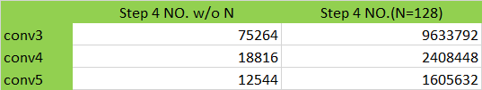
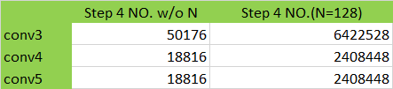

# CNN 中的卷积

## 卷积思路
目前 `Caffe` 中的卷积是转换成矩阵乘法做的，主要依靠 BLAS 的 GEMM。发展到后期，要抠 performance 的时候，GEMM 变成了瓶颈，主要在两个方面：
- GEMM 占用 memory 大。举例来说，一个 `3x3` 的卷积操作，需要先通过 `im2col` 把输入图像展开为 $IW \times IH \times IC \times 9$ 的矩阵，再使用矩阵矩阵乘法来计算，比原图像多用 $9$ 倍的内存。
- 存在计算效率比 GEMM 更高的算法。

目前的优化算法，主要存在两种思路：

### FIR 法

- `IM2COL + GEMM` 法
- 直接卷积法

### 变换域法

#### Winograd

#### FFT

FFT 方法又分为两种：
- Radix-based FFT
- FB-FFT

## 基于 Winograd FIR 的卷积优化

### F(2x2, 3x3) for 3x3 kernel
#### Forward Propagation
##### Formula

Winograd FIR 公式：

$$O = O_{2\times2\_3\times3}[(F_{2\times2\_3\times3} F F^{T}_{2\times2\_3\times3}) .* (I_{2\times2\_3\times3} I  I^{T}_{2\times2\_3\times3})]O^{T}_{2\times2\_3\times3}$$
其中，
$$F_{2\times2\_3\times3} = \left[
 \begin{matrix}
   1.0 & 0.0 & 0.0 \\
   0.5 & 0.5 & 0.5 \\
   0.5 & -0.5 & 0.5 \\
   0.0 & 0.0 & 1.0
  \end{matrix}
  \right]_{4\times3}$$
$$I_{2\times2\_3\times3} = \left[
 \begin{matrix}
   1.0 & 0.0 & -1.0 & 0.0 \\
   0.0 & 1.0 & 1.0 & 0.0 \\
   0.0 & -1.0 & 1.0 & 0.0 \\
   0.0 & 1.0 & 0.0 & -1.0
  \end{matrix}
  \right]_{4\times4}$$
$$O_{2\times2\_3\times3}  = \left[
 \begin{matrix}
   1.0 & 1.0 & 1.0 & 0.0 \\
   0.0 & 1.0 & -1.0 & -1.0
  \end{matrix}
  \right]_{2\times4}$$

##### 流程图

##### 步骤

###### Step 1. 卷积核变换
For each `(c, k)` in `(C, K)`, we have:
$$F_w = F_{2\times2\_3\times3} F F^{T}_{2\times2\_3\times3}$$
这是两个矩阵乘法：一个是 $4\times3 * 3\times3$，一个是 $4\times3 * 3\times4$，结果是 $4\times4$。以下是 `AlexNet` 各卷积层的 $F_w$ 运算次数。得到的 $F_w$ 是 $D\times D \times C \times K$ 矩阵，其中 $D = 4$。

###### Step 2. image tile变换
$$Y_w = \lceil P/B\rceil, X_w = \lceil Q/B\rceil，其中 B=2$$
For each $(y_{patch}, x_{patch}, c, n)$ in $(Y_w, X_w, C, N)$, we have:
$$I_w = I_{2\times2\_3\times3} I  I^{T}_{2\times2\_3\times3}$$
这也是两个 $4\times4 * 4\times4$ 矩阵乘法，结果是 $4\times4$。得到的 $I_w$ 是 $D\times D \times C \times Y_w \times X_w \times N$ 矩阵。

###### Step 3. Point-wise Multiplication
对 $4\times4$ 的每个点有：

$$M_w = F_w^{T}[s,t,C,K] \times (I_w[s, t].reshape(C, Y_wX_wN))$$

本步做 16 次矩阵乘法，每次是 $K\times C * C \times Y_wX_wN$ 的矩阵乘法，具体规模如下:

得到的 $M_w$ 是 $D\times D \times K \times Y_w \times X_w \times N$ 矩阵。

###### Step 4. 输出变换
For each $(y_{patch}, x_{patch}, k, n)$ in $(Y_w, X_w, K, N)$, 有：

$$O =  O_{2\times2\_3\times3} M_w O^{T}_{2\times2\_3\times3}$$

这是两个矩阵乘法：一个是 $2\times4 * 4\times4$，一个是 $2\times4 * 4\times2$，结果是 $2\times2$。每层的变换次数为：

#### Backward Propagation
后向传播与前向的步骤相似，仅仅是 $F(C,R,S,K)$ 变成了 $F(K,R,S,C)$ 且每个 kernel 作了 `mirror` 和 `flip` 操作，且输入和输出反置了，其余步骤与前向一致。下面仅给出每一步的计算量。

#### Weight Gradient Update
Weight Update 遵循基本类似的步骤，有两点不同：
- 变换阵不同，如下所示。
- Step 3 不同，所以这里的矩阵乘法规模显著变小，为 $C\times N * N\times K$；而且这里比前向传播步骤引入了更多的小矩阵乘法。
$$U = O_{3\times3\_2\times2}(\sum_{i\in tiles}[(F_{3\times3\_2\times2} O F^{T}_{3\times3\_2\times2}) \times (I_{3\times3\_2\times2} I  I^{T}_{3\times3\_2\times2})])O^{T}_{3\times3\_2\times2}$$
其中，
$$F_{3\times3\_2\times2} = \left[
 \begin{matrix}
   1.0 & 0.0 \\
   0.5 & 0.5 \\
   0.5 & -0.5 \\
   0.0 & 1.0
  \end{matrix}
  \right]_{4\times2}$$
$$I_{3\times3\_2\times2}  = \left[
 \begin{matrix}
   1.0 & 0.0 & -1.0 & 0.0\\
   0.0 & 1.0 & 1.0 & 0.0 \\
   0.0 & -1.0 & 1.0 & 0.0 \\
   0.0 & -1.0 & 0.0 & 1.0
  \end{matrix}
  \right]_{4\times4}$$
$$O_{3\times3\_2\times2} = \left[
 \begin{matrix}
   1.0 & 1.0 & 1.0 & 0.0\\
   0.0 & 1.0 & -1.0 & 0.0 \\
   0.0 & 1.0 & 1.0 & 1.0
  \end{matrix}
  \right]_{3\times4}$$

#### 结论
- 与 `im2col` 方法对 `batch` 中的图像一个一个处理不同，Winograd FIR 是 `batch` 处理这些图像的。
- Winograd FIR 不考虑 bias 的计算，需要另行处理。
- Winograd FIR 引入了大量的小矩阵运算，这些运算本质上是 SPMD 的。
- Winograd 由于每次计算 2x2 的输出，因此数据利用率比 im2col 方法高，communication cost 相对较小。
- Winograd FIR 对大矩阵 GEMM 的利用有限，仅在 batch GEMM 计算 point-wise multiplication 时会利用到。

*写于 2016 年 8 月*