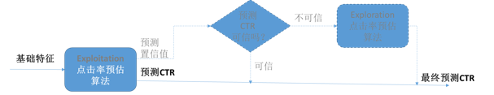
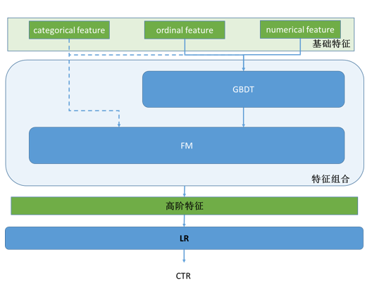
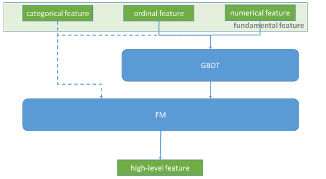

# 程序化广告交易中的点击率预估

## 指标

广告点击率预估是程序化广告交易框架的非常重要的组件，点击率预估主要有两个层次的指标：

1. 排序指标。排序指标是最基本的指标，它决定了我们有没有能力把最合适的广告找出来去呈现给最合适的用户。这个是变现的基础，从技术上，我们用AUC来度量。

2. 数值指标。数值指标是进一步的指标，是竞价环节进一步优化的基础，一般 DSP 比较看中这个指标。如果我们对 CTR 普遍低估，我们出价会相对保守，从而使得预算花不出去或是花得太慢；如果我们对 CTR 普遍高估，我们的出价会相对激进，从而导致 CPC 太高。从技术上，我们有 Facebook 的 NE（Normalized Entropy）还可以用 OE（Observation Over Expectation）。
   $$OE = \frac{\sum_{i=0}^{i=N} \mathbb{I}(user\ click\ ad\ i)}{\sum_{i=0}^{i=N}{pctr}}$$

## 框架

工业界用得比较多的是基于 LR 的点击率预估策略，我觉得这其中一个重要的原因是可解释性，当出现 bad case 时越简单的模型越好 debug，越可解释，也就越可以有针对性地对这种 bad case 做改善。但虽然如此，我见到的做广告的算法工程师，很少有利用 LR 的这种好处做模型改善的，遗憾….. 最近 DNN 很热，百度宣布 DNN 做 CTR 预估相比 LR 产生了 20% 的 benefit，我不知道比较的benchmark，但就机理上来讲如果说 DNN 比原本传统的人工 feature engineering 的 LR 高 20%，我一点也不奇怪。但如果跟现在增加了 FM 和 GBDT 的自动高阶特征生成的 LR 相比，我觉得 DNN 未必有什么优势。毕竟看透了，DNN 用线性组合+非线性函数（tanh/sigmoid etc.）来做高阶特征生成，GBDT + FM 用树和 FM 来做高阶特征生成，最后一层都是非线性变换。从场景上来讲，可能在拟生物的应用上（如视、听觉）上 DNN 这种高阶特征生成更好，在广告这种情境下，我更倾向于 GBDT + FM 的方法。

整个 CTR 预估模块的框架，包含了 explore/exploit 的逻辑。

单纯点击率预估算法的框图如下：

## Step-by-step

### 数据探索（data exploration）

主要是基础特征（raw feature/fundamental feature）的粗筛和规整。

展示广告的场景可以表述为：“在某场景下，通过某媒体向某用户展示某广告”，因此基础特征就在这四个范围内寻找：

- 场景：何时何地，使用何种设备，使用什么浏览器等

- 广告：包括广告主特征，广告自身的特征如 campaign、创意、类型，是否重定向等

- 媒体：包括媒体（网页、app 等）的特征、广告位的特征等

- 用户：包括用户画像，用户浏览历史等

单特征选择的方法有下面几种：

1. 简单统计方法，统计特征取值的覆盖面和平衡度,对 dominant 取值现象很显著的特征，要选择性地舍弃该特征或者是归并某些取值集到一个新的值，从而达到平衡的目的。

2. 特征选择指标，特征选择主要有两个目的，一是去除冗余的特征，也就是特征之间可能是互相冗余的；二是去无用，有些特征对 CTR 预估这个任务贡献度很小或没有，对于这类特征选择，要小小地做，宁不足而不过分，因为单特征对任务贡献度小，很有可能后面再组合特征生成时与其他特征组合生成很有效的组合特征，所以做得不能太过。

   - 去冗余。主要是特征间的相关性，如 Pearson 相关性，或者指数回归（从泰勒定理的角度它可以模拟高阶的多项式特征）。
   - 去无用。主要是信息增益比。

### 特征组合

两派方法：

- FM 系列
  对于 categorical feature，一般把他们 encode 成 one hot 的形式，特征组合适合用 FM。

- Tree 系列
  对于 numerical feature 和 ordinal feature，特征组合可以使用决策树类的，一般用 random forest 或 GBDT。其中 GBDT 的效果应该更好，因为 boosting 方法会不断增强对错判样本的区分能力。

 对于广告点击率预估，同时拥有这三类特征。所以一个简单的方法就是级联地使用这两个方法，更好地进行特征组合。

 

### LR

- OWL-QN
  
  这个是 batch 训练的方法，主要用于处理 L1 正则下的 LR 最优化。

- Online learning（FTRL and Facebook enhancement）
  
  在线学习，及时反馈点击信息，不断演化 LR 模型，从而为新广告更快收敛。

### 预测 CTR 可信吗?

任何一个特征向量输入到这个 CTR 预测算法，算法都会像模像样地给你输出一个预测 CTR。但这个 CTR 真的可信吗？我们知道机器学习是典型 data driven 的，当训练数据中某种情况的数据不足时，这种情况下的预测值很有可能被其他数据拉偏。所以，肯定会有预测值不可信的情况，那我们怎么判断当前的预测 CTR 的可信度呢？

Google 在提出 FTRL 算法的同时伴随提出了一个预测 CTR 可信度的方法，想法很简单：训练数据越多则可信度越高。下图公式中 $n_i$ 指训练集中第 `i` 维 feature 非零的训练向量的个数。normalization 到 `[0, 1]` 的方法很多，需要根据总业务数据量以及先验 CTR 来最终确定。

$$confidence \propto n_i$$

### 修修补补

后面的事情就是在前述的框架的基础上，根据 bad case 修修补补了。比如说，现在认为在不同的点击率区段，影响点击率的特征的权重是一致的，但实际发现是不一样的，就可以按照点击率的区间划分，做分区间模型（据说阿里用的 MLR 就是这个东东）。这些都不出上面的框架，是在分析数据之后做的细化，逃不脱“分段逼近”这个大圈。                                         