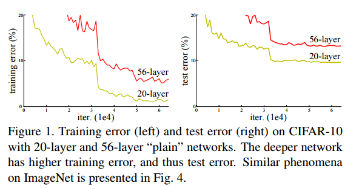

# CV Recognition: From AlexNet To Inception-v4

> 做研究就像比武论剑一样，要论剑就要到华山论剑，如果你一定要去太行山论剑，去挺进大别山，那别人只能当你是游击队，永远也别想成正规军。在计算机视觉领域，农村是永远也包围不了城市的。华山以外，很难论出好剑。 
>   　　   　　   　　　　　　　　　　　　　　　　　　　            　- 汤晓鸥

## AlexNet

- **Year**
  
    2012

- **Achievement**
  
    ILSVRC-2012 winner, achieved a winning top-5 test error rate of 15.3%, compared to 26.2% achieved by the second-best entry in ILSVRC-2012 competition.

- **Current Affiliation**
  
  Toronto University $\to$ Google
	
	(right: Hinton, mid: Alex, left: Ilya Sutskever)

- **Features**
  
    Bring deep learning back to CV community & industry. 

- **Topology**
  
    
    

## GoogLeNet-v1
- **Year**
  
    2015 CVPR

- **Achievement**
  
    ILSVRC-2014 winner with top-5 test error rate of 7.9%

- **Current Affiliation**
  
    Google (Christian Szegedy)

- **Features**
  - More Accurate(Representative)
    - Wider
      - Introduce Inception-v1 (Deep Dream) with heterogeneous combination of convolutions

	     
	- Deeper
      - 22 layers while AlexNet is 8
  - Faster
	- Special designed Inception to decrease computation
	- Less parameters 4M while AlexNet is 61M (only 1 FC layer)
		
## VGG
- **Year**
  
    2015 ICLR

- **Achievement**
  
    ILSVRC-2014 runner-up with top-5 test error rate of 7.3%

- **Current Affiliation** 
  
    Oxford University $\to$ Google (Karen Simonyan)

- **Features**
  - More Accurate(Representative)
  	- Wider
		- feature map number up to 512
	- Deeper
		- 16(VGG-16) and 19(VGG-19) 
  - Faster
	- Simple factorization:  use multiple 3x3 kernel to simulate bigger kernel. (2 to simulate 5x5, 3 to simulate 7x7)
	- No LRN is involved

    Meanwhile, VGG greatly increased the parameter number, from 61M(AlexNet) to 138M(VGG-16) and 144M(VGG-19).

## Inception-v2 & Inception-v3
- **Year**
  
    2015 Dec

- **Achievement**
  
    top-5 test error rate of 5.6% (v3)

- **Current Affiliation**
  
    Google (Christian Szegedy)

- **Features**
  - More Accurate(Representative)
	- Wider
		- New inception modules
	- Deeper
		- v3 depth 17 if treating Inception as one, 47 layers in fact.
  - More Accurate through tricks
	- Batch Normalization  - v2, v3
		- location
		
		- algorithm
		
	- Label Smooth  - v3 
	
	- BN auxiliary classifier - v3
  - Faster
	- Factorization:  - v3
	 
	
	
	- Grid Size Reduction - v3
	
	- Batch Normalization  - v2, v3

- **Arch**
  - Inception-v2
	- v1 with BN layers 
  - Inception-v3
	

## ResNet
- **Year**
  
    2015 Dec

- **Achievement**
  
    ILSVRC-2015 winner with top-5 test error rate of 5.7%

- **Current Affiliation**
  
    Microsoft $\to$ Facebook (He Kaiming)

- **Features**

    Try to fix the bad behavior of CNN in linear component representation.
  - Shortcut
  	- CNN to approximate non-linear part while shortcut to simulate linear part 
  - More Accurate(representative)
	- Wider
		- feature map number up to 3072
	- Deeper
		- up to 152 layer
  - Faster
	- Small kernel: all 3x3 except first layer(7x7)
	- Only one FC layer with 100M parameters in 152-layer arch

- **Arch**

	
	
	

## Inception-v4
- **Year**

    2016

- **Achievement**

    top-5 test error rate of 4.2%

- **Current Affiliation**

    Google (Christian Szegedy)

- **Arch**
    
    
	
	

*写于 2018 年 4 月*
