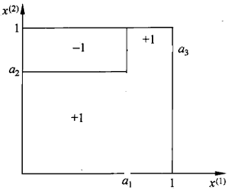

# 机器学习算法 - 决策树

## Why

[例] 论丈母娘如何选女婿

- 决策树

    ```mermaid
    flowchart TD
    cond1{"有房子"}--是-->op1(("同意"))
    cond1{"有房子"}--否-->cond2{"有工作"}
    cond2{"有工作"}--是-->op3(("同意"))
    cond2{"有工作"}--否-->op2(("拒绝"))
    ```

- 判别函数

    

    Decision Tree 是一种非线性分类和回归方法，其模型可以看成是 `if-then-else` 规则集合，具有可读性强，接受度高的特点。
    
    虽然很少作为单分类器使用，但决策树具有一个很好的性质：可以通过控制叶结点（leaf node）的个数较容易地进行bias-variance trade-off，这个性质使得它成为很多 ensemble 方法的 base learner，如 random forest， adaboost 以及 GBDT。
    
    另一个副产品是在决策树的生成过程中，每个内部结点（internal node）的选择其实是一个特征选择的过程，这对于其他模型的特征选择同样是有借鉴意义的。而且，决策树本身也可以用来做高阶特征的生成。

    基于以上的理由，我们有必要好好认识一下决策树。

## 决策树的生成

### 分类树

从概率意义上来说，决策树表示了给定特征条件下的条件概率分布。如：

$$p(y=1|有房子且有工作) = 0.8$$

因此，很自然地，决策树学习的目标就是最大似然，决策树学习的过程就是一个最大似然估计的过程。

$$\max \limits_{T} \prod_{i=0}^{N}p(y^{(i)}|x^{(i)},T)$$

但是由于决策树没有完备的数学表达式，一般只能采取穷举的方法来选取最优决策树，这是一个 `NP-完全`问题，因此无法求取最优解。在实践中，我们退而求其次，不强求最优解，采用启发式方法（实际上就是贪心法），近似求解这一最优化问题，得到次优（sub-optimal）的决策树。

决策树学习的算法递归地选择最优特征，并根据该特征对当前数据集进行分割。每次选择的“最优特征”应该能最大程度地减少当前数据集的“不纯度”, 最好的情况就是它划分出来的每个子数据集只对应一个类别。关于如何度量“不纯度的减少”，有两种思路。

#### 信息增益(Information Gain, IG)

信息增益的公式如下，其本质上就是数据集中类与特征的互信息量。

$$IG(D,A) = H(D) - H(D|A)$$

`IG` 对可能取值数目较多的属性有所偏好，为了减少这种偏好带来的不利影响，又定义了信息增益比（Information Gain Ratio，IGR）。

$$IGR(D,A) = \dfrac{IG(D,A)}{H(A)}$$

使用基于 `IG` 和 `IGR` 的生成算法分别是 `C4.5` 和 `ID3`。注意，`C4.5` 和 `ID3` 生成的是多叉树。

>  **`C4.5` 生成算法**
>
>  输入：训练数据集 $D$，特征集 $A$，阈值 $\varepsilon$
>
>  输出：决策树 $T$
>
>  步骤：
>  1. 如果 $D$ 中所有实例同属于同一类 $C_k$，则置 $T$ 为单结点树，并将 $C_k$ 作为该结点的类，返回 $T$；
>  2. 如果 $A=\emptyset$，则置 $T$ 为单结点树，并将 $D$ 中实例数最大的类 $C_k$ 作为该结点的类，返回 $T$；
>  3. 计算 $A$ 中各特征对 $D$ 的 `IGR`，选择 `IGR` 最大的特征 $A_g$；
>  4. 如果 $A_g$ 的 `IGR` 小于阈值 $\varepsilon$，则置 $T$ 为单结点树，并将 $D$ 中实例数最大的类 $C_k$ 作为该结点的类，返回 $T$ ；
>  5. 则，对 $A_g$ 的每一可能值 $a_i$，依 $A_g = a_i$ 将D分割为若干非空子集 $D_i$，将 $D_i$ 中实例数最大的类作为标记，构建子结点，由结点及其子节点构成树 $T$，返回 $T$；
>  6. 对结点 $i$，以 $D_i$ 为训练集，以 $A-\{A_g\}$ 为特征集，递归调用 1~5 得到子树 $T_i$，返回 $T_i$。
> (P.S. 从上述步骤可以推断，C4.5 树的高度应该小于等于 $\#\{A\}$，即特征集合 A 中特征的数目。)

#### 基尼指数(Gini Index)

基尼指数的定义为：
> 假设有 K 个类，样本点属于第 k 类的概率为 $p_k$，则该概率分布的基尼指数定义为：
>  $$Gini(p) = 1 - \sum_{k=1}^{K} p_k^2$$

在属性 $A$ 的条件下，集合 $D$ 的基尼指数定义为：

> 如果样本集合 $D$ 根据属性 $A$ 是否取某一可能值分割成 $D_1$ 和 $D_2$，则：
> $$Gini(D,A) = \dfrac{|D_1|}{|D|}Gini(D_1) + \dfrac{|D_2|}{|D|}Gini(D_2) $$

基于基尼指数的学习算法是 CART（Classification And Regression Tree）。注意，CART 生成的是二叉树。

> **CART 生成算法**
>
> 输入：训练数据集 $D$，停止计算条件；
>
> 输出：CART 决策树
>
> 步骤：
> 
> 根据训练数据集 $D$，从根结点开始，递归地对每个结点进行以下操作，构建二叉决策树：
> 1. 设结点的训练数据集为 $D$，计算现有特征对该 $D$ 的基尼指数。此时，对每个特征 $A$：
>	  
>    1.1 如果 $A$ 为离散特征，对其可能取的每个值 $a$，根据样本点对 $A=a$ 的测试为“是”或“否”将 $D$ 分割成 $D_1$ 和 $D_2$ 两部分，计算 $A=a$ 时的基尼指数。
>	  
>    1.2 如果 $A$ 为连续特征，对特征的取值进行升序排序，每两个相邻的取值之间的中点 $a$ 作为分裂点，根据样本点对 $A \leq a$ 的测试为“是”或“否”将 $D$ 分割成 $D_1$ 和 $D_2$ 两部分，计算基尼指数。
>	
> 2. 在所有可能的特征 $A$ 以及它们所有可能的切分点 $a$ 中，选择基尼指数最小的特征及其对应的切分点作为最优特征与最优切分点，依最优特征与最优切分点，从现结点生成两个子结点，将训练数据集依特征分配到两个子结点中去。
> 3. 对两个子结点递归地调用1、2，直到满足停止条件。
> 4. 生成 CART 树
>
> 算法停止计算的条件是结点中的样本个数小于预定阈值，或样本集的基尼指数小于预定阈值（样本基本属于同一类），或没有更多特征。

### 回归树

CART 支持回归树，回归树以最小化平方误差为目标，把响应变量建模为：

$$f(x) = \sum_{m=0}^{M}c_mI(x \in R_m )$$

生成算法如下：

> **最小二乘回归树生成算法**
>
> 输入：训练数据集 $D$
>
> 输出：回归树 $f(x)$
>
> 步骤：
> 在训练数据集所在的输入空间里，递归地将每个区域划分为两个子区域并决定每个子区域上的输出值，构建二叉决策树：
> 1. 选择最优切分变量 $j$ 与切分点 $s$ ，求解：
>     $$\min \limits_{j, s}[\min \limits_{c_1}\sum \limits_{x \in R_1(j,s)}(y_i - c_1)^2 + \min \limits_{c_2}\sum \limits_{x \in R_2(j,s)}(y_i - c_2)^2]$$
>    遍历变量 $j$，对固定切分变量 $j$ 扫描切分点 $s$，选择使上式达到最小的值对 $(j,s)$。
> 2. 用选定的对 $(j,s)$ 划分区域并决定相应的输出值：
>     $$\begin{align*} &R_1(j,s)=\{x|x^{(j)} \leq s\}, R_2(j,s)=\{x|x^{(j)} > s\} \\ &\hat{c}_m=\frac{1}{N_m}\sum \limits_{x_i \in R_m(j,s)} y_i, x \in R_m，m=1,2\end{align*}$$
> 3. 继续对两个子区域调用步骤 1、2，直到满足停止条件。
> 4. 将输入空间划分为 $M$ 个区域 $R_1, R_2, ..., R_M$，生成决策树：
>    $$f(x)=\sum \limits_{m=1}^{M} \hat{c}_mI(x \in R_m)$$

## 决策树的剪枝

剪枝从时间点上分可以分为预剪枝（pre-pruning）和后剪枝（post-pruning）两类，从使用的数据上来分可以分为基于训练集的剪枝和基于验证集的剪枝。

### 预剪枝
预剪枝是根据一些原则及早地停止决策树的生长。主要的停止条件有：
1. 达到最大数深度（Maximum Tree Depth）；
2. 划分（Split）增益小于某一个阈值；
3. 结点样本数小于某个阈值等。

如前所述，因为决策树生成的过程本身就是一个启发式求解过程，如果再加入预剪枝的话，很可能使得一些性能较高的结点划分被扼杀，有较大的欠拟合风险，所以一般谨慎使用。但是预剪枝可以减少训练时间开销，在训练时间很长的情况下可以考虑。
预剪枝的停止条件可以作用在训练集上，也可以作用在验证集上。如果作用在训练集上，那就基于训练集的预剪枝；作用在验证集上，就是基于验证集的预剪枝。

### 后剪枝
后剪枝是在决策树已经生成完后，对生成的决策树再进行剪枝。
后剪枝致力于最小化正则化的损失函数，如下：

$$C_{\alpha}(T) = C(T)+ \alpha |T|$$

其中，$|T|$ 定义为树叶子结点的个数，$C(T)$ 可以为：
1. 熵
  $$C(T) = \sum_{t=0}^{|T|}\dfrac{N_t}{N}H_{t}(T)$$
2. 基尼指数
  $$C(T) = \sum_{t=0}^{|T|}\dfrac{N_t}{N}Gini_{t}(T)$$

#### 基于训练集的剪枝

基于训练集的剪枝不需要引入验证集，因此需要人工给定正则化系数 $\alpha$。这是 C4.5/ID3 默认使用的剪枝算法。

> **基于训练集的树剪枝算法**
>
> 输入：生成算法产生的整个树 $T$，参数 $\alpha$；
>
> 输出：修剪后的子树 $T_{\alpha}$
>
> 1. 计算每个结点的经验熵。
> 2. 递归地从数的叶子结点向上回缩。
>    
>    设一组叶结点回缩到其父结点之前与之后的整体树分别为 $T_B$ 与 $T_A$，其对应的损失函数值分别为 $C_{\alpha}(T_A)$ 与 $C_{\alpha}(T_B)$，如果 $C_{\alpha}(T_A) \leq C_{\alpha}(T_B)$ 则剪枝，即将父结点变为新的叶结点。
>
> 3. 返回 2，直至不能继续为止，得到损失函数最小的子树 $T_{\alpha}$。

#### 基于验证集的剪枝

如果我们对如何设置 $\alpha$ 没自信的话，就需要利用验证集对一系列 $\alpha$ 所得的模型进行评估，从而选出最合适的 $\alpha$ 和模型。这也是 CART 树默认采用的剪枝方法。

> **基于验证集的树剪枝算法**
> 1. 剪枝，形成子树序列
>  
>    从整体树 $T_0$ 开始剪枝。对 $T_0$ 的任意内部结点 $t$，以 $t$ 为单结点树的损失函数是:
>    $$C_{\alpha}(t)=C(t)+\alpha$$
>    以 $t$ 为根结点的子树 $T_t$ 的损失函数是:
>    $$C_{alpha}(T_t)=C(T_t)+\alpha|T_t|$$
>    当 $\alpha=0$ 及 $\alpha$ 充分小时，有不等式
>    $$C_{\alpha}(T_t)<C_{\alpha}(t)$$
>    当 $\alpha$ 增大时，在某一 $\alpha$ 有:
>    $$C_{\alpha}(T_t)=C_{\alpha}(t)$$
>    当 $\alpha$ 再增大时，不等式反向。只要 $\alpha=\frac{C(t)-C(T_t)}{|T_t| - 1}$，$T_t$ 与 $t$ 有相同的损失函数值，而 $t$ 的结点少，因此 $t$ 比 $T_t$ 更可取，对 $T_t$ 进行剪枝。
> 
>    为此，对 $T_0$ 中每一个内部结点 t，计算：
>     $$g(t)=\frac{C(t)-C(T_t)}{|T_t|-1}$$
>    它表示剪枝后整体损失函数减少的程度。在 $T_0$ 中减去 $g(t)$ 最小的 $T_t$，将得到的子树作为 $T_1$，同时将最小的 $g(t)$ 设为 $\alpha_1$。$T_1$ 为区间 $[\alpha_1, \alpha_2)$ 的最优子树。然后以此类推，对 $T_1$ 进行相同的操作，生成区间 $[\alpha_2, \alpha_3)$ 的最优子树 $T_2$，直至最后得到由根结点单独构成的树 $T_n$。
>
> 2. 利用验证集，测试子树序列 $T_0, T_1, ..., T_n$ 中各棵子树的平方误差或基尼指数，平方误差或基尼指数最小的决策树为最优的决策树。在子树序列中，每棵子树 $T_1, T_2, ..., T_n$ 都对应于一个参数 $\alpha_1, \alpha_2,...,\alpha_n$。所以，当最优子树 $T_k$ 确定时，对应的 $\alpha_k$ 也就确定了。

## 实践中的问题

### 数值归一化和非线性处理
决策树因为只对特征的相对关系(数值型)进行建模，对数值的绝对大小不在意，因此不需要对特征进行归一化。同理，如果 ground truth 特征和现有特征呈**单调**的非线性关系，决策树不关心也不需要找到这个变换并对现有特征实施这个变换，这个特点降低了对 feature engineering 的要求，是个对 data scientist 很友好的特点。

## 最后的话

To think out of the box:
- 决策树可用于无监督学习，如异常检测等。
	- 聚类： 修改划分标准，如直接用熵。
	- 异常检测：如 isolation tree。
- 决策树的特征选择方法也可为其他模型所用, 也启发了特征选择方法。
	- 比如 FaceBook 在 CTR 预测时使用的 SU（Symmetrical Uncertainty）特征选择方法。
    $$SU(D,A) = \dfrac{2*IG(D,A)}{H(A) + H(D)}$$
- 决策树本身可以用于生成高阶特征。
	- 树的每条路径其实就是一个高阶特征。
- 决策树比较容易在 bias 和 variance 之间进行抉择，这使得它成为一个很好的 base learner。
	- 树深 $\to$ 高方差 $\to$ Random Forest
	- 树浅 $\to$ 高偏差 $\to$ GBDT, AdaBoost

*写于 2016 年 10 月*