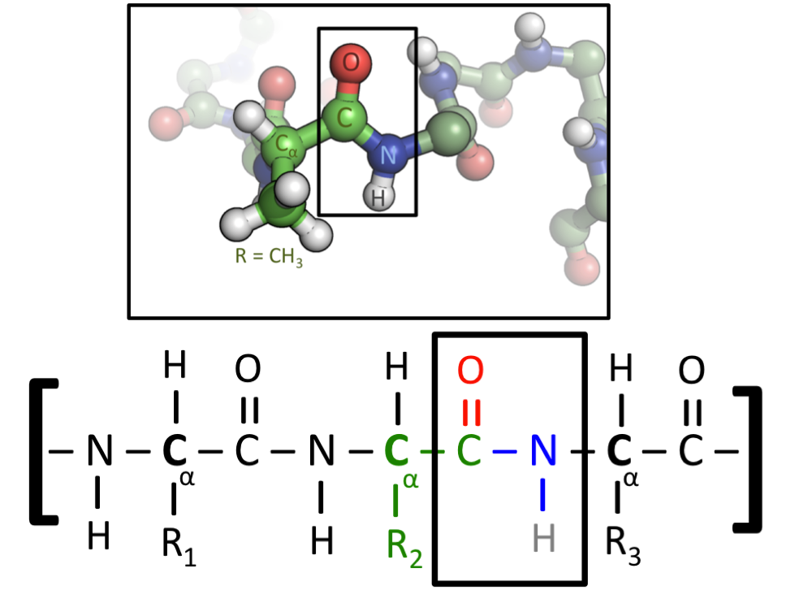

# 蛋白质深度学习

本文的目标读者主要有两类：一类是想使用机器学习的生物学家，一类是想进入生物学领域的机器学习研究者。如果你不熟悉生物学或机器学习，我们仍然欢迎你，但有时你可能会觉得有点读不太懂！如果你已经熟悉这两者，那么你可能根本不需要本文 —— 你可以直接跳到我们的示例 notebook 以查看这些模型的实际应用：

- 微调蛋白质语言模型（[PyTorch](https://colab.research.google.com/github/huggingface/notebooks/blob/main/examples/protein_language_modeling.ipynb)，[TensorFlow](https://colab.research.google.com/github/huggingface/notebooks/blob/main/examples/protein_language_modeling-tf.ipynb)）
- 使用 ESMFold 进行蛋白质折叠（[PyTorch](https://colab.research.google.com/github/huggingface/notebooks/blob/main/examples/protein_folding.ipynb)，因为 `OpenFold` 仅支持 PyTorch，所以目前仅支持 PyTorch）

## 面向生物学家的科普：语言模型是什么鬼？

用于处理蛋白质的模型深受 BERT 和 GPT 等大语言模型的启发。因此，为了了解这些模型是如何工作的，我们要回到 2016 年左右，那时大语言模型还没有出现，特朗普还没有当选，脱欧还没有发生，深度学习（Deep Learning，DL）还是个日日新的超级新星...... DL 成功的关键在于它使用人工神经网络来学习数据中的复杂模式。不过，深度学习有一个关键问题 —— 它需要 **大量** 的数据才能正常工作，而在很多任务中，根本没那么多数据。

假设你想训练一个 DL 模型，输入一个英语句子，并判断它是否合乎语法。所以你准备了训练数据，格式如下：

| Text | Label |
| --- | --- |
| The judge told the jurors to think carefully. | Correct |
| The judge told that the jurors to think carefully. | Incorrect |
| … | … |

理论上，这个任务在当时是完全可行的 —— 如果你将如上格式的训练数据输入深度学习模型，它就可以学着去预测新句子在合乎语法。但在实践中，它的效果并不怎么好，因为在 2016 年，大多数人都从一个随机初始化的新模型开始每项任务。这意味着 **模型必须仅从训练数据中学习它们需要知道的一切！**

我们来理解一下这到底有多难，假设你是一个机器学习模型，我提供给你一些训练数据以完成我希望你学习的任务。假如我给你的训练数据如下：

| Text | Label |
| --- | --- |
| Is í an stiúrthóir is fearr ar domhan! | 1 |
| Is fuath liom an scannán seo. | 0 |
| Scannán den scoth ab ea é. | 1 |
| D’fhág mé an phictiúrlann tar éis fiche nóiméad! | 0 |

在这里，我选择了一种我希望你从未曾见过的语言，所以我猜你已经可能开始对你是否能学会这个任务不太自信了。也许在数百或数千个样本之后，你可能会开始注意到输入中一些重复出现的单词或模式，然后你可能开始能够作出比随机机猜测更好的判断，但即使这样，一旦出现新单词或之前没见过的措辞马上就能够难住你，让你猜错。无独有偶，这也是 DL 模型当时的表现！

现在我们试试相同的任务，但这次使用英语：

| Text | Label |
| --- | --- |
| She’s the best director in the world! | 1 |
| I hate this movie. | 0 |
| It was an absolutely excellent film. | 1 |
| I left the cinema after twenty minutes! | 0 |

现在事情变得简单了 —— 任务只是预测电影评论是正面 (1) 还是负面 (0)的。仅使用两个正例和两个反例，你就可以以接近 100% 的准确率完成这项任务，因为 **你原本就具备大量的英语词汇和语法知识，并具有电影和情感相关表达的文化背景。** 如果没有这些知识，事情就会变得更像第一个任务 —— 你需要阅读大量的例子才能开始发现输入中的表达模式，即使你花时间研究了数十万个的例子你的猜测仍然远不如在英语任务中只有四个例子准确。

### 关键突破：迁移学习

在机器学习中，我们将这种将先验知识迁移到新任务的概念称为 “**迁移学习**”。在 DL 上使用迁移学习是 2016 年左右该领域的一个主要目标。预训练词向量之类的东西（非常有趣，但超出了本文的范围！）在 2016 年确实存在并且允许一些知识迁移到新的模型，但是这种知识迁移仍然比较肤浅，模型仍然需要大量的训练数据才能很好地工作。

这一阶段一直持续到 2018 年。2018 年，两篇巨著横空出世，第一篇引入了 [ULMFiT](https://arxiv.org/abs/1801.06146) 模型，第二篇引入了 [BERT](https://arxiv.org/abs/1810.04805) 模型。这两篇论文是让自然语言迁移学习真正发挥作用的开创性论文，尤其是 BERT 标志着预训练大语言模型时代的发轫。两篇论文共同使用了一个技巧，那就是它们利用了深度学习中人工神经网络的内部结构 —— 先花较长的时间在有着丰富训练数据的文本任务上训练神经网络，然后将整个神经网络复制到新任务中，仅用新任务的数据更新或重新训练与网络输出相对应的少数神经元。

*上图来自 [ULMFiT 论文](https://arxiv.org/abs/1801.06146)，它展示了在三个独立的任务上使用迁移学习与从头开始训练模型相比在性能上的巨大提升。在许多情况下，使用迁移学习的效果相当于拥有超过 100 倍的训练数据。不要忘记这是 2018 年发布的 —— 现代的大语言模型可以做得更好！*

这样做的原因是，在解决任何重要任务的过程中，神经网络学习到很多输入数据的结构的知识 —— 如对于视觉神经网络，输入的是原始像素，模型学习到了如何识别直线、曲线和边缘；对于文本神经网络，输入的是原始文本，模型学习到了有关语法结构的细节。但是，这些信息并不特定于任务的。 - 迁移学习起作用的关键原因是 **解决任务需要知道的很多内容都不是特定于该任务的！** 要对电影评论进行分类，你不需要了解很多关于电影评论的知识，但你确实需要大量的英语和文化背景知识。通过选择训练数据丰富的任务，我们可以让神经网络学习此类 “领域知识”，然后将其应用于我们关心的新任务，而在这些新任务中训练数据可能更难获取。

至此，希望你已经了解了什么是迁移学习，并且大语言模型是一个经过大量文本数据训练而得的大型神经网络，这使其成为迁移到新任务的主要备选方案。我们将在下面看到相同的技术如何应用​​于蛋白质，但首先我需要为另一半观众写一篇介绍。如果你已经熟悉，请随时跳过下一部分！

## 面向机器学习研究者的科普：蛋白质是什么鬼？

简而言之，蛋白质可以做很多事情。有些蛋白质是 **酶** - 它们充当化学反应的催化剂。当你的身体将营养物质转化为能量时，从食物到肌肉运动的每一步都由一种酶催化。一些蛋白质是 **结构性的**，它们的功能是提供稳定性和以及塑形，例如结缔组织的蛋白质。如果你看过化妆品广告，你可能看到过 **胶原蛋白**、**弹性蛋白** 以及 **角蛋白**，这些是构成我们皮肤和头发结构的蛋白质。

其它蛋白质对健康和疾病至关重要 —— 每个人可能都记得 COVID-19 病毒的 **spike 蛋白** 的无数新闻报道。 COVID spike 蛋白与人类细胞表面一种名为 ACE2 的蛋白质结合，使其能够进入细胞并传递病毒 RNA 的有效载荷。由于这种相互作用对感染至关重要，因此在 COVID 大流行期间对这些蛋白质及其相互作用进行建模是一个巨大的研究焦点。

蛋白质由多个 **氨基酸组成**。氨基酸是相对简单的分子，它们都具有相同的分子结构，而该结构的化学性质允许氨基酸融合在一起，从而使单个分子可以成为一条长链。这里关键是要知道氨基酸种类不多 —— 只有 20 种标准氨基酸，某些生物体上可能还有一些其他非标准的氨基酸，但总量不多。导致蛋白质巨大多样性的原因是 **这些氨基酸可以按任何顺序组合**，并且由此产生的蛋白质链可以具有截然不同的形状和功能，因为链的不同部分会粘连以及彼此折叠。类比于文本：英语只有 26 个字母，但想想你可以用这 26 个字母的组合写出各种单词。

事实上，由于氨基酸的数量很少，生物学家可以为每一种氨基酸分配一个不同的字母。这意味着你可以像编写文本字符串一样编写蛋白质！例如，假设一种蛋白质链中有这些氨基酸：甲硫氨酸、丙氨酸和组氨酸。这些氨基酸的 [对应的字母](https://en.wikipedia.org/wiki/Amino_acid#Table_of_standard_amino_acid_abbreviations_and_properties) 是 M、A 和 H，因此我们可以将该链写为 “MAH” 。不过，大多数蛋白质含有数百甚至数千个氨基酸，而不仅仅是三个！！

*上图显示了一种蛋白质的两种表示形式。所有氨基酸都包含碳 - 碳 - 氮（C-C-N）序列。当氨基酸融合到蛋白质中时，这种重复模式将贯穿始终，我们称为蛋白质的 “骨架”。然而，氨基酸的不同之处在于它们的 “侧链”，侧链是附着在 C-C-N 主链上的原子的名称。图的下半部分有标记为 R1、R2 和 R3 的侧链，它们可以是任何氨基酸。在图的上半部分，中央氨基酸有一个 CH3 侧链 - 那么该氨基酸即为 *丙氨酸，由字母 A* 表示（[图片来源](https://commons.wikimedia.org/wiki/File:Peptide-Figure-Revised.png))。

尽管我们可以将它们写成文本字符串，但蛋白质实际上并不是一种 “语言”，至少不是诺姆 - 乔姆斯基认可的任何一种语言。但它们确实有一些类似语言的特征，从机器学习的角度来看，它们是一个与文本非常相似的领域：只有一部分字符串是有“意义”的。随机文本是垃圾，随机蛋白质只是一个无形状的斑点。

此外，如果你只是孤立地考虑蛋白质的一部分，信息就会丢失，就像当你只阅读从较长文本中提取的某个句子时，信息也会丢失。蛋白质的一个区域可能只有在其它部分存在的情况下才会呈现其自然形状，因为需要其它部分帮助稳定和纠正这部分的形状！这意味着被全局自注意力很好地捕捉到的那种长程作用力对于正确建模蛋白质非常重要。

至此，希望你对蛋白质是什么以及为什么生物学家如此关心它们有一个基本的概念 —— 尽管氨基酸 “字母表” 很小，但它们具有广泛的结构和功能多样性。因此如果能仅通过观察氨基酸的原始 “字符串” 来理解和预测蛋白质的结构和功能对研究是非常有价值的。

## 联袂 - 蛋白质机器学习

现在我们已经了解了使用语言模型进行迁移学习是如何工作的，并且我们已经了解了什么是蛋白质。一旦你有了这些背景知识，下一步就不难了 —— 我们可以在蛋白质上使用相同的迁移学习思想！我们不是在涉及英文文本的任务上预先训练模型，而是在输入是蛋白质且有大量可用训练数据的任务上训练它。一旦我们这样做了，我们的模型就有希望学到很多关于蛋白质结构的知识，就像语言模型学到了很多关于语言结构的知识一样。这使得预训练的蛋白质模型有希望可以迁移到任何其它基于蛋白质的任务！

生物学家想在哪些任务上用机器学习训练蛋白质模型？最著名的蛋白质建模任务是 **蛋白质折叠**。该任务是，给定像 “MLKNV……” 这样的氨基酸链，预测蛋白质最终会折叠成什么形状。这是一项极其重要的任务，因为准确预测蛋白质的形状和结构可以深入了解蛋白质作用和机理。

早在现代机器学习出现之前，人们就一直在研究这个问题。最早的一些大规模分布式计算项目，如 Folding@Home，以超精的空间和时间分辨率使用原子级模拟来模拟蛋白质折叠。甚至还存在一个专门的 *蛋白质晶体学* 领域，该领域的研究者使用 X 射线衍射来观察从活细胞中分离出的蛋白质的结构。

然而，与许多其他领域一样，深度学习的到来改变了一切。 AlphaFold，尤其是 AlphaFold2 使用了 transformer 结构的深度学习模型，并在模型上添加了针对蛋白质数据的处理，它们在仅从原始氨基酸序列预测新型蛋白质结构方面取得了出色的结果。如果你对蛋白质折叠感兴趣，我们强烈建议你看看 [我们的 ESMFold notebook](https://colab.research.google.com/github/huggingface/notebooks/blob/main/examples/protein_folding.ipynb) - ESMFold 是一种类似于 AlphaFold2 的新模型，但它更像是一种 “纯” 深度学习模型，不需要任何外部数据库或搜索操作即可运行。因此，设置过程变得不那么痛苦，模型运行得更快，同时仍保持出色的准确性。

*上图为多杀巴斯德氏菌的 **氨基葡萄糖 - 6 - 磷酸脱氨酶** 同源二聚体的预测结构。该结构和可视化图是由上文中的 ESMFold notebook 在几秒钟内生成的。深蓝色表示结构置信度最高的区域。*

不过，蛋白质折叠并不是我们唯一感兴趣的任务！生物学家可能有更多想做的蛋白质分类任务 —— 比如他们想预测蛋白质将在细胞的哪个部分起作用，或者在蛋白质产生后其中哪些氨基酸会被修改。在机器学习的语言中，当你想对整个蛋白质进行分类（例如，预测其亚细胞定位）时，这类任务可被建模为 **序列分类（sequence classification）**；当你想对每个氨基酸进行分类时（例如，预测哪些氨基酸会被翻译后修饰（Post-translational modification， PTM）），这类任务可被建模为 **标记分类（token classification）**。

不过，关键的一点是，尽管蛋白质与语言非常不同，但它们可以通过几乎完全相同的机器学习方法来处理 —— 在一个大的蛋白质序列数据库上进行大规模预训练，然后通过 **迁移学习** 迁移到其它训练数据可能少得多的任务。事实上，在某些方面它甚至比像 BERT 这样的大型语言模型还要简单，因为不需要复杂的分词和词解析 —— 蛋白质没有分词，因此最简单的方法是直接将每个氨基酸转换成单词。

## 听起来很酷，但从何下手？

如果你已经熟悉深度学习，那么你会发现微调蛋白质模型的代码看起来与微调语言模型的代码非常相似。我们提供了 [PyTorch](https://colab.research.google.com/github/huggingface/notebooks/blob/main/examples/protein_language_modeling.ipynb) 和 [TensorFlow](https://colab.research.google.com/github/huggingface/notebooks/blob/main/examples/protein_language_modeling-tf.ipynb) 两个示例供你起步。你可以从像 [UniProt](https://www.uniprot.org/) 这样的开放蛋白质数据库中获取大量标注数据，UniProt 除了提供 REST API 接口以供访问数据外还提供了一个漂亮的 Web 界面。你的主要困难是找到有趣的研究方向进行探索，这我就爱莫能助了 —— 但我相信有很多生物学家愿意与你合作！

反之，如果你是一名生物学家，你可能有很多想法想尝试，但可能对深入研究机器学习代码有点害怕。别怕！我们精心设计了示例（[PyTorch](https://colab.research.google.com/github/huggingface/notebooks/blob/main/examples/protein_language_modeling.ipynb）和 [TensorFlow](https://colab.research.google.com/github/huggingface/notebooks/blob/main/examples/protein_language_modeling-tf.ipynb))，使得其中的数据加载部分完全独立于其他部分。这意味着如果你有一个 **序列分类** 或 **标记分类** 任务，你只需要构建一个包含蛋白质序列及其应对标签的数据集，然后把我们的数据加载代码换成你自己写的用于加载你的数据集的代码就好了。

尽管示例中使用 [ESM-2](https://www.biorxiv.org/content/10.1101/2022.07.20.500902v1) 作为基础预训练模型，因为它在当前是最先进的。该领域的研究人员可能还熟悉其他模型，如 Rost 实验室的 [ProtBERT](https://huggingface.co/Rostlab/prot_bert)（[论文链接](https://www.biorxiv.org/content/10.1101/2020.07.12.199554v3)) 是同类中最早的模型之一，并且引起了生物信息学界的极大兴趣。只需将示例代码中的 checkpoint 路径从 `facebook/esm2...` 改为 `Rostlab/prot_bert` 之类的内容，示例中的代码就可以使用 ProtBERT 模型了。

## 结语

深度学习和生物学的交叉领域将在未来几年成为一个非常活跃和富有成果的领域。然而，使得深度学习发展如此迅速的原因之一是人们可以快速重现结果并调整新模型以供自己使用。本着这种精神，如果你训练了一个你认为对社区有用的模型，请分享它！上面哪些的 notebook 中都包含将模型上传到 Hub 的代码，其他研究人员可以在那里自由访问和构建它们 - 除了对该领域的好处之外，这也可以让你的论文被更多人见到和引用。你甚至可以使用 [Spaces](https://huggingface.co/docs/hub/spaces-overview) 做一个实时的网络演示版，以便其他研究人员可以输入蛋白质序列并免费获得结果，而无需编写一行代码。祝你好运，愿审稿人对你青眼相加！

> 英文原文: <url> https://huggingface.co/blog/deep-learning-with-proteins </url>
> 原文作者：Matthew Carrigan
> 译者: Matrix Yao (姚伟峰)，英特尔深度学习工程师，工作方向为 transformer-family 模型在各模态数据上的应用及大规模模型的训练推理。