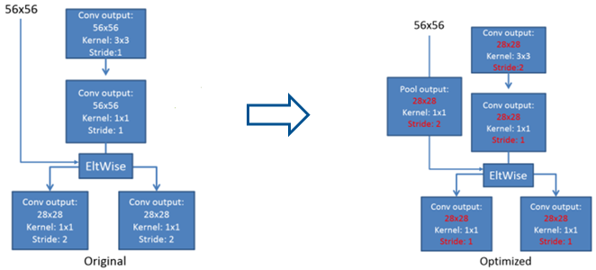
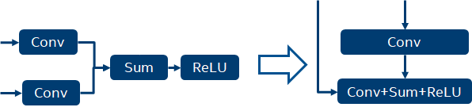

# 深度学习推理性能优化

## 推理性能优化：一个越来越重要的话题
为什么我们开始关注和重视推理性能的优化。

- **天时**

    深度学习的上半场主题是**自证**，数据科学家们设计出各种各样的模型结构（topology architecture），并用海量的数据喂养它，最终养成能够解决各行各业不同问题的高指标模型。 经过这一阶段，基本证明了深度学习作为一种新的方法，能够解决一些实际场景之前难解或不可解的问题。基于此，上半场的主要工作在**训练**模型。

    随着上半场的推进，目前整个社会对深度学习确实是很多问题的有效解决方案已没有异议。那么，势必推进到下半场，下半场的主题是**落地**，也就是把训练出的模型部署到实际的应用场景中，产生经济或社会效益。所以，下半场的主要工作在**推理**阶段。

- **地利**

    从市场来说，我们可以用一个粗略的方法来估计训练和推理的市场容量：训练市场规模和数据科学家的规模成正比；而推理市场规模和$(应用数 \times 应用的用户数)$成正比，孰大孰小一目了然。所以对平台、硬件厂商而言，不管你在上半场是失败者或是成功者，下半场都要打起精神，认真面对。

    

- **人和**

    2018 年后半段，产业界开始有越来越多的投入在深度学习推理引擎上。这些投入是有其必要性的。
 
    其一是深度学习训练框架的碎片化。
 
    > **为什么会碎片化** 
    > - 出于站位的原因各大公司都推出了自己训练框架（Google 的 TensorFlow，Facebook 的 PyTorch，Amazon 的 MxNet，百度的 PaddlePaddle 等）。
    > - 算法科学家在选择模型训练框架上有多样性和倾向性。这是跟算法科学家所在社区（如计算机视觉算法喜欢 PyTorch，NLP 的喜欢 TensorFlow etc.）和标杆性模型是用什么框架实现等这些元素相关的。

    这种碎片化，导致了高效部署上的实际困难。首先，生产环境需要支持各种各样、各个版本的框架，而各种框架之间又存在依赖上的不兼容性，导致了生产环境的混乱、不稳定。同时也使得生产环境中的推理的性能优化变得碎片化和难以为继。

    其二是软件设计上的。我们知道现有的 AI 框架主要是为算法科学家设计的，这个设计定位使得AI框架在设计取舍上会倾向于灵活性，即使得算法科学家能够用框架搭出尽可能多的新模型架构。这就要求在算子设计颗粒度上要尽可能小。而在生产环境中，主诉求从灵活变成了效率，因为成本很重要。而效率要求做一些激进的优化，如做一些大的 `operator fusion`，数学变换以及微架构友好的优化，从而减少调度开销和微架构开销。 可以看到生产环境和研究环境下对框架设计的要求是在“灵活和效率”两大矛盾的两端，这种矛盾是很难调和的。基于以上，在这种情况下，为生产环境专门做一个效率为先的框架是必要的，这一块也有越来越多的工程师的投入。

    一个典型的推理引擎栈如下：

    

## 一些初期的探索和经验

我们在 2017-2020 的时间窗口，在推理的性能优化方面，做了一些实际的工作。在这些实际工作的基础上，也渐渐总结出一些方法论上的东西。现在分享出来，抛砖引玉。

### 推理优化四部曲

我们对做过的优化工作总结梳理后，把推理优化工作归成四类：算子优化，图优化，模型压缩和部署优化。下面一一解释。

### 算子优化

算子优化的题中之意就是优化单算子的性能，方法无非是算法优化和微架构优化。

#### 算法优化

对同一个算子可能有不同的算法去实现它。举个例子，对卷积算法我们常见的就有：空间域方法（`im2col + matmul`，直接卷积法），变换域方法（`Winograd` 变换法，`FFT` 变换法）。需要我们针对目标问题，分析并实现合适的算法，来达到最佳性能。

#### 微架构优化
  
微架构优化主要焦点是如何充分利用好微架构的内置加速器的能力去最大化算子的性能。如 Intel Xeon CPU 里面一般都有 `SIMD（Single Instruction Multiple Data）`加速器（如 `AVX512` 的 `FMA（Fused Multiply-Add）`加速）。如何充分利用并最大化这些 `SIMD` 加速器的利用率，是微架构优化需要做的。下面展示了给出了一个如何充分利用 `AVX512 VNNI` 的能力进行 `INT8` 直接卷积计算的一个例子。

可以看出，为了最大化 `AVX512` 的吞吐，需要计算方案和 `memory` 存取协同优化。在该方案中，我们可以一个时钟周期完成 `16` 个输出数据的计算。

> **例**：输入 4 通道，输出 16 通道，卷积核大小为 $3\times3$，INT8 卷积
> 
>	
>
>	

### 图优化

图优化主要通过子图变换和算子融合的方式来达到减少计算量或者其他系统开销（如访存开销），从而达到性能优化的目的。图优化主要是希望在不影响模型的数值特性的基础上，通过图变换达到简化计算、资源开销，提升性能，所以是性能优化时的首选方法之一。下面列举几例。

#### **子图变换**

子图变换主要是通过数学变换的手段对图进行精简，从而减少计算和调度开销。常见的有常数折叠、公共子表达式折叠（`common subexpression elimination （CSE）`）以及算术变换。

- **常数折叠（Constant Folding）**
	- **例 1：`Conv + Batch Normalization` 折叠**

	    

	- **例 2：Identity 折叠**
  
	    

- **算术变换（Arithmetic Optimizer）**
	- **例 1：`MatMul + Transpose` 变换**

    	

	- **例 2：Residual Block 子图变换**

    	

#### **算子融合（Operator Fusion/Remapper）**

算子融合基于对深度学习拓扑结构模式的观察。深度学习算子按其对资源的需求可以分为两类：

- 计算密集型算子，这些算子的时间绝大部分花在计算上，如卷积、全连接、矩阵乘等。

- 访存密集型算子，这些算子的时间绝大部分花在访存上，他们大部分是 `element-wise` 算子，如 `ReLU`，`eltment-wise sum`。

在典型的深度学习模型中，一般计算密集型和访存密集型算子是相伴出现的，最简单的例子是 `Conv + ReLU` 相伴出现。这时候我们可以通过 `fusion` 来实现 `in-register computing`，从而减少访存密集型算子的访存，减少内存访问延时和带宽压力，提高推理效率。

**例 1： `Conv + Conv + Sum + Activation` 融合**
  
这是 residual block 里一个常见的 pattern，我们可以采用如下融合方案：
		

	
可以看到，这个方案通过融合减少了两个 tensor 内存读和写操作。
		

	
#### **数据流优化**

最典型的数据流优化要算 `memory layout propagation` 了。针对不同特点的计算平台和不同的算子，为了追求最好的性能匹配，一般都需要选择不同的 `tensor` 内存布局（`memory layout`），而这些 `layout` 可能跟框架缺省的内存布局是不一样的。在这种情况下，之前的做法是算子在做完后加入一个 `reorder` 操作，把 `memory layout` 转换回框架的缺省内存布局，这就引入了额外的 `reorder` 操作。以下图为例，在 `AVX512` 平台上 `conv` 算子在 `nchw16C` 的内存排布时是性能最优的，所以可以看到 conv kernel 输出的 tensor layout 是 `nchw16C`，然后通过一个 `reorder` 操作转回了框架缺省的 `nchw`，紧接着，后面又是一个 `conv`，它需要 `nchw16C` 的输入，所以又做了一个 `nchw->nchw16C` 的 `reorder`。我们很容易看出，虚线框内的两个 `reorder` 操作互为逆操作，可以相互抵消。`layout propagation` 就是用于识别出相邻的互逆 `reorder`，并消除它们，从而减少了无效的 `memory` 操作。
- **例 2：Convolution Memory Layout Propagation**
  
    

### 模型压缩

上面的都是无损的，当这两点都做完了后，如果还需要额外的性能增益，这时候需要考虑模型压缩方案。模型压缩（model compression）主要手段有：模型量化、模型蒸馏和模型稀疏化。

- 模型量化
  
  模型量化主要是通过降低模型中 tensor 和 weights 精度的手段，从而减少计算需求和数据存储与传输需求，来达到加速的目的。主要方法分两派：一是训练后量化（Post-Training Quantization，PTQ），二是量化感知训练（Quantization-Aware Training，QAT）。这个 topic 比较大，可以另讲。

- 模型蒸馏
  
  模型蒸馏采用的是迁移学习的方法，通过采用预先训练好的复杂模型（teacher model）的输出作为监督信号去训练另外一个简单的网络（student model），最后把 student model 用于推理。

- 模型稀疏化
  
  稀疏化首先是 Han Song 做 FPGA 的时候提出来的，这个时期的稀疏化就是纯稀疏化，减少 synapses。这种稀疏化，适合 FPGA，相当于减少了电路。但对于通用计算平台（如CPU，GPU等），不规则稀疏矩阵计算最终还是要落地到规则的计算单元上，这个时候是性能变好还是变差取决于 problem size 和如何把问题映射到计算单元上的方案，性能是提高还是降低是不确定的。所以后面业界的研究重点就转向了结构稀疏化。

### 部署优化

前面三类优化可以认为是静态优化，是与资源分配无关的。但当这些静态优化部署在平台上的时候，就产生了 `executable` 和部署环境的交互，这就产生了资源分配和调度的问题。部署优化主要通过调整模型在部署时的资源分配和调度的参数来进一步优化性能。下面的例子从一个角度说明了部署优化的重要性和带来的价值，这里仅仅调整了NUMA的参数就带来了 `56%` 的吞吐提升。

CPU 平台上常见的运行时优化 knobs 有:
- system knobs
	- NUMA
	- core affinity
	- Turbo
	- Hyper Threading
- framework-specific knobs
	- TensorFlow
		- inter_op_parallelism_threads
		- intra_op_parallelism_threads
- solution knobs
	- data parallelism vs. task parallelism
	- data & inference pipeline

我们可以把把部署优化问题建模为一个约束最优化问题，从而利用自动化的寻优算法来自动化这个过程，[2] 在这方面做了有益的探索，我们在使用的过程中也确实获得了不错的性能增益。

## 前方的路

初期的工作起到了拓荒的作用。在短期解决了产品和业务特定痛点的同时，更重要的是为系统化工作提供洞察力和原始积累。case-by-case 的优化理论上提供了极致性能（efficiency）的可能性，但同时也大大约束了生产力（productivity），从而进一步束缚了工业落地。我们可以类比汇编语言时代，虽然汇编语言是效率的王者，但是没有高级语言和编译技术的出现并提供合理的开箱性能（Out-Of-Box），我们无法把人从汇编优化中解放出来，去做更有价值的应用和领域，从而推动技术和商业的发展。同样的，如果我们深信 AI 会是未来的生产力赋能工具，我们需要首先解决 AI 落地本身的低效问题。这也是 DSA（Domain Specific Architecture）和 DSC（Domain Specific Compiler）出现的时代背景和必然性。我们需要凝练、固化、泛化经验，让它软件化、工具化、自动化，赋能 DSA/DSC，这才是最终的路径。

## References
1. [TensorFlow Graph Optimizations](https://web.stanford.edu/class/cs245/slides/TFGraphOptimizationsStanford.pdf)
2. [Auto-tuning TensorFlow Threading Model for CPU Backend](https://arxiv.org/pdf/1812.01665.pdf)

*写于 2020 年 6 月*