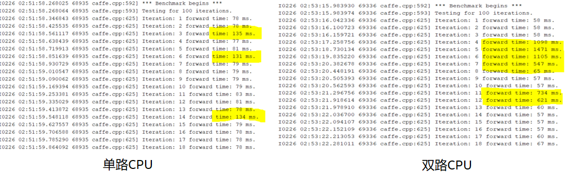
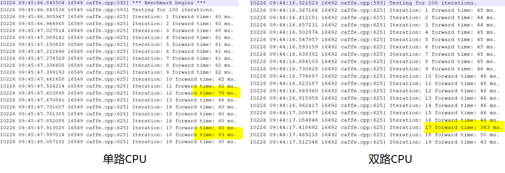
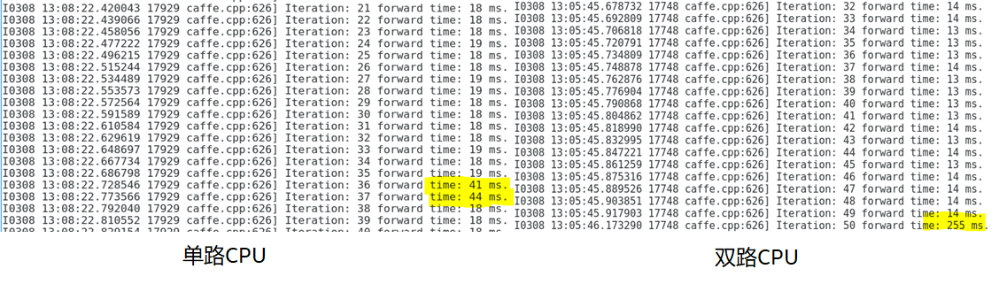
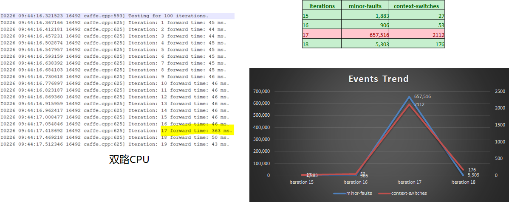
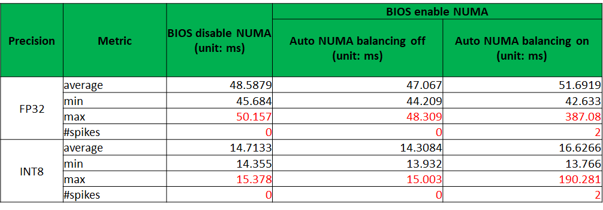

# CPU深度学习模型推理性能抖动问题

## 问题
客户在其环境中发现推理延时毛刺问题，如下：



模型为 `ResNet-152-v1 FP32` 推理。

从 log 可见，抖动出现的频率还比较高，且双路时抖动时延高达平均时延的 `20` 倍左右，已经会影响客户的 SLA（Service Level Agreement）。

## 初步排查

- **环境是裸机还是云主机？**
   
   裸机
 
- **绑核了吗？**
   
   使用下面的命令：
	
    ``` shell
	$ export OMP_NUM_THREADS=52
	$ export MKL_NUM_THREADS=52
	$ taskset -c {0-51} numactl -l caffe time -model <model_path> -iterations 100
	```
   
   无效
 
- **disable Turbo 有没有效果？**
   
   无效

- **有没有磁盘 IO ？**
  
  测试是 dummy data，不是 real data，测试时无磁盘 IO。

- 会不会是硬件问题？
   - **有没有 `dmesg` 报错？**
     
        无

   - **在跑 benchmark 的时候有没有频率抖动？**
  
        用 `turbostat` 查看无明显异常

   - [**SGEMM benchmark 有类似的问题吗？**](https://software.intel.com/en-us/articles/benchmarking-gemm-with-intel-mkl-and-blis-on-intel-processors)

        无

## 复现

low-hanging 排查失败后，方向转向：先在本地复现，然后 debug。

### 环境对齐

- 要求客户提供如下信息：
	- **HW**
		- `lscpu`
		- `dmidecode -t memory`

	- **BIOS**
		- P-state
		- C-state

	- **OS**
		- power governor: performance

    	    ``` shell
	        $ cpupower frequency-info
	        $ cpupower frequency-set -g performance
	        ```
			
与客户对齐 framework commit、batch size、CPU SKU、内核版本以及命令后，我们的 lab 在 `FP32` 和 `INT8` 上均能复现客户的问题。
- **`FP32` `AVX512`**
  
	
- **`INT8` `VNNI`**

	
<!-- Framework：Intel-Caffe；batch size：8；SKU：8269C；NUMA enabled；kernel：4.19.4-->

## Debug

### [开始] 是否是OS与应用程序资源争用导致？

之前曾遇到过阿里云上性能下降的问题，最终 root cause 是由于 OS 和 KVM 争用应用程序的资源导致，在 `taskset` 规避掉 `0～1` core 后 fix，这个问题是否与之相似？

- 尝试：将应用程序 taskset 到 `2~23` 核，防止与 OS 争用 `0～1` 核。
- 结果：问题仍然存在，失败。

**分析陷入僵局**

### [转机] 客户提及性能抖动在 NUMA off 后消失
在 lab 也复现出客户所说的现象，分析重心向 NUMA 问题倾斜。又联想到这个现象隔一段时间发生，思路开始往“周期性 event" 方面倾斜，想看下这个抖动是否与内核/硬件的 events 有正相关关系。于是，通过 `perf stat` 命令开始收集 latency 和 events 的关系。

经过很多实验，最终 narrow down 到 `minor-faults` 和`context-switches` 两个事件。如下：



可以看到，在 latency 突变时，`minor-faults` 和 `context-switches` 两个 event 数目也同时发生了大量的增加。那么是什么导致了这两个 event 的大量增加呢？这要从理解这两个事件开始。

- minor-faults: It occurs when the code (or data) needed is actually already in memory, but it isn't allocated to that process/thread。不是 `major page fault`，而是 `minor page fault`，说明数据基本都在内存中，仅仅出现了线程间的数据迁移。

- context-switches: A context switch (also sometimes referred to as a process switch or a task switch) is the switching of the CPU (central processing unit) from one process or thread to another。不仅数据出现了迁移，thread 也迁移了。

但我们在跑代码的时候使用 `KMP_AFFINITY`，`taskset` 以及 `numactl` 固定了 `OMP` 的线程。按之前对这三个工具的理解应该是不会发生线程 floating 的。是不是 kernel 有自己的行为，仍然会按照自己的策略进行 thread 和 data 的 allocation？果然找到了 `Automatic NUMA Balancing` 这个 kernel feature，叙述如下：

> An application will generally perform best when the threads of its processes are accessing memory on the same NUMA node as the threads are scheduled. Automatic NUMA balancing moves tasks (which can be threads or processes) closer to the memory they are accessing. It also moves application data to memory closer to the tasks that reference it. This is all done automatically by the kernel when automatic NUMA balancing is active.
> 
> Automatic NUMA balancing uses a number of algorithms and data structures, which are only active and allocated if automatic NUMA balancing is active on the system:
> - Periodic NUMA unmapping of process memory
> - NUMA hinting fault
> - Migrate-on-Fault (MoF) - moves memory to where the program using it runs
> - task_numa_placement - moves running programs closer to their memory

因为 `Automatic NUMA Balancing` 既会移动数据也会移动线程，因此上面既能看到 `minor-faults` 又能看到 `context-switches` 两个 event 的激增就能理解了。

### [Solution]

```
$ cat /proc/sys/kernel/numa_balancing
$ sysctl -w kernel.numa_balancing=0
or 
$ echo 0 > /proc/sys/kernel/numa_balancing
```

### [Results]


问题解决！

## Further Readings
1.  [Linux kernel profiling with perf](https://perf.wiki.kernel.org/index.php/Tutorial)
2. [Automatic NUMA Balancing](https://access.redhat.com/documentation/en-us/red_hat_enterprise_linux/7/html/virtualization_tuning_and_optimization_guide/sect-virtualization_tuning_optimization_guide-numa-auto_numa_balancing)
3. [Context Switch Definition](http://www.linfo.org/context_switch.html)
4. [CPU Frequency Scaling](https://wiki.archlinux.org/index.php/CPU_frequency_scaling)
5. [irqbalance](https://access.redhat.com/documentation/en-us/red_hat_enterprise_linux/7/html/performance_tuning_guide/appe-Red_Hat_Enterprise_Linux-Performance_Tuning_Guide-Tool_Reference#sect-Red_Hat_Enterprise_Linux-Performance_Tuning_Guide-Tool_Reference-irqbalance)
6. [Understanding page faults and memory swap-in/outs: when should you worry?](https://scoutapm.com/blog/understanding-page-faults-and-memory-swap-in-outs-when-should-you-worry)
7. [Memory Management Unit](https://en.wikipedia.org/wiki/Memory_management_unit)

*写于 2020 年 6 月*