# 计算架构的演进

## 路标
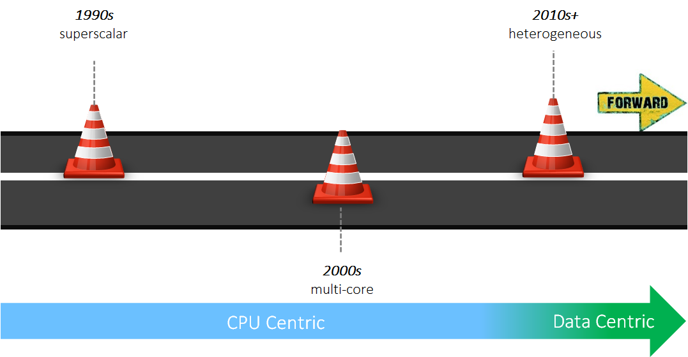

## super-scalar 时期（1990s）
超标量时期主要关注单核性能，主要使用的方法有：

### **`ILP（Instruction Level Parallelism）`**
`ILP` 顾名思义就是挖掘指令性并行的机会，从而增加指令吞吐。指令吞吐的度量是: `IPC（Instructions Per Cycle）` 即每个时钟周期可以执行的指令数。在未做 `ILP` 的时候 `IPC = 1`。

增加 `IPC` 主要通过 `pipeline` 技术来完成（如下图）。`pipeline` 技术把指令的执行过程分成多个阶段（stages），然后通过一个同步时钟来控制，使得每过一拍，指令都会往前行进到 `pipeline` 的下一个阶段，这样，理想情况下可以保证同一个周期可容纳 $d$ 条指令在 `pipeline` 内，使得 `pipeline` 的所有 `stage` 都是忙碌的，$d$ 称为 `pipeline` 的深度（depth）。

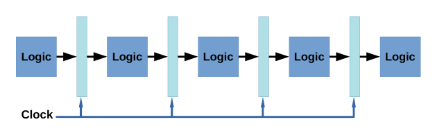

下图是 `RISC-V` 的标准 `pipeline`，它的 $d=5$，分别为：取指（Instruction Fetch，IF），译指（Instruction Decode，ID），执行（Execute，EX），访存（Memory Access，Mem），回写（Write Back，WB）。其中 `IF` 和 `ID` 称为前端（Front End）或者控制单元（Control Unit），执行/访存/回写称为后端（Back End）或者执行单元（Eexcution Engine），即广义 ALU（Arithmetic/Logical Unit）。

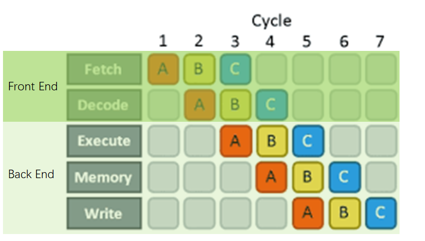

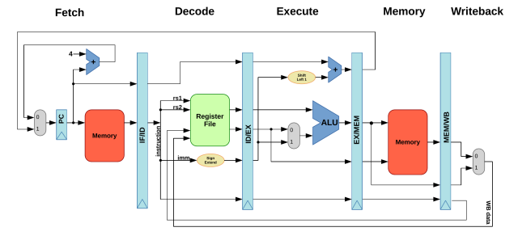

有了 `pipeline`，就可以通过增加 `pipeline width` 的方式提高指令并行度，即：使得 `pipeline` 可以在同一个时钟周期取、译、发射（issue, 即将指令提交给 `execution engine` 执行）多个指令的方式来达成 `ILP`。物理上，需要多路 `ID/IF` 以及多个 `execution engine`。如果一个核在一个时钟周期最多可以 issue $m$ 条指令，我们就叫这个架构为 `m-wide` 的 `multi-issue core`，也叫 `superscalar core`。

下图为 x86 SunnyCove core（Skylake 的 core）示意图。可以看到，它有 4 个计算 ports（即 `execution engine`），我们可以称它为 `4-wide multi-issue core`，即它的最大可达 `IPC` 为 4。

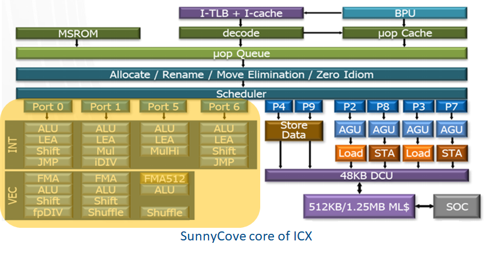

### **`DLP（Data Level Parallelism）`**

提高数据并行度的主要方式是增加 `execution engine` 每个时钟周期能处理的数据个数。传统的 CPU 每个时钟周期只能处理一个标量的运算，我们叫它 `scalar core`。增加 `DLP` 的方式是使得每个时钟周期能处理一个特定长度的向量数据，这就是 `vector core`。目前 `vector core` 主要通过 `SIMD(Single Instruction Multiple Data)` 技术来实现数据并行，如 ARM 的 NEON，X86 的 SSE、AVX（Advanced Vector eXtensions）、AVX2、AVX512，以及 GPU `SIMT（Single Instruction Multiple Data）` 技术的 execution engine 其实都是 `SIMD`。

下图 SunnyCove core 的 port 5 有一个 `AVX512` 的 `FMA512（512-bit Fused MultiplyAdd）` 它可以带来 16 个 `FP32` 乘加运算的 `DLP`。

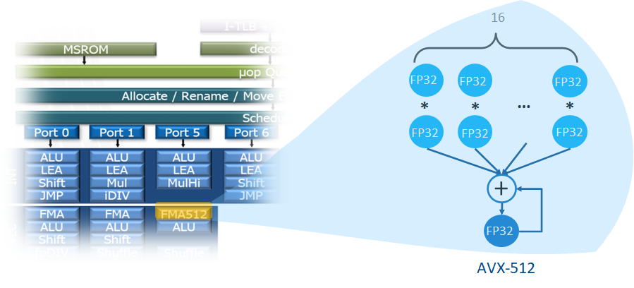

### **Heterogeneous Parallelism**
这一时期，我们也能依稀看到异构并行的萌芽，体现在标量和向量的异构并行上。下图就体现出标量和向量的并行。

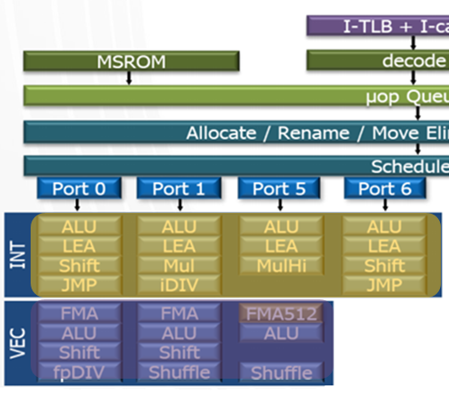

## Multi Core 时期（2000s）

多核时期在继续抠 `ILP`、`DLP` 的同时，慢慢开始重视 `TLP（Thread Level Parallelism）`。主要想法是通过堆同构（homogeneous）核，横向扩展并行计算能力。

### **`TLP（Thread Level Parallelism）`**
#### **Physical Multi-Core**

Physical Multi-Core 就很简单了，就是纯氪金，对 CPU 和 GPU 而言都是堆核，只不过 GPU 把核叫作 SM（Streaming Multiprocessor，NV），SubSlice（Intel）或  Shader Array（AMD）。

下图是一个 x86 Icelake socket，可以看到，它有 28 个核。

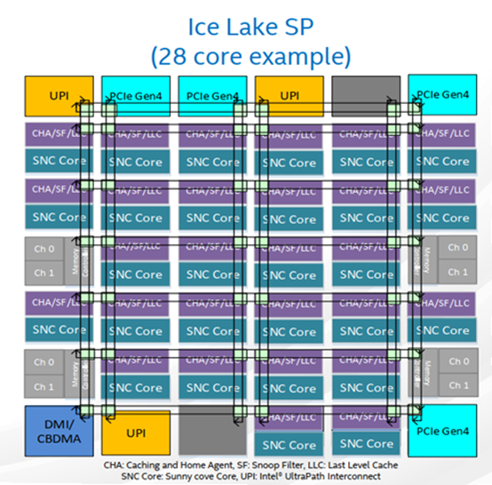

下图是 NV A100 对应的 GA100 full chip，它有 128 个核（SM）。

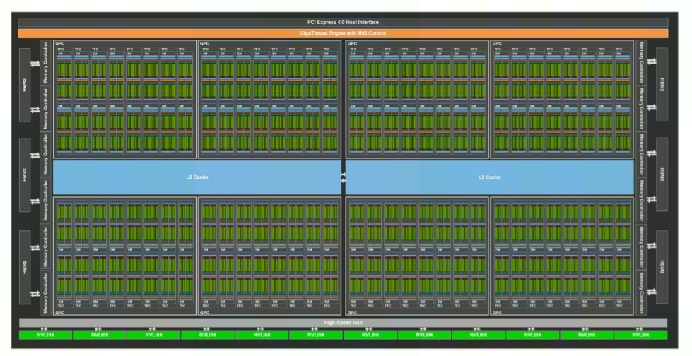

#### **Hardware Threading**

相比 Physical Multi-Core，Hardware Threading 就是挖掘存量了。它的基本假设是：现有单程序会因为各种依赖会造成各种 `pipeline stall`，导致 `pipeline bubble`，从而很难打满 `pipeline` 的利用率。所以，需要考虑跨程序挖掘并行度。基于这个假设，一个自然的想法就是增加多个程序 `context`，如果一个程序 `stall` 了，`pipeline` 就切到另一个，从而增加打满 `pipeline` 的概率。示意图如下。

CPU：

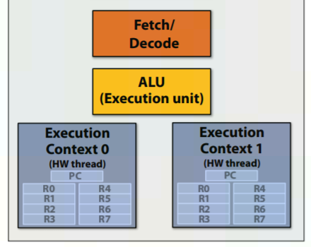

GPU：

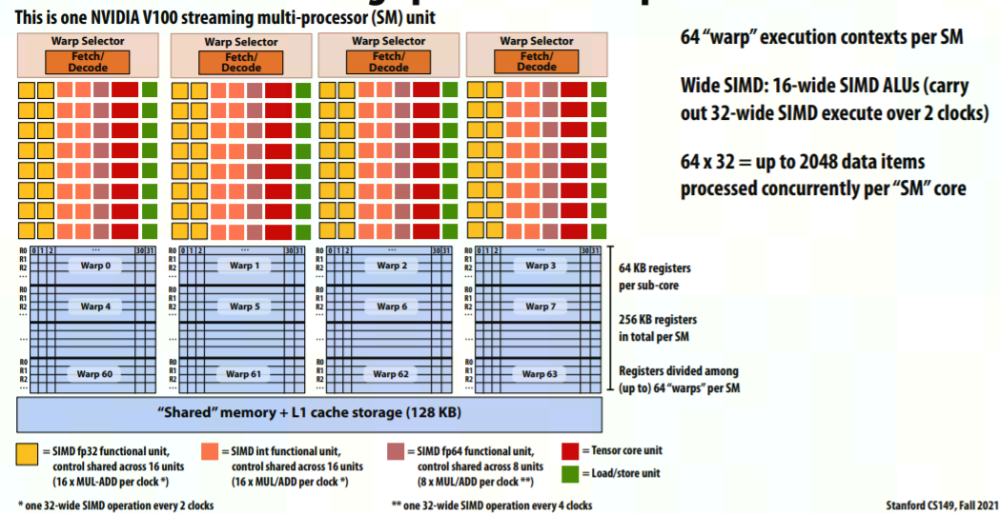

这就可以看出为啥叫 `threading` 了，就是不增加实际 `pipeline` 硬件，只增加 `execution context` 的白嫖，:)，这是 `threading` 的精髓。跟 s`oftware threading` 不一样的地方是，这个 `execution context` 的维护和使用是硬件做的，而不是软件做的，因此叫 `hardware threading`。

因为有多个 context 对应于同一个 pipeline，因此如何调度 Front End 间的 issue 指令方式也有两种方式：

- `SMT（Simultaneous Multi-Threading）`
  
  Each clock, the pipeline chooses instructions from multiple threads to run on ALUs。典型的 `SMT` 就是 Intel X86 CPU 的 Hyper Threading Technology（HT or HTT），每个核有 2 个 `SMT` threads；另一个例子是 NV GPU 的 warp。

- `IMT（Interleaved Multi-Threading）`
  
  Each clock, the pipeline chooses a thread, and runs an instruction from the thread on the core’s ALUs. 

Intel Gen GPU 采用的 `SMT` 和 `IMT` 的混合技术。

## Heterogeneous Computing 时期（2010s+）

由于应用对算力（Higher Computation Capacity）和能效（Better Power Efficiency）的需求越来越高，体系架构为了应对这种需求发生了方法论的转变，从 *One for All* 走向 *Suit is Best*。这是需求侧的因素。

而在供给侧，GPU 的成功也侧面证明了 Domain Specific Computing 的逐渐成熟。

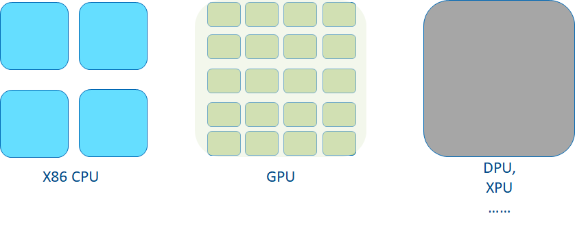

对 software productivity 而言，需要有两个前提条件：

- Unified Data Access

  这个 OpenCL 2.0 的 SVM（Shared Virtual Memory）和 CUDA 的 UVM（Unified Virtual Memory）有希望。硬件上 coherency-aware data access 硬件如 `CXL` 可以从性能角度进行支撑。 

- Unified Programming Model

  需要类 C/C++ 的且支持异构计算的统一编程语言，这个有 CUDA、OpenCL 以及 DPC++。

异构计算的题中之意是：**Use best compute engine for each workload by re-balancing ILP & DLP & TLP**，最终计算能力是 3 者的组合：

$$ Compute\_Capability\_per\_Cycle = TLP \times ILP \times DLP $$

对不同的工作负载，我们需要考虑我们是更倾向于 **A Few Big** 还是 **Many Small**。

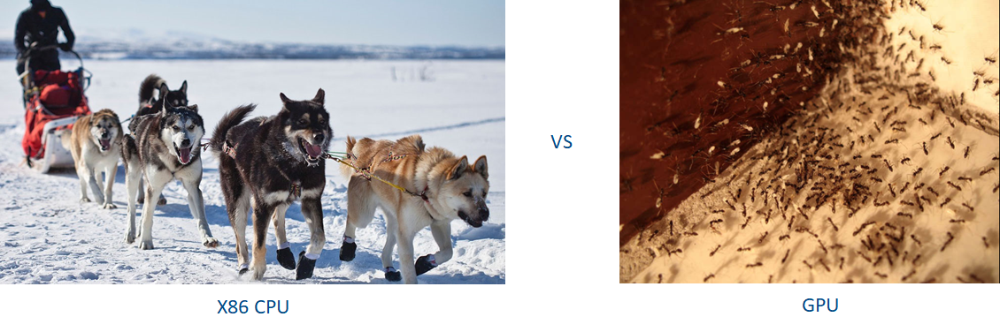

目前常见的异构计算是 CPU 和 GPU 的异构计算，CPU 作为 latency machine 代表, GPU 作为 throughput machine 的代表，二者各有所长。
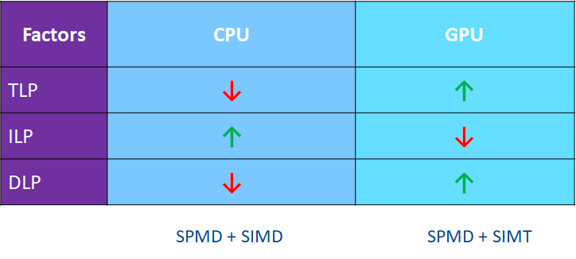

### CPU Micro-Architecture Characteristics

- TLP

  tens of cores, each with 2 hardware threads;
- **ILP**

  4 compute ports w/ OoO(Out of Order) issue
- DLP

  SIMD width supported by increased cache bandwidth

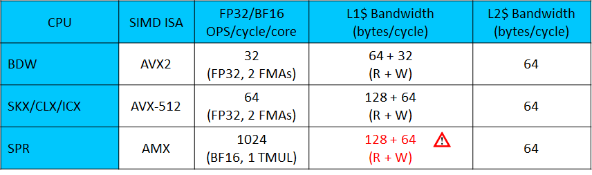

### GPU Micro-Architecture Characteristics

- **TLP**
  - hundreds of cores, each with many(e.g. 32) hardware threads;
  - simple and efficient thread generation/dispatching/monitoring
- **ILP**
  - 2~3 compute ports, mainly in-order issue
- **DLP**
  - wider SIMD width, plus large register files reduce cache/memory bandwidth needs and improve compute capability and efficiency

随着算力和能效的要求越来越高，除了挖掘冯-诺伊曼体系内的异构计算机会外（如 `CPU + GPU` 异构, `GPU + ASIC` 异构等）。大家还开始 revisit 其他体系结构，寻找 cross 体系结构的异构机会，如最近一段时间大家讨论比较多的 dataflow architecture 或者 spatial computing。路是越走越宽了！

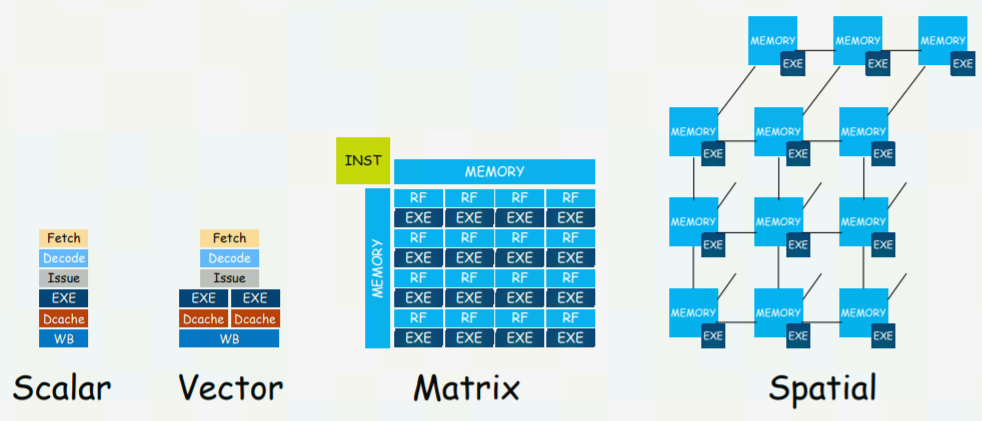

## References
1. [CSE 471: Computer Design and Organization - Spring 2015](https://courses.cs.washington.edu/courses/cse471/15sp/lectures.html)
2. [CSE 471: Computer Design and Organization - Spring 2007](https://courses.cs.washington.edu/courses/cse471/07sp/lectures.html)
3. [Design of a dual-issue RISC-V processor](https://iopscience.iop.org/article/10.1088/1742-6596/1693/1/012192/pdf)
4. [Astorisc architecture overview: pipeline](https://www.alrj.org/astorisc-architecture-overview-pipeline.html)
5. [NVIDIA A100 Tensor Core GPU Architecture](https://images.nvidia.cn/aem-dam/en-zz/Solutions/data-center/nvidia-ampere-architecture-whitepaper.pdf)
6. [Introducing RDNA Architecture](https://www.amd.com/system/files/documents/rdna-whitepaper.pdf)
7. [Intel Processor Graphics Gen11 Architecture](https://www.intel.com/content/dam/develop/external/us/en/documents/the-architecture-of-intel-processor-graphics-gen11-r1new.pdf)
8. [Hyper-threading Wikipedia](https://en.wikipedia.org/wiki/Hyper-threading)
9. [Stanford CS149: Parallel Computing - Fall 2021](https://gfxcourses.stanford.edu/cs149/fall21)
10. [OpenCL™ 2.0 Shared Virtual Memory Overview](https://www.intel.com/content/www/us/en/develop/articles/opencl-20-shared-virtual-memory-overview.html)
11. [Everything You Need To Know About Unified Memory](https://on-demand.gputechconf.com/gtc/2018/presentation/s8430-everything-you-need-to-know-about-unified-memory.pdf)
12. [Peer-to-Peer & Unified Virtual Addressing](https://on-demand.gputechconf.com/gtc-express/2011/presentations/cuda_webinars_GPUDirect_uva.pdf)
13. [关于GPU一些笔记(SIMT方面)](https://blog.csdn.net/weixin_42730667/article/details/109838089)
14. [Instruction Pipeline Simulation](https://github.com/mlshort/InstructionPipeline)
15. [What's up with my branch on GPU?](https://aschrein.github.io/jekyll/update/2019/06/13/whatsup-with-my-branches-on-gpu.html)
16. [An AnandTech Interview with Jim Keller: 'The Laziest Person at Tesla'](https://www.anandtech.com/show/16762/an-anandtech-interview-with-jim-keller-laziest-person-at-tesla)
17. [Moore's Law in the age of AI Chips](https://cdn2.hubspot.net/hubfs/6212008/ScaledML%20Media%20Archives/2020/Slides/Jim%20Keller%20-%202020.pdf?hsCtaTracking=0e1ac61d-a34e-45f8-8868-958afb7d5c66%7Ce0324752-d66b-42ed-bc6f-2ae6e9e22adb)
18. [ScaledML archive](https://info.matroid.com/scaledml-media-archive-2020)
19. [RISC-V Pipeline Implementation](https://passlab.github.io/CSE564/notes/lecture09_RISCV_Impl_pipeline.pdf)

*写于 2022 年 2 月*