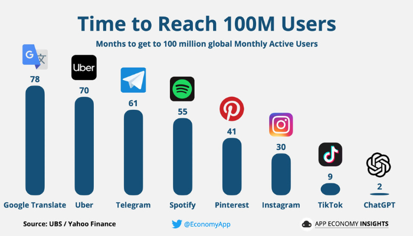
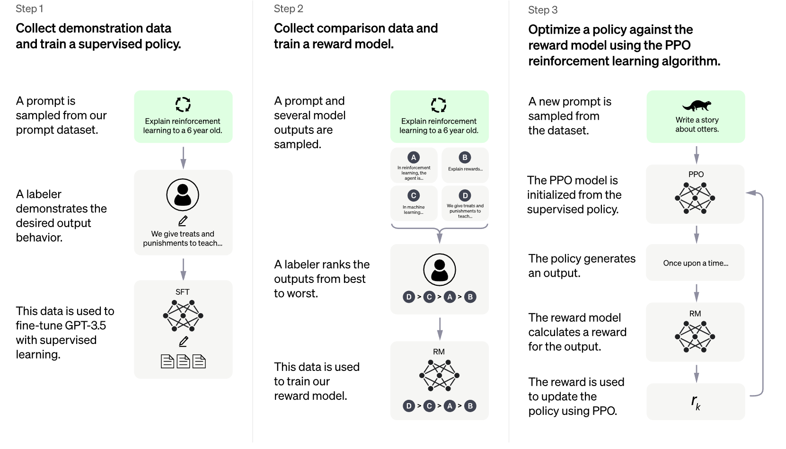
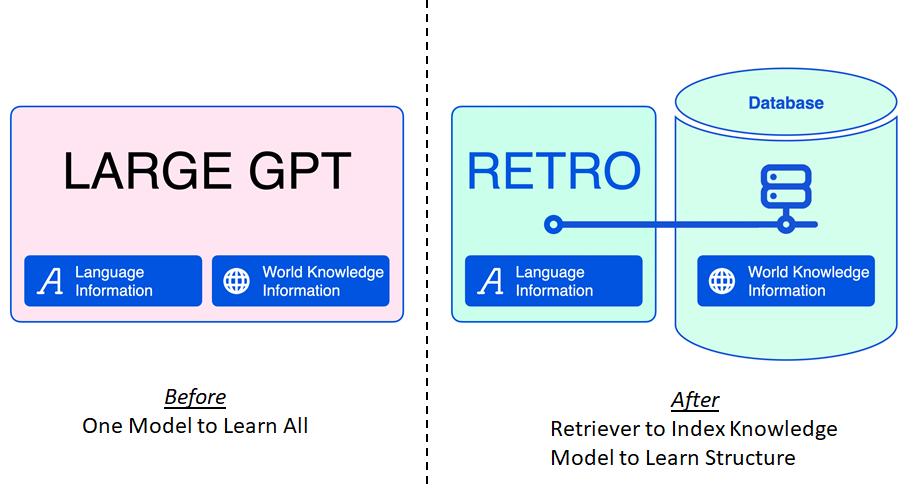

# ChatGPT 与 AIGC 简问乱答

**仅代表个人观点。**

- **[Q1]** ChatGPT 最近非常火爆，2 个月突破 1 亿月活，从产品形态来看，我们知道的微软、谷歌的搜索引擎都会嵌入。那么我们如何看待它的用户粘性，真的会有那么多人持续使用吗还是说只是一阵热潮？

     

  - **[A1]** 首先，工业界长久以来对搜索引擎的最终产品形态的定义是：信息问答助理。目前的信息检索黄页的产品形态个人认为其实是在技术发展未能满足最终产品形态目标的情况下的一种中间产物。近几年来，随着AI的发展，大家其实已经开始拾起初心，重新开始探索**自然问答产品形态**在新的技术进展下的可能性。如果大家留意观察的话，可以看到百度、Bing、Google 在用户输入自然语言问题时，已经开始在第一栏展示自然语言的回答，而不仅仅是相关链接。

    

    但之前的技术虽然使用了 AI 但还不完善，没有达到颠覆性用户体验的阈值。而 ChatGPT 的出现让大家看到了达到这个阈值的希望。因此，个人觉得，ChatGPT 本身提供了贴合搜索引擎最终产品形态理想的一个现在看上去很有前途的技术方案。如果它能在后续语料和反馈不断增加的情况下不断提高 coverage、准确度、以及价值观的拟人性，它就能过够帮助搜索引擎达到其理想的产品形态，成为搜索引擎和各类人机交互引擎的主要或默认接口形态。
    因此，从方向上来看是正确的方向，最终能不能成为主要接口取决于真实大规模实际使用的 bad case 的处理的演进速度。

- **[Q2]** 我们现在可以看到 ChatGPT 作为一个 AIGC 率先火爆起来，那么其他 AIGC 比如图片和音频上可能会有什么应用场景出现吗，我们看好哪些探索，商业化更看好哪些实现方式，未来可以替代哪些工作？
	- **[A2]** 最近一段时间以来，Creative AI 或者 Generative AI 领域取得了比较多的进展。在 ChatGPT 之前，文生图的 Stable Diffusion 也震动了科技圈一段时间，你可以输给模型一段话用于描述你想生成什么样内容和风格的图像，模型会根据你的描述创作一幅图。其他的，我们也看到 Google 公开了文本生成音乐的 MusicLM 模型等。因为其中生成自然语言文本是最难也是大众最常用的（不是每个人都作画、作曲，但每个人都有语言输出），因此在这方面的进展对大众造成的用户体验冲击最大，在大众中的影响力也最大。

        我们之前对 AI 的认知是 AI 主要擅长**理解**， 我们主要用它来进行识别、分类、预测这些任务，辅助我们理解世界、作出决策。`Generative AI` 最近的进展表明，AI 开始在**生成**这个领域开始越过奇点，朝着可用的方向迈进。这种变化具有潜在的革命性。从**理解**到**生成**，类比于从**分析**到**综合**，从能力上来讲是从人工智能到拟人智能的进步，这里面的技术进步是非线性的，产生了代差。

        我觉得 `Generative AI` 技术在**内容生成**领域有潜力造成革命性的影响，而**内容生成**其实无处不在，比如说画家作画、作曲家谱曲、作词人写词、作家写文章、建筑设计师出设计图、软件工程师写代码、硬件工程师画板图其实都是内容生成...... 因此，有比较大的想像空间。可以想像一下，如果进展比较顺利的话，初级 、中级的“内容生成者”会先被革命掉，这个 `24x7` 快速无休、不抱怨出活的模型带来了很大的诱惑。整个内容生产的闭环有可能从现在的 **“中级内容生产者生成初始内容 $\to$ 中高级内容审核者审阅、润色 $\to$ 打回打磨”** 变成  **“ AIGC 生成初始内容 $\to$ 中高级审核者审阅、润色 $\to$ 打回打磨”**。而在这个过程中其实又暗合了 ChatGPT 或生成式 AI 基于人类反馈的增强学习（Reinforcement Learning from Human Feedback，RLHF）的过程，因此同时也为 reward model 的演进提供了训练样本，因此促进 AIGC 的进一步演化和发展，从而形成有机的正向闭环。

        

- **[Q3]** 在游戏的工业化方面会有什么进展吗？
	- **[A3]** 首先游戏产业也是内容生产产业。其次，游戏大多不属于严肃文化的范畴，而属于商业文化（或流行文化）的范畴，因此它更希望能揣摩流行偏好、用户偏好从而最大化商业利润，而这正是统计学或者基于统计学的机器学习擅长的。从这两个角度，AIGC 在其中命中两点，因此会有比较大的潜力。我们也能看到国外已经在进行一系列的探索：如有些游戏已经开始[试验在 NPC 对话中引入](https://hackaday.com/2023/02/08/with-chatgpt-game-npcs-get-a-lot-more-interesting/)，从而使得游戏体验更逼真、个性化和更有实境感，从试验的结果看还是很有前景的。此外，大家还在试验 AIGC 用于初稿的游戏脚本生成，AIGC 用于游戏场景图像的生成或者多分辨率化等。

- **[Q4]** 我们知道大模型训练的算力要求比较高，那么这样一个模型的花费多少，每次计算的成本如何划分，整个链条上成本如何分配？
	- **[A4]** 模型的成本分为两个部分：
		- 训练成本：公开资料显示，预训练一个 175B 的 GPT3 模型大约需要 1024 张 A100 训练 34 天，使用了 300B 个词的语料库。所以成本包括：设备费用（包括机箱、GPU、互联设备）、训练电费、语料收集和清洗费用、工程师费用等。其中光电费可能就有几百万美金。这部分成本需要分摊。
		- 推理成本：模型生成后用于推理时，每次推理也会产生成本。因为模型比较大，对计算设备的算力和内存容量要求比较高，因此需要相对高端的计算设备、以及多个计算设备（如 GPU 等）一起工作才能达到一定的周转延迟（turn-around latency）。

        因为目前还在技术期，并未完全展开商业化探索，因此目前的成本还是由投资机构和公司来承担。随着 Bing 接入，意味着开始商业化探索，最终的成本如何分配如何还要看探索的结果。在搜索引擎这种 2C 产品形态而言，可能最终还是以广告的形式把成本转接给广告主。其他 2B/2C 的**专业内容生产**产品形态可能会出现跟用户分摊的方式。

- **[Q5]** 目前国内大模型各家的比较和看法？
	- **[A5]** 国内科技行业在当前这一阶段的现状一般可以理解为： **一开源就自主**，其实也就跟 `generative AI` 之前的 AI 现状差不多，理解能力强，创造能力相对需要提高。目前 ChatGPT 尚未开源或有相应的开源平替，也没有相应的最新论文，只有一个平替论文 `InstructGPT` 以及一个 [blog](https://openai.com/blog/chatgpt/)。所以，这块还需要观察。

        有，应该肯定是会有。能不能用，这个要观察，Google Bard也是一个前车之鉴。

        从数据和技术积累而言，百度应该是最有可能积累得最多的，因为主营业务是搜索引擎，因此有条件拥有大量且质量较高的 NLP 数据、搜索引擎本身也是 NLP 场景因此有对应的技术语境。而其他如阿里，因为它的主业还是购物网站，其主营业务数据模态还是购物的行为数据和品类数据，虽然有NLP类数据如品类描述等，但从知识型、性等角度来说还是欠缺，所以在数据和业务上并没有什么太大的优势。华为更甚。腾讯虽然有较多的社交文本数据，但社交文本数据本身具有私域性，且信息和知识密度低于搜索引擎或知乎之类网站，因此其实语料量大但质未必高。

        从技术积累上来看，百度因为主业是搜索引擎，因此在 NLP 技术的积累上来看应该是最多的。但涉及到与国际相应水平的对标上，要看近十几年来中国的科学和工程教育和工程师培养，我理解挑战还是颇大的。有时候，中国人“太”聪明了，抄近道的想法铭刻于骨血，这种表面上是急事，其实要看之前的久久之功的事情，还是要看积累。

<!-- - **[Q6]** 中文平台的 AIGC 是否会有合规问题，比如 AI 生成一些政治敏感、色情的内容，对国内 AIGC 是否有更高的要求和挑战？
	- **[A6]** 是的，AIGC 内容的安全性在技术方案设计的时候是一个很重要的因素。在中国可能尤甚，因为有两个问题：
		- 中国的内容审查机制更加严格
		- 中国的内容审查机制更加不可预测

		这导致了我们的有效训练数据会更少、以及需要更严格和动态的调整。这对数据标注、模型训练甚至使用时的人工干预形成了更大的挑战，甚至有可能在系统设计时引入非模型的控制模块，导致系统行为更复杂而使模型对最终结果的影响式微。

        另外，国内中文社区创造新词、老词新意、使用隐语的现象更加严重，也会造成影响。
-->

- **[Q7]** 我们知道目前 ChatGPT 本质上是一个概率模型，给你的答案是根据上下文语境概率最高的但不一定正确的答案。对于实时信息的生成是否也会受到当前训练数据的影响？
	- **[A7]** 是的，ChatGPT 本质上是一个概率模型，但我理解这不构成一个主要问题，因为人的表达其本质上也是一个概率模型，其本质上是基于人以往的经验所做的最大似然或是最大后验表达。所以从原理上来讲两者是一样的，并不存在固有缺陷。

        这个问题可能更多的在说：对于事实性信息，因为已经是确定的，所以应该怎么避免概率化表达带来的事实的似是而非或是信息缺失。这个目前已经有一些比较好的研究思路和实践，方法就是在生成模块之前加一个事实库，对输入的问题先通过事实库检索事实，再将检索到的事实和问题一起输给语言模型最终生成回答，即检索增强的生成（Retrieval Augmented Generation, RAG）。同时，该技术也有望解决实时信息的更新问题，只要把实时信息及时更新到检索库就好了。

        

- **[Q8]** 目前有哪些主要的缺陷，是模型角度造成的缺陷，还是通过训练可以弥补的缺陷？
	- **[A8]** 我觉得目前的主要工作还是对生成内容的质量、安全性和真实性的增强，这需要在 LLM 的核心上继续研究其配套技术及进行训练数据增强。目前没有看到 LLM 基石的变动的必要性，主要还是配套技术和数据集上。也许到一定时间会发现 LLM 基石出现限制，需要解决，这个可能要在数据和配套技术发展到一定程度会发现，现在还没有见到。

- **[Q9]** 从硬件角度看，您当前大模型随着参数量的提升是否给芯片算力和设计带来压力，软硬件是否存在代差（硬件跟不上软件，还是当前芯片算力有富余）
	- **[A9]** 目前没有看到软硬件存在禁止性的代差，因为模型已经可以训练和推理。但**可实现**和**可商用**是有区别的。下一步应该是怎么使得这个技术的成本达到大规模普及和可盈利的程度。工程师会进场对硬件、软件进行一轮优化，目标是成本降低到可普及和可盈利使用的水平。对硬件而言，除了算力的需求外，可能比算力增加更加紧迫的内存墙和互联墙，最近 NV 在 H100 上已经做了一些工作，大大增加了 NVLink 的带宽其实就是对此的一个回应， 因此应用和硬件其实在这个方面是有共识的，也已经开始在行动。目前更当务之急的应该还是怎么通过技术上的软硬件创新降低训练和推理成本， 解决[“与大型语言模型等人工智能交换信息的成本可能是完成标准关键字搜索功能的 10 倍以上”](https://www.163.com/tech/article/HU8JMCEJ00097U7R.html)的问题。

- **[Q10]** 国内企业如百度等要做国内版 ChatGPT，这个实现起来要多久，或者需要多久才能赶上现在版 ChatGPT，后面会不会变成我们进步了，他们也在进步，最后被远远甩在后面？
	- **[A10]** 这个问题其本质上就是原创的创新力的问题。只要没有原创创新力，就需要一直追赶，**抄作业的人作业抄得再快总是要等别人作业做完才能抄的**。这个要回归到我们的教育和社会体系中去解决。

- **总结**

    硅基智能的拟人化是融合模拟世界和数字世界的必要前提。从这个角度来看，这可被视作普遍的刚性需求。之前很热的元宇宙，要真正实现的话，其必要条件之一也在于此。之前 AI 在很多时候被诟病，主要还是 2 个问题：1) 对训练数据过拟合，外推能力不达预期；2) 自然语言生成能力弱，计算能力强而表达能力弱。这 2 点导致我们始终觉得 AI 属于哑巴式 “聪明” ，“人” 的部分偏弱。而 ChatGPT 的意义在于凭借着 LLM 的突现能力（emergent ability）和 RLHF 带来的价值观引导，使我们看到了好像有一个东西已经能够越过用户体验的阈值，之前遥不可及的梦想似乎有一条隐约可见的路指向它了！业界开始走上这条路，随着我们的前进，路上肯定会有其他的问题，但至少有一条路，那就有希望。

*写于 2023 年 2 月*