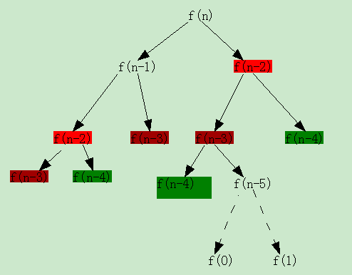

 # Fibonacci 数的生成
 
Fibonacci 数被称为“黄金分割数”，因为其相邻两项的比值越来越趋近黄金分割比例。据说是进制数的先驱的 Fibonacci 频繁被人们提起却是由于其在《算盘书》中提出的“兔子繁殖”问题：

> 如果一对兔子每月能生一对小兔（一雄一雌），而每对小兔在它出生后的第三个月里，又能开始生一对小兔，假定在不发生死亡的情况下，由一对出生的小兔开始，50 个月后会有多少对兔子？

Fibonacci 可能没想到的是，这道题目最后成就了他，从此他的名字永远留在了数学史和计算机史上。由这道题引发的一个数列被人们称为 Fibonacci 数列。

那么，什么是 Fibonacci 数列呢？它的定义如下：

一个数列被称为 Fibonacci 数列，当它满足如下条件：

$$
f(n)= \begin{cases}
0,\quad &n = 0 \\
1,\quad &x = 1 \\
f(n-1) + f(n-2), \quad &otherwise
\end{cases} 
$$

我们现在要讨论的问题就是，如何计算第 n 项 Fibonacci 数的值呢？下面讨论几种不同的方法。

## 方法一：递归法（从后往前推）

只要知道 $f(n-1)$ 和 $f(n-2)$，$f(n)$ 就好办了，因为 $f(n)=f(n-1)+f(n-2)$，而 $f(n-1)$、$f(n-2)$ 又可以表示成其前两项的和，直到 $n = 0,1$ 为止。这样，一个问题被分解成很多个相同形式的子问题。只要解决了这些子问题，那么最初的问题自然就被解决了。这就是分治法的思路。

自此，我们可以写一个递归的程序来解决这个问题：

```cpp
#include <iostream>

using namespace std;

unsigned long fibo_recursion(int n) {
    if (n < 0) {
        cout << "error!" << endl;
        cout << "Please input a number that is larger than or equal to 0" << endl;return 0UL;
    } else if (n == 0) {
        return 0UL;
    } else if (n == 1) {
        return 1UL;
    } else {
        return (fibo_recursion(n-1) +
                fibo_recursion(n-2));
    }
}
```

我们可以看到，代码非常简洁，就是公式的翻版。但是只要执行过的人就会有深刻的体会，代码的效率是很低的。算一个 $f(40)$ 要 `14.75s`，而 $f(50)$ 6分钟还算不出来（Pentium4 2.8GHz，1.5G内存，WINDOWS XP）。现在，我们分析一下，为什么会这么慢呢？我们重走一下流程：



我们发现，在分治的过程中，有很多的子问题被重复计算了，这种情况越往下走越严重。甚至，我们发现，某一项被重复计算的次数等于其后两项被重复计算的次数之和，还是Fibonacci 数列！！！这种情况是不妙的，说明递归越深，重复计算的次数是随着深度的增加呈指数增长的态势的。这就解释了为什么 $f(40)$ `14.75s` 能算出来，而 $f(50)$ `6 分钟`还算不出来了。怎样避免重复计算呢。我们来看方法二。

## 方法二：递推法（从前往后推）

不重复计算的方法就是，从前往后推。由 $f(0)$、$f(1)$ 算出 $f(2)$，依次类推，一直到 $f(n)$。这样，每项只被计算一次。我们看下源码：

```cpp
#include <iostream>

using namespace std;

unsigned long fibo_recurrence(int n) {
  if (n < 0) {
    cout << "error!" << endl;
    cout << "Please input a number that is larger than or equal to 0" << endl;
    return 0UL;
   } else if (n == 0) {
    return 0UL;
   } else if (n == 1) {
    return 1UL; 
   } else {
    unsigned long nebor[2] = {0, 1};
    int k = 2;
    int parity = 0;
    while (k <= n) {
        parity = (k & 1);
        nebor[parity] += nebor[1 - parity]; 
        k++;
    }
    return (nebor[parity]); 
   }
}
```

这段程序比前一段多加了一个错误处理，这在程序设计的时候是应该考虑的。

现在我们跑一下 $f(50)$，时间是 `0s`，也就是其运算时间在几十毫秒以内。

感觉递推法已经不错了，是不是还有别的方法呢？有的！那就是：矩阵法。

## 方法三：矩阵法

矩阵法也是基于 Fibonacci 的定义。我们可以把 Fibonacci 数列的定义改写成以下形式：

$$
\begin{bmatrix}
f(n) \\
f(n-1)\\
\end{bmatrix} =
\begin{bmatrix}
1 & 1\\
1 & 0\\
\end{bmatrix} \begin{bmatrix}
f(n-1) \\
f(n-2)\\
\end{bmatrix} = ... = \begin{bmatrix}
1 & 1\\
1 & 0\\
\end{bmatrix} ^{n-1} \begin{bmatrix}
f(1) \\
f(0)\\
\end{bmatrix} = \begin{bmatrix}
1 & 1\\
1 & 0\\
\end{bmatrix} ^{n-1} \begin{bmatrix}
1 \\
0\\
\end{bmatrix}
$$

这样，我们发现计算 $f(n)$ 就变成了矩阵的幂的计算。

对于幂的计算也有相应的 Horner 法。下面给出源码：

```cpp
#include <iostream>
#include <vector>

using namespace std;
typedef struct {
    unsigned long a11;
    unsigned long a12;
    unsigned long a21;
    unsigned long a22;
} matrix;

inline matrix matrix_square(matrix a) {
    matrix res = {0};

    res.a11 = a.a11*a.a11 + a.a12*a.a21;
    res.a12 = a.a11*a.a12 + a.a12*a.a22;
    res.a21 = a.a21*a.a11 + a.a22*a.a21;
    res.a22 = a.a21*a.a12 + a.a22*a.a22;

    return res;     
}


inline matrix matrix_multiply(matrix a, matrix b) {
    matrix res = {0};

    res.a11 = a.a11*b.a11 + a.a12*b.a21;
    res.a12 = a.a11*b.a12 + a.a12*b.a22;
    res.a21 = a.a21*b.a11 + a.a22*b.a21;
    res.a22 = a.a21*b.a12 + a.a22*b.a22;

    return res; 
}

vector<unsigned> decTobin(int val, int n) {
    vector<unsigned> coefs;
    int ppow = 1;
    int p = 2;
    for (int i = 0; i < n; i++) {
        coefs.push_back( (val % (p*ppow))/ppow );
        ppow *= p;
    }
    return coefs;
}

unsigned long fibo_matrix(int val) {
     int val2 = val - 1;
     if (val2 == 0){
        return 0UL;
     } else if (val2 == 1) {
        return 1UL;
     } else {
        int n = 0;
        while (0 != val2) {
          n++;
          val2 = val2/2;
        }
        matrix result = {1, 0, 0, 1};
        matrix begin = {1, 1, 1, 0};
        vector<unsigned> bin(n);
        bin = decTobin(val - 1, n);
        if (bin[0] == 1) {
            result.a12 = 1;
            result.a21 = 1;
            result.a22 = 0;
        }
        for (int i = 1; i < n; i++) {
            begin = matrix_square(begin);
            if (bin[i] != 0) {
               result = matrix_multiply(result, begin);  
            }
        }
        return (result.a11);
     }
}
```

*写于 2009 年 5 月*