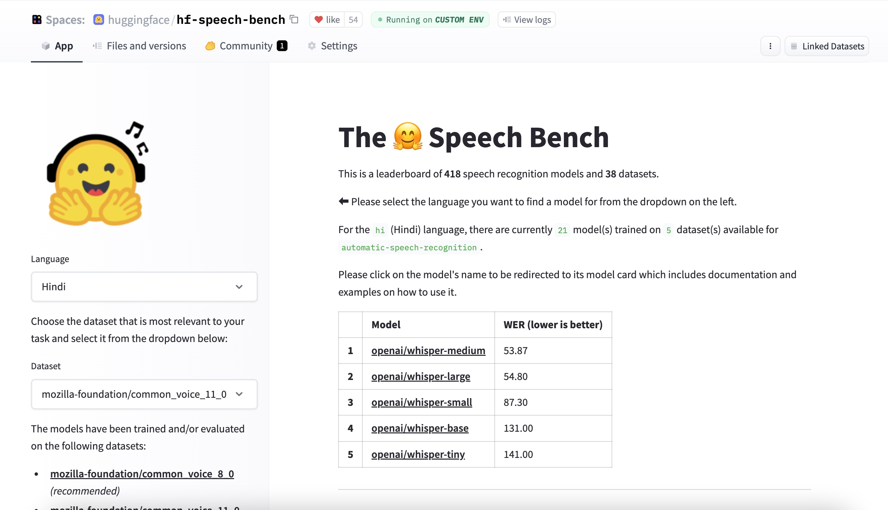

# 使用 🤗 Transformers 为多语种语音识别任务微调 Whisper 模型

<!-- {blog_metadata} -->
<!-- {authors} -->

<a target="_blank" href="https://colab.research.google.com/github/sanchit-gandhi/notebooks/blob/main/fine_tune_whisper.ipynb">
    
</a>

通过本文，我们提供了一个使用 Hugging Face 🤗 Transformers 在任意多语种语音识别（ASR）数据集上微调 Whisper 的分步指南。我们还深入解释了 Whisper 模型、Common Voice 数据集、微调背后的理论，同时我们还提供了用于准备数据和微调的相应代码。如果你想要一个全代码、解释少的 Notebook，可以参阅这个 [Google Colab](https://colab.research.google.com/github/sanchit-gandhi/notebooks/blob/main/fine_tune_whisper.ipynb)。

## 目录
1. [简介](#简介)
2. [在 Google Colab 中微调 Whisper](#在-google-colab-中微调-whisper)
    1. [准备环境](#准备环境)
    2. [加载数据集](#加载数据集)
    3. [准备特征提取器、分词器和数据](#准备特征提取器分词器和数据)
    4. [训练与评估](#训练与评估)
    5. [构建演示应用](#构建演示应用)
3. [结束语](#结束语)

## 简介

Whisper 是来自于 OpenAI 的由 Alec Radford 等人于 [2022 年 9 月](https://openai.com/blog/whisper/) 发表的用于自动语音识别 (automatic speech recognition，ASR) 的预训练模型。与 [Wav2Vec 2.0](https://arxiv.org/abs/2006.11477) 等前作不同，之前的模型是在未标记的音频数据上预训练的，而 Whisper 是在大量的**标注**音频转录数据上预训练的。其训练标注训练数据高达 68 万小时，比用于训练 Wav2Vec 2.0 的未标注音频数据（6 万小时）还多一个数量级。更有甚者，该预训练数据中有 11.7 万小时多语种语音识别数据。因此，Whisper 训得的 checkpoint 可应用于超过 96 种语言，其中许多语言*缺乏训练数据*。

这么多的标注数据使得我们可以直接在*有监督*语音识别任务上预训练 Whisper，从而从标注音频转录预训练数据 ${}^1$ 中习得语音到文本的映射。因此，Whisper 几乎不需要额外的微调就已经是高性能的 ASR 模型了。这使得 Wav2Vec 2.0 相形见绌，Wav2Vec 2.0 是在*无监督的*掩码预测任务上预训练的。在这种情况下，模型经过训练可以从未标注的纯音频数据中习得从语音到隐含状态的中间映射。虽然无监督预训练产生了高质量的语音表示，但它**学不到**语音到文本的映射，该映射只能在微调期间学习。因此，其需要更多的微调才能保证其性能有竞争力。

当扩展到 68 万小时的标注预训练数据时，Whisper 模型展示了强大的泛化到多数据集和领域的能力。其预训练 checkpoint 表现出了与最先进的 ASR 系统旗鼓相当的结果：在LibriSpeech ASR 的无噪测试子集上达到了接近 3% 的单词错误率（word error rate，WER），在 TED-LIUM 上创下了新的最佳记录 - 4.7% 的 WER（*详见* [Whisper 论文](https://cdn.openai.com/papers/whisper.pdf)的表 8）。Whisper 在预训练期间获得的广泛的多语种 ASR 知识对一些缺乏数据的语种特别有用；通过微调，预训练的 checkpoint 可以进一步适配特定的数据集和语言，从而进一步改进在这些语言上的识别效果。

Whisper 是一个基于 Transformer 的编码器-解码器模型（也称为*序列到序列*模型）。它将音频频谱图特征*序列*映射到文本词*序列*。首先，通过特征提取器的操作将原始音频输入转换为对数梅尔声谱图（log-Mel spectrogram）。然后，Transformer 编码器对频谱图进行编码，形成一系列编码器隐含状态。最后，解码器以先前的词以及编码器的隐含状态为条件，自回归地预测文本的下一个词。图 1 是 Whisper 模型的示意图。

<figure>

<figcaption align = "center"><b>图 1:</b> Whisper 模型，该模型属于标准的基于 Transformer 的编码器-解码器架构。 首先将对数梅尔声谱图输入到编码器，编码器生成的最终隐含状态会通过交叉注意机制输入给解码器。解码器再基于编码器隐含状态和先前的预测词，自回归地预测下一个输出词。图源: <a href="https://openai.com/blog/whisper/">OpenAI Whisper 博客</a>。</figcaption>
</figure>

在序列到序列模型中，编码器负责从语音中提取重要特征，将音频输入转换为一组隐含状态表征。解码器扮演语言模型的角色，处理隐含状态表征并生成相应的文稿。在模型架构**内部**集成语言模型的行为我们称之为*深度融合*。与之相对的是*浅融合*，此时，语言模型是在**外部**与编码器组合的，如 CTC + $n$-gram (*详见* [Internal Language Model Estimation](https://arxiv.org/pdf/2011.01991.pdf) 一文）。通过深度融合，可以用相同的训练数据和损失函数对整个系统进行端到端训练，从而提供更大的灵活性和更优越的性能（*详见* [ESB Benchmark](https://arxiv.org/abs/2210.13352)）。

Whisper 使用交叉熵目标函数进行预训练和微调，交叉熵目标函数是训练序列到序列的分类模型的标准目标函数。这里，系统经过训练可以从预定义的词汇表中正确地对目标词进行分类，从而产生输出词。

Whisper 有五种不同尺寸的 checkpoints。最小的四个尺寸分别有基于纯英语训练的版本和基于多语种数据训练的版本。最大的 checkpoint 只有基于多语种数据训练的版本。[Hugging Face Hub](https://huggingface.co/models?search=openai/whisper) 上提供了所有九个预训练 checkpoints。下表总结了这些 checkpoints 的信息，并了各自的 Hub 链接：

| 尺寸   | 层数 | 宽 | 多头注意力的头数 | 参数量 | 纯英语 checkpoint                                         | 多语种 checkpoint                                      |
|--------|--------|-------|-------|------------|------------------------------------------------------|---------------------------------------------------|
| tiny   | 4      | 384   | 6     | 39 M       | [✓](https://huggingface.co/openai/whisper-tiny.en)   | [✓](https://huggingface.co/openai/whisper-tiny.)  |
| base   | 6      | 512   | 8     | 74 M       | [✓](https://huggingface.co/openai/whisper-base.en)   | [✓](https://huggingface.co/openai/whisper-base)   |
| small  | 12     | 768   | 12    | 244 M      | [✓](https://huggingface.co/openai/whisper-small.en)  | [✓](https://huggingface.co/openai/whisper-small)  |
| medium | 24     | 1024  | 16    | 769 M      | [✓](https://huggingface.co/openai/whisper-medium.en) | [✓](https://huggingface.co/openai/whisper-medium) |
| large  | 32     | 1280  | 20    | 1550 M     | x                                                    | [✓](https://huggingface.co/openai/whisper-large)  |

下文我们将以微调多语种版的 [`small`](https://huggingface.co/openai/whisper-small)（参数量 244M (~= 1GB)）checkpoint 为例，带大家走一遍全程。数据方面，我们将使用 [Common Voice](https://huggingface.co/datasets/mozilla-foundation/common_voice_11_0) 数据集里的小语种数据来训练和评估我们的系统。我们将证明，只需 8 小时的训练数据，我们就可以微调出一个在该语种上表现强大的语音识别模型。

------------------------------------------------------------------------

${}^1$ Whisper 的名称来自于 “Web-scale Supervised Pre-training for Speech Recognition（网络规模的有监督语音识别预训练模型）” 的首字母缩写 “WSPSR”。

## 在 Google Colab 中微调 Whisper

### 准备环境

我们将使用几个流行的 Python 包来微调 Whisper 模型。我们会使用 `datasets` 来下载和准备训练数据，并使用`transformers` 来加载和训练 Whisper 模型。我们还需要 `soundfile` 包来预处理音频文件，`evaluate` 和 `jiwer` 来评估我们模型的性能。最后，我们会使用 `gradio` 为我们微调的模型构建一个亮闪闪的演示。

```bash
!pip install datasets>=2.6.1
!pip install git+https://github.com/huggingface/transformers
!pip install librosa
!pip install evaluate>=0.30
!pip install jiwer
!pip install gradio
```

我们强烈建议你在训练时直接将模型 checkpoint 上传到 [Hugging Face Hub](https://huggingface.co/)。它提供了以下功能：
- 集成版本控制：确保在训练期间不会丢失任何模型 checkpoint。
- Tensorboard 日志：跟踪训练过程中的重要指标。
- 模型卡：记录模型的作用及其应用场景。
- 社区：轻松与社区进行分享和协作！

将 Python notebook 链接到 Hub 非常简单 - 只需在出现提示时输入你的 Hub 身份验证令牌即可。你可以在[此处](https://huggingface.co/settings/tokens)找到你的 Hub 身份验证令牌：

```python
from huggingface_hub import notebook_login

notebook_login()
```

**打印输出：**
```bash
Login successful
Your token has been saved to /root/.huggingface/token
```

### 加载数据集

Common Voice 由一系列众包数据集组成，其中包含了用各种语言录制的来自维基百科的文本。这里，我们会使用最新版本的 Common Voice 数据集（[版本 11](https://huggingface.co/datasets/mozilla-foundation/common_voice_11_0)）。语种上，我们选择了用[*印地语*](https://en.wikipedia.org/wiki/Hindi) 来微调我们的模型。印地语是一种在印度北部、中部、东部和西部使用的印度-雅利安语。Common Voice 11.0 包含大约 12 小时的标注印地语数据，其中 4 小时是测试数据。

我们先前往 Hub 查看 Common Voice 的数据集页面：[mozilla-foundation/common_voice_11_0](https://huggingface.co/datasets/mozilla-foundation/common_voice_11_0)。

当首次查看此页面时，系统会要求我们接受其使用条款。之后，我们即可获得对数据集的完全访问权限。

一旦验证了身份，我们就会看到数据集预览。数据集预览展示了数据集的前 100 个样本。更重要的是，它加载了可供我们实时收听的音频样本。我们可以通过使用下拉菜单将子集设置为 `hi` 来选择 Common Voice 的印地语子集（`hi` 是印地语的语言标识符代码）：

<figure>

</figure>

如果点击第一个样本的播放按钮，我们可以收听音频并看到相应的文本。我们还可以滚动浏览训练集和测试集中的样本，以更好地了解待处理的音频和文本数据。从语调和风格可以看出这些录音来自于旁白。你可能还会注意到录音者和录音质量的巨大差异，这是众包数据的一个共同特征。

使用 🤗 Datasets，下载和准备数据非常简单。我们只需一行代码即可下载和准备 Common Voice 数据集。由于印地语数据非常匮乏，我们把`训练集`和`验证集`合并成约 8 小时的数据用于训练，而测试则基于 4 小时的`测试集`：

```python
from datasets import load_dataset, DatasetDict

common_voice = DatasetDict()

common_voice["train"] = load_dataset("mozilla-foundation/common_voice_11_0", "hi", split="train+validation", use_auth_token=True)
common_voice["test"] = load_dataset("mozilla-foundation/common_voice_11_0", "hi", split="test", use_auth_token=True)

print(common_voice)
```

**打印输出：**
```
DatasetDict({
    train: Dataset({
        features: ['client_id', 'path', 'audio', 'sentence', 'up_votes', 'down_votes', 'age', 'gender', 'accent', 'locale', 'segment'],
        num_rows: 6540
    })
    test: Dataset({
        features: ['client_id', 'path', 'audio', 'sentence', 'up_votes', 'down_votes', 'age', 'gender', 'accent', 'locale', 'segment'],
        num_rows: 2894
    })
})
```

大多数 ASR 数据集仅提供输入音频样本 (`audio`) 和相应的转录文本 (`sentence`)。 Common Voice 包含额外的元数据信息，例如 `accent` 和 `locale`，对 ASR 场景，我们可以忽略这些数据。为了使代码尽可能通用，我们只考虑基于输入音频和转录文本进行微调，而丢弃掉额外的元数据信息：

```python
common_voice = common_voice.remove_columns(["accent", "age", "client_id", "down_votes", "gender", "locale", "path", "segment", "up_votes"])
```

Common Voice 只是我们可从 Hub 上下载的众多的多语种 ASR 数据集中的一个 —— Hub 上还有很多可供我们使用！想知道 Hub 上有哪些可用于语音识别的数据集，请点击链接：[Hub 上的 ASR 数据集](https://huggingface.co/datasets?task_categories=task_categories:automatic-speech-recognition&sort=downloads)。

### 准备特征提取器、分词器和数据

ASR 的流水线主要包含三个模块：
1）预处理原始音频输入的特征提取器
2）执行序列到序列映射的模型
3) 将模型输出转换为文本的分词器

在 🤗 Transformers 中，Whisper 模型有一个关联的特征提取器和分词器，即 [WhisperFeatureExtractor](https://huggingface.co/docs/transformers/main/model_doc/whisper#transformers.WhisperFeatureExtractor) 和 [WhisperTokenizer](https://huggingface.co/docs/transformers/main/model_doc/whisper#transformers.WhisperTokenizer)。

下面，我们逐一详细介绍特征提取器和分词器！

### 加载 WhisperFeatureExtractor

语音可表示为随时间变化的一维数组，给定时刻的数组值表示信号在该时刻的*幅度*，而我们可以仅从幅度信息重建音频的频谱并恢复所有声学特征。

由于语音是连续的，因此它包含无数个幅度值，而计算机只能表示并存储有限个值。因此，我们需要通过对语音信号进行离散化，即以固定时间的间隔对连续信号进行*采样*。我们将每秒采样的次数称为*采样率*，通常以样本/秒或*赫兹 (Hz)* 为单位。高采样率可以更好地近似连续语音信号，但同时每秒需要存储的值也更多。

需要特别注意的是，输入音频的采样率需要与模型期望的采样率相匹配，因为不同采样率的音频信号之间的分布是不同的。处理音频时，需要使用正确的采样率，否则可能会引起意想不到的结果！例如，以 16kHz 的采样率采集音频但以 8kHz 的采样率收听它，会使音频听起来好像是半速的。同样地，向一个需要某一采样率的 ASR 模型馈送一个错误采样率的音频也会影响模型的性能。 Whisper 特征提取器需要采样率为 16kHz 的音频输入，因此我们需要将输入的采样率与之相匹配。我们不想无意中用慢速语音来训练 ASR！

Whisper 特征提取器执行两个操作。首先，填充/截断一批音频样本，使所有样本的输入长度均为 30 秒。通过在序列末尾附加零（音频信号中的零对应于无信号或静音），将短于 30 秒的样本填充到 30 秒。并将超过 30 秒的样本被截断为 30 秒。由于这一批数据中的所有元素都被填充/截断到最大长度（即 30 s），因此在将音频馈送给 Whisper 模型时我们就不需要注意力掩码了。 Whisper 在这方面是独一无二的 —— 对大多数音频模型而言，你需要提供一个注意力掩码，详细说明填充序列的位置，使得模型可以在自注意力机制中忽略填充序列。 Whisper 经过训练可以在没有注意力掩码的情况下运行，它可以直接从语音信号中推断出应该忽略哪些。

Whisper 特征提取器执行的第二个操作是将填充的音频数组变换为对数梅尔声谱图。这些频谱图是信号频率的直观表示，很像傅里叶变换。图 2 显示了一个示例频谱图。$y$ 轴表示梅尔频段（Mel channel），它们对应于特定的频段。$x$ 轴是时间。每个像素的颜色对应于给定时间该频段的对数强度。对数梅尔声谱图是 Whisper 模型需要的输入形式。

梅尔频段是语音处理中的标准表示形式，研究人员选择用它来近似人类的听觉范围。对于 Whisper 微调这个任务而言，我们只需要知道声谱图是语音信号中频率的直观表示。有关梅尔频段的更多详细信息，请参阅[梅尔频率倒谱](https://en.wikipedia.org/wiki/Mel-frequency_cepstrum)这篇文章。

<figure>

<figcaption align = "center"><b>图 2：</b> 采样的音频信号到对数梅尔声谱图的转换。左：采样的一维音频信号。右图：相应的对数梅尔声谱图。图源：<a href="https://ai.googleblog.com/2019/04/specaugment-new-data-augmentation.html">谷歌 SpecAugment 博文</a>. </figcaption>
</figure>

幸运的是，🤗 Transformers Whisper 特征提取器仅用一行代码即可执行填充和声谱图变换！让我们继续从预训练的 checkpoint 中加载特征提取器，为音频数据处理做好准备：

```python
from transformers import WhisperFeatureExtractor

feature_extractor = WhisperFeatureExtractor.from_pretrained("openai/whisper-small")
```

### 加载 WhisperTokenizer

现在我们看看如何加载 Whisper 分词器。 Whisper 模型会输出词元，这些词元表示预测文本在词典中的索引。分词器负责将这一系列词元映射到实际的文本字符串（例如 [1169, 3797, 3332] -> "the cat sat"）。

传统上，当使用编码器模型进行 ASR 时，我们使用 [_Connectionist Temporal Classification (CTC)_](https://distill.pub/2017/ctc/) 进行解码。在这里，我们需要为我们使用的每个数据集训练一个 CTC 分词器。使用编码器-解码器架构的优势之一是我们可以直接是用预训练模型的分词器。

Whisper 分词器针对 96 种预训练语言进行了预训练。因此，它的[字节对（byte-pair）](https://huggingface.co/course/chapter6/5?fw=pt#bytepair-encoding-tokenization)涵盖范围很广，几乎适用于所有多语种 ASR 应用。对于印地语，我们可以加载分词器并将其用于微调而无需任何进一步修改。我们只需指定目标语言和任务，分词器会根据这些参数将语言和任务标记作为输出序列前缀：

```python
from transformers import WhisperTokenizer

tokenizer = WhisperTokenizer.from_pretrained("openai/whisper-small", language="Hindi", task="transcribe")
```

我们可以通过对 Common Voice 数据集的第一个样本进行编码和解码来验证分词器是否正确编码了印地语字符。在对录音文本进行编码时，标记器将“特殊标记”添加到序列的开头和结尾，其中包括文本的开始/结尾、语言标记和任务标记（由上一步中的参数指定）。在解码时，我们可以选择“跳过”这些特殊标记，从而允许我们以原始输入形式返回字符串：

```python
input_str = common_voice["train"][0]["sentence"]
labels = tokenizer(input_str).input_ids
decoded_with_special = tokenizer.decode(labels, skip_special_tokens=False)
decoded_str = tokenizer.decode(labels, skip_special_tokens=True)

print(f"Input:                 {input_str}")
print(f"Decoded w/ special:    {decoded_with_special}")
print(f"Decoded w/out special: {decoded_str}")
print(f"Are equal:             {input_str == decoded_str}")
```
**打印输出：**
```bash
Input:                 खीर की मिठास पर गरमाई बिहार की सियासत, कुशवाहा ने दी सफाई
Decoded w/ special:    <|startoftranscript|><|hi|><|transcribe|><|notimestamps|>खीर की मिठास पर गरमाई बिहार की सियासत, कुशवाहा ने दी सफाई<|endoftext|>
Decoded w/out special: खीर की मिठास पर गरमाई बिहार की सियासत, कुशवाहा ने दी सफाई
Are equal:             True
```

### 组建一个 WhisperProcessor

为了简化特征提取器和分词器，我们可以将两者*包进*到一个 `WhisperProcessor` 类。该类继承自 `WhisperFeatureExtractor` 及 `WhisperProcessor`，可根据需要用于音频输入和模型预测。这样，在训练期间我们只需要保持两个对象：`processor` 和 `model`：

```python
from transformers import WhisperProcessor

processor = WhisperProcessor.from_pretrained("openai/whisper-small", language="Hindi", task="transcribe")
```

### 准备数据
我们打印 Common Voice 数据集的第一个示例，看看数据是什么形式的：

```python
print(common_voice["train"][0])
```
**打印输出：**
```python
{'audio': {'path': '/home/sanchit_huggingface_co/.cache/huggingface/datasets/downloads/extracted/607848c7e74a89a3b5225c0fa5ffb9470e39b7f11112db614962076a847f3abf/cv-corpus-11.0-2022-09-21/hi/clips/common_voice_hi_25998259.mp3', 
           'array': array([0.0000000e+00, 0.0000000e+00, 0.0000000e+00, ..., 9.6724887e-07,
       1.5334779e-06, 1.0415988e-06], dtype=float32), 
           'sampling_rate': 48000},
 'sentence': 'खीर की मिठास पर गरमाई बिहार की सियासत, कुशवाहा ने दी सफाई'}
```

我们可以看到我们有一个一维输入音频数组及其对应的录音文本。我们已经多次谈到了采样率的重要性，以及将音频的采样率与 Whisper 模型 (16kHz) 的采样率相匹配的重要性。由于我们的输入音频以 48kHz 采样，因此在将其馈送给 Whisper 特征提取器之前，我们需要将其*下采样*至 16kHz。

我们将使用 `dataset` 的 [`cast_column`](https://huggingface.co/docs/datasets/package_reference/main_classes.html?highlight=cast_column#datasets.DatasetDict.cast_column) 方法将音频输入转换为正确的采样率。该操作不会改变原音频数据，而是指示 `datasets` ，以便在第一次加载音频样本时*即时地*对其进行重新采样：

```python
from datasets import Audio

common_voice = common_voice.cast_column("audio", Audio(sampling_rate=16000))
```

重新加载 Common Voice 数据集中的第一个音频样本，可以看到其已被重采样为所需的采样率：

```python
print(common_voice["train"][0])
```
**打印输出：**
```python
{'audio': {'path': '/home/sanchit_huggingface_co/.cache/huggingface/datasets/downloads/extracted/607848c7e74a89a3b5225c0fa5ffb9470e39b7f11112db614962076a847f3abf/cv-corpus-11.0-2022-09-21/hi/clips/common_voice_hi_25998259.mp3', 
           'array': array([ 0.0000000e+00,  0.0000000e+00,  0.0000000e+00, ...,
       -3.4206650e-07,  3.2979898e-07,  1.0042874e-06], dtype=float32),
           'sampling_rate': 16000},
 'sentence': 'खीर की मिठास पर गरमाई बिहार की सियासत, कुशवाहा ने दी सफाई'}
```

酷！我们可以看到采样率已经下采样到 16kHz 了。数组值也变了，因为相较而言，之前的每 3 个幅度值才大致对应现在的一个幅度值。

现在我们编写一个函数来为模型准备数据：
1. 调用 `batch["audio"]` 加载和重采样音频数据。如上所述，🤗 Datasets 会即时执行任何必要的重采样操作。
2. 使用特征提取器从一维音频数组中计算对数梅尔声谱图输入特征。
3. 通过使用 tokenizer 将录音文本编码为 id。

```python
def prepare_dataset(batch):
    # load and resample audio data from 48 to 16kHz
    audio = batch["audio"]

    # compute log-Mel input features from input audio array 
    batch["input_features"] = feature_extractor(audio["array"], sampling_rate=audio["sampling_rate"]).input_features[0]

    # encode target text to label ids 
    batch["labels"] = tokenizer(batch["sentence"]).input_ids
    return batch
```

我们可以使用 `dataset` 的 `.map` 方法将数据准备函数应用于所有的训练样本：

```python
common_voice = common_voice.map(prepare_dataset, remove_columns=common_voice.column_names["train"], num_proc=4)
```

好了！训练数据准备完毕！我们继续看看如何使用这些数据来微调 Whisper。

**注意**：目前 `datasets` 同时使用 [`torchaudio`](https://pytorch.org/audio/stable/index.html) 和 [`librosa`](https://librosa.org /doc/latest/index.html) 来进行音频加载和重采样。如果你定制一个数据加载/采样函数，你可以直接通过 `"path"` 列获取音频文件路径并忽略 `"audio"` 列。

## 训练与评估

现在我们已经准备好数据，可以开始进行训练了。 [🤗 Trainer](https://huggingface.co/transformers/master/main_classes/trainer.html?highlight=trainer) 将为我们完成大部分繁重的工作。我们要做的有：

- 定义数据整理器（data collator）：数据整理器获取预处理后的数据并转换为 PyTorch 张量。

- 评估指标：在评估过程中，我们希望使用[单词错误率 (word error rate，WER)](https://huggingface.co/metrics/wer) 指标来评估模型。我们需要定义一个`compute_metrics`函数来处理此计算。

- 加载一个预训练的 checkpoint：我们需要加载一个预训练的 checkpoint 并正确配置它以进行训练。

- 定义训练参数：这些将由 🤗 Trainer 在构建训练计划时使用。

对模型进行微调后，我们将使用测试数据对其进行评估，以验证我们是否已正确训练它以对印地语进行语音识别。

### 定义数据整理器

序列到序列语音模型的数据整理器与其他场景有所不同，因为 `input_features`和 `labels` 的处理方法是不同的：`input_features` 必须由特征提取器处理，而 `labels` 由分词器处理。

`input_features` 已经填充至 30s 并转换为固定维度的对数梅尔声谱图，因此我们所要做的就是将它们转换为 PyTorch 张量。我们使用参数为 `return_tensors=pt` 的特征提取器的 `.pad` 方法来做到这一点。请注意，这里不需要额外的填充，因为输入是固定维度的，所以我们只需要简单地将`input_features` 转换为 PyTorch 张量。


另一方面，`labels` 数据并未填充。我们首先使用分词器的 `.pad` 方法将序列填充至本 batch 的最大长度。然后将填充标记替换为 `-100`，以使它们**不**损失计算。然后我们从标签序列的开头去掉 `SOT`，稍后训练的时候再加上它。

我们可以利用我们之前定义的 `WhisperProcessor` 来执行特征提取和分词操作：

```python
import torch

from dataclasses import dataclass
from typing import Any, Dict, List, Union

@dataclass
class DataCollatorSpeechSeq2SeqWithPadding:
    processor: Any

    def __call__(self, features: List[Dict[str, Union[List[int], torch.Tensor]]]) -> Dict[str, torch.Tensor]:
        # split inputs and labels since they have to be of different lengths and need different padding methods
        # first treat the audio inputs by simply returning torch tensors
        input_features = [{"input_features": feature["input_features"]} for feature in features]
        batch = self.processor.feature_extractor.pad(input_features, return_tensors="pt")

        # get the tokenized label sequences
        label_features = [{"input_ids": feature["labels"]} for feature in features]
        # pad the labels to max length
        labels_batch = self.processor.tokenizer.pad(label_features, return_tensors="pt")

        # replace padding with -100 to ignore loss correctly
        labels = labels_batch["input_ids"].masked_fill(labels_batch.attention_mask.ne(1), -100)

        # if bos token is appended in previous tokenization step,
        # cut bos token here as it's append later anyways
        if (labels[:, 0] == self.processor.tokenizer.bos_token_id).all().cpu().item():
            labels = labels[:, 1:]

        batch["labels"] = labels

        return batch
```

我们初始化一下我们刚刚定义的数据整理器：

```python
data_collator = DataCollatorSpeechSeq2SeqWithPadding(processor=processor)
```

### 评估指标

接下来，我们定义评估指标。我们将使用词错误率 (WER) 指标，这是评估 ASR 系统的“标准”指标。有关其详细信息，请参阅 WER [文档](https://huggingface.co/metrics/wer)。我们将从 🤗 Evaluate 中加载 WER 指标：

```python
import evaluate

metric = evaluate.load("wer")
```

然后我们只需要定义一个函数来接受我们的模型预测并返回 WER 指标。这个名为`compute_metrics` 的函数首先将 `-100` 替换为 `label_ids` 中的`pad_token_id`（撤消我们在数据整理器中做的，以便在损失计算时正确地忽略掉填充标记）。然后，将预测到的 id 和 `label_ids` 解码为字符串。最后，计算预测字符串和真实字符串之间的 WER：

```python
def compute_metrics(pred):
    pred_ids = pred.predictions
    label_ids = pred.label_ids

    # replace -100 with the pad_token_id
    label_ids[label_ids == -100] = tokenizer.pad_token_id

    # we do not want to group tokens when computing the metrics
    pred_str = tokenizer.batch_decode(pred_ids, skip_special_tokens=True)
    label_str = tokenizer.batch_decode(label_ids, skip_special_tokens=True)

    wer = 100 * metric.compute(predictions=pred_str, references=label_str)

    return {"wer": wer}
```

### 加载预训练 checkpoint

现在我们加载预训练的 Whisper `small` 模型的 checkpoint。同样，我们可以通过使用 🤗 transformers 很轻松地完成这一步！


```python
from transformers import WhisperForConditionalGeneration

model = WhisperForConditionalGeneration.from_pretrained("openai/whisper-small")
```

原始 Whisper 模型含有在自回归生成开始之前强制作为模型输出的词元 ID([`forced_decoder_ids`](https://huggingface.co/docs/transformers/main_classes/text_generation#transformers.generation_utils.GenerationMixin.generate.forced_decoder_ids)）。这些词元 ID 代表零样本 ASR 任务语种和任务。现在因为我们是对特定的语言（印地语）和任务（转录）进行微调，所以我们要将 `forced_decoder_ids` 设置为 `None`。还有一些词元在生成期间被抑制了（[`suppress_tokens`](https://huggingface.co/docs/transformers/main_classes/text_generation#transformers.generation_utils.GenerationMixin.generate.suppress_tokens)）。这些词元的对数概率被设置为 `-inf`，因此它们永远不会被采样。我们会将 `suppress_tokens` 覆盖为一个空列表，也就是不抑制任何词元：

```python
model.config.forced_decoder_ids = None
model.config.suppress_tokens = []
```

### 定义训练参数

在最后一步中，我们定义与训练相关的所有参数。下面解释了一部分参数：
- `output_dir`：保存模型权重的本地目录。这也将是 [Hugging Face Hub](https://huggingface.co/) 上的模型存储库名称。
- `generation_max_length`：评估期间自回归生成的最大词元数。
- `save_steps`：在训练期间，每 `save_steps` 步保存一次中间 checkpoint 并异步上传到 Hub。
- `eval_steps`：在训练期间，每 `eval_steps` 步对中间 checkpoint 进行一次评估。
- `report_to`：保存训练日志的位置。支持的平台有 `azure_ml`、`comet_ml`、`mlflow`、`neptune`、`tensorboard` 以及 `wandb`。选择你最喜欢的或使用缺省的 `tensorboard` 保存至 Hub。

有关其他训练参数的更多详细信息，请参阅 Seq2SeqTrainingArguments [文档](https://huggingface.co/docs/transformers/main_classes/trainer#transformers.Seq2SeqTrainingArguments)。

```python
from transformers import Seq2SeqTrainingArguments

training_args = Seq2SeqTrainingArguments(
    output_dir="./whisper-small-hi",  # change to a repo name of your choice
    per_device_train_batch_size=16,
    gradient_accumulation_steps=1,  # increase by 2x for every 2x decrease in batch size
    learning_rate=1e-5,
    warmup_steps=500,
    max_steps=4000,
    gradient_checkpointing=True,
    fp16=True,
    evaluation_strategy="steps",
    per_device_eval_batch_size=8,
    predict_with_generate=True,
    generation_max_length=225,
    save_steps=1000,
    eval_steps=1000,
    logging_steps=25,
    report_to=["tensorboard"],
    load_best_model_at_end=True,
    metric_for_best_model="wer",
    greater_is_better=False,
    push_to_hub=True,
)
```

**注意**：如果不想将模型 checkpoint 上传到 Hub，你需要设置 `push_to_hub=False`。

我们可以将训练参数连同我们的模型、数据集、数据整理器和 `compute_metrics` 函数一起传给 🤗 Trainer：

```python
from transformers import Seq2SeqTrainer

trainer = Seq2SeqTrainer(
    args=training_args,
    model=model,
    train_dataset=common_voice["train"],
    eval_dataset=common_voice["test"],
    data_collator=data_collator,
    compute_metrics=compute_metrics,
    tokenizer=processor.feature_extractor,
)
```

有了这些，我们就可以开始训练了！

### 训练
要启动训练，只需执行：

```python
trainer.train()
```

训练大约需要 5-10 个小时，具体取决于你的 GPU 或分配给 Google Colab 的 GPU。根据 GPU 的情况，你可能会在开始训练时遇到 CUDA `内存耗尽`错误。此时，你可以将 `per_device_train_batch_size` 逐次减少 2 倍，并使用 [`gradient_accumulation_steps`](https://huggingface.co/docs/transformers/main_classes/trainer#transformers.Seq2SeqTrainingArguments.gradient_accumulation_steps) 进行补偿。

**打印输出：**

| 步数 | 训练损失 | 轮数 | 验证损失 |  WER  |
|:----:|:-------------:|:-----:|:---------------:|:-----:|
| 1000 |    0.1011     | 2.44  |     0.3075      | 34.63 |
| 2000 |    0.0264     | 4.89  |     0.3558      | 33.13 |
| 3000 |    0.0025     | 7.33  |     0.4214      | 32.59 |
| 4000 |    0.0006     | 9.78  |     0.4519      | 32.01 |
| 5000 |    0.0002     | 12.22 |     0.4679      | 32.10 |

Our best WER is 32.0% - not bad for 8h of training data! The big question is how this compares to other ASR systems. For that, we can view the [`hf-speech-bench`](https://huggingface.co/spaces/huggingface/hf-speech-bench), a leaderboard that categorises models by language and dataset, and subsequently ranks them according to their WER.

最佳 WER 是 32.0% —— 对于 8 小时的训练数据来说还不错！那与其他 ASR 系统相比，这个表现到底处于什么水平？为此，我们可以查看 [`hf-speech-bench`](https://huggingface.co/spaces/huggingface/hf-speech-bench)，这是一个按语种和数据集对模型进行分门别类，并按类别根据它们的 WER 进行排名的排行榜。

<figure>

</figure>

我们微调的模型显著提高了 Whisper `small` checkpoint 的零样本性能，也突出展示了 Whisper 强大的迁移学习能力。

当我们将训练结果推送到 Hub 时，我们可以自动将 checkpoint 提交到排行榜 —— 只需配置适当的关键字参数 (key-word arguments，kwargs)。你还可以更改这些值以相应地匹配你的数据集、语种和模型名称：

```python
kwargs = {
    "dataset_tags": "mozilla-foundation/common_voice_11_0",
    "dataset": "Common Voice 11.0",  # a 'pretty' name for the training dataset
    "dataset_args": "config: hi, split: test",
    "language": "hi",
    "model_name": "Whisper Small Hi - Sanchit Gandhi",  # a 'pretty' name for your model
    "finetuned_from": "openai/whisper-small",
    "tasks": "automatic-speech-recognition",
    "tags": "hf-asr-leaderboard",
}
```

现在可以将训练结果上传到 Hub了。为此，请执行 `push_to_hub` 命令：

```python
trainer.push_to_hub(**kwargs)
```

您现在可以使用 Hub 上的链接与任何人共享此模型。他们还可以使用标识符`"your-username/the-name-you-picked"`加载它，例如：

```python
from transformers import WhisperForConditionalGeneration, WhisperProcessor

model = WhisperForConditionalGeneration.from_pretrained("sanchit-gandhi/whisper-small-hi")
processor = WhisperProcessor.from_pretrained("sanchit-gandhi/whisper-small-hi")
```

虽然微调模型在 Common Voice Hindi 测试数据上产生了令人满意的结果，但它绝不是最优的。本文的目的是演示如何在任何多语种 ASR 数据集上微调预训练的 Whisper checkpoint。通过优化训练超参（例如 *learning rate* 和 *dropout*）并使用更大的预训练 checkpoint（`medium` 或 `large`）可能会提升效果。

### 构建演示应用

现在我们已经对模型进行了微调，我们可以构建一个演示来展示其 ASR 功能！我们将使用 🤗 Transformers `pipeline`，它将完成整个 ASR 流水线，从对音频输入进行预处理到对模型预测输出进行解码。我们将使用 [Gradio](https://www.gradio.app) 构建我们的交互式演示。 Gradio 可以说是构建机器学习演示的最直接的方式；使用 Gradio，我们可以在几分钟内构建一个演示！

运行下面的示例将生成一个 Gradio 演示应用，我们可以通过计算机的麦克风录制语音并将其馈送给我们微调的 Whisper 模型以转录出相应的文本：

```python
from transformers import pipeline
import gradio as gr

pipe = pipeline(model="sanchit-gandhi/whisper-small-hi")  # change to "your-username/the-name-you-picked"

def transcribe(audio):
    text = pipe(audio)["text"]
    return text

iface = gr.Interface(
    fn=transcribe, 
    inputs=gr.Audio(source="microphone", type="filepath"), 
    outputs="text",
    title="Whisper Small Hindi",
    description="Realtime demo for Hindi speech recognition using a fine-tuned Whisper small model.",
)

iface.launch()
```

## 结束语

通过本文，我们介绍了如何使用 🤗 Datasets、Transformers 和 Hugging Face Hub 一步步为多语种 ASR 微调一个 Whisper 模型。如果你想自己试试微调一个，请参阅 [Google Colab](https://colab.research.google.com/github/sanchit-gandhi/notebooks/blob/main/fine_tune_whisper.ipynb)。如果你有兴趣针对英语和多语种 ASR 微调一个其它的 Transformers 模型，请务必查看 [examples/pytorch/speech-recognition](https://github.com/huggingface/transformers/tree/main/examples/pytorch/speech-recognition）。

> 英文原文: <url> https://huggingface.co/blog/fine-tune-whisper </url>
> 原文作者：Sanchit Gandhi
> 译者: Matrix Yao (姚伟峰)，英特尔深度学习工程师，工作方向为 transformer-family 模型在各模态数据上的应用及大规模模型的训练推理。
