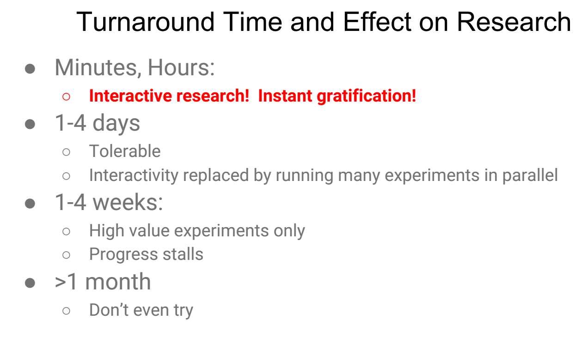
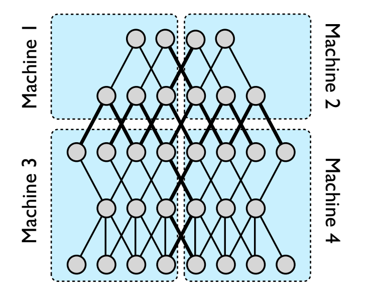
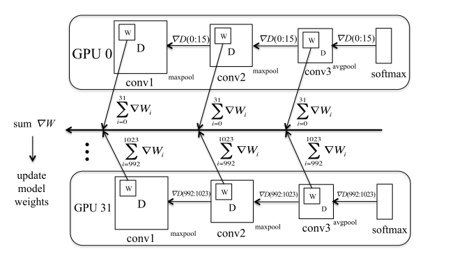
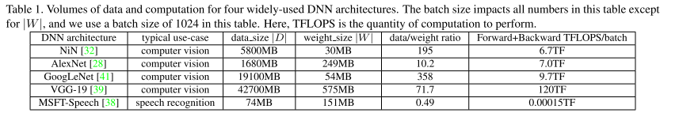
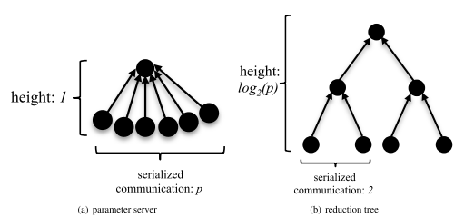
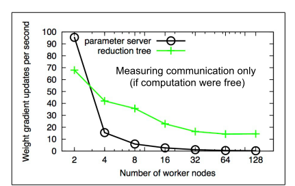
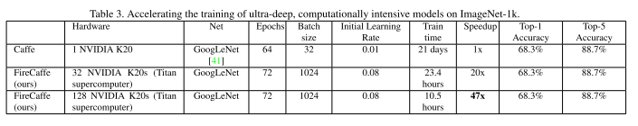

# 深度学习分布式训练 - 以 FireCaffe 为例

## 论文
***Forrest N. Iandola etc., [FireCaffe: near-linear acceleration of deep neural network training on computer clusters](https://arxiv.org/abs/1511.00175), 2016.1***

## Problem statements from data scientists
4 key pain points summarized by Jeff Dean from Google:
- DNN researchers and users want results of experiments quickly.
- There is a "patience threshold": No one wants to wait more than a few days or a week for result.
- This significantly affects scale of problems that can be tackled.
- We sometimes optimize for experiment turnaround time, rather than absolute minimal system resources for performing the experiments

## Problem analysis

The speed and scalability of distributed algorithm are ***almost always limited by the overhead of communicating between servers***; DNN training is not an exception to this rule.

So the design focuses on the communication enhancement, including:
 - Upgrade to high throughput interconnects, i.e. use high throughput interconnects like IB etc.
 -  Decrease the data transmission volume while training, which includes:
	- Balance carefully between data parallelism and  model parallelism.
	- Increase batch size to reduce communication quantity. And identify hyperparameters suitable for large batch size.
	- Communication data quantity balance among nodes to avoid single point dependency. 

## Key take-aways

### Parallelism Scheme: Model parallelism or Data Parallelism

 

     

 

#### Model parallelism
Each worker gets a subset of the model parameters, and the workers communication by exchanging data gradients $\nabla D$ and exchanging activations $D$. $\nabla D$ and $D$ data quantity is:

$$|D| = \sum_{L=1}^{\#layers} ch_L * activationW_L * activationH_L * batchSize$$

#### Data parallelism
Each worker gets a subset of the batch, and then the workers communicate by exchanging weight gradient updates $\nabla W$, where $W$ and $\nabla W$ data quantity is:

$$|W| = \sum_{L=1}^{\#layers} ch_L * numFilt_L * filterW_L * filterH_L$$

Convolution layer and fully connection layer have different characteristics in data/weight ratio. So they can use different parallelism schemes.

So a basic conclusion is: convolution layers can be fitted into data parallelism, and fc layers can be fitted into model parallelism.
Further more, for more advanced CNNs like GoogLeNet and ResNet etc., we can directly use data parallelism, as this paper is using.

### Gradient Aggregation Scheme: Parameter Server or Reduction Tree

One picture to show how parameter server and reduction tree work in data parallelism.

#### Parameter Server

Parameter communication time with regard to worker number $p$ in parameter server scheme.

$$param\_server\_communication\_time=\dfrac{|\nabla W| * p}{BW}$$

The communication time scales ***linearly*** as we increase the number of workers. single parameter server becomes scalability bottleneck. 

Microsoft Adam and Google DistBelief relief this issue by defining a pool of nodes that collectively behave as a parameter server. The bigger the parameter server hierarchy gets, the more it looks like a reduction tree.

#### Reduction Tree
The idea is same as *allreduce* in message passing model. Parameter communication time with regard to worker number $p$ in reduction tree scheme.

$$t=\dfrac{|\nabla W| * 2log_{2}(p)}{BW}$$

It scales logarithmically as the number of workers.

### Batch size selection

Larger batch size lead to less frequent communication and therefore enable more scalability in a distributed setting. But for larger batch size, we need identify a suitable hyperparameter setting to maintain the speed and accuracy produced in DNN training. 

Hyperparameters includes:
- Initial learning rate $initial\_lr$
- learning rate update scheme
- weight delay $\omega$
- momentum $\mu$

Weight update rule used, here $i$ means iteration index:

$$\begin{align*} \\
\Delta w &:= \mu \Delta w + lr(<\dfrac{\partial E}{\partial w}>_i - \omega w) \\
w &:= w + \Delta w \\
\end{align*} $$

Learning rate update rule:

$$lr = lr_{0}(1 - \dfrac{iter}{max\_iter})^{\alpha}, \alpha = 0.5$$

On how to get hyperparameters according to batch size, I will write another article for this.

## Results
Final results on GPU cluster w/ GoogleNet.

## More thinking

- 以上方案基本上是无损的，为了更进一步减少通信开销，大家开始尝试有损的方案，在训练速度和准确度之间进行折衷。典型的有:
	1. Reduce parameter size using 16-bit floating-point - ***Google***
	2. Use 16-bit weights and 8-bit activations.
	3. 1-bit gradients backpropagation - ***Microsoft***
	4. Discard gradients whose numerical values fall below a certain threshold - ***Amazon***
	5. Compress(e.g. using PCA) weights before transmitting
	6. Network pruning/encoding/quantization - ***Intel, DeePhi*** 
- 使用新的底层技术来减少通信开销
	1. RDMA rather than traditional TCP/IP?

## References
1. [Jeff Dean at AI Frontiers: Trends and Developments in Deep Learning Research](https://www.slideshare.net/AIFrontiers/jeff-dean-trends-and-developments-in-deep-learning-research)

*写于 2016 年 10 月*
