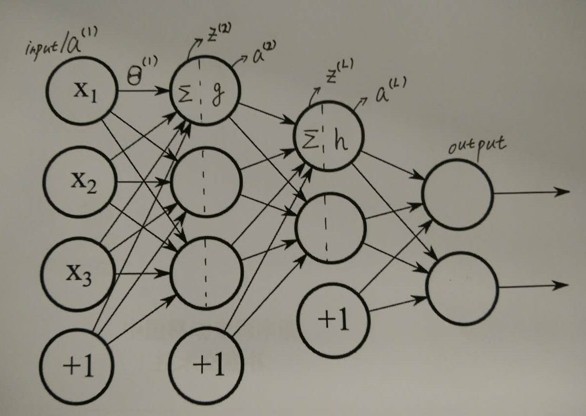
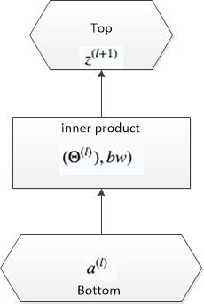
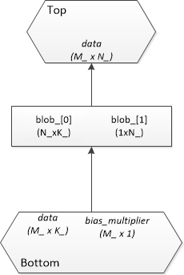
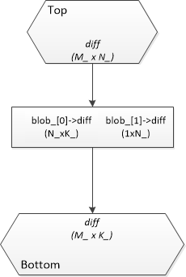

# 深度学习算子之全连接

## Theory
全连接结构中的符号定义如下图：

### Forward Propagation

$$\begin{align*}
&z^{(l)} = \Theta^{(l-1)}a^{(l-1)} \\
&a^{(l)} = g(z^{(l)}) \\
&a_n^{(l)} = 1
\end{align*}$$

### Backward Propagation

根据链式法则，设损失函数为 $J(\Theta)$，则有：

$$\dfrac{\partial J(\Theta)}{\partial\Theta^{(l)}} = \dfrac{\partial J(\Theta)}{\partial z^{(l+1)}} \dfrac{\partial z^{(l+1)}}{\partial \Theta^{(l)}} = \delta^{(l+1)}  \dfrac{\partial z^{(l+1)}}{\partial \Theta^{(l)}}$$

此处，我们定义 $\delta^{(l+1)} = \dfrac{\partial J(\Theta)}{\partial z^{(l+1)}}$，下面分别介绍这两个偏导项如何计算。

#### 计算 $\delta^{(l)}$

Now we firstly get output layer $\delta^{(L)}$. As an example, we take cross entropy as loss function, with SoftMax as output function.

$$h(z^{(L)}) = \dfrac{1}{1+e^{-z^{(L)}}}$$

$$\begin{align*} \delta_i^{(L)} & = \dfrac{\partial}{\partial z_i^{(L)}}(y_i log(h(z_i^{(L)})) + (1-y_i)log(1-h(z_i^{(L)}))) \\
     & = y_i \dfrac{1}{h(z_i^{(L)})}h'(z_i^{(L)}) + (1 - y_i)\dfrac{1}{1-h(z_i^{(L)})}(-h'(z_i^{(L)})) \\
  代入: \\
  & a_i^{(L)} = h(z_i^{(L)}), h'(z_i^{(L)}) = a_i^{(L)}(1-a_i^{(L)}) \\
  可得： \\
  & \delta_i^{(L)} = (a_i^{(L)} - y_i)\end{align*} $$

继续由 $\delta^{(l)}$ 推 $\delta^{(l-1)}$ 有：

$$\begin{align*}
  & g(z) = max(0, z) \\
  & z^{(l)} = \Theta^{(l - 1)} g(z^{(l-1)}) \end{align*} $$

还是链式法则，其决定了 BP 是个递推过程。

$$ \dfrac{\partial J(\Theta)}{\partial z^{(l-1)}}  =  \dfrac{\partial J(\Theta)}{\partial z^{(l)}}  \dfrac{\partial  z^{(l)}}{\partial z^{(l-1)}} $$
    
则：

$$\begin{align*}& \delta^{(l-1)} = (\Theta^{(l-1)})^{T}\delta^{(l)} .* g'(z^{(l-1)})\end{align*}$$

$\delta^{(l)}$ 的求解过程是是个从后往前的递推过程。

#### 计算 $\dfrac{\partial z^{(l+1)}}{\partial \Theta^{(l)}}$

$\dfrac{\partial z^{(l+1)}}{\partial \Theta^{(l)}}$ 的求解比较简单。

由于：

$$z^{(l+1)} = \Theta^{(l)}a^{(l)}$$

则有：

$$\dfrac{\partial z^{(l+1)}}{\partial \Theta^{(l)}} = a^{(l)}$$

## Caffe Practice

### Forward Propagation

bottom 神经元数 $K\_$，top 神经元数 $N\_$，batch size $M\_$。则 bottom 矩阵为 $bottom_{M\_ \times K\_}$，top 矩阵为 $top_{M\_ \times N\_}$，weight 矩阵 $\Theta^{(l)}_{N\_ \times K\_}$，bias 为 $b_{M\_ \times 1}$，bias weight 为 $bw_{1 \times N\_}$。下图给出了这几个关键量在 Caffe 中的存在形式：

数学形式为：

$$top = bottom * (\Theta^{(l)})^{T} + b * bw$$

### Backward Propagation

后向还是分两部分算，一部分是计算 $\dfrac{\partial J(\Theta)}{\partial\Theta^{(l)}}$；一部分是计算 $bottom\_diff = \dfrac{\partial J(\Theta)}{\partial{(bottom\_data)}}$，以作为下一层的$top\_diff$，这里 $bottom\_data$ 实际上就是 $a^{(l)}$，因此 $bottom\_diff = \dfrac{\partial J(\Theta)}{\partial{a^{(l)}}}$。下图给出 Caffe 计算后向传播时的几个关键量。

#### 计算 $\dfrac{\partial J(\Theta)}{\partial\Theta^{(l)}}$

$$\dfrac{\partial J(\Theta)}{\partial\Theta^{(l)}} =  a^{(l)} * \delta^{(l+1)}$$

则有下面的实现：

$$\begin{align*}
&\Theta^{(l)}_{diff} = top\_diff^{T} * bottom\\
& bw_{diff} = top\_diff^{T} * b
\end{align*}$$

#### 计算 bottom_diff

$$\dfrac{\partial J(\Theta)}{\partial{a^{(l)}}} = \dfrac{\partial J(\Theta)}{\partial{z^{(l+1)}}} * \Theta^{(l)}$$

即：

$$bottom\_diff = top\_diff * \Theta^{(l)}$$

可以看出，其主要操作是 `GEMM` 和 `GEMV`。

## References
[1] http://www.jianshu.com/p/c69cd43c537a

[2] http://blog.csdn.net/walilk/article/details/50278697

[3] http://blog.sina.com.cn/s/blog_88d97475010164yn.html

[4] http://www.itnose.net/detail/6177501.html

[5] http://www.zhihu.com/question/38102762

*写于 2016 年 10 月*