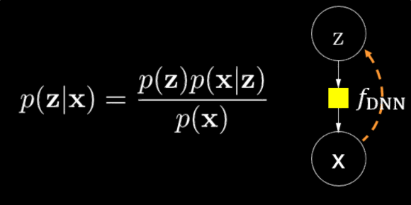
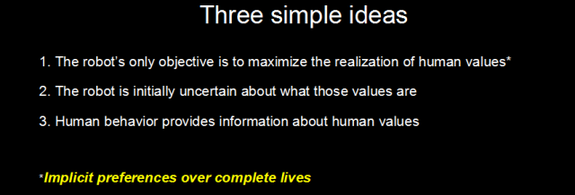

# GMIS 2017 Take-away

## What's GMIS

GMIS 全称 `Global Machine Intelligence Summit` 是由机器之心举办的一个关于机器智能的论坛。会议在 2017 年 5 月 27 和 28 日在北京召开两天。我参加了本次会议，从中也 get 到一些挺有意思的信息，拿出来分享一下。

## 几个技术趋势

### From deep discriminative model To deep generative model

在一些关键领域（如金融、自动驾驶等），可解释性或者说算法透明度（transparency）是 deep learning 被应用的最后一道屏障。在这些领域，黑匣子是不可接受的，如果有什么异常的行为发生，一定要知道原因，它必须是可以解释的。因为在这些领域系统一旦出错，那么可能就会产生一些比较致命的后果。而目前比较 hot 的 CNN，RNN 都属于 discriminative model 的范畴，可解释性不好，应用的需求促成了 deep generative model 的研究，主要有 DBN（Deep Bayesian Network），GAN（Generative Adversarial Network），VAE（Variational Auto Encoder）。

GMIS 大会上来自地平线（自动驾驶）的余凯对这个问题进行了阐述，并指出地平线使用了 BNN（Bayesian Neural Network）作为其算法之一。来自清华大学的朱军团队提出了[珠算开源库](https://github.com/thu-ml/zhusuan)，这是一个基于 TensorFlow 的 generative model 库，目前主要针对 GPU 做了深度优化，从 workload 上来讲有没有适合 Intel micro architecture 的机会，我们可以持续关注。

### From big data To small data

从 big data 到 small data，商业上的驱动主要有以下两点：
- 某些细分领域并不能产生大量的数据。一个例子就是奢侈汽车销售行业就不会有很多的交易数据。
- 个性化。针对特定用户的数据量肯定比所有用户的全量数据小好几个数量级，但如果能基于这些数据提供个性化的服务，肯定是很有前景和钱景的。
从人工智能或者机器智能的角度来讲，"one shot learning" 才是人类学习的根本能力，比如说你给一个小朋友看一个桔子，基本上大部分的桔子他都认识了，人的小样本泛化能力是非常强的，如何设计算法模拟人的这种能力是很有意思的 topic。

GMIS 大会上有三个来自第四范式的 presentations 都在强调小数据情况如何学习的重要性，他们重点关注的手段是 transfer learning。除了我们比较熟悉的相似领域间 knowledge transfer（典型的如把 IMAGENET 的分类model transfer 到 PASCAL VOC detection 上去）。对于更广泛的迁移学习，第四范式的杨强介绍了一个比较有趣的观点：“分离 **问题的结构** 和 **问题的内容**”，其中问题的结构的知识是可 transfer 的（即外推），而内容需要自己学习（即内省）。这个观点 2015 年 12 月由 Breden 等人在 Science 上发表，题为 `Human-level concept learning through probabilistic program induction`。个人觉得这个观点是很有启发性的。另一个适合小数据的方法就是生成模型，这个思路就暗合了第一点了。

### Self-Evolving Learning
Self-evolving learning 关注如何实现让机器从 `train to learn` 到 `learn to train` 的范式变化，构造 recursively self-improving AI。这从技术上主要是通过 unsupervised learning 和 reinforcement learning 来实现。邓力以及一些其他演讲者都提了这个问题。整场听下来，感觉 unsupervised learning 在 NLP 领域有可能最先取得突破，因为完全无监督是不可能的，我个人更倾向于认为这是个"implicit supervised learning" or "very weak supervised learning"，在文本领域大量的上下文关系，共现关系其实是很好的implicit label，抓住这些关系对于语言模型的构建从而 benefit 翻译、主题分析这些领域是大有希望的。在 `An Unsupervised Learning Method Exploiting Sequential Output Statistics` 论文中，邓力等形式化了这个问题，更关键的是提出了 Stochastic Primal-Dual Gradient（SPDG）数值方法来求解这个模型。reinforcement learning 目前感觉属于大家都在摇旗呐喊，但出来的干货基本没有，个人认为大家普遍 hands-on 不多，所以还没有更深的体会，可能也就 AlphaGo 用得最多了。后续机器人产业发展起来，应该会大大带动这一块的实际应用以及由实际应用带来的问题研究。

### Deep Learning+
在最终应用上，deep learning 必然只是最终解决方案的一环，所以 deep learning 需要跟其他方法发挥出协同作用，甚至互相借鉴解决思路。有一些值得继续思考的方向：
 - deep learning + shallow learning：deep wide learning 是 Google 提出的一个思路，其提出 deep 部分负责 generalization， wide 部分负责 memorization，个人比较认同。
 - deep learning + game theory：最近大火的 GAN 就是这一例。除了用在风格迁移这类比较阳春白雪的应用上外。从我个人角度，GAN 还有两类比较来钱的应用，一是 machine writing（这个是今日头条之类的公司比较看重的）；二是为数据量很少领域生成训练数据, 这里首先要解决 diversity 的问题。
 - deep learning + planning：这个组合从个人角度，我认为是 AI 从 stage 2 到 stage 3 的一种尝试。AI 从 sensing 到 understand/recognition 到 action，其中 planning 是最重要的衔接环。2016 年的 NIPS best paper Value Iteration Network 以及 AlphaGo 即属此类。

## 具体问题的业界实践
### Sequence-to-sequence
很多问题可以归到 seq2seq 的范式下，如语音识别，翻译，TTS等。Deep Learning 对这类问题提供了 direct mapping 而不是传统的 pipeline 式的新的解决思路。目前解决这个问题主要有两种手段：
- CTC 模型
  
	“CTC 模型十分适合语音识别这样的问题，因为它所要求得输出序列长度比输入序列长度要短很多。CTC 模型还有一个优势，传统的深度神经网络与混合模型一般来说建模粒度非常小，但是在 CTC 模型里面你可以相对自由地选择建模单元，而且在某些场景下建模单元越长、越大，你的识别效果反而会越好。
	最近谷歌(微博)有一项研究从 YouTube 上采用几十万小时甚至上百万小时的训练数据量。CTC 的模型可以不依赖额外的语言模型就能做到识别率超过传统模型。但由于训练稳定性差，CTC 模型相对于传统模型更难训练。”
- Encoder-Attention-Decoder 框架
  
	“Attention 模型首先把输入序列、语音信号序列，转换成一个中间层的序列表达，在这个中间层序列表达上面，能够提供足够的信息，然后就可以基于这个信息有一个专门的、基于递归神经网络的生成模型，这个方法在机器翻译里面现在成为了主流方案，但是在语音识别里面它还是一个非常不成熟的技术，它有两个主要问题：
    
    问题1：只适合短语的识别，对长的句子效果比较差。
    
    问题2：在做语音识别的时候，它的效果是相对来说非常不稳定的”
  
  所以目前的主流方向是两者结合。

## 务虚但还挺重要的话
### 关于 Human compatible AI
Stuart Russel 提出了 human compatible AI 的概念，但如何做到，这是个问号。从 Russel 的角度来讲，这个问题虽然难回答，但他觉得这是个技术问题，终会找到答案。

*写于 2017 年 5 月*