# 图智能 101

## Why

### Graph无处不在

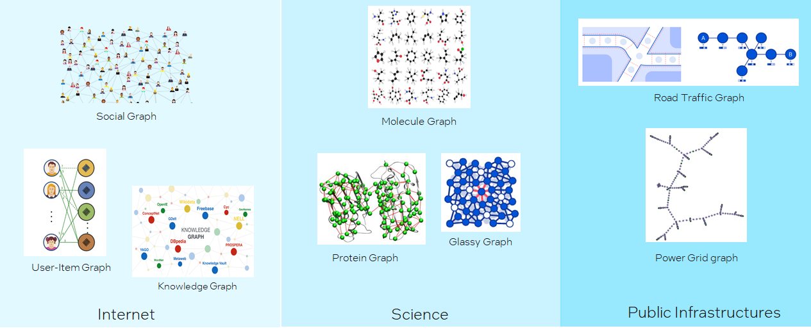

### Graph Intelligence helps

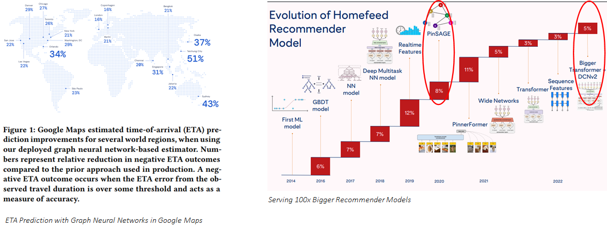

### It's the right time now!

Gartner 预测，graph 技术在数据和分析创新中的使用率从 2021 年的 10%，到 2025 年会增长到 `80%`。目前正在经历从 `early adoption` 到 `early mainstream` 的穿越大峡谷期间，既不太早也不太晚，时间刚刚好。

## What

### 如何建模图

> A graph 𝒢 is an ordered pair 𝒢 = (𝑉, 𝐸) comprising:
> - 𝑉, a set of vertices (or nodes)
> - 𝐸⊆{(𝑥,𝑦)|𝑥,𝑦∈𝑉}, a set of edges (or links), which are pairs of nodes

> Example:
> 
>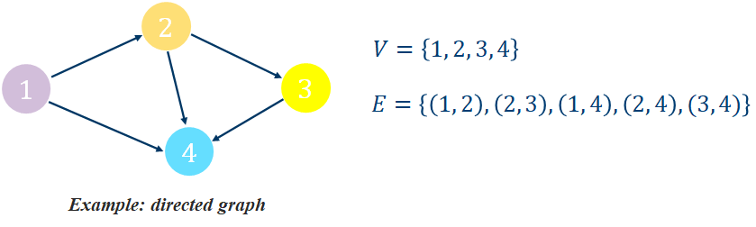

#### Different Types of Graph

- Are edges directed?

	Directed Graph vs. Undirected Graph

- Are there multiple types of nodes or multiple types of edges?

	Homogeneous Graph vs Heterogeneous Graph

### 如何表示图

不同的表示方式会指向不同的计算模式。

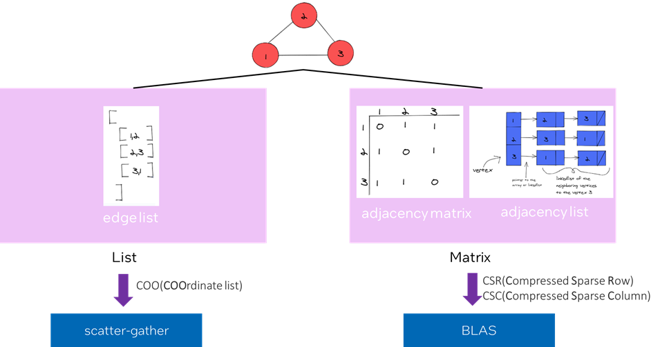

### 如何计算图

如下图所示，图的计算步骤如下：

- 遍历图中的所有结点，或者采样图中的一些结点。每次选择其中一个结点，称为目标结点（target node）； 
- 一个 𝐿-层的 GNN 至少需要聚合目标结点的 L-跳邻域的信息。因此，我们需要以围绕目标结点构造一个 L-跳的 `ego-network`。图中是一个 2-跳 `ego-network` 的例子，其中绿色结点是第 1 跳，蓝色结点是第 2 跳；
- 计算并更新 `ego-network` 里的每个结点的 embedding。embedding 会使用到图的结构信息和结点与边的特征。

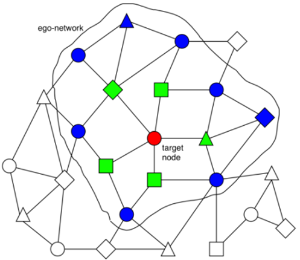

那么，这些 embedding 是如何计算和更新的呢？主要是使用 Message Passing 的计算方法。Message Passing 有一些计算范式如 `GAS（Gather-ApplyEdge-Scatter）`，`SAGA（Scatter-ApplyEdge-Gather-ApplyVertex）`等。我们这里介绍归纳得比较全面的 `SAGA` 计算范式。假设需要计算和更新下图中的 $\vec{x_1}$:

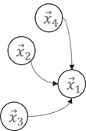

- **`Scatter`**

	Propagate message from source vertices to edge.

	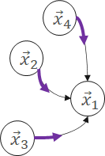

- **`ApplyEdge`**

	Transform message along each edge.

	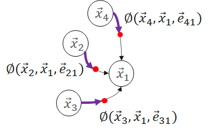

- **`Gather`**

	Gather transformed message to the destination vertex.

	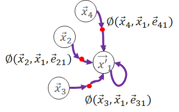

- **`ApplyVertex`**

	Transform the gathered output to get updated vertex.

	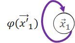

公式如下：

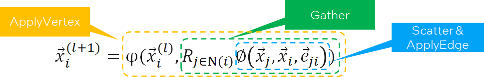

分析一下会发现，`SAGA` 模式中 `ApplyEdge` 和 `ApplyVertex` 是传统 deep learning 中的 NN（Neural Network）操作，我们可以复用；而 `Scatter` 和 `Gather` 是 GNN 新引入的操作。即：**Graph Computing = Graph Ops + NN Ops**。

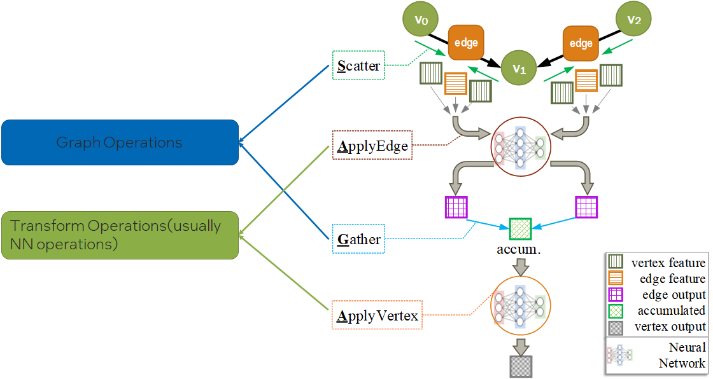

### 不同的图数据集规模

- One big graph

	可能高达数十亿的结点，数百亿的边。

	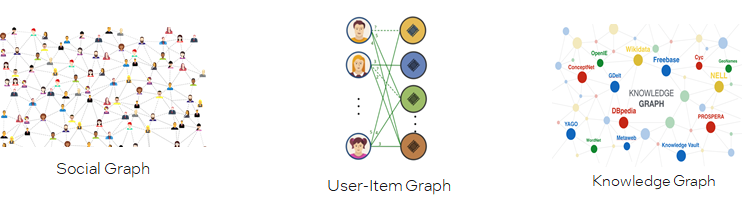

- Many small graphs

	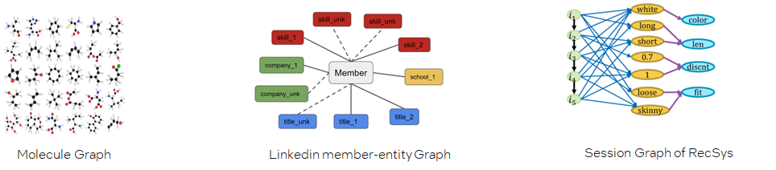

### 不同的图任务

- Node-level prediction

	预测图中结点的类别或性质

	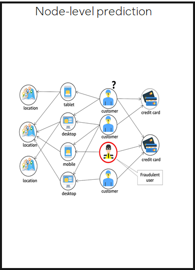

- Edge-level prediction

	预测图中两个结点是否存在边，以及边的类别或性质

	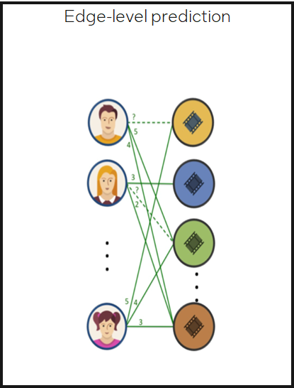

- Graph-level prediction

	预测整图或子图的类别或性质

	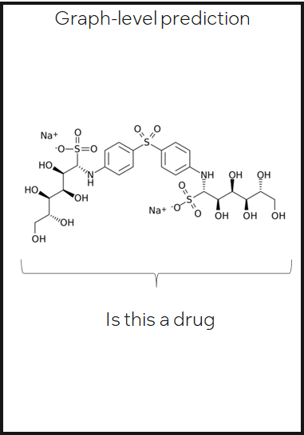

## How

### Workflow

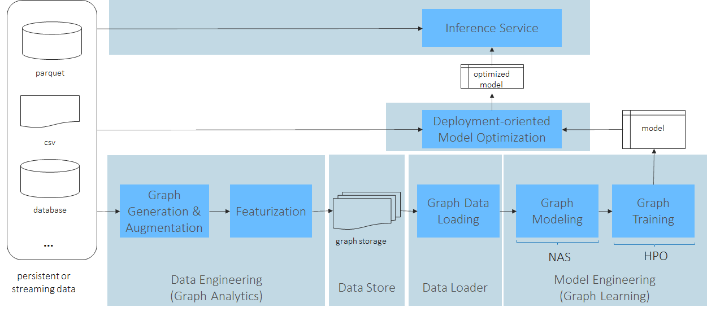

> 以 fraud detection 为例：
>	- Tabformer 数据集
>	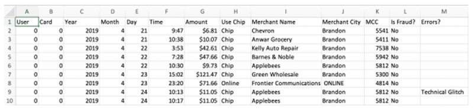
>	- workflow
>   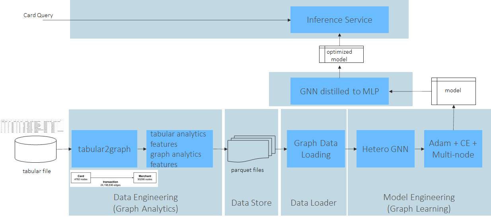

### 软件栈

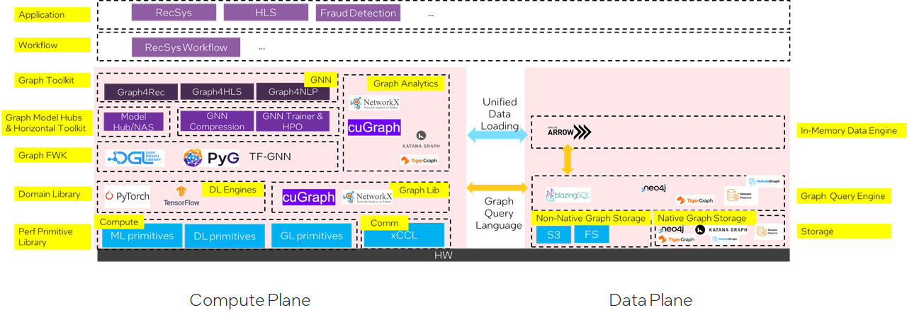

- 计算平面

	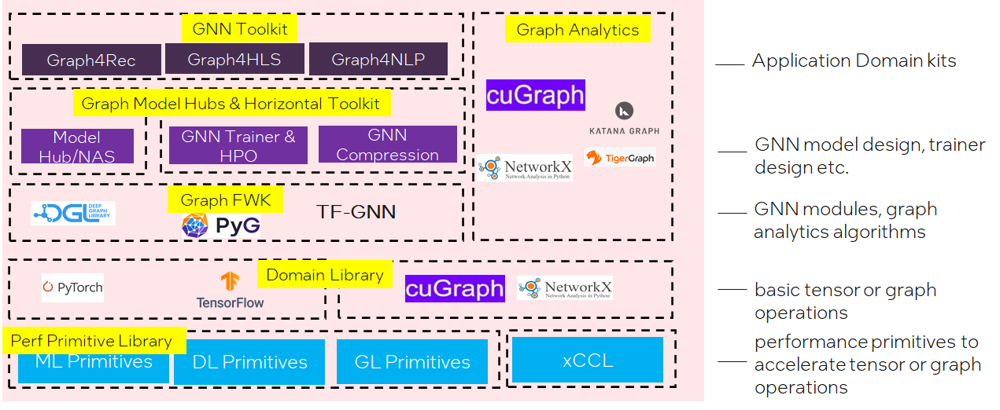

- 数据平面

	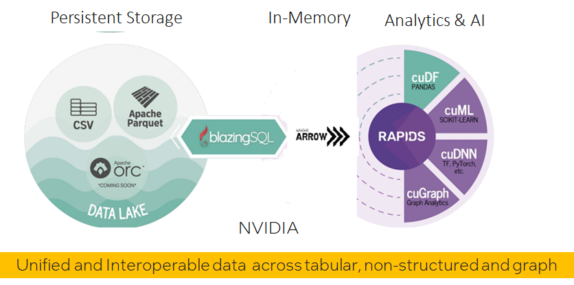

### SW Challenges

#### Graph Sampler

For `many small graphs` datasets, **full batch training** works most time. Full batch training means we can do training on whole graph;

When it comes to `one large graph` datasets, in many real scenarios, we meet `Neighbor Explosion` problem;  

> Neighbor Explosion:
> 
> 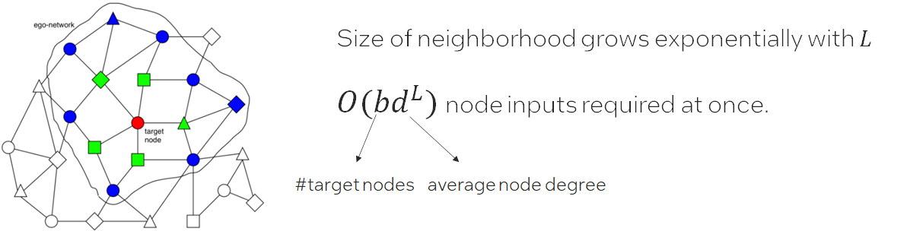

Graph sampler comes to rescue. Only sample a fraction of target nodes, and furthermore, for each target node, we sample a sub-graph of its ego-network for training. This is called **mini-batch training**.
Graph sampling is triggered for each data loading.  And the hops of the sampled graph equals the GNN layer number 𝐿. Which means graph sampler in data loader is important in GNN training.

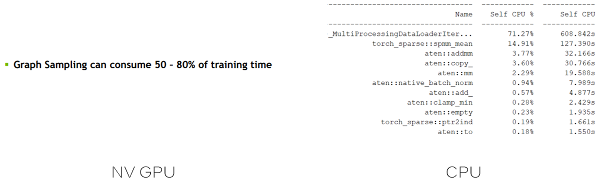

**Challenge: How to optimize sampler both as standalone and in training pipe?**

When graph comes to huge(billions of nodes, tens of billions of edges), we meet new at-scale challenges:
- How to store the huge graph across node? -> graph partition
- How to build a training system w/ not only distributed model computing but also distributed graph store and sampling?
	- How to cut the graph while minimize cross partition connections?

		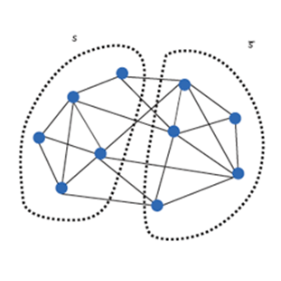

A possible GNN distributed training architecture:

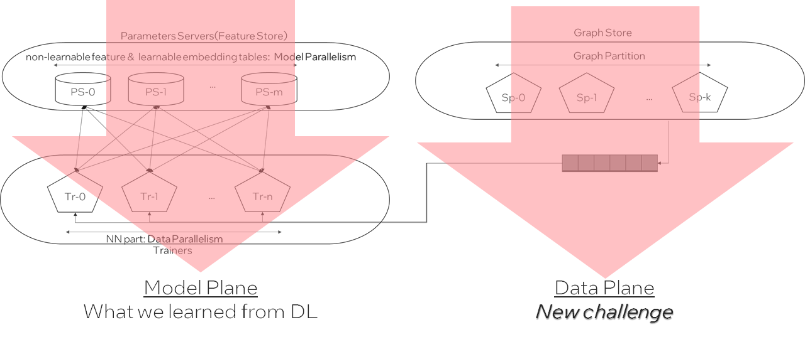

#### Scatter-Gather
- Fuse adjacent graphs ops
  
	> One common fuse pattern for GCN & GraphSAGE：
	>
	>	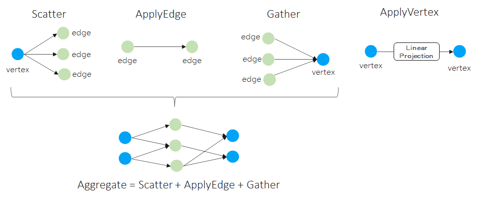
	
	**Challenge:**  
	**How to fuse more GNN patterns on different ApplyEdge and ApplyVertex, automatically?**

- How to implement fused Aggregate
  
	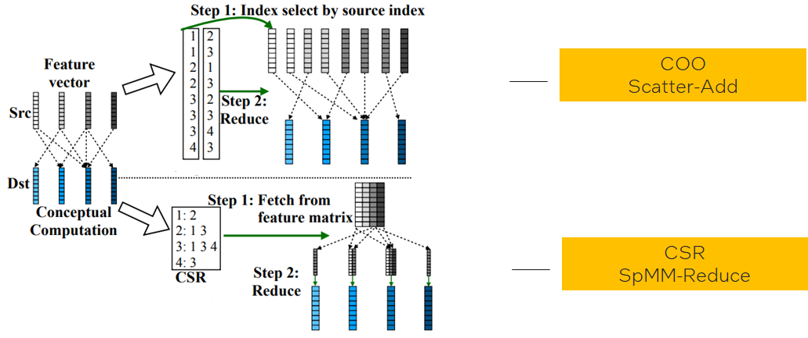

    **Challenge:**
	- **Different graph data structures lead to different implementations in same logic operations;**
	- **Different graph characteristics favors different data structures;(like low-degree graphs favor COO, high-degree graphs favor CSR)**
	- **How to find the applicable zone for each and hide such complexity to data scientists?**

#### More

- Inference challenge
	- GNN inference needs full batch inference, how to make it efficient?
	- Distributed inference for big graph?
	- Vector quantization for node and edge features? 
	- GNN distilled to MLP?
- SW-HW co-design challenge
	- How to relief irregular memory access in scatter-gather?
	- Do we need some data flow engine for acceleration?
-  …

## Finishing words

"There is plenty of room at the top" 对技术人员很重要。但为避免入宝山而空返，我们更需要建立起技术架构，这就像是地图一样，只有按图索骥才能更好地探索和利用好 top 里的 `plenty of room`。

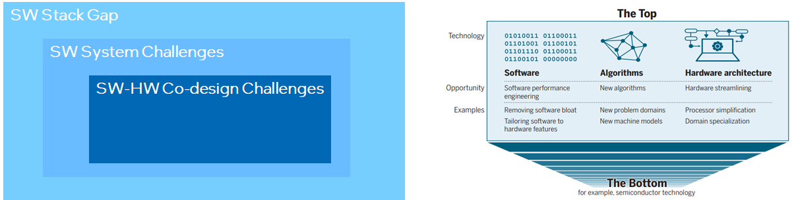

## References

1. [Graph + AI: What's Next? Progress in Democratizing Graph for All](https://www.graphaisummit.com/agenda/session/895480)
2. [Recent Advances in Efficient and Scalable Graph Neural Networks](https://www.chaitjo.com/post/efficient-gnns/#learning-paradigms-for-gnn-compression)
3. [Crossing the Chasm – Technology adoption lifecycle](https://thinkinsights.net/strategy/crossing-the-chasm/)
4. [Understanding and Bridging the Gaps in Current GNN Performance Optimizations](https://dl.acm.org/doi/pdf/10.1145/3437801.3441585)
5. [Automatic Generation of High-Performance Inference Kernels for Graph Neural Networks on Multi-Core Systems](https://dl.acm.org/doi/fullHtml/10.1145/3472456.3473511)
6. [Understanding GNN Computational Graph: A Coordinated Computation, IO, And Memory Perspective](https://nicsefc.ee.tsinghua.edu.cn/%2Fnics_file%2Fpdf%2Fe96e4419-630b-4bf7-8635-61256efcfbd4.pdf)
7. [Graphiler: A Compiler For Graph Neural Networks](https://gnnsys.github.io/papers/GNNSys21_paper_10.pdf)
8. [Scatter-Add in Data Parallel Architectures](http://cva.stanford.edu/people/gajh/publications/hpca11_camera.pdf)
9. [fuseGNN: Accelerating Graph Convolutional Neural Network Training on GPGPU](https://seal.ece.ucsb.edu/sites/default/files/publications/fusegcn_camera_ready_.pdf)
10. [VQ-GNN: A Universal Framework to Scale up Graph Neural Networks using Vector Quantization](https://neurips.cc/media/neurips-2021/Slides/26298.pdf)
11. [NeuGraph: Parallel Deep Neural Network Computation on Large Graphs](https://www.usenix.org/conference/atc19/presentation/ma)
12. [Completing a member knowledge graph with Graph Neural Networks](https://engineering.linkedin.com/blog/2021/completing-a-member-knowledge-graph-with-graph-neural-networks)
13. [PinnerFormer: Sequence Modeling for User Representation at Pinterest](https://arxiv.org/pdf/2205.04507.pdf)
14. [Gartner and Graph Analytics](https://graphlytic.biz/blog/gartner-and-graph-analytics)
15. [Analysis and Optimization of GNN-Based Recommender Systems on Persistent Memory](https://arxiv.org/pdf/2207.11918.pdf)
16. [GNNear: Accelerating Full-Batch Training of Graph Neural Networks with Near-Memory Processing](https://arxiv.org/pdf/2111.00680.pdf)