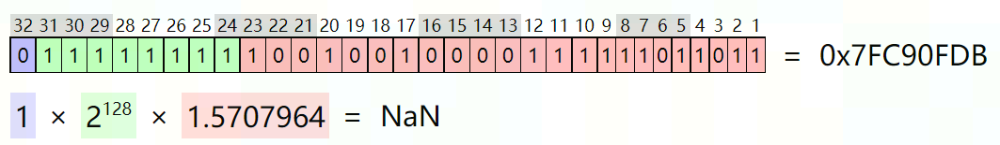
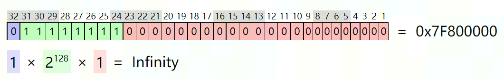
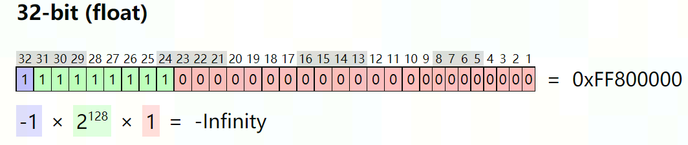

# IEEE-754 浮点数算术规范

## 数值比较

<!-- >> **Caveat**: 370 HW only supports ordered comparison, SW will only expose ordered comparison API
-->

比较两个浮点数的数值分为 **Ordered** 和 **Unordered** 两种方法，二者的主要区别是 `NaN` 的处理。

据 [PTX ISA 9.3.1.2 Floating Point Comparisons](https://docs.nvidia.com/cuda/parallel-thread-execution/index.html#floating-point-comparisons)。

### ordered

The ordered floating-point comparisons are `eq`, `ne`, `lt`, `le`, `gt` and `ge`. If either operand is `NaN`, the result is `False`. Below table lists the **ordered** floating-point comparison operators.

| Meaning | Floating-Point Operator |
|  ----  | ----  |
| `a == b && !isNaN(a) && !isNaN(b)`	| `eq` |
| `a != b && !isNaN(a) && !isNaN(b)`	| `ne` |
| `a < b && !isNaN(a) && !isNaN(b)`	| `lt` |
| `a <= b && !isNaN(a) && !isNaN(b)`	| `le` |
| `a > b && !isNaN(a) && !isNaN(b)`	| `gt` |
| `a >= b && !isNaN(a) && !isNaN(b)`	| `ge` |

### unordered

To aid comparison operations in the presence of `NaN` values, **unordered** floating-point comparisons are provided: `equ`, `neu`, `ltu`, `leu`, `gtu`, and `geu`. If both operands are numeric values (not `NaN`), then the comparison has the same result as its ordered counterpart. If either operand is `NaN`, then the result of the comparison is True.
Below table  lists the floating-point comparison operators accepting `NaN` values.

| Meaning | Floating-Point Operator |
| ----  | ----  |
| `a == b \|\| isNaN(a) \|\| isNaN(b)` | `equ` |
| `a != b \|\| isNaN(a) \|\| isNaN(b)` | `neu` |
| `a < b \|\| isNaN(a) \|\| isNaN(b)`  | `ltu` |
| `a <= b \|\| isNaN(a) \|\| isNaN(b)` | `leu` |
| `a > b \|\| isNaN(a) \|\| isNaN(b)`  | `gtu` |
| `a >= b \|\| isNaN(a) \|\| isNaN(b)` | `geu` |

To test for `NaN` values, two operators `num` (`numeric`) and `nan` (`isNaN`) are provided. `num` returns `True` if both operands are numeric values (not `NaN`), and `nan` returns `True` if either operand is `NaN`. Below table lists the floating-point comparison operators testing for `NaN` values.

| Meaning | Floating-Point Operator |
| ----  | ----  |
| `!isNaN(a) && !isNaN(b)` | `num` |
| `isNaN(a) \|\| isNaN(b)` | `nan` |

## min/max

<!-- >> **Caveat**: 370 HW min/max behaviors don't conform to 754, SW enhancement is needed to meet conformance.

> **370 HW behavior** 
>> // max(a, b)
>> `NaN`, num → `NaN`
>> num, `NaN` → num
>> `NaN`, `NaN` → `NaN`
>> 其他（不包含`NaN`时，正常比较大小）
-->

浮点数 min/max 按照 754 spec 分为 **maximum/minimum** 和 **maximumNumber/minimumNumber** 两种，二者的主要区别是 `NaN` 的处理。

According to [PTX ISA 9.7.3.11 Floating Point Instructions: min](https://docs.nvidia.com/cuda/parallel-thread-execution/index.html#floating-point-instructions-min).

### maximum/minimum
>**maximum(a, b)**
>`NaN`, num → `NaN`
>
>num, `NaN` → `NaN`
>
>`NaN`, `NaN` → `NaN`
>
>其他（不包含 `NaN` 时，正常比较大小）

PTX ISA通过 `min.NaN` 和 `max.NaN` 指令 modifier 来达成。

### maximumNumber/minimumNumber

> **maximumNumber(a, b)**
>
> `NaN`, num → num
>
> num, `NaN` → num
>
> `NaN`, `NaN` → `NaN`
>
> 其他（不包含 `NaN` 时，正常比较大小）

PTX ISA 通过 `min` 和 `max` 指令 modifier 来达成。

## `NaN` & `Inf`
`NaN`：指数位全是 1，尾数位不全为 0；
`Inf`：指数位全是 1，尾数位都是 0；根据符号位是 0，1 来区分是 `Inf` 还是 `-Inf`；

- `NaN`

	
- `Inf`

	
- `-Inf`

	

## References
1.  [float toy](https://evanw.github.io/float-toy/) 