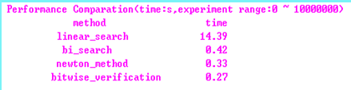

# 如何计算整数平方根

## 定义

所谓整数平方根即：
$$ f(x) = \lfloor{\sqrt{x}}\rfloor$$

## 算法

### 算法 1：猜试法

利用等差级数公式：
$$ 1+3+5+...+(2n-1) = n^2$$         

这样的话，$n$ 从 1 开始一直算到数列的前项和第一次大于 $x$ 的时候，$n-1$ 即为所求。下面给出 C 代码：

```cpp
unsigned linear_search(unsigned long x) {
    unsigned long sum_n = 1;
    unsigned n = 1;

    if (x <= 1) {
        return x;
    }

    while (sum_n <= x) {
        n++;
        sum_n += (n << 1) - 1;
    }

    return (n-1);
}
```

这种方法无异于穷举法，其唯一的优点是：每次的迭代用到了前面迭代的结果，所以会有一些效率的增益。对于该算法的改进就是不穷举，改用我们熟悉的二分查找法来做。

```cpp
unsigned bi_search(unsigned long x) {
    unsigned long sum_n = 0;
    unsigned n = (x >> 1);
    unsigned top = x;
    unsigned bottom = 0;

    if (x <= 1) {
        return x;
    }

    for (;;) {
        sum_n = n * n;
        if (sum_n < x) {
          bottom = n;
          n += ((top - bottom) >> 1);
          if (n == bottom) {
              return n;
          }
        }
        else if (sum_n > x) {
          top = n;
          n -= ((top - bottom) >>1);
          if (n == top) {
              return n-1;
          }
        }
        else {
            return n;
        }
    }
}
```

### 算法 2：Newton 法

把这个问题转换为方程求根问题，即：$x^2 - a = 0$，求 $x$。

而方程求根的问题可以用 `Newton` 法来解决。现在的问题有一点不同，即所求的根必须是整数。通过证明，我们可以发现，Newton 迭代公式是适用于整数情况的，于是有：
$$g_{n+1} = (g_n + \frac{a}{g_n}) / 2$$

至于是怎么证明的，可以参考 `hacker’s delight`。

另外，初值的选择也是很重要的一环，这里我们选择大于 $\sqrt{x}$ 等于的最小的 2 的幂次数。

OK，下面给出程序：

```cpp
unsigned newton_method(unsigned long x) {
    unsigned long x1 = x - 1;
    unsigned s = 1;
    unsigned g0,g1;

    /* 初值设定 */
    if (x1 > 65535) {s += 8; x1 >>= 16;}
    if (x1 > 255)   {s += 4; x1 >>= 8;}
    if (x1 > 15)    {s += 2; x1 >>= 4;}
    if (x1 > 3)     {s += 1; x1 >>= 2;}

    /*迭代*/
    g0 = 1 << s;
    g1 = (g0 + (x >> s)) >> 1;
    while (g1 < g0) {
       g0 = g1;
       g1 = (g0 + x/g0) >> 1;
    }
    return g0;
}
```

### 算法 3：逐比特确认法

逐比特确认法认为一个 32 位整数求根，结果应该是一个 16 位整数。求这个 16 位整数，其实质是确认每位的比特是 0 还是 1。我们把这个根分为两个相加的部分，一部分是已确认的值，另一部分是未确认的值。从高位到低位，每次迭代确认一位。初始时，已确认部分为 0。则问题的初始形式为：

$$\begin{align*}
&(n_{0} + r_{15})^2 \le a\\
& s.t.\ \ n_0=0
\end{align*} $$

算法发明者为 James Ulery，论文为 `Computing Integer Square Roots`。

下面给出源代码：

```cpp
unsigned bitwise_verification(unsigned long x) {

   unsigned long temp = 0;
   unsigned v_bit = 15;
   unsigned n = 0;
   unsigned b = 0x8000;

   if (x <= 1) {
       return x;
   }

   do {
       temp = ((n << 1) + b) << (v_bit--);
       if (x >= temp) {
           n += b;
           x -= temp;
       }
   } while (b >>= 1);
   
   return n; 
}
```

## 性能比较

在 `[0, 1000000]` 范围内对四种算法进行了遍历性的测试，测试结果如下：



显见四种算法的遍历性能以逐比特确认法为最好，逐比特确认法从本质上来说是一种二分查找法，而且其查找范围为整个 16 位整数域；而我们实现的二分查找法的查找范围到已知变量为止，从范围上来说比逐比特确认法来得小，但是最后平均性能却不及逐比特确认法。其原因在于：逐比特确认法把问题分解为相同的子问题的集合，采用递推的方法，很好地利用了前面步骤的结果，不用什么都从头算起，从而避免了重复劳动，用加减法和移位操作代替了乘除法操作，最终获得了性能上的增益。

需要注意的是，虽然平均性能有如此的关系。并不代表每个数或每组数都有这样的关系。实际上，我们每组产生 1000 个随机数，并对每组的算法性能进行了测试，各个算法都有获得优胜的时候。至于具体是什么场合用什么算法，需要分析和经验的支撑。目前，我所能归纳出的概要指导准则为：

1. 在大多数情况下，牛顿迭代都能获得不错的性能；
2. 逐比特确认法更适合运算数比较大的场合

测试环境说明：
- 操作系统：windows xp sp3
- CPU：Pentium4 3.0GHZ
- 内存：2.40GHz 0.99GB
- 编译环境：VC++6.0 企业版


## 参考文献

1. `hacker’s delight` 之初等函数
2. [完全平方数的判定及整数平方根的快速求解](https://www.cnblogs.com/atyuwen/archive/2009/11/09/intsqrt.html)
3. James Ulery，`Computing Integer Square Roots`，期间曾因为算法细节问题，向 James Ulery 求教并得到其热情回复，向其表示感谢。
4. [计算正整数平方根的整数部分(J2ME)](http://www.360doc.com/content/060601/10/233_126245.html)

*写于 2009 年 7 月*