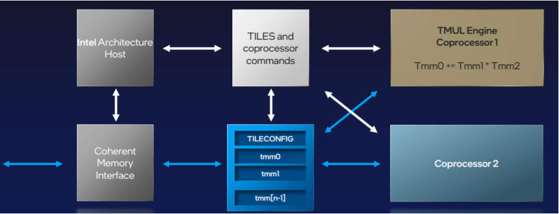
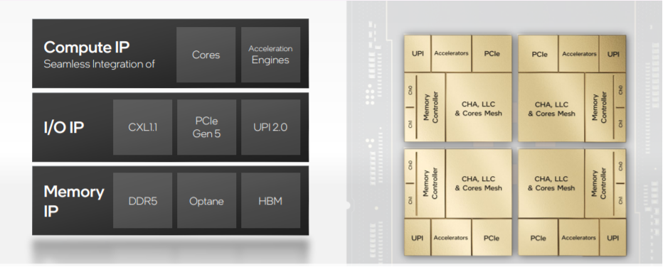

# Intel Architecture Day Takeaways

## Key Messages

- A mindset shift from **Platform-Driven** to **Application-Driven**

- A practice shift from **One-For-All** to **All-For-One**, by transforming **x86-centric** strategy to **data-centric** strategy

- A muscle-showing to industry about the well preparation, by exhibiting **the most complete portfolio in industry**

## Problems To Be Solved

What industry is asking for is far beyond what Moore's Law can serve.

$$Requested\_Scaling = (Moore's\ Law)^5$$

## Intel's Answer

Sustaining innovations through tik-tok(alternative innovations between process and architecture) is not enough. Disruptive innovations are needed, through joint forces from: architecture, software, memory, interconnect, process&packaging.

In Architecture Day, Intel focuses on Architecture.

- **Architecture** - shifting from SoC to SiP
  
	
- Software
- Memory
- Interconnect
- Process & Packaging

## SiPs

### CPU

- **IP**
	- Efficient Core

	  Rename **Atom** to **Efficient Core**, targeting to throughput-driven and power-efficient scenarios. HT and AVX-512 are disabled, so $V$ is saved for better core count scaling.

		$$P=\alpha * C * f * V^2$$ 
	  
      Single core throughput is optimized by:
	  - **deeper** front end
		  - 2x Instruction Cache
		  - 2x 3-wide OOO decoders
	  - **wider** back end
		   - 17 ports
	- Performance Core

	  Among other incremental gen-by-gen optimizations in both front end and back end, 3 highlights:
	  - Tensor Co-processor - AMX

		  
	  - SIMD FADD ISA is added to accelerate sum-based zip operations(embedding_bag, eltsum etc.)
	  - New Smart PM Controller to minimize frequency drop across AVX2/AVX512/AMX

- **SiP**
Heterogeneous compute dies connect as a hybrid compute die in package.

	 
	- Alder Lake

    	 
	
         w/ building blocks:
	 
        
     
        Automatic core scheduling btw efficient cores and performance cores by Intel Thread Director.
	- Sapphire Rapids
	  A bold experiment on in-package data flow processing. 

	  $$package = data\ accelerators(QAT/DSA\ etc.) + vector\ 
      accelerators(AVX) + tensor\ accelerators(AMX)$$

	  

### GPU

Intel shows its ambitions by revealing its full GPU portfolio for every segment: gaming, AI computing, high performance computing, w/ both integrated and discrete form factors.  In this catching-up phase, there is no need to show fancy innovations, it just needs to be execute fast and flawlessly.
In HotChips'33, Intel shows an promising AI performance on ResNet-50 w/ its A0 silicon.

- training IPS(1.1x)
	- PVC: 3400
	- A100: 2986
- inference IPS(1.5x)
	- PVC: 43000
	- A100: 29856

For package, as CPU, GPU is also shifting to SiP through 3D IC technology.

### IPU

IPU's mission is infrastructure offload. What's the infrastructure really meaning to offload? There are 3:
- management (already offload to BMC based Out-Of-Band system)
- IO
	- storage
	- network

For every IO, we have 3 planes: 
- data plane
- control plane
- management plane

In pre-IPU era, low-level data plane is done by device(disk/NIC etc.), high-level data plan, control plan and management plane are delegated to host CPU. For CSPs which sell IAAS for revenue, host CPU is expensive. IPU is here to take back full data plan, control plane and management plane from CPU to device. So in post-IPU era, we converted dummy NICs and dummy SSDs to smart NICs and smart SSDs.

Intel did some exploration on its IP/package portfolio, and announced 3 products(system/package).

This is just a first step from zero to one, Intel has more in their IP/package portfolio to explore, to get to HW convergence.

## Thoughts

A data-centric mindset means architecture design will be around data life cycle 
- data@compute
- data@transmit
- data@rest

### About data@compute
We can revisit different WLs we have:
- latency-driven WL -> CPU is the converged architecture
- throughput-driven WL
	- (a) BIG number of HEAVY work, same TOA(Time Of Arrival): e.g. image(2D/3D) training, NLP training, offline inference
	- BIG number of LIGHT work
		- (b) same TOA: e.g. search&rec training
		- (c) different TOA: e.g. online inference
	
	

With these sub-types which pose different data@compute problems, although GPU has a good track-of-record for type (a), architecture still has a long way to solve all these 3 problems. 

After tensor core was accepted as the third base accelerator, SIMT finished its acting role on matrix operation acceleration, and backed to the scalar/vector acceleration role. So basically, we need reconsider the architecture since new base blocks are accepted.

Industry is exploring 3 tracks in parallel for scalar/vector acceleration choices(as below). We just need let the bullets fly...

#### [Q] Can we converge latency-driven WL and throughput-driven WL to one device?

Intel is using Sapphire Rapids to explore the possibility of converging latency-driven WL and throughput-driven WL back to CPU. W/ this vision, they need carefully handle the mixed deployment problem, since latency-driven WL prefers **frequency** and throughput-driven WL prefers **compute_cap_per_cycle**, they are conflicting.

$$System\_Compute\_Cap = freq * Compute\_Cap\_Per\_Cycle$$

And w/ current design, tensor core AMX is designed as a co-processor. This design has a better programming experience at the cost of sharing clock source... Maybe IBM Telum Processor's design is another option to explore.

A step-back question is: is device convergence the real what we need? I don't think so. Maybe architecture convergence is far more important than device convergence for Intel. For `CPU + Tensor Accel` track, Intel had `Xeon Phi` before, they missed it.

### About data@transmit and data@rest

IPU was designed to save IAAS cost and offload infrastructure workload, and solve the security concern at the same time. NVIDIA thinks more to use it to do application offload, SHARP(Scalable Hierarchical Aggregation and Reduction Protocol) is a step upward to experiment on aggregation and reduction operations. We can think more, although it's not an easy work.

### Software is Eaten

近 10 年尤其是近 5 年来，应用裹挟着硬件一路狂奔，留下软件在风中凌乱。Raja 曾经在 HotChips'32 里用 Swiss Cheese 的隐喻来描述这一地鸡毛的 leaky abstraction。在 Architecture 的 Golden Age 的光晕里，Software 的 Golden Age 呼之欲出，去补上这千疮百孔。

Software 的走向取决于 Architecture 的走向，我们不妨做一些 What-If。
- What-If 1: Architecture Converge back to CPU, which different device types
  
  传统的编程模型没有发生根本改变，只需要重新划定 role&responsibility，分层补洞。

- What-If 2: Multi-Architecture is promised land
  
  编译技术的黄金时代会到来。在这条路线上，首先需要进行的是 GC 和 DSC 的 converge，Intel 把 ICC 放弃掉，统一至 LLVM，算是为这条路做个基础性工作。

- What-If 3
   ...
 
让我们耐着性子，边走边看，边走边改。

## References
1. [Intel Architecture Day 2021](https://download.intel.com/newsroom/2021/client-computing/intel-architecture-day-2021-presentation.pdf)
2. [Accelerated Computing with a Reconfigurable Dataflow Architecture](https://sambanova.ai/wp-content/uploads/2021/06/SambaNova_RDA_Whitepaper_English.pdf)
3. [Why P scales as C*V^2*f is so obvious](https://software.intel.com/content/www/us/en/develop/blogs/why-p-scales-as-cv2f-is-so-obvious.html)

*写于 2021 年 10 月*