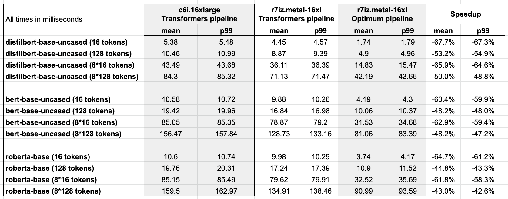

# 使用英特尔 Sapphire Rapids 加速 PyTorch Transformers，第 2 部分

在 [最近的一篇文章](https://huggingface.co/blog/intel-sapphire-rapids) 中，我们介绍了代号为 [Sapphire Rapids](https://en.wikipedia.org/wiki/Sapphire_Rapids) 的第四代英特尔至强 CPU 及其新的先进矩阵扩展 ([AMX](https://en.wikipedia.org/wiki/Advanced_Matrix_Extensions)) 指令集。通过使用 Amazon EC2 上的 Sapphire Rapids 服务器集群并结合相应的英特尔优化库，如 [英特尔 PyTorch 扩展（IPEX）](https://github.com/intel/intel-extension-for-pytorch)，我们展示了如何使用 CPU 进行高效的分布式大规模训练，与上一代至强 (Ice Lake) 相比，Sapphire Rapids 实现了 8 倍的加速，取得了近线性的扩展比。

本文我们将重点关注推理。使用基于 PyTorch 的 HuggingFace transformers 模型，我们首先在 Ice Lake 服务器上分别测量它们在长、短两种文本序列上的性能。然后，我们在 Sapphire Rapids 服务器和最新版本的 Hugging Face [Optimum Intel](https://github.com/huggingface/optimum-intel) 上执行相同的测试，并比较两代 CPU 的性能。这里，Optimum Intel 是一个专用于英特尔平台的硬件加速开源库。

让我们开始吧！


## 为什么你应该考虑使用 CPU 推理

在决定使用 CPU 还是 GPU 进行深度学习推理时需要考虑多个因素。最重要的当然是模型的大小。一般来说，较大的模型能更多地受益于 GPU 提供的强大算力，而较小的模型可以在 CPU 上高效运行。

另一个需要考虑的因素是模型和推理任务本身的并行度。 GPU 为大规模并行处理而设计，因此它们可能对那些可以高度并行化的任务更高效。而另一方面，如果模型或推理任务并没有特别高的并行度，CPU 可能是更有效的选择。

成本也是一个需要考虑的重要因素。 GPU 可能很昂贵，而使用 CPU 可能是一种性价比更高的选择，尤其是在业务应用并不需要极低延迟的情况下。此外，如果你需要能够轻松扩缩推理实例的数量，或者如果你需要能够在各种平台上进行推理，使用 CPU 可能是更灵活的选择。

现在，让我们开始配置我们的测试服务器。

## 配置我们的测试服务器
和上一篇文章一样，我们将使用 Amazon EC2 实例：

* 一个基于 Ice Lake 架构 `c6i.16xlarge` 实例，
* 一个基于 Sapphire Rapids 架构的 `r7iz.16xlarge-metal` 实例。你可以在 [AWS 网站](https://aws.amazon.com/ec2/instance-types/r7iz/) 上获取有关新 r7iz 系列的更多信息。

两个实例都有 32 个物理核（因此有 64 个 vCPU）。我们将用相同的方式来设置它们：

* Ubuntu 22.04 和 Linux 5.15.0 (`ami-0574da719dca65348`),
* PyTorch 1.13 与 IPEX（Intel Extension for PyTorch） 1.13，
* Transformers 4.25.1。

唯一的区别是在 r7iz 实例上我们多装一个 Optimum Intel 库。

以下是设置步骤。像往常一样，我们建议使用虚拟环境来保证环境纯净。

```
sudo apt-get update

# 安装 libtcmalloc，获取更好性能
sudo apt install libgoogle-perftools-dev -y
export LD_PRELOAD="/usr/lib/x86_64-linux-gnu/libtcmalloc.so"

sudo apt-get install python3-pip -y
pip install pip --upgrade
export PATH=/home/ubuntu/.local/bin:$PATH
pip install virtualenv
virtualenv inference_env
source inference_env/bin/activate

pip3 install torch==1.13.0 -f https://download.pytorch.org/whl/cpu
pip3 install intel_extension_for_pytorch==1.13.0 -f https://developer.intel.com/ipex-whl-stable-cpu
pip3 install transformers

# 仅需在 r7iz 实例上安装
pip3 install optimum [intel]
```

在两个实例上完成上述步骤后，我们就可以开始运行测试了。

## 对流行的 NLP 模型进行基准测试

在这个例子中，我们将在文本分类任务上对几个 NLP 模型进行基准测试：[distilbert-base-uncased](https://huggingface.co/distilbert-base-uncased), [bert-base-uncased]( https://huggingface.co/bert-base-uncased) 和 [roberta-base](https://huggingface.co/roberta-base)。你可以在 Github 上找到 [完整脚本](https://gist.github.com/juliensimon/7ae1c8d12e8a27516e1392a3c73ac1cc)。当然，你也可以用你自己的模型随意尝试！

```
models = ["distilbert-base-uncased", "bert-base-uncased", "roberta-base"]
```

我们使用序列长度分别为 16 和 128 的两种句子来测试，同时我们也将在这两种句子上分别测量单句推理和批量推理的平均预测延迟和 p99 预测延迟。该测试方案模拟了真实场景，因此可以较好地近似在真实场景中的预期加速比。


```
sentence_short = "This is a really nice pair of shoes, I am completely satisfied with my purchase"
sentence_short_array = [sentence_short] * 8

sentence_long = "These Adidas Lite Racer shoes hit a nice sweet spot for comfort shoes. Despite being a little snug in the toe box, these are very comfortable to wear and provide nice support while wearing. I would stop short of saying they are good running shoes or cross-trainers because they simply lack the ankle and arch support most would desire in those type of shoes and the treads wear fairly quickly, but they are definitely comfortable. I actually walked around Disney World all day in these without issue if that is any reference. Bottom line, I use these as the shoes they are best; versatile, inexpensive, and comfortable, without expecting the performance of a high-end athletic sneaker or expecting the comfort of my favorite pair of slippers."
sentence_long_array = [sentence_long] * 8
```

基准测试功能非常简单。在几次预热迭代后，我们使用 `pipeline` API 运行 1000 次预测，把预测时间存下来，并计算它们的均值和 p99 值。

```
import time
import numpy as np

def benchmark (pipeline, data, iterations=1000):
    # 预热 100 次
    for i in range (100):
        result = pipeline (data)
    times = []
    for i in range (iterations):
        tick = time.time ()
        result = pipeline (data)
        tock = time.time ()
        times.append (tock - tick)
    return "{:.2f}".format (np.mean (times) * 1000), "{:.2f}".format (
        np.percentile (times, 99) * 1000
    )
```

在 c6i (Ice Lake) 实例上，我们只使用普通的 Transformers `pipeline`。

```
from transformers import pipeline

for model in models:
    print (f"Benchmarking {model}")
    pipe = pipeline ("sentiment-analysis", model=model)
    result = benchmark (pipe, sentence_short)
    print (f"Transformers pipeline, short sentence: {result}")
    result = benchmark (pipe, sentence_long)
    print (f"Transformers pipeline, long sentence: {result}")
    result = benchmark (pipe, sentence_short_array)
    print (f"Transformers pipeline, short sentence array: {result}")
    result = benchmark (pipe, sentence_long_array)
    print (f"Transformers pipeline, long sentence array: {result}")
```

在 r7iz (Sapphire Rapids) 实例上，我们同时使用普通 `pipeline` 和 Optimum `pipeline`。在 Optimum `pipeline` 中，我们启用 `bfloat16` 模式以利用到 AMX 指令，并将 `jit` 设置为 `True` 以使用即时编译进一步优化模型。


```
   import torch
	from optimum.intel import inference_mode
	
	with inference_mode (pipe, dtype=torch.bfloat16, jit=True) as opt_pipe:
	    result = benchmark (opt_pipe, sentence_short)
	    print (f"Optimum pipeline, short sentence: {result}")
	    result = benchmark (opt_pipe, sentence_long)
	    print (f"Optimum pipeline, long sentence: {result}")
	    result = benchmark (opt_pipe, sentence_short_array)
	    print (f"Optimum pipeline, short sentence array: {result}")
	    result = benchmark (opt_pipe, sentence_long_array)
	    print (f"Optimum pipeline, long sentence array: {result}")
```

为简洁起见，我们先看下 [distilbert-base-uncased](https://huggingface.co/distilbert-base-uncased) 的 p99 结果。你可以在文章末尾找到所有测例的完整结果。


如上图所示，与上一代至强 CPU 相比，Sapphire Rapids 上单个句子的预测延迟加速了 **60-65%**。也就是说，由于结合了英特尔 Sapphire Rapids 平台以及 Hugging Face Optimum 的优化，你只需对代码进行很少改动就可将预测速度提高 3 倍。

这让我们即使在长文本序列上也可以达到 **个位数的预测延迟**。在 Sapphire Rapids 之前，这样的性能只有通过 GPU 才能实现。

## 结论

第四代英特尔至强 CPU 提供了出色的推理性能，尤其是在与 Hugging Face Optimum 结合使用时。这是深度学习在更易得和更具成本效益的道路上的又一个进步，我们期待与英特尔的朋友们在这条道路上继续合作。

以下是一些可帮助你入门的其他资源：

* [英特尔 IPEX GitHub](https://github.com/intel/intel-extension-for-pytorch)
* [Hugging Face Optimum GitHub](https://github.com/huggingface/optimum)


如果你有任何问题或反馈，我们很乐意在 [Hugging Face 论坛](https://discuss.huggingface.co/) 上与你交流。

感谢阅读！


## 附录：完整结果



* 基准测试软件环境：Ubuntu 22.04 with libtcmalloc, Linux 5.15.0 patched for Intel AMX support, PyTorch 1.13 with Intel Extension for PyTorch, Transformers 4.25.1, Optimum 1.6.1, Optimum Intel 1.7.0.dev0*


> 英文原文: <url> https://huggingface.co/blog/intel-sapphire-rapids-inference </url>
>
> 译者: Matrix Yao (姚伟峰)，英特尔深度学习工程师，工作方向为 transformer-family 模型在各模态数据上的应用及大规模模型的训练推理。