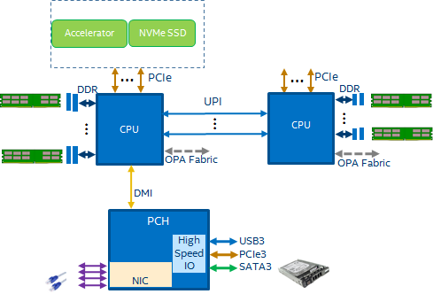
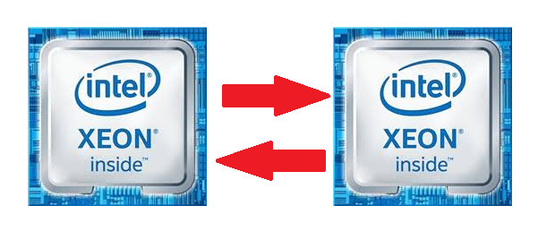
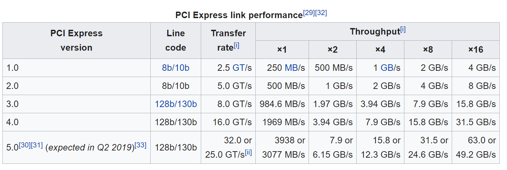
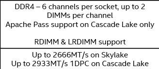
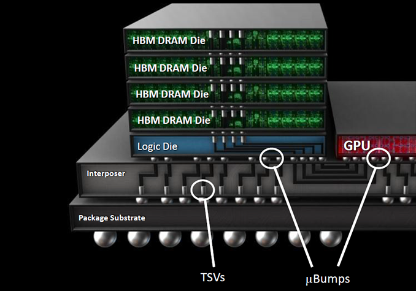
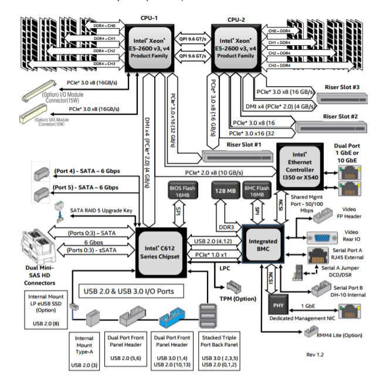

# 计算系统中的互联

如果我们把遵循冯-诺伊曼模型的计算机系统处理数据的过程类比成碾谷机碾谷子，能碾多少谷子取决于两个指标：一是机器每单位时间能碾多少谷子；二是传送带每单位时间能输送多少谷子。如果瓶颈在前者，我们叫 `compute bound`；如果在后者，我们叫 `communication bound`。一个典型的 CPU-centric 计算机系统如下图：

在该系统中，互联（interconnect）连接着运算设备、内存设备以及 IO 设备，承担着传送带的职责。因此，它的带宽和延时决定了 communication 的效率。本文主要讨论带宽。

首先亮出带宽（Bandwidth, BW）计算公式，其单位为 `GB/s（Giga Bytes per second）`，如下：

$$ BW = transfer\_rate \times bus\_width\_per\_channel \times channel\_number $$

这里，`transfer_rate` 是 interconnect 的频率，一般以 `MHz` 或者 `GT/s（Giga Transactions per second）` 为单位。

## Compute Engine Interconnects

本部分讨论计算设备间的互连带宽的计算。

### QPI/UPI

QPI（QuickPath Interconnect）和 UPI（UltraPath Interconnect）是 Intel 为支持 multi-socket 而设计的 CPU socket 间 interconnect，其最大的特点是 unified memory space 和 cache coherency。

> **例子：**
>
> Xeon Skylake（SKX）spec 中的 UPI 说明如下：
> 
> 
> 
> 一般的 `dual-socket` 方案配置如下：
> - 每个 socket 可用 2 个 UPI ports 用于 socket 间互联
> - 每个 port 支持全双工（full duplex），有 2 条 link：`transmit link` 和 `receive link`
> - 每条 link 的有效带宽为 16 bit（即 16 条有效数据 lane）
> 
> 所以：
> $$ BW = 10.4 \times \frac{16}{8} \times 2  \times 2= 83.2\ GB/s $$

### PCIe

PCIe（Peripheral Component Interconnect express）spec 如下：

#### PCIe 3

> **例子：**
> 
>  Skylake spec 中 PCIe 说明如下：
> 
> 
> 
> 对一个典型的 16 条 lane 的 PCIe 3 设备而言，每条 lane 的有效带宽为 128/130 bit，所以其带宽为：
> 
> $$ BW = 8 \times (\frac{1}{8} \times \frac{128}{130}) \times 16 = 15.8\ GB/s $$
> 
> 这里，PCIe 的 bus width 是 1 bit，编码效率是 128b/130b。

 
> **Rule-of-Thumb**
> PCIe 3 一条 lane 单向带宽约为 `1GB/s`，双向带宽约为 `2GB/s`。

#### PCIe 4

PCIe 4 的 transfer rate 是 PCIe 3 的两倍，即一个 16 条 lane 的 PCIe 4 设备单向带宽约为 `31.6GB/s`，双向约为 `64GB/s`。

#### PCIe 5

PCIe 5 的 transfer rate 是 PCIe 4 的两倍，即一个16 条 lane 的 PCIe 5 设备单向带宽约为 `64GB/s`，双向约为 `128GB/s`。

### CXL

CXL 1.1 的物理层基于 PCIe 5，所以其带宽与 PCIe 5 相同。

## Memory Interconnects

本部分讨论计算设备与内存间带宽的计算。

### DDR

最常见的内存设备就是 DDR 了。

#### DDR 4

> **例子：**
> 
> Skylake spec 中 memory 说明如下：
> 
>
>
> *这里 DPC = DIMMs Per Channel.*
> 
> 首先 DDR4 每 channel 的有效带宽是 64 bits（72 for ECC memory），从 spec 可以看出每路 CPU 共有 6 channel，频率为 `2666MT/s`。因此，单路 CPU 内存理论带宽为：
> 
>  $$ BW = \frac{2666}{1000} \times 8 \times 6 \approx 127\ GB/s $$
>  一个典型的双路系统的内存理论带宽为 `254GB/s`。

#### DDR 5
一个 8 channel，频率为 `4800MT/s` 的单路 CPU 内存理论带宽为：

$$ BW = \frac{4800}{1000} \times 8 \times 8 \approx 307\ GB/s $$

因此，双路系统的内存理论带宽 `615GB/s`。

### HBM

HBM（High Bandwidth Memory）顾名思义是高带宽内存，它通过 3D 堆叠（stacking）技术把若干个 DRAM die 堆叠起来，从而达成高带宽的目的。

系统中 HBM 的带宽公式如下:

$$ BW = stacks\_per\_system \times dies\_per\_stack \times BW\_per\_die $$

HBM 每个 die 有两个 128-bit 的 channel，即数据宽度为 $2 \times 16$ 字节。

#### HBM2
HBM2 的 transfer rate 最高能到 `2GT/s`。
> **例 1：**
> 
> Nvidia Tesla V100 每卡配备了 4 块 HBM2 stack, 每块容量为 4 GB，总容量为 16 GB。每块 HBM2 含 4 个 die，transfer rate 为 `1.75GT/s`。
> 基于此，其理论带宽为：
> 
> $$\begin{align*}
&BW\_per\_die = (2 \times 16) \times 1.75 = 56\ GB/s \\
& BW\_per\_stack = 56 \times 4 = 224\ GB/s \\ 
& BW = 224 \times 4 = 896\ GB/s
\end{align*} $$

> **例 2：**
> Nvidia Tesla A100 每卡配备了 5 块 HBM2 stack, 每块容量为 8GB，总容量为 40GB。每块 HBM2 含 8 个 die，transfer rate 为 `1.215GT/s`。
> 基于此，其理论带宽为：
> 
> $$\begin{align*}
&BW\_per\_die = (2 \times 16) \times 1.215 = 38.88\ GB/s \\
& BW\_per\_stack = 38.88 \times 8 = 311.04\ GB/s \\ 
& BW = 311.04 \times 5  = 1.5552 \ TB/s
\end{align*} $$

#### HBM2e
HBM2e（e 表示 evolutionary），是 HBM2 的一个改进版本。主要改进在：最高 transfer rate 提高到 `3.6GT/s`；HBM2 单 die 容量 1GB，而 HBM2e 单 die 容量提升至 2GB。因此，HBM2e 在相同的 stack 高度下，提供了 HBM2 双倍的内存容量（和成本），把 per stack 的最高容量提升到了 16GB。

> **例子：**
> SPR HBM SKU 每 socket 上配备了 4 块 HBM2e stack, 每块容量为 16GB，总容量为 64GB。每块 HBM2e 含 4 个 die，transfer rate 为 `3.2GT/s`。
> 基于此，其理论带宽为：
> $$\begin{align*}
&BW\_per\_die = (2 \times 16) \times 3.2 = 102.4\ GB/s \\
& BW\_per\_stack = 102.4 \times 4 = 409.6 GB/s \\ 
& BW = 409.6 \times 4 = 1.6\ TB/s
\end{align*} $$

> **注意 ⚠️**
> 
> 虽然 HBM 的带宽比 DDR 宽，但 transfer rate 低于 DDR，所以在小数据块的情况下，HBM 的访问延时会比 DDR 长。

## IO Interconnects

目前 IO 的带宽与 memory 相比差距还是比较大的。所以谈到分布式系统的时候，很多时候大家都说 `IO is important`，甚至有人说 `network is critical`，就是因为 IO 的带宽与 memory 差距相当大。

### 存储
存储和网络是计算型工作负载中最常用的两种 IO 设备。存储设备就是各种各样的盘，目前主流的是 SSD（Solid State drive）和 HDD（Hard Disk Drive），他们带宽不同，但都是块设备（block device）。块设备与内存设备不同之处为：
1. 内存读写的单位是 byte，但盘读写的单位是 block。因此计算盘的的带宽一般为：
   $$BW = IOPS * bytes\_per\_transfer\_block$$
   其中 `IOPS` 的全称是 `Input/Output Operations Per Second`。
2. 顺序读写和随机读写的带宽是不一样的。一个直观的解释就是：对 HDD 而言顺序读写减少了磁针的寻道开销，所以提高了读写带宽。但对 SSD 而言，因为不再有寻道和旋转延时，理论上顺序读写和随机读写的带宽是一样的。另外在 SSD 中，不同的 block size 的 IOPS 是不一样的，这是由 SSD 内部的 scatter 机制决定的。

所以，`IOPS`，尤其是 SSD 的 `IOPS`，是个挺复杂的东西，受很多东西影响，我们一般通过实测而不是解读 spec 来获得其性能。在 `Linux` 中，一般通过 `fio` 测试我们关心的配置下的 `IOPS`，然后用上述公式折算出带宽。

从上限估算的角度，我们可以从它们使用的接口来给出一个上限。对 SSD 盘来说，目前主要有两种：SATA 和 PCIe NVMe。
- SATA-2 的带宽为 `3Gbps` 也就是 `375MB/s`，SATA-3的带宽为 `6Gbps` 也就是 `750MB/s`（除去校验码，实际只有 `600MB/s`），PCIe 3 x4 的接口带宽为 `4GB/s`。这里可以看出，即使不管介质、控制器和协议的限制，单从接口的限制上来看，存储离内存还是差得远的。

    需要注意的是，SATA 接口之间是相互独立的，也就是理论上来讲，如果我插 N 块盘，且能把文件均匀地 scatter 到各个盘中，理论上总的 IO 带宽会变成 `N` 倍的。但是，有一个限制，就是因为 SATA 接口是接在 PCH（Platform Controller Hub）上的，然后 PCH 通过一个 PCIe 或者 DMI（Direct Media Interface）与 CPU 连接，所以总带宽上限受这个 DMI 或 PCIe 的带宽限制。在下面这个板子 design中，总带宽限制是 `4GB/s`。
- PCIe 接口的带宽限制当然是由 PCIe 来决定，可参见上文的 PCIe 部分。

### 网络

目前比较常用的网络有 `10Gbps`，`25Gbps`，`40Gbps`，后面演进有 `50Gbps`，`100Gbps` 以及 `400Gbps`。就算到了 `400Gbps`，它的上限还是 `50GB/s`，离 memory 还是有较大距离的，这会影响分布式系统的性能。所以，阿里有一个架构师在一次分享中说过这么一句话：“虽然我是做存储的，但我觉得对性能而言，最重要的是网络。”，这可以看作是一个过来人的心声流露。

## 趋势

随着各种各样的工作负载往云端迁徙，云端承载越来越多的各种各种的工作负载，从 web server 到数据库到 AI，因此云端会逐渐成为一个需求 hub。这使得“把所有的工作 converge 到 CPU”方案变得越来越局促和过时，“以 CPU 为中心”的系统设计也越来越不合时宜。“异构计算”时代已经到来，这不仅仅是因为目前的工作负载的多样性发展趋势，也是 cloud provider 作为 workload hub 的话语权越来越大的必然结果。AI 只是第一个踢开这个大门的闯入者，我相信后续这样的 usage scenarios 会越来越多。我们正在见证两个时代的交替，时代的主旋律正在从 `hardware define application` 转型到 `application define hardware`。

那么哪些系统设计方案会成为“明日之星”，我觉得以内存为中心（memory-centric）的方案会是其中之一。我们已经看到很多这一方向上的探索，如 CCIX、Gen-Z、OpenCAPI 甚至 NVLink。虽然它们有着不同的设计和实现方法，但是它们有一个共同的愿景就是：系统设计思路应该开始从 `CPU centric` 转变到 `data centric`。而 `data centric` 的第一步就是 `engine democratization`，这个转变有两个显著的特点：

- 各个计算引擎与内存的距离相似，即不会出现所有 engine 都必须经过 CPU 来 access memory 的情况。

- 统一编址（Unified Memory），使得 share memory 成为题中之意，极大减少系统需要的内存量和内存间搬移的数量。

## References
[1] [PCIe wiki](https://en.wikipedia.org/wiki/PCI_Express)

[2] [Converting GT/s to Gbps](https://paolozaino.wordpress.com/2013/05/21/converting-gts-to-gbps/)

[3] [DDR SDRAM](https://en.wikipedia.org/wiki/DDR_SDRAM)

[4] [Everything You Need To Know About QPI](http://www.hardwaresecrets.com/everything-you-need-to-know-about-the-quickpath-interconnect-qpi/2/)

[5] [Performance Characteristics of Common Transports and Buses](https://www.microway.com/knowledge-center-articles/performance-characteristics-of-common-transports-buses/)

[6] [Intel Server Board S2600WT Design Spec](https://www.intel.com/content/dam/support/us/en/documents/server-products/server-boards/Intel_Server_Board_S2600WT_TPS.pdf)

[7] [NVIDIA Tesla V100 SXM2 16 GB](https://www.techpowerup.com/gpu-specs/tesla-v100-sxm2-16-gb.c3018)

[8] [NVIDIA Tesla P40](https://www.techpowerup.com/gpu-specs/tesla-p40.c2878)

[9] [NVIDIA TITAN X Pascal](https://www.techpowerup.com/gpu-specs/titan-x-pascal.c2863)

[10] [NVIDIA Tesla V100 GPU Architecture](https://images.nvidia.com/content/volta-architecture/pdf/volta-architecture-whitepaper.pdf)

[11] [NVIDIA A100 Tensor Core GPU Architecture](https://www.nvidia.com/content/dam/en-zz/Solutions/Data-Center/nvidia-ampere-architecture-whitepaper.pdf)

[12] [Skylake Processors UPI BW](https://www.nas.nasa.gov/hecc/support/kb/skylake-processors_550.html#:~:text=The%20UPI%20runs%20at%20a,second%20(GB%2Fs))

[13] [Wiki Intel QuickPath Interconnect](https://en.wikipedia.org/wiki/Intel_QuickPath_Interconnect)

*写于 2017 年 12 月*