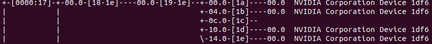

# 软件方法获取单机互联拓扑

## NV GPU

### 概况

```bash
$ nvidia-smi
```
如下是在某机型上的输出示例：


可知，本机型共有 8 张 V100S-PCIe 卡，每卡 TDP 为 250W，DRAM 大小为 32GB。

### 物理连接拓扑

```bash
$ nvidia-smi topo -m
```

输出如下：


1. 由 `CPU Affinity` 栏：
    
    8 张 GPU 卡都是接到 CPU socket 0 上的，这是一个 `single root system`；
2. 由连接矩阵：
	- 由 `PIX` 信息可得，共有 2 个 `PCIe switch`，其中 GPU0-GPU3 连在同一个 `PCIe switch` 上，GPU4-GPU7 连在同一个 `PCIe switch` 上；
	- 由 `NODE` 信息可得，这两个 `PCIe switch` 连在同一个 CPU 的两个 `Root Complex` 下；
	    > **交叉验证**
	    > 由 `lspci -tv`，从如下 BDF（Bus, Device, Function）号可以看出，两个 `PCIe switch` 是 attach 给两个 bus id 的（分别是 3a 和 17）。
        >
        > 
        >
        > 
        >
        > 由 bus 的 `cat /sys/class/pci_bus/0000:17/cpulistaffinity` 命令也可交叉验证。

进一步地，GPU PCIe spec 可使用 `nvidia-smi -q` 获得：


可知该机型 V100 卡使用 PCIe 3.0 x16 接口。
	
综合可得，物理连接拓扑为：


## MLU

### 概况

```bash
$ cnmon
```

如下是在机型一上的输出示例：


可知，本机型共有 16 张 MLU370-X8 卡。但这 16 张卡其实只有 8 个 PCIe form factor，即 8 张物理卡，因为 MLU370-X8 是单卡双芯的结构，如下：


这个信息 `cnmon` 命令是看不出来的，需要由 `lspci -tv` 来进一步获得。
- 机型一

	
	
- 机型二

	
	
	
	

可以看到这两个机型虽然 `PCIe Switch` 数目不同, 但第二级 `PCIe Switch` 总是挂着两个 `PCIe end point`，其实第二级 `PCIe switch` 如上文所画，是一个卡上 `PCIe switch`。

### 物理连接拓扑

```bash
$ cnmon topo -m
```

输出如下：
- 机型一
    
	1. 由 `CPU Affinity` 栏：
	    16 张 MLU 卡都是接到 CPU socket 0 上的，这是一个 `single root system`；
	2. 由连接矩阵：
		- 由 `MUL` 信息可得，共有 2 个一级 `PCIe switch`，其中 MLU0-MLU7 连在同一个一级 `PCIe switch` 上，MLU8-MLU15 连在同一个一级 `PCIe switch` 上；
		- 由 `CPU` 信息可得，这两个 `PCIe switch` 连在同一个 CPU 的两个 `Root Complex` 下；
		- 由 `MLK` 信息可得，连在同一个一级 `PCIe switch` 下的 8 张卡之间同时有 `MLULink` 高速链路。
- 机型二
	
	1. 由 `CPU Affinity` 栏：
	    MLU0-MLU7 接到 CPU socket 0 上，MLU8-MLU15 接到 CPU socket 1 上，这是一个 `dual root system`；
	2. 由连接矩阵：
		- 由 `MUL` 信息可得，共有 4 个一级 `PCIe switch`，其中 MLU0-MLU3，MLU4-MLU7，MLU8-MLU12，MLU13-MLU15 各自连在同一个一级 `PCIe switch` 上；
		- 由 `CPU` 信息可得，每两个 `PCIe switch` 连在同一个 CPU 的两个 `Root Complex` 下；
		- 由 `MLK` 信息可得，连在同一个 CPU socket 下的 8 张卡之间同时有 `MLULink` 高速链路。

进一步地，MLU PCIe spec 可使用 `cnmon info -c 0` [表示获取卡 0 的信息]获得：


`cnmon info` 命令非常蛋疼地不显示 PCIe Generation 信息，但从 "Max Speed: 16 GT/s" 可推知该卡使用 PCIe 4.0；又结合 "Max Width" 可知，是 PCIe 4.0 x16 接口。接口归接口，因为是每个卡号表示一个芯片（或逻辑卡），物理卡对外接口也是个 PCIe 4.0 x16 接口，所以实际只能降到 PCIe 3.0 x16 来使用。所以可以看到 "Current Speed: 8 GT/s Current Width: x16"。

综合可得，物理连接拓扑为：

- 机型一

	
- 机型二

	

## Reference

1. [4U GPU System - PCIe Root Architectures](https://www.supermicro.org.cn/products/system/4U/4029/PCIe-Root-Architecture.cfm)
2. [NCCL: Accelerated Multi-GPU Collective Communications](https://images.nvidia.cn/events/sc15/pdfs/NCCL-Woolley.pdf)
3. [原来 PCIe 这么简单，一定要看！](https://cloud.tencent.com/developer/article/1458755)
4. [Interpreting PCIe Device to CPU Locality Information](https://dshcherb.github.io/2019/02/02/interpreting-pcie-device-to-cpu-locality-information.html)
5. [nvidia-smi topo SOC](https://forums.developer.nvidia.com/t/nvidia-smi-topo-soc/54396)
6. [Intro to PCIe](https://www.mindshare.com/files/resources/MindShare_Intro_to_PCIe.pdf)
7. [Fast Multi-GPU communication over PCI Express](https://www.duo.uio.no/bitstream/handle/10852/88547/sivertac-thesis.pdf?sequence=1)

*写于 2017 年 12 月*