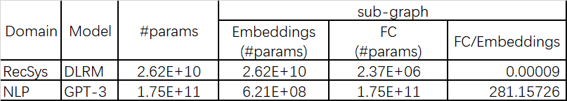

# 大得不同：推荐系统模型与 NLP 模型

推荐系统和自然语言处理是大模型高发的两大应用领域，在大的特征下，它们又有各自的特点。下面以推荐系统的代表模型 DLRM（Deep Learning Recommendation Model）和 GPT-3（Generative Pre-Training）为例说明。

## DLRM vs GPT-3

可以看到，推荐系统模型参数大部分在 embeddings 部分，而 NLP 模型参数大部分在 FC（transformer）部分。可以认为推荐系统比 NLP 更稀疏（sparse）、且 memory intensive 得多。

<!-- GPT-3 embeddings(1): 50527*12288
MLP: ((12288*128*3)*96+12288*12288+(12288*49152+49152*12288))*96+12288*50257-->

<!-- DLRM embeddings(26): 4*40000000(max index range)*128+40790948*128+3067956*128+590152*128+405282*128+39060*128+20265*128+17295*128+12973*128+11938*128+7424*128+7122*128+2209*128+1543*128+976*128+155*128+108*128+63*128+36*128+14*128+10*128+4*128+3*128 (16 big tables, 10 small tables)
MLP: bottom: 13*512+512*256+256*128; top: 479*1024+1024*1024+1024*512+512*256+256*1-->

## References
1. [The GPT-3 Architecture, on a Napkin](https://dugas.ch/artificial_curiosity/GPT_architecture.html)
2. [GPT-3 An Overview](https://dzlab.github.io/ml/2020/07/25/gpt3-overview/)
3. [Language Models are Few-Shot Learners](https://arxiv.org/pdf/2005.14165.pdf)
2. [Improving Language Understanding by Generative Pre-Training](https://s3-us-west-2.amazonaws.com/openai-assets/research-covers/language-unsupervised/language_understanding_paper.pdf)
3. [BERT: Pre-training of Deep Bidirectional Transformers for Language Understanding](https://arxiv.org/pdf/1810.04805.pdf)
4. [Attention Is All You Need](https://arxiv.org/pdf/1706.03762v5.pdf)
5. [BERT transformer block code](https://github.com/google-research/bert/blob/eedf5716ce1268e56f0a50264a88cafad334ac61/modeling.py#L558)
6. [Deep Learning Recommendation Model for Personalization and Recommendation Systems](https://arxiv.org/pdf/1906.00091.pdf)
7. [Behavior Sequence Transformer for E-commerce Recommendation in Alibaba](https://arxiv.org/pdf/1905.06874v1.pdf)