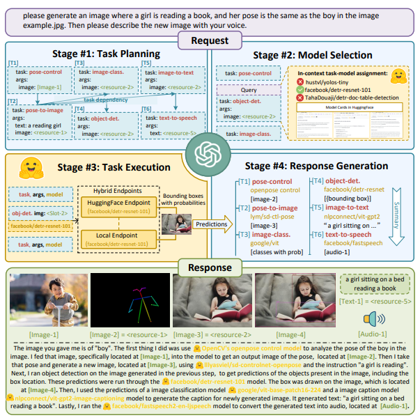

# 乱弹 LLM 的工程化

*仅为个人观点，乱弹而已。*

这一波 LLM 狂热很有意思，从现象上来看跟`智能手机 + 移动互联网`那一拨有点相像。首先是 OpenAI 扮演了当年 Apple 的角色，以 ChatGPT 这一杀手级产品搅动了一池春水，此时整个学术界、工业界及 AI 社区对 AI 表现出的那种`食之无味、弃之可惜`的有限智能及其带来的`落地难，落地贵`问题正束手无策、踟蹰不前，很多当年从学术界出山的卧龙凤雏们也重新归隐了学术界，因此 ChatGPT 的出现确实也如明灯，点燃了士气（当然也拯救了大家的职业生涯）。从这个角度看， 这是名副其实的 `iPhone Moment`。一炮打响之后就是考虑构建应用生态了，围绕 GPT 这一赋能型技术(enabling technology)，先是以 Microsoft 的 bing 为标杆试验应用如何接入落地，继而开放 [plugins](https://openai.com/blog/chatgpt-plugins) 更大范围地试验 `app store`。当然，无意外地，出于能说得出来的和不能说得出来的各种原因，这一切到目前为止都是闭源、基于 API 发展的。但蛋糕大家都已经看到了，你端出来让大家看一眼，然后说大家不要眼馋再拿回去，于情于理都是断不可能的。既然看见了，肯定想得慌。那后面就是 iPhone 有 iPhone 的路，Android 有 Android 的路了。

在 LLM 的隐喻里，这条路上现在有很多无畏的创业者。他(她)们有的是被这股热浪卷到这条道路上的，只听别人说这边发鸡蛋，不由自主地就排到这个队里了；有的是坚信凭借自己现有的用户基础、技术基础、经济基础等等可以拼一拼，问鼎也未尝不可；也有的是深怀家国情怀，相信我们值得拥有一个自己的......不一而足。这条路是艰险之路。对第二类踏上此路的英雄，我想说的是用户基础这种其实并不算什么护城河，消费主义的本质特征是其时限性和短暂性，谁带来新的刺激，谁就带走用户，你们以此起家，但此时可能忘了。

我们现在回到 Android 之路上，这条路可以容纳的人会多一些。如果我们把 LLM 赋能的整个产业看成一个人的话：硬件可为其骨，基础软件可为其肉，模型可为其魂，而应用软件即为其衣冠。我们由内及外展开。

## 硬件
硬件这条路，短期的赢家肯定是 NV。长期来看，如果我们认为这一块长期仍会以单一 transformer 架构主导的话，如果我是 NV，我会觉得是坏事。我会认为 AI workload 的 diversity 是 NV 当前市场地位的一个重要原因。正是因为 AI workload 的 diversity，使得必须在通用性和性能之间取得最好的折衷。而目前CPU 够通用但性能尚不足；ASIC 方案性能可以但不够通用，corner case 太多，以至于客户一听到新硬件就脱口而出 "CUDA 兼容吗"，就是因为内部一堆 application 代码里面手写的 CUDA，定制的函数堆起来危如累卵，一动就倒了。但现在事情变了，如果我们认为 LLM 是个非常有前途的单一 workload 的话，完全可以出现为它服务的新硬件，只专心加速各种配置下的 transformer block 就行了，万里长城修下了，没想到敌人从海上登陆了，:(。只要模块足够标准化，就可以复刻当年 video codec 以及矿机芯片的故事。更长期来讲，如果 ASIC 路线发展得好，当前的霸主也会逐渐失去 hardware lottery$^{[1]}$ 以及可以支持后续创新的 installation base，最终有可能导致循环动力不足而出现问题$^{2}$。所以，从硬件上来讲，个人认为这是一个好的窗口，最大单一 workload 还是很诱人的。

## 基础软件
基础软件需要承担 LLM 的训练、微调和推理工作。目前，基本的基础软件栈如下图所示。我们可以看到，为 `2+1` 格局，主干软件为 Compute Engine 和 Parallelism Engine，支撑软件为 Scheduler & Orchestration Engine。

当然可以不需要支撑软件直接在 OS 上裸跑，这也是传统 HPC 情境下的常见方式。但传统 HPC 情境的假设是“HPC 集群可视为一个鲁棒的超级计算机，多机如多核般鲁棒”，这个假设在 GPU 等加速器进入后被破坏掉了，[OPT](https://github.com/facebookresearch/metaseq/blob/main/projects/OPT/chronicles/OPT175B_Logbook.pdf) 和 [BLOOM](https://www.cnblogs.com/Matrix_Yao/p/17238627.html) 的预训练都表明了这一点。

前期用 `mpirun` 和 `手工 + specific 脚本恢复` 没有问题，因为前期的目的是证明 LLM 本身的可行性。一旦证明可行性后，进入工程化阶段后，仍使用这种方式肯定是不适应生产力发展的要求的。如何进行系统化的资源自动发现、纳管以及故障恢复，甚至如何进行云原生的部署，这些都是需要考虑的问题，其中有些我们可以使用之前的经验，有些是 LLM 带来的新问题，需要解决。举个例子，在训练时，因为 LLM 训练数据多、训练 epoch 少（BLOOM 只训练了一个 epoch），原本以 epoch 为粒度的 checkpoint resume 机制需要如何改进适应以 step 为粒度的 checkpoint resume 机制，这里引入的新问题因为 resume 以 step 为粒度了，我们需要考虑如何保持数据读取状态，使得整个数据集的读取不会再从头开始。当然还有其他的问题，比如资源的发现和纳管如何支持新的加速器，一个例子是目前 Ray 再这一块的实现是 overfit 到 NV GPU 的，那新硬件怎么办？大数据的大规模应用是以 Hadoop 为基础的，那么 LLM 的大规模应用是以什么为基础，如果我们认为是 Ray 的话，Ray 还需要哪些增强...... 我们听到很多：Google 用 Ray，OpenAI 用 Ray 训练 GPT，Stability AI 用 Ray 训练 Stable Diffusion 等等，但除此以外还没有更多的工程层面的信息，对于上面提出的几个问题目前也还没看到公开的信息，这些需要而且会一步步明朗。

再看 Parallelism Engine，Alpa 和 DeepSpeed 都在其列，但都不能算是比较完善的软件框架。以 DeepSpeed 为例，这是一个深度耦合 NV GPU 的框架，对于其他加速器的 [plugin](https://github.com/microsoft/DeepSpeed/pull/3041) 的接口设计仍然在推进中，更不消说新硬件的集成及其集成过程中可能遇到的问题了。而从运行机制上来讲，DeepSpeed 一开始以支持 kernel injection 为主，因为相应的 CUDA kernel 已经 ready，这对新硬件非常不友好，最近已经开始 enable [auto TP](https://www.microsoft.com/en-us/research/project/deepspeed/timeline/) 模式，但也需要时间来完善。而 Alpa 目前对 PyTorch 的支持有限。

再看 Compute Engine，这一块算是最 ready 的，以 PyTorch 为主，还有 JAX 和 TensorFlow。但也不是完全风平浪静，与硬件的想法一样，如果我们认为 transformer 的份额会大到足以有一个专用的硬件的话，那软件也同理啊。是不是有可能不需要一个那么大而全且重的框架，[ggml](https://github.com/ggerganov/ggml) 是不是也可以？而且它可以横跨端、边、云。

至此，我们对基础软件栈作了一个不完全的清点，即使是通过这个不完全的清点，我们也能感觉到在这个热潮中，软件是比较脆弱的部分，不深的软件栈上有不少的洞，如果我们真的认同 LLM 是 industry 的下一个 Mr Right 的话，可能需要更多的软件上的工作才能支撑它。

基础软件栈明晰化和系统化是重要的必要条件，不然就好像草台班子很难支撑后续的scale out。但这不是充要条件，后续还需要基于基础软件栈的应用软件栈把应用创新的门槛砍平。

## 模型
模型这个赛道可谓是挤满了淘金者。但我们真的静下来想想的话，这条赛道的护城河其实是智力密度和数据，而不是模型本身。

对于开放域的通用模型和基础模型而言，因为此时大多数使用公开数据进行训练的，智力密度是其护城河。像 OpenAI 就是靠智力密度，能为天下之先。这样想想，可能会让很多人冷静下来，我们有没有这个智力密度。如果只是拿着 [Red Pajama](https://github.com/togethercomputer/RedPajama-Data) 再加点很少的自己的数据，follow 或者集成别人的 best recipes 训一个自己的模型，感觉构不成任何核心价值，张三能做，李四也可以，唯手熟尔。因此，从这个角度看，在没有智力优势的情况下，模型可能更多地起到锦上添花的作用。所以我们这里把模型比作魂，无肉体的魂是鬼，不是人；而无魂的肉体是行尸走肉。也许最好的方式是 Meta 的方式：把小规格的模型及其权重以非商用的许可证的形式开源给社区，借助社区的智力密度进行创新，然后获得商用的原生性和独家性；同时也获得对大规格模型的集智。这其实比较好地结合了社区的智力密度和自身商用诉求，也是 $^{[3]}$ 所说的 `Owning the Ecosystem: Letting Open Source Work for Us` 的题中之意。

对于垂域而言，数据又成了其护城河和核心，最终训出来或微调出来的模型，不是因为其模型而区分为张三李四，而更多是因为其数据不同而区分出来的。那张三李四是泯然众人还是卓尔不群，也是取决于其数据本身的稀有度、独家性和质量。

说直白一点，更好的方式可能是 infrastructure 厂商以 infrastructure 软硬件为锦，以模型为花，最后形成 `1+1>2` 的局面。仅凭模型有可能会成为无本之木。 

## 应用
应用是最终繁荣的根本保证，没有应用的繁荣就没有最终的繁荣。应用和模型在时间和空间上有两重可能的阻隔。

第一重阻隔是时间上的，模型的训练数据总是有起止时间的，超过这个起止时间的事实性信息并不为模型所捕获，因此如何处理这种情况，避免输出错误的时效性的事实信息呢？一种方法是重新训练基础模型，这个显然是不经济同时也是不现实的，不经济是训练成本贵，不现实是信息更新快模型重训基本不可能赶上。这个时候就要诉诸常识，人类如何处理这一情况呢？答案是：人类主要通过查阅资料，然后再组织答案的方法来完成。那我们依此行之就可以了。此即 RAG（Retrieval Augmented Generator）架构，如下图所示。

第二重阻隔是空间上的。我们知道应用大致可分成两类：垂域应用和通用应用。而对于很多垂域应用，由于有较大一部分的行业或公司处于保护自身商业利益的考量有数据不出域的诉求，这就是空间上的阻隔。而 `私域信息 = 私域语言信息 + 私域知识信息`，举个例子对法律领域而言，其私域语言信息是其独特严谨的语言组织方式，与我们日常的语言组织方式是不相同的；而其私域知识信息就是其专业术语体系。在垂域应用中，不仅数据不能出域，所以部署方式可能是 on-prem 为多，而且因为其语言信息和知识信息都具有其特点，因此不仅需要前述的 RAG，而且需要对 LLM 进行微调以将模型牵引至相应领域的语言信息。因为是垂域，对通用性的要求就比较低；因为是 on-prem 部署，可能就不能承担超大模型的成本。因此，不需要也没必要使用超大模型，几 B 到几十 B 的模型可能是最适合的。

以上从设计上解决了通用生成类任务以及单事项指令性任务。但如果遇到多事项指令性任务怎么办呢？[HuggingGPT](https://arxiv.org/pdf/2303.17580.pdf) 指出了一条可能的路径。即用大规格的通用模型进行意图识别和任务规划，然后将切分后的任务分发给垂类小规格模型来完成，最后再用通用模型进行结果综合。

这种就比较复杂了，但可能这才是最终的实际场景需求。如果走到最终场景时，我们如何对域内/域外的能力进行整合，能做到数据不出域的情况下用好域外的能力。HuggingGPT 本质上是个 `divide-execute-aggregate` 模型，`divide` 部分应该不会涉及什么机密信息，所以可以域外进行，后面的垂域模型的 `execute` 部分在域内进行，各自做完后的 `aggregate` 因为所整合的信息基本都是域内信息，所以原方案中使用通用大规格模型的方法可能就行不通了，这里可能需要一个新的语言整合小规格模型帮助在域内完成最终的结果整合，这个可能是 HuggingGPT 最终在垂域应用上的部署形态。[后注：就是现在说的 agentic AI]

要支撑这些应用，需要一套好用的“应用开发套件”，应用开发者可以在这之上很轻松地开发应用，而不需要管 DeepSpeed，PyTorch 这种底层开发者的语言，从而分离各自的关注点。就像 Android 有 Android SDK 一样，LLM 开发也需要有一个这样的 LLM SDK，用于支持傻瓜式的模型 training, finetune 和 inference。

## 最后
如果我们相信 LLM 会像当年的智能手机一样赋能一波新的繁荣，那么可能我们希望它更像 Android 而不是 iPhone，这给了我们方向，但通往这个方向的路径如何，还需要时间去澄清。

同时，如果我们相信 LLM 会赋能一波新的繁荣，我们也要认可 Software 2.0 所言不虚。在这个范式下，数据而不是软件成为了最需要保护的部分，这给了 CSP 们尤其是国内 CSP 们新的课题。尤其对国内而言，CSP 们与其租户没有信任的基础。在 Software 1.0 时代，软件本身为核心资产，所以通过编译、混淆等技术，租户可以把软件变成 binary 部署到云上，相当于通过技术手段缓解了这种不信任。但到了数据这儿，目前还没有技术手段能够完全解决大家的问题，信任无根。因此要么是找到如同 1.0 时代的技术手段，要么就要诉诸公信力，这里面也有一段路要走。

## References
1. [The Hardware Lottery](https://arxiv.org/pdf/2009.06489.pdf)
2. [The Decline of Computers as a General Purpose Technology](https://ide.mit.edu/wp-content/uploads/2019/03/2018-08-Thompson.Abcopy3-6.pdf?x96981#:~:text=Our%20research%20finds%20that%20technological,of%20algorithms%20like%20deep%20learning.)
3. [Google "We Have No Moat, And Neither Does OpenAI"](https://www.semianalysis.com/p/google-we-have-no-moat-and-neither)
4. [Who Owns the Generative AI Platform?](https://a16z.com/2023/01/19/who-owns-the-generative-ai-platform/)

*写于 2023 年 5 月*