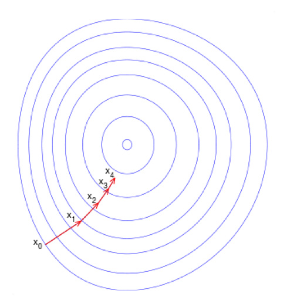

# 机器学习算法 - 逻辑回归

Logistic Regression 是 `the chosen one`，在工业界有着相当广泛的民意基础和使用基础，也被研究得最为彻底。无论是广告点击率估计、内容推荐、信用评分卡，还是各种各样的其他领域，你总能清楚或是依稀地看到它的身影。其原因除了它招牌的“可解释性”，“可调试性”外，其实我们从数学上还可以看到很多数学之美发生在它身上，而我们总是偏爱那些美的东西。

## Problem Modeling

Logistic regression is a **discriminative** model.

$$\begin{align*}
&p(y=1|x;\theta) = g(\theta^{T}x) = \dfrac{1}{1+e^{-\theta^{T}x}}
\end{align*}$$

对应的曲线为：

可以看到曲线呈 S 型，所以也叫 `sigmoid` 曲线。

## Evaluation Function

估计方法采用最大似然估计（Maximum Likelihood Estimation）。

$$L(\theta) = \prod{p(y|x;\theta)}=\prod{g(\theta^{T}x)^{y}(1-g(\theta^{T}x))^{1-y}}$$

取对数有：

$$l(\theta) = \sum{[ylog(g(\theta^{T}x)) + (1-y)log(1-g(\theta^{T}x))}]$$

取负数变成损失函数，有：

$$J(\theta) = -\dfrac{1}{N}l(\theta)$$

有没有觉得 $J(\theta)$ 很熟悉？是的！他就是 `log loss`，也叫 `cross entropy loss`。 在 logistic regression 里，最大似然估计等价于 `log loss` 估计。世界处处充满惊喜！

## Model Visualization

$p(y=1|x) \geq \dfrac{1}{m}$ 判为 1。 有：

$$\begin{align*}
&1+e^{-\theta^{T}x} \leq m \\
& \theta^{T}x \geq -log(m-1)
\end{align*}$$

Aha! This is a linear classifier.

## Solver

### Batch Solver

#### L2 Regulator

$$J(\theta) =  -\dfrac{1}{N}\sum_{i=1}^{N}{[y_i log(g(\theta^{T}x_i)) + (1-y_i) log(1-g(\theta^{T}x_i))}] + \lambda \sum_{j=1}^{M}\theta_j^2$$

##### Gradient Decent

$$\begin{align*}
\dfrac{\partial{J(\theta)}}{\partial{\theta}} &= -\dfrac{1}{N} \sum_{i=1}^{N} [y_i \dfrac{1}{g(\theta^{T}x_i)}g'(\theta^{T}x_i) - (1-y_i) \dfrac{1}{(1-g(\theta^{T}x_i))}g'(\theta^{T}x_i) ] + 2\lambda \sum_{j=1}^{M}\theta_j\\
    &= -\dfrac{1}{N} \sum_{i=1}^{N} [y_i \dfrac{1}{g(\theta^{T}x_i)} - (1-y_i) \dfrac{1}{(1-g(\theta^{T}x_i))} ] g'(\theta^{T}x_i) + 2\lambda \sum_{j=1}^{M}\theta_j \\
    &= -\dfrac{1}{N} \sum_{i=1}^{N} [y_i \dfrac{1}{g(\theta^{T}x_i)} - (1-y_i) \dfrac{1}{(1-g(\theta^{T}x_i))} ] g(\theta^{T}x_i) (1-g(\theta^{T}x_i)) \dfrac{\partial{(\theta^T x)}}{\partial{\theta}}+ 2\lambda \sum_{j=1}^{M}\theta_j \\
    &= -\dfrac{1}{N} \sum_{i=1}^{N} [y_i - g(\theta^{T}x_i)]  \dfrac{\partial{(\theta^T x)}}{\partial{\theta}} + 2\lambda \sum_{j=1}^{M}\theta_j
 \end{align*}$$
 
 最终有：
 
 $$\dfrac{\partial{J(\theta)}}{\partial{\theta_j}} = [\dfrac{1}{N} \sum_{i=1}^{N} (g(\theta^{T}x_i)- y_i ) x_i^j] + 2\lambda \theta_j $$
 
 梯度下降法沿着负梯度方向，以一定的步长（learning rate，$\alpha$）求解模型。
 
 $$\theta_j^{(t+1)} = \theta_j^{(t)} -\alpha ( [\dfrac{1}{N} \sum_{i=1}^{N} (g(\theta^{T}x_i)- y_i ) x_i^j] + 2\lambda \theta_j)$$
 
 

#### L1 Regulator

$$J(\theta) =  -\dfrac{1}{N}\sum_{i=1}^{N}{[y_ig(\theta^{T}x_i) + (1-y_i)(1-g(\theta^{T}x_i))}] + \lambda \sum_{j=1}^{M}|\theta_j|$$

L1 正则化得到的系数更稀疏。其固有的特征选择效果，使得它成为很多大规模机器学习算法的选择。但 L1 要解决的问题是局部不可导问题。

### Online Solver

#### Stochastic Gradient Decent

每次拿一个样本的 `loss` 去更新参数。这边的 `1` 也可以变成 `K`，这就变成了 deep learning 里的 mini-batch。

$$\theta_j^{(t+1)} = \theta_j^{(t)} -\alpha [(g(\theta^{T}x_i)- y_i ) x_i^j+ 2\lambda \theta_j]$$

## Non-linearity

线性分类器只能处理线性可分或近似线性的数据，但实际上有很多数据是非线性可分的。怎么办？

#### 数值型
- $log(x)$，$loglog(x)$
- $a^x$
- $x^a$
- GBDT

#### 类别型

- FM（Factorization Machine）
- FFM（Field-aware Factorization Machine）
- 频繁项集
- GBDT

#### 顺序型
- 隶属函数

整个流程，我们可以用下面的图来表示：

我们看这个图其实是跟 `ANN` 是一样的。区别在于 `ANN` 找到了一个`线性函数 + 非线性激活函数`进行 `feature engineering` 的方法，而且 `ANN` 的 `feature engineering` 是自动化的。而 `LR` 使用的是`非线性变换 + 特征组合`的方法。这个过程在很长一段时间内是由机器学习工程师手工完成的，非常痛苦而且非常依赖于工程师的能力和领域知识。后面开始引入半自动的方法如 `GBDT/FM` 来做特征工程，大大改善了这种情况。那么，问题来了，有没有完全自动的方法呢？有！最近 Facebook 提出了一种基于"特征组合"的树形自动 feature engineering 的方法。

## Multi-Class Classifier

上面介绍的都是二分类问题，那如果是多分类怎么办呢。

### 1 vs rest
如果这 `K` 个类并不互斥，比如说买手机的用户并不排除会买手表，这个时候就要对每个类训练一个 logistic regression 模型来满足这个需求。

### 1 vs 1
还有一种场景，那就是 `K` 个类是互斥的，比如说你是青年就不可能是少年，中年或者老年。这种时候我们一般使用 SoftMax 来做。

$$p(y=i|x;\theta) = \dfrac{e^{\theta_i^{T}x}}{\sum_{j=0}^{K}{e^{\theta_j^{T}x}}}$$

## One More Thing!

判别模型和生成模型的完美相遇！

我们从另一个角度推导：
$$\begin{align*}
&log{\dfrac{p(y=1|x)}{p(y=0|x)}} \\
& = log{\dfrac{p(x|y=1)p(y=1)}{p(x|y=0)p(y=0)}}  \\
& = log{\dfrac{p(x|y=1)}{p(x|y=0)}}  + log{\dfrac{p(y=1)}{p(y=0)}}  
\end{align*}$$

假设 $y$ 的先验服从二项分布，$p(x|y)$ 服从高斯分布，这个模型有个学名 Gaussian Naive Bayes。 有：

$$\begin{align*}
&log{\dfrac{p(y=1|x)}{p(y=0|x)}} \\
& = log{\dfrac{p(x|y=1)}{p(x|y=0)}}  + log{\dfrac{p(y=1)}{p(y=0)}} \\
& = -\dfrac{(x-\mu_1)^2}{2\sigma_1^2} + \dfrac{(x-\mu_0)^2}{2\sigma_0^2} + \theta_0
\end{align*}$$

再假设 $\sigma_0 = \sigma_1$，则有：

$$log{\dfrac{p(y=1|x)}{p(y=0|x)}} = \theta^Tx$$

即

$$\begin{align*}
&p(y=1|x;\theta) = \dfrac{1}{1+e^{-\theta^{T}x}}
\end{align*}$$

也就是说 logistic regression 在形式上等价于方差相同的 GNB 生成模型。完美！

[1] http://blog.jobbole.com/88521/

[2] http://www.meihua.info/a/65329

[3] http://www.cnblogs.com/EE-NovRain/p/3810737.html

[4] http://www.lxway.com/5240162.htm

[5] http://blog.csdn.net/starzhou/article/details/51769561

[6] http://www.cnblogs.com/joneswood/archive/2012/03/11/2390529.html

[7] http://blog.csdn.net/starzhou/article/details/51769484

[8] http://blog.csdn.net/pakko/article/details/37878837

[9] http://blog.csdn.net/abcjennifer/article/details/7716281

[10] Scalable Training of L1-Regularized Log-Linear Models

[11] 冯扬 在线最优化求解(Online Optimization)

*写于 2016 年 10 月*