# 以大底库全库向量召回为例谈 Profiling 驱动的性能优化

> 天下难事必作于易，天下大事必作于细。是以圣人终不为大，故能成其大。 - 《道德经》

## 问题
- **Problem**
	- **kNN(k Nearest Neighbor) 定义**
    
        给定一个查询向量，按照某个选定的准则（如点积距离），从底库中选择 $k$ 个与查询向量最相似或者最邻近的向量的过程。
	- **输入**
	  - 查询向量（query）: $x \in \mathbb{R}^{d}$
	  - 底库(database): $Y = \{y_1, y_2, ...,y_{i}\}$，其中$y_{i} \in \mathbb{R}^{d}$
	- **输出**
	  - 底库中与查询向量**点积**相似度最大的 $k$ 个向量：
	    $$x_k := \underset{i \in [1, n]}{arg \ maxk} <x, y_{i}>, k \in [1, K]$$
  - **算法**
	  - Exhaustive Search, 穷搜
 
- **用例**

    只考虑 IP 计算部分的单核性能，参数配置如下：
	| 参数 | 配置 |
	| :---- | :------ |
	| query batch size（bs） | 32 |
	| 底库大小（n） | 1M 条向量 | 
	| 向量维度（d） | 128 |
	| 向量数据精度（precision） | FP32 |

- **代码**

    https://github.com/yao-matrix/mProto/tree/master/snippet/c/dp

## 实现

### [Impl #0] Naive
最朴素的实现就是循环计算每个 query 向量与底库中每个向量的内积。实现如下：
``` cpp
// 例程
for (size_t i = 0; i < bs; i++) {
    for (size_t j = 0; j < base_vec_num; j++) {
        dotp_naive(query + i * vec_dim, base + j * vec_dim, 
                   vec_dim, &scores[i * base_vec_num + j]);
     }
}

// 子例程
static void dotp_naive(const float *lhs, const float *rhs, size_t dim, float *score) {
    float res = 0;
    for (size_t i = 0; i < dim; i++) {
        res += lhs[i] * rhs[i];
    }
    *score = res;
    return;
}
```
性能显然是不好的，在至强 `CascadeLake 8269C` 上单核平均每 batch 需要 `5426.046ms`。
祭出 VTune 大法后，得到如下的 TMAM（Top-down Micro-architecture Analysis Method）分布。

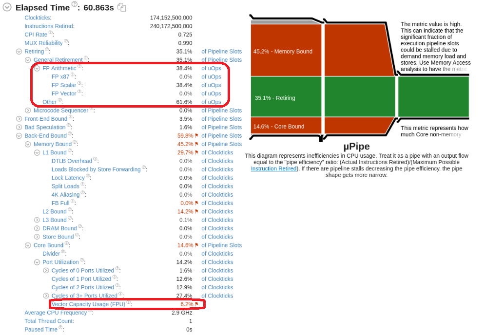

看到这个 TMAM 图的时候，一定要先按捺住自己想去拯救 `Memory Bound` 那一片红海的冲动。优化的过程中，要牢牢守住“先计算后数据”的初心，因为数据往往是可以配合计算的，所以首先是要把计算这跟柱子立牢了，然后在这个基础上做数据优化。

计算优化的第一步是看 `SIMD` 有没有被用上：

- 我们看到整个 workload 的 `Retiring` 的指令中，有 `38.4%` 是 `FP Arithmetic`，即浮点算术指令，而这些操作目前全部都是标量实现的，没有 `SIMD 化`。

- 同时，通过 `Vector Capacity Usage(FPU)` 的利用率 `6.2%` 也可以看出 CPU 的向量计算能力没有被充分利用。

所以，虽然现在是 `Memory Bound`，但我们还是不能“头疼医头，脚疼医脚”，而是应该先做向量化的优化，再来分析。

### [Impl #1] AVX2 Vectorization
使用 `AVX2` 来向量化 IP 运算，其余保持不变。代码如下：
``` cpp
// 例程
for (size_t i = 0; i < bs; i++) {
    for (size_t j = 0; j < base_vec_num; j++) {
        dotp_avx2(query + i * vec_dim, base + j * vec_dim,
                  vec_dim, &scores[i * base_vec_num + j]);
     }
}

// 子例程
void dotp_avx2(const float *lhs, const float *rhs, size_t size, float *score) {
    __m256 ymm_sum0 = _mm256_setzero_ps();
    __m256 ymm_sum1 = _mm256_setzero_ps();

    for (size_t i = 0; i < size; i += 16) {
        ymm_sum0 = _mm256_fmadd_ps(_mm256_loadu_ps(lhs + i),
                                   _mm256_loadu_ps(rhs + i),
                                   ymm_sum0);
        ymm_sum1 = _mm256_fmadd_ps(_mm256_loadu_ps(lhs + i + 8), 
                                   _mm256_loadu_ps(rhs + i + 8),
                                   ymm_sum1);
    }
    *score = horizontal_add_v256(_mm256_add_ps(ymm_sum0, ymm_sum1));
    return;
}

static inline float horizontal_add_v256(__m256 v) {
    __m256 x1 = _mm256_hadd_ps(v, v);
    __m256 x2 = _mm256_hadd_ps(x1, x1);
    __m128 x3 = _mm256_extractf128_ps(x2, 1);
    __m128 x4 = _mm_add_ss(_mm256_castps256_ps128(x2), x3);

    return _mm_cvtss_f32(x4);
}
```
`AVX2` 向量化带来了性能提升，在至强 `CascadeLake 8269C` 上单核平均每 batch 延时下降到了 `2143.29ms`。

同样，我们把 VTune 的 TMAM 数据拉出来端详端详。可以看到这下 `FP Arithmetic` 都落到 `FP Vector` 上了，同时 `Vector Capacity Usage` 也提高到 `48.8%`。只是 `Memory Bound` 更严重了，飙到了 `76.1%`。这时要做的，还是按捺住自己想要去优化数据部分的小心脏，继续看看还有没有计算优化的空间。一个自然的想法是：试试 `AVX512`。

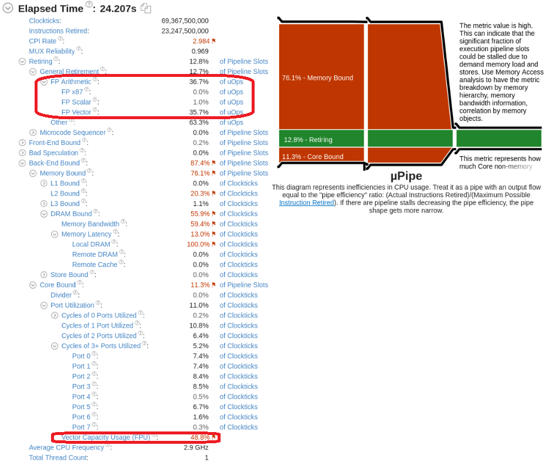

### [Impl #2] AVX512 Vectorization
使用 `AVX512` 来向量化 IP 运算，其余保持不变。代码如下：
``` cpp
// 例程
for (size_t i = 0; i < bs; i++) {
    for (size_t j = 0; j < base_vec_num; j++) {
        dotp_avx3(query + i * vec_dim, base + j * vec_dim,
                  vec_dim, &scores[i * base_vec_num + j]);
    }
}

// 子例程
void dotp_avx3(const float *lhs, const float *rhs, size_t dim, float *score) {
    __m512 zmm_sum0 = _mm512_setzero_ps();
    __m512 zmm_sum1 = _mm512_setzero_ps();

    for (size_t i = 0; i < dim; i += 32) {
        zmm_sum0 = _mm512_fmadd_ps(_mm512_loadu_ps(lhs + i),
                                   _mm512_loadu_ps(rhs + i), zmm_sum0);
        zmm_sum1 = _mm512_fmadd_ps(_mm512_loadu_ps(lhs + i + 16), 
                                   _mm512_loadu_ps(rhs + i + 16), zmm_sum1);
    }
    *score = horizontal_add_v512(_mm512_add_ps(zmm_sum0, zmm_sum1));
    return;
}

static inline float horizontal_add_v512(__m512 v) {
    __m256 low = _mm512_castps512_ps256(v);
    __m256 high = _mm256_castpd_ps(_mm512_extractf64x4_pd(
                                     _mm512_castps_pd(v), 1));

    return horizontal_add_v256(low + high);
}
```
跑下来， 单核平均每 batch 延时进一步下降到了 `1589.99ms`。上 TMAM，如下图。我们可以看到：
- 因为 `AVX512` 的指令位宽是 `AVX2` 的两倍，所以处理相同的 problem size 所需要的指令数大约是 `AVX2` 的一半。这个可以通过比较 `Instructions Retired` 得到验证。
- 一半的指令数的减少并没有等比反映到延时性能中，我们可以看到最终延时仅有 `25.8%` 的降低。这里面有两个原因：
	- `AVX512` 造成了 CPU 的降频，从 `Average CPU Frequency` 可以看到在 `AVX512` 实现中频率从 `AVX2` 时的 `2.9GHz` 降到了 `2.5GHz`, 降了 `0.4GHz`。
	- `Memory Bound` 继续增大到了 `78.4%`， 数据瓶颈阻碍了 `AVX512` 的性能发挥。

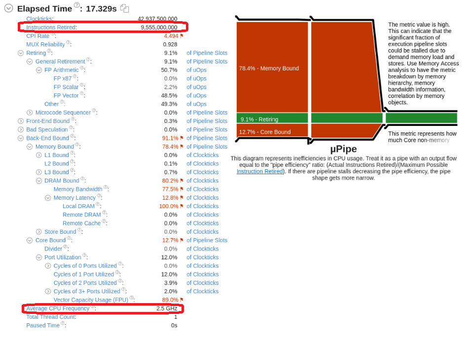

### [Impl #3] AVX512 Query Batching
到现在为止，基于 `SIMD` 的计算优化就告一段落了。我们可以把目光投向 `Memory Bound`。我们再仔细看一下 `Memory Bound` 的分布，可以看到几乎全部都 bound 到了 DRAM, L1/L2/L3 cache 事实上失去了作用。

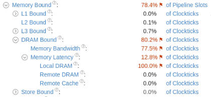

出现这个状况也是可解释的，我们目前的实现方案可以用下图表示。外层是 query 循环，内层是底库循环，而且 query 的向量数是远小于底库的向量数的。我们可以从局部性的角度来打量 query 和数据库向量在本计算方案中的情况：
- query 向量：有很好的空间局部性和时间局部性，query 会连续与底库中每个向量计算，cache hierarchy 能够很好地 amortize 掉 memory read 的 overhead。
- db 向量：有很好的空间局部性，为 `SIMD` 的使用奠定基础。但时间局部性非常差，每个向量被使用一次后，下一次使用就是在底库被全库遍历后再回到该向量的时候了，而底库又非常大，所以下一次使用的时候仍能命中 cache 的可能性为 0。 因此，在 cache behavior 上来讲变成了一个 streaming 数据，击穿了 cache 体系。

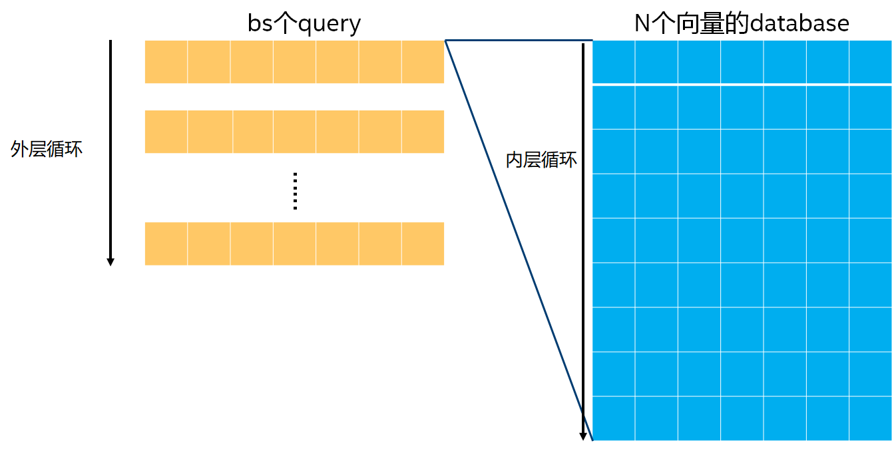

所以为了降低 `Memory Bound`，主要需要考虑如何提高 db 向量的时间局部性。一个自然的想法就是交换内外层循环。这样，每个 db 向量 `load` 进来后都会被使用多次，而不是像以前那样只有一次，这些计算 amortize 了一次 db 向量的 memory read overhead，减少了 DRAM 的 access。这里只有一个问题，交换循环后 query 的时间局部性会不会被牺牲掉？在这个问题中，我们算一下 query 总共需要 $bs * dim * 4 = 32 * 128 * 4 = 16 KB$ 数据，而一个 db 向量需要 $128 * 4 = 512 B$, 两个加起来小于 L1 DCache 的 size 32KB，所以 query 的 cache 局部性不会被牺牲掉。

代码如下：
```cpp
// 例程
for (size_t i = 0; i < base_vec_num; i++) {
    dotp_avx3_qb(query, base + i * vec_dim, bs, vec_dim, scores + i * bs);
}

// 子例程（`memalign` 的部分在正式实现时需要移到初始化 API 中，并在 destroy 代码中 `free` 内存。这里为简化代码忽略内存泄漏，不影响性能结论）
void dotp_avx3_qb(const float *query, const float *base, size_t bs, size_t dim, float *scores) {
    static __m512 *zmm_sum0 = NULL;
    static __m512 *zmm_sum1 = NULL;
 
    if (zmm_sum0 == NULL) {
        zmm_sum0 = (__m512*)memalign(64, 2 * bs * sizeof(__m512));
        zmm_sum1 = zmm_sum0 + bs;
    }
    memset(zmm_sum0, 0, 2 * bs * sizeof(__m512));

    __m512 v_base0, v_base1;
    __m512 v_q0, v_q1;

    for (size_t i = 0; i < dim; i += 32) {
        v_base0 = _mm512_loadu_ps(base + i);
        v_base1 = _mm512_loadu_ps(base + i + 16);

        for (size_t j = 0; j < bs; j++) {    
            v_q0 = _mm512_loadu_ps(query + j * dim + i);
            v_q1 = _mm512_loadu_ps(query + j * dim + i + 16);

            zmm_sum0[j] = _mm512_fmadd_ps(v_base0, v_q0, zmm_sum0[j]);
            zmm_sum1[j] = _mm512_fmadd_ps(v_base1, v_q1, zmm_sum1[j]);
        }
    }

    for (size_t j = 0; j < bs; j++) {
        scores[j] = horizontal_add_v512(
                        _mm512_add_ps(zmm_sum0[j], zmm_sum1[j]));
    }

    // free(zmm_sum0);
    // zmm_sum0 = NULL;

    return;
}
```
单核平均每 batch 延时进一步从 `1589.99ms` 下降到了 `348.05ms`，性能提升了约 `3.5` 倍。这个时候再看一下 VTune。

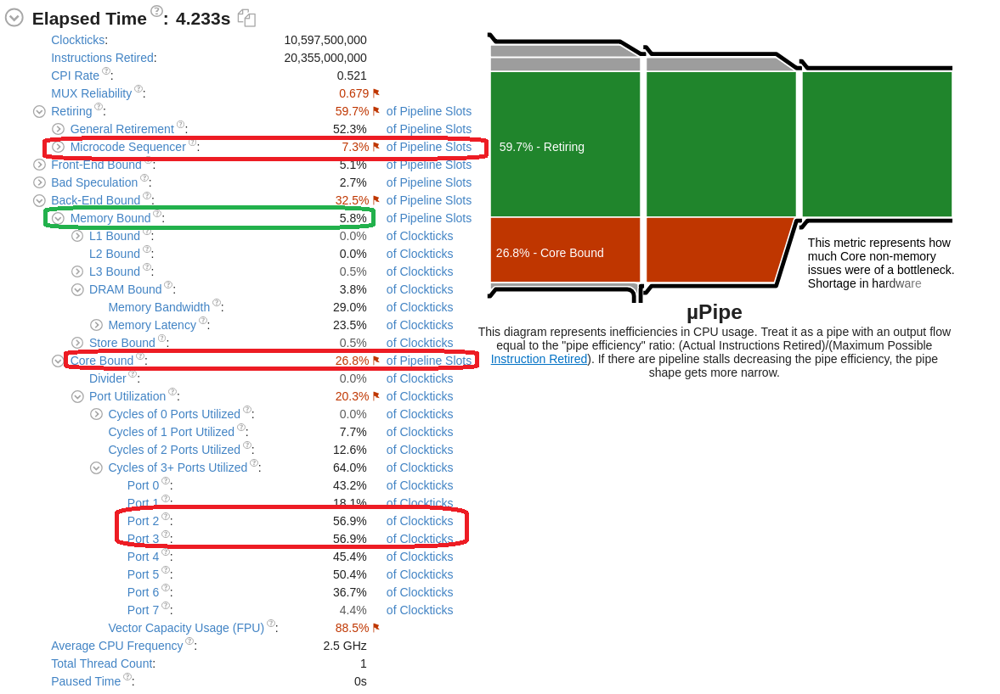

这是一个非常有趣的 VTune TMAM。首先看到如我们所料，我们通过增加 db 向量的时间局部性大幅降低了系统的 `Memory Bound`(`78.4%` -> `5.8%`)，基本达到我们的目的。进一步分析，可以发现
- 系统的热点转移到了 `Core Bound`, 各 `port` 都有比较大的压力，特别是 `Port 2` 和 `Port 3` 这两个压力最大, 从下面的微架构图中可以看出这两个端口是 `Load/Store` 数据的端口，说明数据读压力还是较大，只不过这次压力从数据源（内存 / Cache 体系）转移到了读数据的端口。

    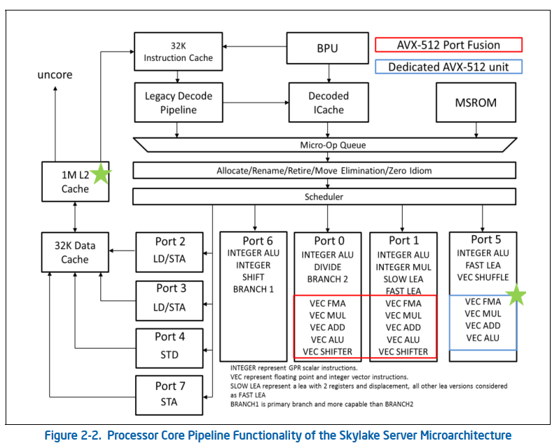

- `Microcode Sequencer` 的 bound 效应开始显现。这个主要还是来自于我们计算方案中使用的 `hadd` 指令。下表给出了 `hadd` 指令的 `uOP` 数和 `port` 使用情况。

    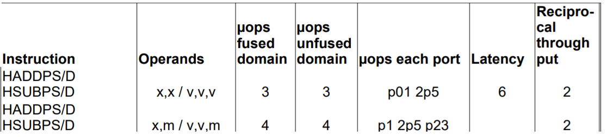

### [Impl #4] AVX512 Block 计算
沿着上一节的分析，我们思考有没有办法降低 core 的 `port` 的压力，并减少 `Micro Sequencer` 的触发率。

我们目前的计算方案，是每次**直接**计算一对 vector 的 IP。以 `vector dimension 8` 为例，具体方案如下。从中我们可以看出，计算的冗余度比较大，从第二个 `hadd` 开始，有一半或以上的计算结果都不会被最终结果用到，形成了一种“无效向量化”的效果，而且 `hadd` 指令的加入也使得 `Micro Sequencer` 加入了指令的 issue，拖慢了运行的效率。

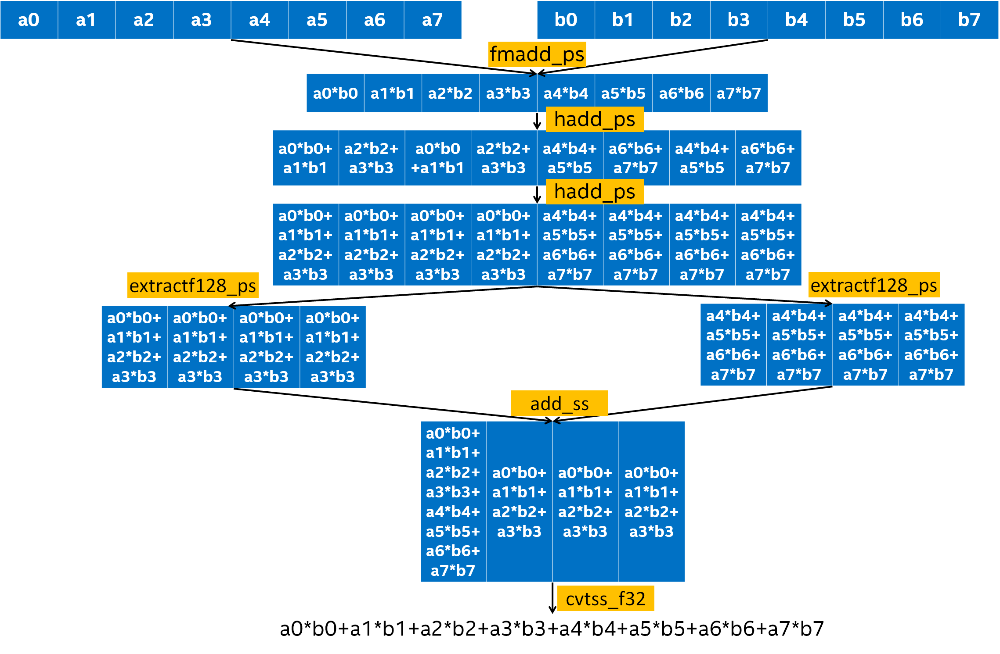

**Block 优化**可以消除计算冗余度，同时消除 `hadd` 指令的使用。想法很简单，把 `1 v 1` 的向量计算，变成 `1 v N` 的向量计算，这里 `N` 需要取一个 `AVX512` 寄存器里能保存的 `float` 数的个数，也就是 `16`。具体如下：

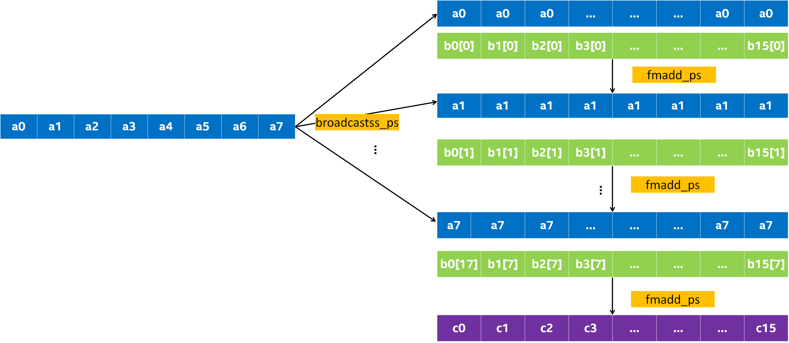

按数据库中 `16` 条向量来算：从指令数上来讲，直接法需要 $7 * 16=112$ 条指令，而 block 优化需要 $2 * 8 = 16$ 条指令，指令数大大降低了，而且也消除了 `hadd`。但是 Block 优化需要增加一个额外的操作，就是每 `16` 行 db 向量需要做一个转置，这个可以在数据库初始化的时候一次性做掉就可以了，不需要每次都做，所以这个时间是可以不算的。

下面给出实现：
``` cpp
// 例程
for (size_t i = 0; i < base_vec_num; i += 16) {
    dotp_avx3_block(query, base + i * vec_dim, bs, vec_dim, scores + i * bs);
}

// 子例程
static inline __m512 _mm512_extload_ps(float const* daddr) {
    __m128 d = _mm_load_ps(daddr);
    return _mm512_broadcastss_ps(d);
}

void dotp_avx3_block(const float *query, const float *base, size_t bs, size_t dim, float *scores) {
    static __m512 *zmm_sum0 = NULL;
    if (zmm_sum0 == NULL) {
        zmm_sum0 = (__m512*)memalign(64, bs * sizeof(__m512));
    }
    memset(zmm_sum0, 0, 2 * bs * sizeof(__m512));
   
    __m512 v_base0;
    __m512 v_q0, v_q1;

    for (size_t i = 0; i < dim; i += 1) {
        v_base0 = _mm512_loadu_ps(base + i * 16);

        for (size_t j = 0; j < bs; j += 2) {
            v_q0 = _mm512_extload_ps(query + j * dim + i);
            v_q1 = _mm512_extload_ps(query + (j + 1) * dim + i);

            zmm_sum0[j]     = _mm512_fmadd_ps(v_base0, 
                                              v_q0, zmm_sum0[j]);
            zmm_sum0[j + 1] = _mm512_fmadd_ps(v_base0,
                                              v_q1, zmm_sum0[j + 1]);
        }
         _mm_prefetch(base + (i + 1) * 16, _MM_HINT_T0);
    }

    for (size_t j = 0; j < bs; j++) {
        _mm512_store_ps(scores + j * 16, zmm_sum0[j]); 
   }

    // free(zmm_sum0);
    // zmm_sum0 = NULL;
    return;
}
```
跑下来，单核平均每 batch 延时进一步从 `348.05ms` 下降到了 `206.53ms`， 性能提升了约 `1.7` 倍。再看一下 VTune。可以看到 `Port 2`、`Port 3` 的压力下降了，`Micro Sequencer` 的热点也不见了，`FPU` 的利用率也达到了 `100%`。另外观察到两个现象：
- 数据 access 端口压力还是最大，包括 `Port 2`, `Port 3`, `Port 4`。尤其是 `Port 4` 是 `store` 端口，与 `Back-End Bound` 里面的 `Store Bound` 是相互映证的。目前还没有想到好的办法缓解。
- `L2 Bound` 比较 significant, 另有 `3.7%` 的 `DRAM     Bound`, 可以再试试 `prefetch` 能不能有帮助。

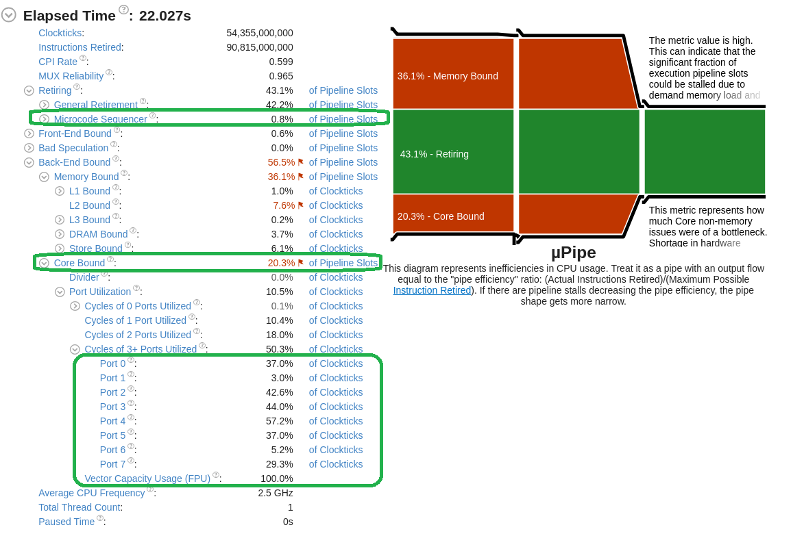

下面试一下 prefetch，代码如下:

``` cpp
// 子例程
void dotp_avx3_block(const float *query, const float *base, 
                     size_t bs, size_t dim, float *scores) {
    static __m512 *zmm_sum0 = NULL;
    if (zmm_sum0 == NULL) {
        zmm_sum0 = (__m512*)memalign(64, bs * sizeof(__m512));
    }
    memset(zmm_sum0, 0, 2 * bs * sizeof(__m512));
   
    __m512 v_base0;
    __m512 v_q0, v_q1;

    for (size_t i = 0; i < dim; i += 1) {
        v_base0 = _mm512_loadu_ps(base + i * 16);

        for (size_t j = 0; j < bs; j += 2) {
            v_q0 = _mm512_extload_ps(query + j * dim + i);
            v_q1 = _mm512_extload_ps(query + (j + 1) * dim + i);

            zmm_sum0[j]     = _mm512_fmadd_ps(v_base0, 
                                              v_q0, zmm_sum0[j]);
            zmm_sum0[j + 1] = _mm512_fmadd_ps(v_base0,
                                              v_q1, zmm_sum0[j + 1]);
        }
         _mm_prefetch(base + (i + 1) * 16, _MM_HINT_T0);
    }

    for (size_t j = 0; j < bs; j++) {
        _mm512_store_ps(scores + j * 16, zmm_sum0[j]); 
   }

    // free(zmm_sum0);
    // zmm_sum0 = NULL;
    return;
}
```
跑下来，单核平均每 batch 延时进一步从 `206.53ms` 下降到了 `195.78ms`，约 `5%` 的性能提升。这个 `prefetch` 是 `prefetch` 到 L1 的，从 TMAM 分析可以看到，`prefetch` 把 `DRAM Bound` 消除了，但对 `L2 Bound` 的部分并没有什么影响。

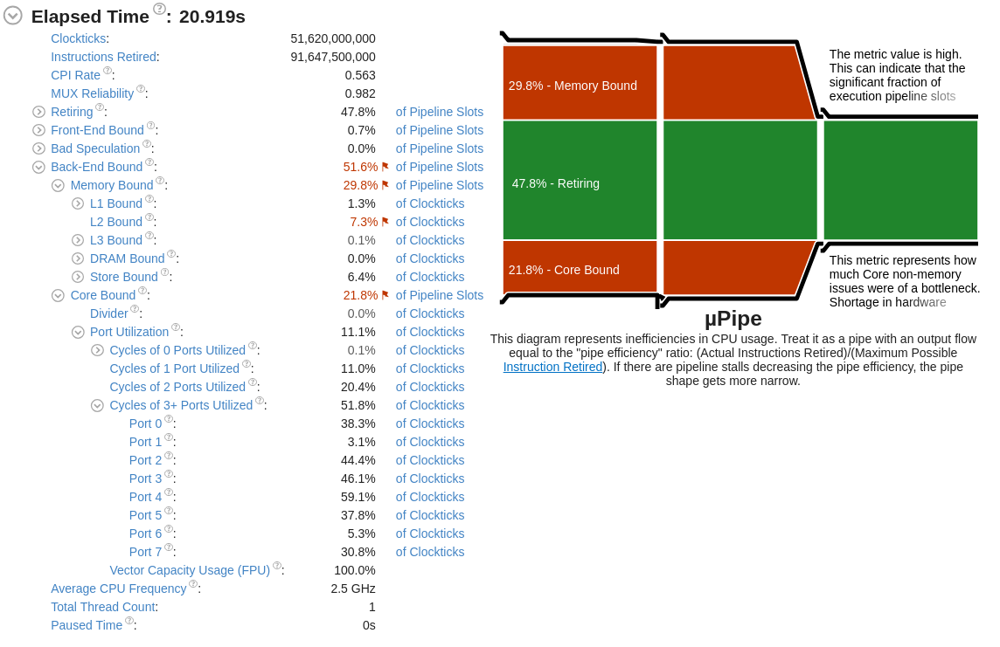

至此，优化基本告一段落。后面只有向硬件提需求了，如增大 L1 cache size, 增加 store port 等。

## 总结与思考
我们回顾这次优化之旅，效果还是比较显著的：

| 方案 | 单核 batch 延时（单位：ms） |
| :---- | :------ |
| Naive | 5426.046 |
| AVX2 Baseline | 2143.29 | 
| AVX512 Baselie | 1589.99 |
| AVX512 Query Batching| 348.05 |
| AVX512 Block | 206.53 |
| AVX512 Block + Prefetch | 195.78 |

一路下来，我们把单核 batch 延时从 `5426.046ms` 优化到了 `195.78ms`, 性能提升了 `27` 倍。

在优化过程中，我们也收获不少思考：
- 编译器自动向量化效率比较低。在 naive 算法中，我们在编译选项中已经开了 `native` 优化的选项，但从结果中我们可以看到，其向量化的效率并不理想，目前还是需要人工向量化。

- profiling 驱动优化是比较有效的优化方法。通过紧密结合 profiling 数据和对 workload 的理解，我们可以一步一步打磨 workload 和计算平台的适切性，从而获得较好的性能增益。

- 优化过程中要坚持“计算第一，数据配合”的原则，以计算优化为首要优先级，待计算优化稳定后再配合数据优化。

在本文中，我们对一个简单的问题进行了尝试，这是为了比较容易去说明 profiling 驱动的优化的过程，我们在实际工作的问题可能比这个更复杂，但主要方法论还是通用的。另外，这里只说明了单核优化的情况，对多核优化其实并未涉及，但个人认为只要在单核上把问题理解清楚了，多核扩展是相对比较自然的。

## Reference
1. [instruction tables](https://www.agner.org/optimize/instruction_tables.pdf)
2. [Intel® 64 and IA-32 Architectures Software Developer's Manual](https://software.intel.com/content/www/us/en/develop/download/intel-64-and-ia-32-architectures-sdm-combined-volumes-1-2a-2b-2c-2d-3a-3b-3c-3d-and-4.html)