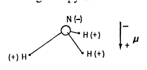

# More Is Different
Broken symmetry and the nature of the hierarchical structure of science
---

The reductionist hypothesis may still be a topic for controversy among philosophers, but among the great majority of active scientists I think it is accepted without question. The workings of our minds and bodies, and of all the animate or inanimate matter of which we have any detailed knowledges are assumed to be controlled by the same set o£ fundamental laws which except under certain extreme conditions we feel we know pretty well.

It seems inevitable to go on uncritically to what appears at first sight to be an obvious corollary of reductionism: that if everything obeys the same fundamental laws, then the only scientists who are studying anything really fundamental are those who are working on those laws. In practice, that amounts to some astrophysicists, some elementary particle physicists, some logicians and other mathematicians, and few others. This point of view, which it is the main purpose of this article to oppose, is expressed in a rather well-known passage by Weisskopf $^{[1]}$:

Looking at the development of science in the Twentieth Century one can distinguish two trends, which I will call "intensive" and "extensive" research, lacking a better terminology. In short: intensive research goes for the fundamental laws, extensive research goes for the explanation of phenomena in terms of known fundamental laws. As always, distinctions of this kind are not unambiguous, but they are clear in most cases. Solid state physics, plasma physics, and perhaps also biology are extensive. High energy physics and a good part of nuclear physics are intensive. There is always much less intensive research going on than extensive. Once new fundamental laws are discovered, a large and ever increasing activity begins in order to apply the discoveries to hitherto unexplained phenomena. Thus, there are two dimensions to basic research. The frontier of science extends all along a long line from the newest and most modern intensive research, over the extensive research recently spawned by the intensive research of yesterday, to the broad and well developed web of extensive research activities based on intensive research of past decades.

The effectiveness of this message may be indicated by the fact that I heard it quoted recently by a leader in the field of materials science, who urged the participants at a meeting dedicated to "fundamental problems in condensed matter physics" to accept that there were few or no such problems and that nothing was left but extensive science, which he seemed to equate with device engineering.

The main fallacy in this kind of thinking is that the reductionist hypothesis does not by any means imply a "constructionist" one: The ability to reduce everything to simple fundamental laws does not imply the ability to start from those laws and reconstruct the universe. In fact, the more the elementary particle physicists tell us about the nature of the fundamental laws, the less relevance they seem to have to the very real problems of the rest of science, much less to those of society. 

The constructionist hypothesis breaks down when confronted with the twin difficulties of scale and complexity. The behavior of large and complex aggregates of elementary particles, it turns out, is not to be understood in terms of a simple extrapolation of the properties of a few particles. Instead, at each level of complexity entirely new properties appear, and the understanding of the new behaviors requires research which I think is as fundamental in its nature as any other. That is, it seems to me that one may array the sciences roughly linearly in a hierarchy, according to the idea The elementary entities of science X obey the laws of science Y.

| X    | Y |
| -------- | ------- |
| solid state or many-body physics  | elementary particle physics |
| chemistry | many-body physics    |
| molecular biology    | chemistry    |
| cell biology   | molecular biology   |
| ...   | ...    |
| psychology   | physiology   |
| social sciences   | psychology   |

But this hierarchy does not imply that science X is "just applied Y". At each stage entirely new laws, concepts, and generalizations are necessary, requiring inspiration and creativity to just as great a degree as in the previous one. Psychology is not applied biology, nor is biology applied chemistry.

In my own field of many-body physics, we are, perhaps, closer to our fundamental, intensive underpinnings than in any other science in which nontrivial complexities occur, and as a result we have begun to formulate a general theory of just how this shift from quantitative to qualitative differentiation takes place. This formulation, called the theory of "broken symmetry," may be of help in making more generally clear the breakdown of the constructionist converse of reductionism. I will give an elementary and in-complete explanation of these ideas, and then go on to some more general speculative comments about analogies at other levels and about similar phenomena.

Before beginning this, I wish to sort out two possible sources of misunderstanding. First, when I speak of scale change causing fundamental change I do not mean the rather well-understood idea that phenomena at a new scale may obey actually different fundamental laws as, for example, general relativity is required on the cosmological scale and quantum mechanics on the atomic. I think it will be accepted that all ordinary matter obeys simple electrodynamics and quantum theory, and that really covers most of what I shall discuss. (As I said, we must all start with reductionism, which I fully accept.) A second source of confusion may be the fact that the concept of broken symmetry has been borrowed by the elementary particle physicists, but their use of the term is strictly an analogy, whether a deep or a specious one remaining to be understood.

Let me then start my discussion with an example on the simplest possible level, a natural one for me because I worked with it when I was a graduate student: the ammonia molecule. At that time everyone knew about ammonia and used it to calibrate his theory or his apparatus, and I was no exception. The chemists will tell you that ammonia "is" a triangular pyramid with the nitrogen negatively charged and the hydrogens positively charged, so that it has an electric dipole moment ($\mu$), negative toward the apex of the pyramid. Now this seemed very strange to me, because I was just being taught that nothing has an electric dipole moment. The professor was really proving that no nucleus has a dipole moment, because he was teaching nuclear physics, but as his arguments were based on the symmetry of space and time they should have been correct in general. 

I soon learned that, in fact, they were correct (or perhaps it would be more accurate to say not incorrect) because he had been careful to say that no stationary state of a system (that is, one which does not change in time) has an electric dipole moment. If ammonia starts out from the above unsymmetrical state, it will not stay in it very long. By means of quantum mechanical tunneling, the nitrogen can leak through the triangle of hydrogens to the other side, turning the pyramid inside out, and, in fact, it can do so very rapidly. This is the so-called "inversion", which occurs at a frequency of about $3 \time 10^{10}$ per second. A truly stationary state can only be an equal superposition of the unsymmetrical pyramid and its inverse. That mixture does not have a dipole moment. (I warn the reader again that I am greatly oversimplifying and refer him to the textbooks for details.) 

I will not go through the proof, but the result is that the state of the system, if it is to be stationary, must always have the same symmetry as the laws of motion which govern it. A reason may be put very simply: In quantum mechanics there is always a way, unless symmetry forbids, to get from one state to another. Thus, if we start from any one unsymmetrical state, the system will make transitions to others, so only by adding up all the possible unsymmetrical states in a symmetrical way can we get a stationary state. The symmetry involved in the case of ammonia is parity, the equivalence of left- and right-handed ways of looking at things.(The elementary particle experimentalists' discovery of certain violations of parity is not relevant to this question; those effects are too weak to affect ordinary matter.)

Having seen how the ammonia molecule satisfies our theorem that there is no dipole moment, we may look into other cases and, in particular, study progressively bigger systems to see whether the state and the symmetry are always related. There are other similar pyramidal molecules, made of heavier atoms. Hydrogen phosphide, $PH_{3}$, which is twice as heavy as ammonia, inverts, but at one-tenth the ammonia frequency. Phosphorus trifluoride, $PF_{3}$, in which the much heavier fluorine is substituted for hydrogen, is not observed to invert at a measurable rate, although theoretically one can be sure that a state prepared in one orientation would invert in a reasonable time.

We may then go on to more complicated molecules? such as sugar, with about 40 atoms. For these it no longer makes any sense to expect the molecule to invert itself. Every sugar molecule made by a living organism is spiral in the same sense, and they never inverts either by quantum mechanical tunneling or even under thermal agitation at normal temperatures. At this point we must forget about the possibility of inversion and ignore the parity symmetry: the symmetry laws have been, not repealed, but broken. 

If, on the other hand, we synthesize our sugar molecules by a chemical reaction more or less in thermal equilibrium, we will find that there are not, on the average, more left- than right- handed ones or vice versa. In the absence of anything more complicated than a collection of free molecules, the symmetry laws are never broken, on the average. We needed living matter to produce an actual unsymmetry in the populations. 

In really large, but still inanimate, aggregates of atoms, quite a different kind of broken symmetry can occur, again leading to a net dipole moment or to a net optical rotating power, or both. Many crystals have a net dipole moment in each elementary unit cell(pyroelectricity), and in some this moment can be reversed by an electric field (ferroelectricity). This asymmetry is a spontaneous effect of the crystal's seeking its lowest energy state. Of course, the state with the opposite moment also exists and has, by symmetry, just the same energy, but the system is so large that no thermal or quantum mechanical force can cause a conversion of one to the other in a finite time compared to, say, the age of the universe.

There are at least three inferences to be drawn from this. One is that symmetry is of great importance in physics. By symmetry we mean the existence of different viewpoints from which the system appears the same. It is only slightly overstating the case to say that physics is the study of symmetry. The first demonstration of the power of this idea may have been by Newton, who may have asked himself the question: What if the matter here in my hand obeys the same laws as that up in the sky, that is, what if space and matter are homogeneous and isotropic?

The second inference is that the internal structure of a piece of matter need not be symmetrical even if the total state of it is. I would challenge you to start from the fundamental laws of quantum mechanics and predict the ammonia inversion and its easily observable properties without going through the stage of using the unsymmetrical pyramidal structure, even though no "state" ever has that structure. It is fascinating that it was not until a couple of decades ago $^{[2]}$ that nuclear physicists stopped thinking of the nucleus as a featureless, symmetrical little ball and realized that while it really never has a dipole moment, it can become football-shaped or plate-shaped. This has observable consequences in the reactions and excitation spectra that are studied in nuclear physics, even though it is much more difficult to demonstrate directly than the ammonia inversion. In my opinion, whether or not one calls this intensive research it is as fundamental in nature as many things one might so label. But it needed no new knowledge of fundamental laws and would have been extremely difficult to derive synthetically from those laws; it was simply an inspirations based, to be sure on everyday intuition, which suddenly fitted everything together.

The basic reason why this result would have been difficult to derive is an important one for our further thinking. If the nucleus is sufficiently small there is no real way to define its shape rigorously: Three or four or ten particles whirling about each other do not define a rotating "plate" or "football". It is only as the nucleus is considered to be a many-body system - in what is often called the $N \to \infty$ limit - that such behavior is rigorously definable. We say to ourselves: A macroscopic body of that shape would have such-and-such a spectrum of rotational and vibrational excitations, completely different in nature from those which would characterize a featureless system. When we see such a spectrum even not so separated, and somewhat imperfect, we recognize that the nucleus is, after all, not macroscopic; it is merely approaching macroscopic behavior. Starting with the fundamental laws and a computer, we would have to do two impossible things - solve a problem with infinitely many bodies, and then apply the result to a finite system - before we synthesized this behavior.

A third insight is that the state of a really big system does not at all have to have the symmetry of the laws which govern it; in fact, it usually has less symmetry. The outstanding example of this is the crystal: Built from a substrate of atoms and space according to laws which express the perfect homogeneity of spaces the crystal suddenly and unpredictably displays an entirely new and very beautiful symmetry. The general rule, however, even in the case of the crystal, is that the large system is less symmetrical than the underlying structure would suggest: Symmetrical as it is, a crystal is less symmetrical than perfect homogeneity.

Perhaps in the case of crystals this appears to be merely an exercise in confusion. The regularity of crystals could be deduced semiempirically in the mid-19th century without - any complicated reasoning at all. But sometimes, as in the case of superconductivity, the new symmetry - now called broken symmetry because the original symmetry is no longer evident - may be of an entirely unexpected kind and extremely difficult to visualize. In the case of superconductivity, 30 years elapsed between the time when physicists were in possession of every fundamental law necessary for explaining it and the time when it was actually done. 

The phenomenon of superconductivity is the most spectacular example o£ the broken symmetries which ordinary macroscopic bodies undergo, but it is of course not the only one. Antiferromagnets, ferroelectrics, liquid crystals, and matter in many other states obey a certain rather general scheme of rules and ideas, which some many-body theorists refer to under the general heading of broken symmetry. I shall not further discuss the history, but give a bibliography at the end of this article $^{[3]}$. 

The essential idea is that in the so called $N \to \infty$ limit of large systems(on our own, macroscopic scale) it is not only convenient but essential to realize that matter will undergo mathematically sharp, singular "phase transitions" to states in which the microscopic symmetries, and even the microscopic equations of motion, are in a sense violated. The symmetry leaves behind as its expression only certain characteristic behaviors, for instance, long-wavelength vibrations, of which the familiar example is sound waves; or the unusual macroscopic conduction phenomena of the superconductor; or, in a very deep analogy, the very rigidity of crystal lattices, and thus of most solid matter. There is, of course, no question of the system's really violating, as opposed to breaking, the symmetry of space and time, but because its parts find it energetically more favorable to maintain certain fixed relationships with each other, the symmetry allows only the body as a whole to respond to external forces.

This leads to a "rigidity", which is also an apt description of superconductivity and superfluidity in spite of their apparent "fluid" behavior. [In the former case, London noted this aspect very early $^{[4]}$.] Actually, for a hypothetical gaseous but intelligent citizen of Jupiter or of a hydrogen cloud somewhere in the galactic center, the properties of ordinary crystals might well be a more baffling and intriguing puzzle than those of superfluid helium.

I do not mean to give the impression that all is settled. For instance, I think there are still fascinating questions of principle about glasses and other amorphous phases, which may reveal even more complex types of behavior. Nevertheless, the role of this type of broken symmetry in the properties of inert but macroscopic material bodies is now understood, at least in principle. In this case we can see how the whole becomes not only more than but very different from the sum of its parts.

The next order of business logically is to ask whether an even more complete destruction of the fundamental symmetries of space and time is possible and whether new phenomena then arise, intrinsically different from the "simple" phase transition representing a condensation into a less symmetric state.

We have already excluded the apparently unsymmetric cases of liquids, gases, and glasses. (In any real sense they are more symmetric.) It seems to me that the next stage is to consider the system which is regular but contains information. That is, it is regular in space in some sense so that it can be "read out", but it contains elements which can be varied from one "cell" to the next. An obvious example is DNA; in everyday life, a line of type or a movie film have the same structure. This type of "information-bearing crystallinity" seems to be essential to life. Whether the development of life requires any further breaking of symmetry is by no means clear.

Keeping on with the attempt to characterize types of broken symmetry which occur in living things, I find that at least one further phenomenon seems to be identifiable and either universal or remarkably common, namely, ordering(regularity or periodicity) in the time dimension. A number of theories of life processes have appeared in which regular pulsing in time plays an important role: theories of development, of growth and growth limitation, and of the memory. Temporal regularity is very commonly observed in living objects. It plays at least two kinds of roles. First, most methods of extracting energy from the environment in order to set up a continuing, quasi-stable process involve time-periodic machines, such as oscillators and generators, and the processes of life work in the same way. Second, temporal regularity is a means of handling information, similar to information-bearing spatial regularity. Human spoken language is an example, and it is noteworthy that all computing machines use temporal pulsing. A possible third role is suggested in some of the theories mentioned above: the use of phase relationships of temporal pulses to handle information and control the growth and development of cells and organisms $^{[5]}$.

In some sense, structure-functional structure in a teleological sense, as opposed to mere crystalline shape-must also be considered a stage, possibly intermediate between crystallinity and information strings, in the hierarchy of broken symmetries. 

To pile speculation on speculation, I would say that the next stage could be hierarchy or specialization of function, or both. At some point we have to stop talking about decreasing symmetry and start calling it increasing complication. Thus, with increasing complication at each stage, we go on up the hierarchy of the sciences. We expect to encounter fascinating and, I believe, very fundamental questions at each stage in fitting together less complicated pieces into the more complicated system and understanding the basically new types of behavior which can result.

There may well be no useful parallel to be drawn between the way in which complexity appears in the simplest cases of many-body theory and chemistry and the way it appears in the truly complex cultural and biological ones, except perhaps to say that, in general, the relationship between the system and its parts is intellectually a one-way street. Synthesis is expected to be all but impossible; analysis, on the other hand, may be not only possible but fruitful in all kinds of ways: Without an understanding of the broken symmetry in superconductivity, for instance, Josephson would probably not have discovered his effect [Another name for the Josephson effect is "macroscopic quantum-interference phenomena": interference effects observed between macroscopic wave functions of electrons in superconductors, or of helium atoms in superfluid liquid helium. These phenomena have already enormously extended the accuracy of electromagnetic measurements and can be expected to play a great role in future computers, among other possibilities, so that in the long run they may lead to some of the major technological achievements of this decade $^{[6]}$.] For another example, biology has certainly taken on a whole new aspect from the reduction of genetics to biochemistry and biophysics, which will have untold consequences. So it is not true, as a recent article would have it $^{[7]}$, that we each should "cultivate our own valley, and not attempt to build roads over the mountain ranges ... between the sciences." Rather, we should recognize that such roads, while often the quickest shortcut to another part of our own science, are not visible from the viewpoint of one science alone.

The arrogance of the particle physicist and his intensive research may be behind us (the discoverer of the positron said "the rest is chemistry"), but we have yet to recover from that of some molecular biologists, who seem determined to try to reduce everything about the human organism to "only" chemistry, from the common cold and all mental disease to the religious instinct. Surely there are more levels of organization between human ethology and DNA than there are between DNA and quantum electrodynamics, and each level can require a whole new conceptual structure.

In closing, I offer two examples from economics of what I hope to have said. Marx said that quantitative differences become qualitative ones, but a dialogue in Paris in the 1920's sums it up even more clearly:

FITZGERALD: The rich are different from us.
HEMINGWAY: Yes, they have more money.

## References
1. V. F. Weisskopf, in Brookhaven Nat. Lab. Ptlbl. 888T360 (1965). Also see Nuovo Cimento Suppl. Ser 1 4, 465 (1966); Phys. Today 20 (NO. 5), 23 (1967).
2. A. Bohr and B. R. Mottelson, Kgl. Dan. Yidensk. Selsk. Mat. Fys. Medd. 27, 16 (1953)
3. Broken symmetry and phase transitions: L.D. Landau, Phys. Z. Sowjetunion 11, 26, 542(1937). Broken symmetry and collective motion general: J. GoIdstone, A. Salam, S. Weinberg, Phys. Rev. 127, 965 (1962); P. W. Anderson, Concepts in Solids (Benjamin, New York, 1963), PP. 175-182; B. D. Josephson, thesis, Trinity College, Cambridge University (1962). Special cases: antiferromagnetism, P. W. Anderson, Phys. Rev. 86, 694 (1952); supery,ibid. 112, 1900 (1958); Y. Nambu, ibid. 117, 648 (1960).
4. F. London, Superfluids (Wiley, New York, 1950), YO1. 1.
5. M. H. Cohen, J. Theor. Biol. 31, 101 (1971).
6. J. Clarke, Amer. J. Phys. 38, 1075 (1969); P. W. Anderson, Phys. Today 23 (No. 11), 23 (1970).
7. A. B. Pippard, Reconciling Physics with Reality (Cambridge Univ. Press, London, 1972). 

> 英文原文: <url> https://www.tkm.kit.edu/downloads/TKM1_2011_more_is_different_PWA.pdf </url>
> 原文作者：P. W. Anderson
> 发表日期：1972 年 8 月 4 日
> 译者: Matrix Yao (姚伟峰) & 豆包