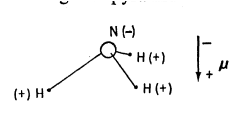

# 多者异也 —— 对称性破缺以及科学层级结构的本质

还原论假设或许在哲学领域尚有争议，但我认为，绝大多数活跃着的科学工作者都已广泛接受这一假设。我们假定，我们的思维和身体的运作，以及我们已知的所有有生命或无生命物质的运行，都是受同一套基本规律支配。除了某些极端条件外，我们自认为对这些规律已经相当了解。

人们似乎会自然而然、不加批判地得出一个乍一看是还原论明显推论的观点：如果万物都遵循相同的基本规律，那么真正在研究根本性问题的科学家就只有那些致力于探究这些规律的人了。实际上，这意味着只有一部分天体物理学家、一部分基本粒子物理学家、一部分逻辑学家以及一部分数学家等少数人在做这样的研究。我撰写本文的主要目的就是要反驳这种观点，这种观点在魏斯科普夫（Weisskopf）一段颇为著名的论述 $^{[1]}$ 中有所体现：

> “回顾 20 世纪科学的发展，人们可以看出两种趋势，由于缺乏更好的术语来描述，我将其称为**深入型研究**及**广泛型研究**。简而言之，深入型研究聚焦于基本规律，广泛型研究则利用已知的基本规律去解释各种现象。一如既往，这类区分并非绝对清晰，但在大多数情况下是明确的。固态物理学、等离子体物理学，或许还有生物学都属于广泛型研究的范畴。高能物理学以及核物理学的很大一部分属于深入型研究。一直以来，深入型研究的数量总是远少于广泛型研究。一旦新的基本规律被发现，为了将这些发现应用于此前无法解释的现象，大量且越来越多的研究活动就会铺开。因此，基础研究存在两个维度：科学前沿沿着一条长长的战线延伸，从最新、最前沿的深入型研究，到由最新的深入型研究催生的广泛型研究，再到基于过去几十年深入型研究发展而来的广泛且完善的研究网。”

这一观点影响深远，最近我还听说一位材料科学领域的领军人物引述了它，这位人士在一次讨论“凝聚态物理学基本问题”的会议上敦促与会者接受这样一个观点，即基本问题已寥寥无几甚至根本不存在了，剩下的只有广泛型科学。而且他似乎将广泛型科学等同于器件工程。

这种思维方式的主要谬误在于，还原论假说并不能推导出“构建论”假说：能够将一切事物还原为简单的基本规律，并不意味着可以仅用这些基本规律重构整个宇宙。事实上，基本粒子物理学家向我们揭示的基本规律越多，这些规律与其他科学领域中的现实问题的关联性似乎就越小，更不用说社科领域的问题了。

当面对规模和复杂性双重难题时，构建论假说就站不住脚了。事实证明，大量且复杂的基本粒子集合体的行为，不能通过对少数几种粒子性质的简单外推来理解。相反，在每个复杂性层次上都会出现全新的性质，而对这些新行为的理解需要新的研究，我认为这种研究在本质上与其他任何研究一样具有基础性。也就是说，在我看来，人们可以大致按照一种层级结构将各学科线性排列，依据的理念是：学科 `X` 的基本物质遵循学科 `Y` 的规律。

| 学科 X   | 学科 Y |
| :----: | :----: |
| 固态或多体物理学  | 基本粒子物理学 |
| 化学 | 多体物理学    |
| 分子生物学    | 化学    |
| 细胞生物学  | 分子生物学   |
| ...   | ...    |
| 心理学   | 生理学   |
| 社会科学   | 心理学   |

但这种层级结构并不意味着学科 `X` 只是学科 `Y` 的“应用”。在每个层级，全新的定律、概念和概括都是必不可少的，其所需的灵感和创造力丝毫不亚于上一层级。心理学并非应用生物学，生物学也不是应用化学。

在我所从事的多体物理学领域，相较于其他存在高复杂性的学科，我们或许更接近那些根本性的、深入的基础支撑，因此我们已经开始构建一个一般性理论，用以阐释这种从量变到质变的转变是如何发生的。我们将其称为“对称性破缺”理论，它或许有助于更普遍地阐明与还原论相对应的构建论的失效之处。我将对这些观点给出一个初步但不完善的解释，然后再就其他层面的类比以及类似现象进行一些更具普遍性和推测性的评论。

在开始论述之前，我希望先厘清两个可能的误解。首先，当我谈及尺度变化会导致根本性变化时，我并非指那种已被充分理解的观点，即新尺度下的现象可能遵循全然不同的基本定律，例如在宇宙尺度上需要广义相对论，而在原子尺度上需要量子力学。我认为大家普遍认可所有一般物质都遵循简单的电动力学和量子理论，而这实际上已涵盖了我要讨论的大部分内容（正如我所说，我们都必须从还原论出发，我完全接受还原论）；第二个可能会引起混淆的是，“对称性破缺” 这一概念已被基本粒子物理学家借用，但他们对该术语的使用，严格来说，只是一种类比，至于这种类比是深刻还是牵强，还有待讨论。

我们从一个最简单的例子开始讨论，这个例子对我来说很自然，因为我在读研究生时就研究过它，那就是氨分子（$NH_3$）。当时，大家都了解氨分子，并用它来校准自己的理论或实验仪器，我也不例外。化学家会告诉你，氨分子“是”一个三角锥形结构，氮原子带负电，氢原子带正电，所以它有电偶极矩（$\mu$），负电在锥顶。我当时觉得很奇怪，因为我学到的知识是任何物质都没有电偶极矩。我的教授当时实际上是在证明原子核没有偶极矩，因为他教的是核物理学，而且由于他的论证是基于时空对称性的，所以从一般意义上来说应该是正确的。

我很快了解到，实际上这两种表述都是正确的（或者更准确地说，并非不正确），因为我的教授很谨慎地指出，一个系统稳态（即不随时间变化的状态）时是没有电偶极矩的。如果氨分子从上述不对称状态出发，它不会长时间保持这种状态。通过量子力学隧穿效应，氮原子能够穿过由氢原子构成的三角形平面到达另一侧，从而将锥体结构翻转，而且实际上这个过程发生得非常快。这就是所谓的 “反转” 现象，其发生频率约为每秒 $3 \times 10^{10}$ 次。一个真正的稳态只能是这种不对称锥体及其反转状态的等权叠加。这种叠加态是没有偶极矩的。（再次提醒读者，这里我做了极大的简化，详情请参考教科书。）

我想不经证明直接给出结论：如果系统的状态要保持稳态，它必须始终具备与支配它的运动定律相同的对称性。这背后的原因可以简单解释为：在量子力学中，总有一种方法可以从一种状态转变到另一种状态，除非对称性禁止其转变。因此，如果我们从任何一个不对称状态出发，系统将会向其他状态转变，所以只有以对称的方式将所有可能的不对称状态叠加起来，我们才能得到稳态。氨分子所涉及的对称性是宇称，即从左手系和右手系两种视角看待事物的等价性（基本粒子实验学家所发现的某些宇称不守恒现象与这个问题无关，那些效应太微弱，不足以影响普通物质）。

了解了氨分子为何符合“不存在偶极矩”这一定理之后，我们可以研究其他情况，特别地，我们可以逐步考察更大的系统，看看状态和对称性是否总是相关的。还有其他类似的锥形分子，它们由更重的原子构成。磷化氢（$PH_{3}$）分子的质量是氨分子的两倍，它也会发生反转，但频率是氨分子的十分之一。三氟化磷（$PF_{3}$）分子中，用重得多的氟原子取代了氢原子，虽然理论上可以确定，处于某一取向的分子态会在合理时间内发生反转，但在可测量的速率下并未观测到它发生反转。

接着我们可以考察更复杂的分子，比如含有约 40 个原子的糖分子。对于这类分子，再去期望它们自身发生反转就毫无意义了。由生物体合成的每一个糖分子都具有相同的螺旋取向，而且无论是通过量子力学隧穿效应还是常温下的热扰动，它们都不会发生反转。在这一点上，我们必须抛开反转的可能性，也不用考虑宇称对称性了：对称性定律并没有被废除，而是被破缺了。

另一方面，如果我们通过大致处于热平衡状态的化学反应来合成糖分子，我们会发现，平均而言，左旋分子的数量并不比右旋分子多，反之亦然。自由分子集合体，在没有更复杂的因素影响它时，从平均意义上来讲，对称性定律永远不会破缺。我们需要有生命物质才能在分子数量上产生实际的不对称性。

但在庞大且无生命的原子集合体中，也会出现一种截然不同的对称性破缺，同样会导致净偶极矩或净旋光能力，或者两者兼具。许多晶体在每个基本晶胞中都有净偶极矩（热电性），而且在某些晶体中，这个偶极矩可以通过电场来反转（铁电性）。这种不对称性是晶体寻求最低能量状态时的一种自发效应。当然，具有相反偶极矩的状态也是存在的，并且根据对称性，其能量与现有状态相同，但由于系统规模如此之大，没有热或量子力学的作用力能够在有限时间（如宇宙的年龄）内将一种状态转变为另一种状态。

从这里至少可以得出三个推论。其一，对称性在物理学中至关重要。我们所说的对称性是指存在不同的观察视角，从这些视角看系统是相同的。可以毫不夸张地说，物理学就是对对称性的研究。这一思想的威力的首次证明可能是由牛顿作出的，或许，他曾问过自己这样一个问题：如果我手中的物质与天上的物质遵循同样的定律会怎样，也就是说，如果空间和物质是均匀且各向同性的会怎样？

第二个推论是，一块物质的内部结构不一定是对称的，即使它的整体状态是对称的。给你出个题，从量子力学的基本定律出发，在不借助不对称三角锥结构这个阶段的情况下，预测氨分子的反转及其可观测的性质，尽管实际上没有任何“状态”具有那种结构。有趣的是，直到几十年前 $^{[2]}$，核物理学家们才不再把原子核看作是一个没有特征、对称的小球体，并意识到，虽然原子核实际上永远没有偶极矩，但它可以变成橄榄球形或盘形。该理论可在核物理学中研究的反应和激发光谱中观测到，尽管要直接证明它比证明氨分子的反转要困难得多。在我看来，无论是否将其称为深入型研究，其在本质上与许多可以被这样称呼的研究一样基础。但它不需要新的基本定律知识，而且从这些定律出发进行综合推导也很难得出；它仅仅是一种基于日常直觉的灵感，突然之间就把所有的事情都联系起来了。

难以从基本定律推导出这个结果的根本原因对我们进一步的思考很重要。如果原子核足够小，就没有真正的方法来严格定义它的形状：三四个或十个相互绕转的粒子并不能定义一个旋转的 “盘” 或 “橄榄球”。只有当原子核被看作是一个多体系统（即 $N \to \infty$ ）时，这种行为才能被严格定义。我们可以这样想：具有那种形状的宏观物体会这样或那样转动以及振动从而激发光谱，其本质与无特征系统的光谱完全不同。当我们看到这样的光谱 —— 即使不是那么分明，还有些不完美（原子核毕竟不是宏观的，它只是在趋近宏观行为） —— 我们就会意识到它后面的结构。从基本定律和一台计算机出发，我们必须做两件不可能的事情 —— 解决一个包含无限多个物体的问题，然后将结果应用于一个有限的系统 —— 才能综合出这种行为。

第三个深刻见解是，一个真正的大系统的状态根本不必具备支配它的定律所具有的对称性，实际上，它通常对称性更低。最突出的例子就是晶体：晶体是根据完美的均匀性定律，由原子和间隙构成的，但它却突然且不可预测地展现出一种全新且非常美妙的对称性。然而，一般的规律是，即使在晶体的情况下，大系统的对称性也比其底层结构所暗含的要低：尽管晶体是对称的，但它的对称性比完美均匀性要低。

也许晶体的例子说服力比较弱。毕竟在 19 世纪中叶，无需任何复杂的推理，就可以半经验地推导出晶体的规则性。但有时，比如说超导现象，新的对称性 —— 现在被称为破缺对称性，因为原来的对称性不再明显 —— 可能是完全出乎意料的，而且极难想象。就超导现象而言，从物理学家掌握了所有解释它所需的基本定律到实际解释清楚，中间相隔了 30 年。

超导现象只是普通宏观物体对称性破缺最引人注意的例子，绝非唯一。反铁磁体、铁电体、液晶以及处于许多其他状态的物质都遵循这套相当普遍的规则和思想体系，一些多体理论学家将其统称为对称性破缺。这里，我就不再进一步讨论其历史，你可通过本文结尾的参考书目 $^{[3]}$ 进一步研究。

其基本思想是，在所谓的大系统（在我们自己的宏观尺度上）即 $N \to \infty$ 下，需要深刻认识到物质会经历数学上尖锐、奇异的 “相变”，转变为在某种意义上违背微观对称性甚至微观运动方程的状态。对称性仅以某些特征行为的形式留下其痕迹，例如长波长振动，我们熟悉的例子是声波；或者是超导体中不寻常的宏观导电现象；或者是晶体晶格的刚性，并延伸至大多数固体物质的刚性。当然，系统并不是真正违背了（与破缺相对）时空对称性，而是因为其各个部分发现彼此保持某些固定关系在能量上更有利，所以对称性只允许物体作为一个整体对外界力做出反应。

这就导致了一种“刚性”，尽管超导和超流现象表面上表现出“流体”行为，但这种“刚性”也是对它们的恰当描述（在超导的情况下，F. London 很早就注意到了这一点 $^{[4]}$）。实际上，假设木星上存在有智慧的气态居民，或者银河系中心某处氢云里存在居民，对他们而言，普通晶体的性质很可能比超流氦的性质更令人困惑和令人着迷。

我并不是想给人一种一切都已解决的错觉。例如，我认为关于玻璃和其他非晶态相，仍然存在一些迷人的原理性问题，这些问题可能会揭示出更复杂的行为类型。然而，至少在原则上，我们已经理解了此类对称性破缺对无生命的宏观物体的性质所起的作用。在这种情况下，我们可以看到整体不仅比其各部分之和更多，而且与之有很大的不同。

从逻辑上讲，接下来的任务是要问，是否有可能更彻底地破坏时空的基本对称性，以及是否会出现新的现象，这些现象在本质上与代表凝聚到较低对称状态的 “简单” 相变不同。

我们已经排除了液体、气体和玻璃这些明显的不对称情况（从任何实际意义上讲，它们的对称性已经比其他情况高了）。在我看来，下一个阶段是考虑规则但包含信息的系统。也就是说，其从某种意义上来讲在空间上是规则的，以便可以“读出”信息，但其包含的元素在不同的“单元”中可以变化。一个明显的例子是 DNA；在日常生活中，一行印刷文字或一卷电影胶片也有相同的结构。这种“承载信息的结晶性”似乎对生命至关重要。生命的发展是否需要进一步破缺对称性，这一点还远不清楚。

继续尝试描述生物中出现的破缺对称性类型时，我发现至少还有一种现象似乎是可以确定的，其即使不是普遍存在的，也是非常常见的，即时间维度上的有序性（规则性或周期性）。已经出现了许多生命过程理论，其中时间上的规则脉冲起着重要作用：发育理论、生长和生长限制理论以及记忆理论。在生物物体中，时间上的规则性非常普遍。它至少有两种作用。首先，大多数从环境中提取能量以建立持续、准稳定过程的方法都涉及时间周期性机制，如振荡器和发电机，生命过程也是以同样的方式运作的。其次，时间上的规则性是一种处理信息的方式，类似于承载信息的空间规则性。人类的口语就是一个例子，值得注意的是，所有计算机都使用时间脉冲。在上述的一些理论中还提出了可能的第三种作用：利用时间脉冲的相位关系来处理信息，并控制细胞和生物体的生长和发育 $^{[5]}$。

从某种意义上说，结构 —— 从目的论意义上的功能结构，而不仅仅是晶体形状 —— 也必须被视为破缺对称性层次结构中的一个阶段，可能介于结晶性和信息串之间。

进一步推测，下一个阶段可能是功能的层级化或专门化，或者两者兼而有之。到某个程度后，我们就不能再谈论对称性的降低，而应该开始称之为复杂性的增加。因此，随着每个阶段复杂性的增加，我们在科学的等级结构中不断向上发展。我们期望在每个阶段都会遇到令人着迷且非常基础的问题，这些问题涉及如何将较简单的部分组合成更复杂的系统，以及如何理解由此可能产生的全新行为。

复杂性在最简单的多体理论和化学中的出现方式，与其在真正复杂的文化和生物现象中的出现方式相比，很可能无法得出有用的类比，或许只能说，一般而言，从思维层面上讲，系统与其组成部分之间的关系是一条单行道，综合推导几乎是不可能的；而另一方面，分析不仅是可能的，而且在各个方面都可能卓有成效。例如：如果不理解超导现象中的破缺对称性，约瑟夫森很可能就不会发现他的效应（约瑟夫森效应的另一个名字是 “宏观量子干涉现象”，即：观测到的超导体中电子的宏观波函数之间，或超流液氦中氦原子的宏观波函数之间的干涉效应。这些现象已极大地提高了电磁测量的精度，并且有望未来在计算机等领域发挥重要作用，从长远来看，它们或许会引发本十年的一些重大技术成就 $^{[6]}$）。再举个例子，从遗传学向生物化学和生物物理学的还原，无疑使生物学呈现出了全新的面貌，这将产生难以估量的影响。因此，最近有文章 $^{[7]}$ 主张我们每个人都应该 “各自耕耘自己的领域，而不要试图在……各学科之间的山脉上架桥铺路”，这种主张是不正确的。相反，我们应该认识到，这些桥梁虽然常常是通往本学科其他部分的最快捷径，但仅从一门学科的角度来看是看不到它们的。

粒子物理学家的傲慢以及他们的深入型研究也许已经成过往（正电子的发现者曾说 “剩下的事情就交给化学了”），但我们还没有从一些分子生物学家的傲慢中恢复过来，这些分子生物学家似乎决意要把人类机体的一切，从普通感冒、所有精神疾病到宗教本能，都“仅仅”归结为化学问题。在人类行为学和 DNA 之间，肯定存在着比 DNA 与量子电动力学之间更多的组织层次，而且每个层次都可能需要全新的概念架构。

最后，我想从经济学领域举两个例子来阐述我希望传达的观点。马克思说过，量变会引起质变，但 20 世纪 20 年代在巴黎的一段对话总结得更为透彻：

- 菲茨杰拉德：富人跟我们不一样。
- 海明威：没错，他们的钱更多。

## 参考文献
1. V. F. Weisskopf, in Brookhaven Nat. Lab. Ptlbl. 888T360 (1965). Also see Nuovo Cimento Suppl. Ser 1 4, 465 (1966); Phys. Today 20 (NO. 5), 23 (1967).
2. A. Bohr and B. R. Mottelson, Kgl. Dan. Yidensk. Selsk. Mat. Fys. Medd. 27, 16 (1953)
3. Broken symmetry and phase transitions: L.D. Landau, Phys. Z. Sowjetunion 11, 26, 542(1937). Broken symmetry and collective motion general: J. GoIdstone, A. Salam, S. Weinberg, Phys. Rev. 127, 965 (1962); P. W. Anderson, Concepts in Solids (Benjamin, New York, 1963), PP. 175-182; B. D. Josephson, thesis, Trinity College, Cambridge University (1962). Special cases: antiferromagnetism, P. W. Anderson, Phys. Rev. 86, 694 (1952); supery,ibid. 112, 1900 (1958); Y. Nambu, ibid. 117, 648 (1960).
4. F. London, Superfluids (Wiley, New York, 1950), YO1. 1.
5. M. H. Cohen, J. Theor. Biol. 31, 101 (1971).
6. J. Clarke, Amer. J. Phys. 38, 1075 (1969); P. W. Anderson, Phys. Today 23 (No. 11), 23 (1970).
7. A. B. Pippard, Reconciling Physics with Reality (Cambridge Univ. Press, London, 1972). 

> 英文原文: <url> https://www.tkm.kit.edu/downloads/TKM1_2011_more_is_different_PWA.pdf </url>
> 原文作者：P. W. Anderson
> 发表日期：1972 年 8 月 4 日