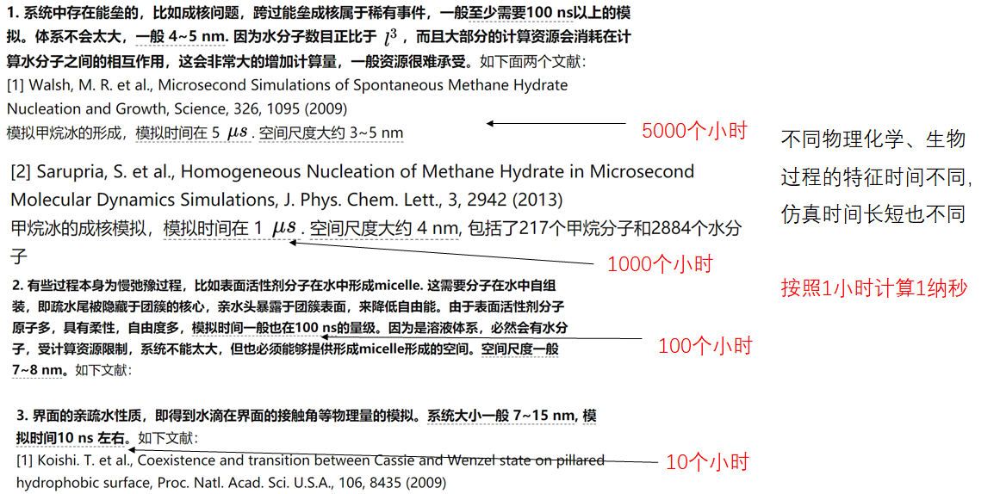
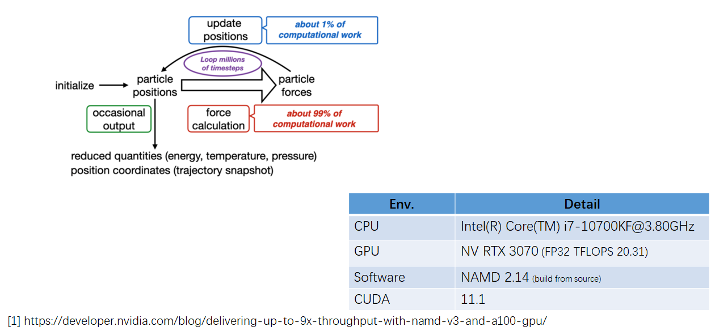
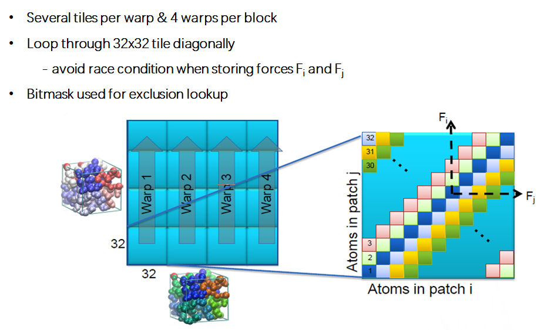
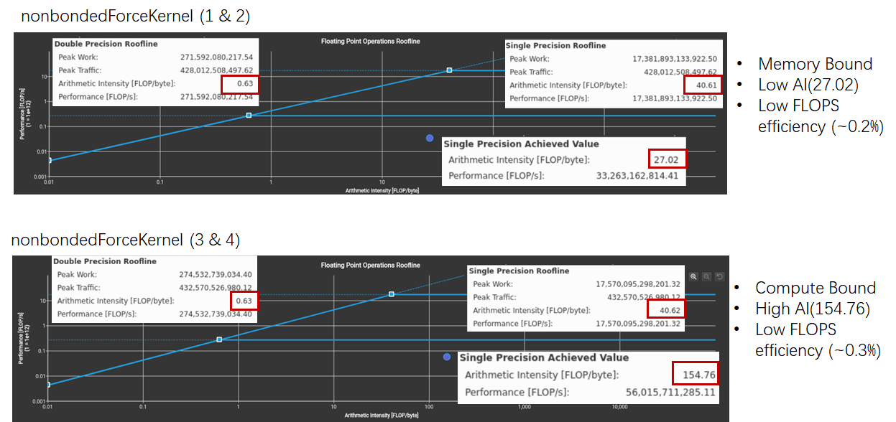

# NAMD 水分子动力学 Benchmark 分析

## Molecules Dynamic Background

### 什么是分子模拟

### 分子模拟建模尺度

### 为何需要分子动力学计算加速

### 计算核心难点 — 力场计算

## Benchmark Brief

## Workload Analysis

### Compute Work Overview

### GPU Compute Work

#### Overview

#### Patch Decomposition

#### Computes and Tiles

#### Non-bonded Force Calculation

#### Warp load balance with neighbor list sorting

#### Inside non-bonded force computation kernels

#### Summary

### Top-Down Analysis

#### Hot Spot Analysis

- Function Hot spots

	
- Kernel Hot spots

	
- Kernel Implementation

	

### Bottom-Up Analysis

#### GPU Throughput

#### Roofline Model

#### Pipeline Utilization

#### Memory Chart

#### Share Memory Atomics

### Cross Validation

## Summary

## What-If Analysis: FP32 As Accumulate Type

## References

1. [Improving NAMD Performance on Multi-GPU Platforms](https://charm.cs.illinois.edu/workshops/charmWorkshop2018/slides/CharmWorkshop2018_namd_hardy.pdf)
2. [NAMD 3.0alpha GPU benchmarking results](http://www.ks.uiuc.edu/Research/namd/benchmarks/)
3. [Delivering up to 9X the Throughput with NAMD v3 and NVIDIA A100 GPU](https://developer.nvidia.com/blog/delivering-up-to-9x-throughput-with-namd-v3-and-a100-gpu/)
4. [Pushing the limit of molecular dynamics with ab initio accuracy to 100 million atoms with machine learning](https://arxiv.org/pdf/2005.00223.pdf)
5. [86 PFLOPS Deep Potential Molecular Dynamics simulation of 100 million atoms with ab initio accuracy](https://arxiv.org/pdf/2004.11658.pdf)