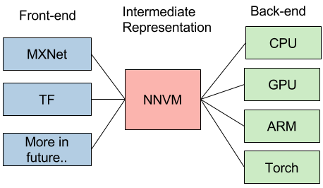

# Neural Network Virtual Machine

## 深度学习 Stack

## 为什么提出 NNVM ？

### 深度学习框架现状 - “碎片化”

目前，深度学习应用框架呈现出高度的“碎片化（fragmentation）”倾向，这主要是由于下述两个原因：

- 深度学习正处于商业应用的前期阶段并具有诱人的商业想象力。诱人的商业前景且尚未出现事实标准的现状，使得有相应实力的公司竞相推出或赞助自己的应用框架，以期在后续的竞争中谋得一席。比如，Google 主推 TensorFlow，Microsoft 主推 CNTK，Amazon 主推 MxNet......

-  深度学习应用领域多。每个领域的开发者都有自己偏好的框架。如医疗领域的偏好 Theano，传统图像识别的偏好 Caffe......

偏偏深度学习又是计算密集型的应用，所以高度依赖于专门的优化，这是要把平台提供商搞死的节奏。为了市场份额，平台提供商不得不一个一个地优化这些框架，以及不断涌出的新框架。感念于斯，平台方面以及一些做框架的先知先觉者开始思考从这个困境中摆脱出来的方法。

### 深度学习优化趋势 - 优化层次从 “operator” 到 “graph”

目前，单硬件引擎的原语（Primitives）层次的优化已经基本上接近尾声，无论是 Intel 的 MKL 还是 NVIDIA 的cuDNN 都基本成熟。为了获得更好的软件性能，方向只能往联合优化去走，优化方向从 operator level（或者 layer level）向到 graph level 演化，从而充分利用硬件特性压榨干 inter operator 之间的开销，并在各引擎间灵活切换从而获得额外增益（异质计算，heterogeneous computing）。

## 什么是 NNVM

NNVM 被提出来解决这两个问题。NNVM 的设计思路跟 LLVM 是一样的。
> **LLVM 简介**
> LLVM 提供了一个统一的编译器优化架构，它支持多前端（C，Fortran...）和多目标引擎（X86，ARM，GPU...）。LLVM 把所有的前端语言解析到一个统一的抽象语义树格式（Abstract Syntax Tree，AST），然后使用一个优化器来进行优化。这样每一个硬件引擎只需要针对一个 AST 实现并努力优化好优化器就够了，大大减少了开发和维护的复杂度。
> 
> 

同样地，NNVM 会把各种 DL framewok 的网络结构翻译成统一的格式，并针对不同的硬件引擎做各种优化。

**它的 IO 模型很简单，你只需要定义一个 graph，NNVM 帮你搞定从 graph 中的 operator 的原语优化到使用什么硬件引擎，如何分配使用内存的所有事情，给你一个 overall optimal solution。** 因为是基于 graph 做，所以用户不用 care operator 如何优化，也不用管 graph 如何优化，这给了优化最大的余地。

|||
|--|--|
| |  |

NNVM 可做的优化内容包括：
- Operator Compounding：Operator Compounding 意图充分利用硬件的特长，对一些相邻的 operator 进行归并。一个常见的是：把 Batch Normalization 层和后续的 Scale 层归并成一个，这个在 NVIDIA cuDNN 和 Intel MKL-DNN 中都进行了这样的优化，优化方向是减少内存消耗以及内存传递消耗。

- Heterogeneous Computing：这个在目前以 GPU 单 IP 为主的思路下很少被讨论。但相信像 Intel，ARM 这样的多 IP 大厂后续会更愿意提起他。一个很直觉的想法是：现在都是 GPU 一个哼哧哼哧在那算，CPU 只能干等，有什么办法能让 CPU 帮上忙, 提高资源利用率。更大的一个问题是：目前其实发现并不是所有的算子都是 GPU 跑比较好，CPU 经过 MKL-DNN 优化后在表现也不错，那怎么发挥协同优势，进一步提高效率。进一步的，如果有 TPU，FPGA，Nervana Engine 等 NPU 的情况下，如何进行协同优化？这里面包括 identify 每个 engine 的擅长，计算容量，存储容量以及 engine 间的 memory sharing 和 re-layout 方案。

- Partition：包括 NN graph 的子图划分（subgraph partition），以及 scale out（multi-node partition）。

上述三个方面在实现的时候“你中有我，我中有你”, 如果能做好，真正是大功德。我们还需要看到，这些折衷优化需要对硬件平台的深刻掌握才能做好，不然很可能长期流于像 BN 层和 Scale 层合并这样的表面优化。在这一领域，platform vendor 因为最熟悉硬件平台，能够发挥重要的作用。

## 当前实践: DMLC-NNVM 与 Nervana-Graph
目前按照 NNVM 设计的主要有两个框架。一个是 DMLC 的 NNVM，一个是 Intel 的 Nervana Graph，目前都处于比较初级的阶段。初步比较见下表。

一句多余的话就是，在向上抽象方面，TensorFlow 已经做得非常好了（在计算图上 Graph/GraphDef、Node 的抽象；在数据流上  Variable、Tensor 的抽象；以及运行时 Session 的抽象，都很贴切），因此很多人也觉得从 API 的角度觉得 NNVM 的存在不是很必要，这个是自顶向下看的角度。从自底向上看的角度，我觉得 NNVM 还是有必要的，我们可以把它当作 Android 系统的 HAL 层来看，撇开这个 HAL 层的 API 谁定义得比较好，应该由谁定义这个问题，我觉得首先需要肯定这个 API 是存在的必要性。因此可能 DMLC-NNVM 和 Nervana Graph 都不会存在，可能最后大家还是回归到 TensorFlow，但是这个 NNVM immediate layer 的思想应该会被接受下来，然后 platform vendor 负责优化 HAL，应用框架负责 usage scenario 的稳定局面会最终形成。

*写于 2017 年 1 月*
