# 计算机视觉中的目标检测

> 量变引起质变，质变又引起新的量变。
> 最佳设计都是折衷的艺术。

## 目标检测解决什么问题
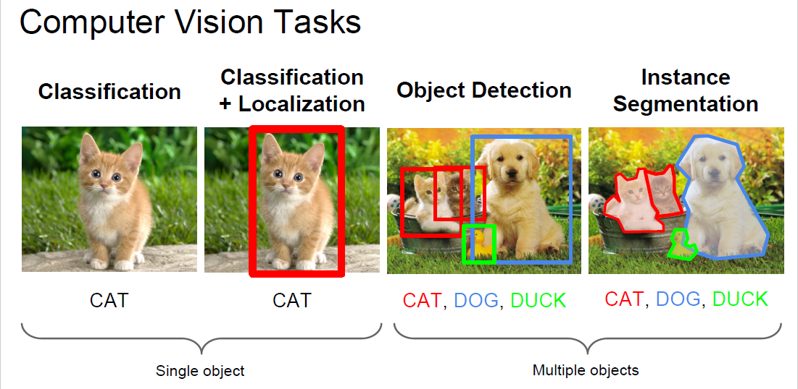

目标检测从图像中找出所有感兴趣的目标的 instances （detecting instances of semantic objects of certain classes），并用 bounding box 框住它们。

从上图可见，目标检测场景有三个特点：
- 多目标
- 在哪里？ -> 定位
- 是什么？ -> 分类

## 目标检测的评价标准

### Accuracy
#### mAP (mean Average Precision)

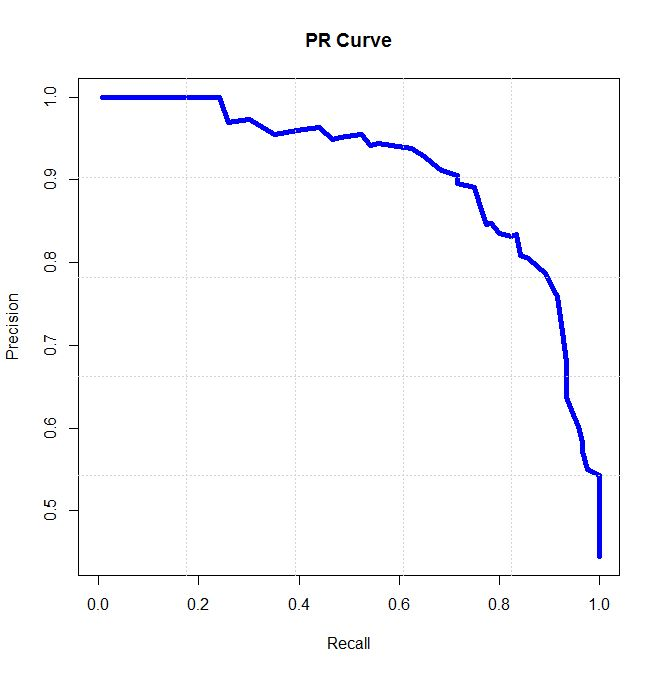

对每个类：

$$\begin{align*}&AP = \frac{1}{11}\sum_{r \in {0, 0.1, ... ,1}}{p_{interp}(r)} \\
    &p_{interp}(r) = max_{\tilde{r}:\tilde{r} \ge r}p(\tilde{r})\end{align*}$$

对所有类：

$$mAP = mean(AP_{c})$$

### Speed

#### Throughput
- fps: frames per second

#### Latency
- how long it takes to process one image

## 目标检测怎么做

### Two Shots Solution: Region Proposal and then Classification

#### Viola-Jones Detector
- Year
	- 2000
- Author

    
- Main Idea
	- Haar-like 特征是一个表达能力很强的人脸描述子。
	- Haar-like 特征可以用积分图来共享计算，大大加快特征提取速度。
	- Cascade 逐级过滤的想法大大降低了分类时间。

    
    
- How
	- Framework
        
        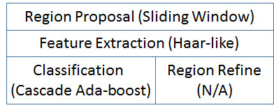
	- Scale-invariance is from same sliding window on multiple scale image 
- Pros & Cons
	- Pros
		- 天下武功，唯快不破！
		- 人脸识别第一次走出实验室，可以工业化应用
	- Cons
		- 只适用于刚体, 如人脸，汽车......
		- 特征普适性不强。要么给一个普适的特征，要么给一个普适的特征生成方法。

#### Deformable Parts Models(DPM)
- Year
	- 2009
- Author
	- Ross Girshick

        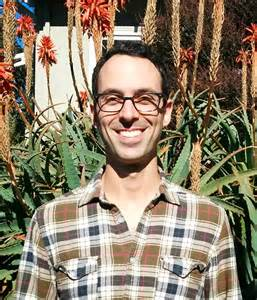
- Main Idea

    使用 Pictorial Structures Framework 解决非刚体的检测问题。
    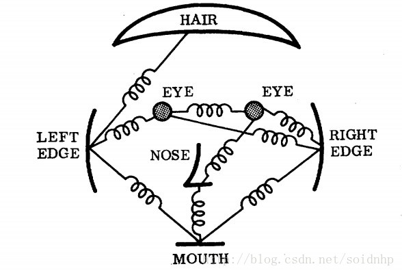
- How
  
    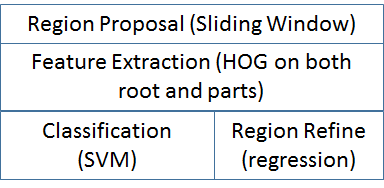
- Pros & Cons
	- Pros
		- 解决了非刚体问题, 准确率更高。
	- Cons
		- 慢了。
		- 还是没解决普适特征的问题。

#### RCNN
- Year
	- 2014.10
- Author
	- Ross Girshick
- Main Idea

    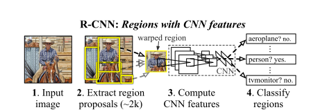
- How

    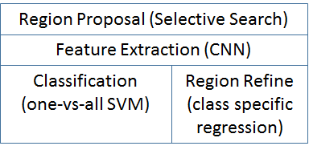
- Pros & Cons
	- Pros
		- 引入 CNN 解决普适特征的问题
	- Cons
		- Multi-stage: fine-tune CNN + SVM training +  bounding box regression
		- Disk starving: feature file need store to disk firstly
		- **Slow while inference: redundant feature extraction per ROI, VGG-16 need 47s w/ GPU**

#### SPP-Net (Spatial Pyramid Pooling)
- Year
	- 2015.4
- Author
	- He Kaiming
    
- Main Idea

    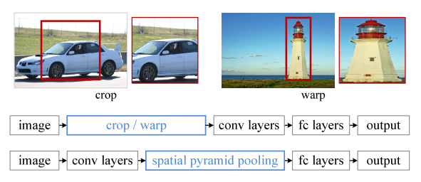

    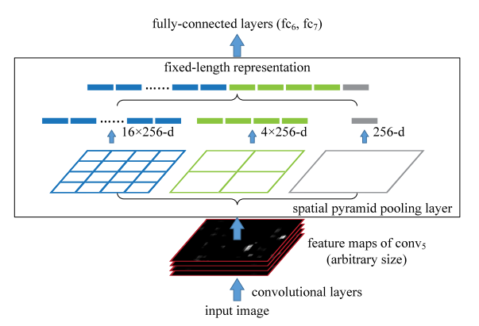
- How

    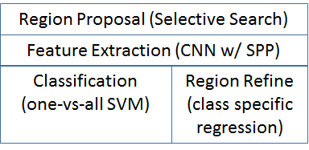
- Pros & Cons
	- Pros
		- **Faster**: introduce SPP to share feature extraction across ROIs
	- Cons
		- 没解决 RCNN 的另外两个问题
		- SPP-NET 在微调网络的时候固定了卷积层，只对全连接层进行 finetune，而对于一个新的任务，有必要对卷积层也进行微调。（分类的模型提取的特征更注重高层语义，而目标检测任务除了语义信息还需要目标的位置信息）

#### Fast RCNN
- Year
	- 2015.9
- Author
	- Ross Girshick
- Main Idea
  
    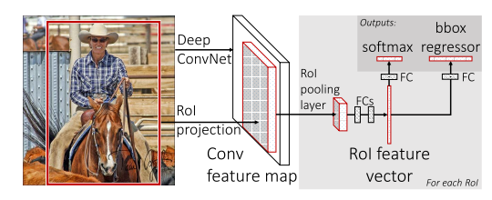
- How
	- inherit SPP's ROI pooling idea w/ single scale

    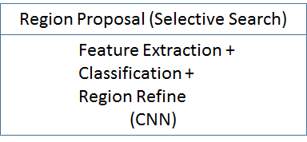
- Pros & Cons
	- Pros
		- joint optimize classification & regression

            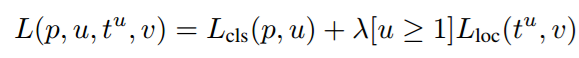
	- Cons
		- Now, speed bottleneck is in selective search. [WHY? People say because it's done by CPU, :( ]

#### Faster RCNN - 里程碑式的工作
- Year
	- 2016.6
- Author
	- Ke Kaiming
- Main Idea
	- 引入 anchor 的概念
    
    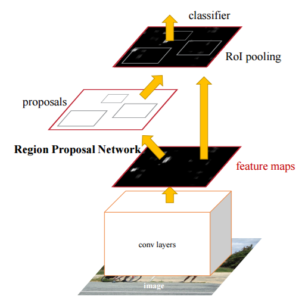
- How

    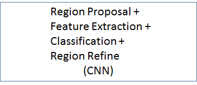
- Pros & Cons
	- Pros
		- End-2-end solution makes faster
		- Less region proposal makes faster (~2k -> ~300)

#### R-FCN
- Year
	- 2016.1
- Author
	- Ke Kaiming (MSRA)
	- Ross Girshick (MSRA)
- Main Idea
	- Not only share computation in image level, but also share computation across ROIs
	- Propose position-sensitive ROI pooling to attain this target.（both share computation and translation variant.）

    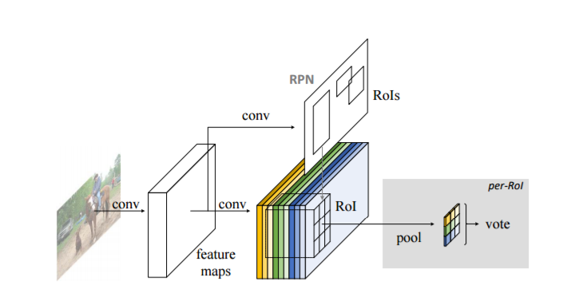
- How

    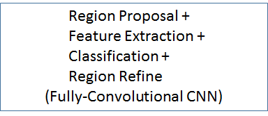
- Pros & Cons
	- faster at the cost of accuracy

#### Mask R-CNN - New Baseline
- Year 
	- 2017.3
- Author 
	- Ke Kaiming (FAIR)
	- Ross Girshick (FAIR)
- Main Idea
	- Combine detection + segmentation into one
	- Use skeleton of faster-rcnn
	- Introduce ROIAlign layer to mitigate the misalignment issue brought by quantization in Faster-RCNN
	- Parallelize BB regression and classification to accelerate speed
	- Use binary Sigmoid rather than SoftMax while segmentation. 
    
    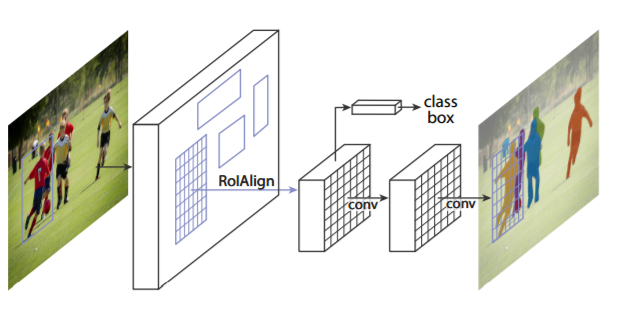
- How

    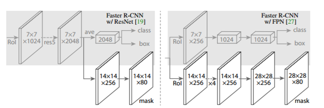
- Pros & Cons
	- Faster
	- More Accurate

### Single Shot Solution
分类和回归一勺烩了。

#### YOLO (You Only Look Once)
- Year
	- 2016
- Author
	- Joseph Redmon
	- Ali Farhadi
	- Ross Girshick
- Main Idea

    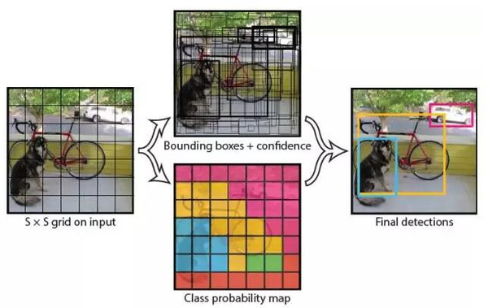
- How
	- 图像缩放为 448x448
	- 把图像划分为 7x7 grid
	- 对每个 grid 预测两个 BB 的位置和类别
	- 用 NMS 去冗余

    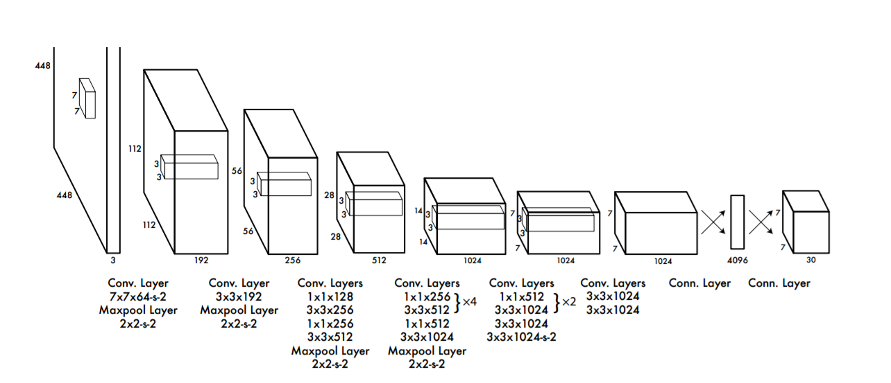
- Pros & Cons
	- Pros
		- FPS: 45 !!!
	- Cons
		- recall 低，最多只能检测 49 个目标
		- 小目标比较难搞定

#### SSD (Single-Shot Multi-Box Detector)
- Year
	- 2016
- Author
	- Wei Liu
- Main Idea
	- 用局部卷积 patch 而不是全图信息（YOLO）去回归 BB 位置
	- 重新引入 anchor box 的概念
	- multi-scale，对小目标是个福音
- How

    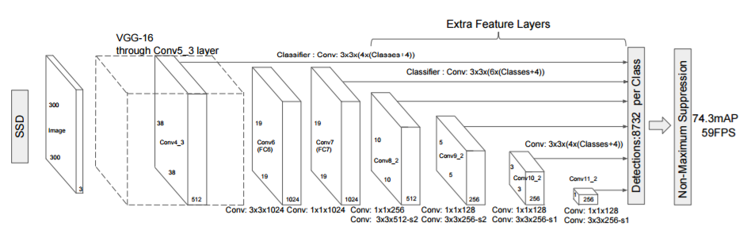
- Pros & Cons
	- N/A

#### YOLO-v2
- Year
	- 2016.12
- Author
	- Joseph Redmon
	- Ali Farhadi
- Main Idea
	- Put all prior best-practice together
- How
	- Batch Normalization - from GoogleNet
	- High Resolution Classifier, fine-tune classifier network to 448x448 images
	- Convoluiotnal with Anchor Boxes - from SSD
	- Dimension Clusters while choosing bounding boxes - k-means idea
	- Hierarchical classification 

## 参考文献
1. Corresponding papers
2. http://blog.csdn.net/g110802008/article/details/52611956
2. https://zhuanlan.zhihu.com/p/21412911?refer=dlclass
3. http://www.tuicool.com/wx/YZ3uAze?from=groupmessage&isappinstalled=0
4. http://blog.csdn.net/standing_on_giant/article/details/60333329
5. http://homepages.inf.ed.ac.uk/ckiw/postscript/ijcv_voc09.pdf
6. http://www.qingpingshan.com/bc/jsp/163450.html
7. http://blog.csdn.net/garfielder007/article/details/51867343
8. http://www.tuicool.com/articles/eEfm2mv
9. http://blog.csdn.net/wy250229163/article/details/56837189

*写于 2018 年 4 月*
