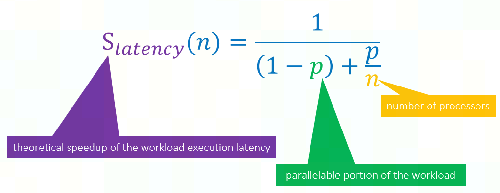
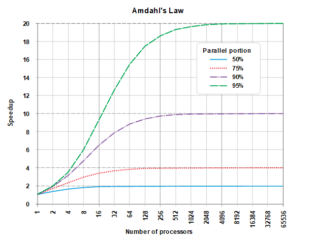
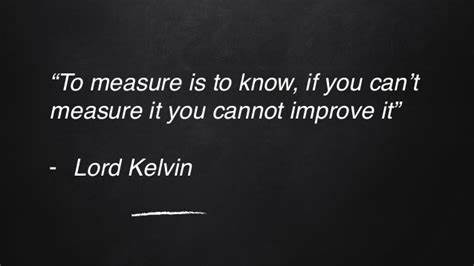
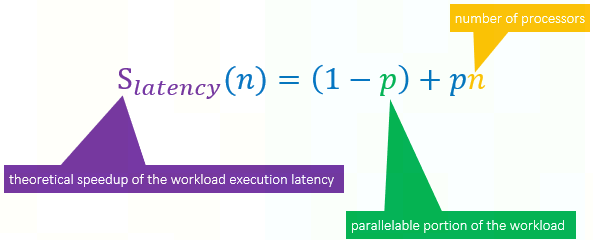
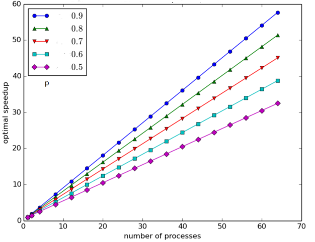

# Performance Scaling Laws

并行优化有两个 scaling laws 指导优化的界。

## `Amdahl's Law（阿姆达尔定律）`

`Amdahl's Law` 又叫 `strong scaling law`。

> **`Amdahl's Law（阿姆达尔定律）`**
> 
> For a given workload in single node, the theoretical speedup of the latency of the workload, is constricted both by the number of processors executing and the serial proportion of the workload.
> 
> 

阿姆达尔定律解决的问题是：**给定工作负载，优化其性能**。即，关注于把给定的任务做好。
 
假设给定工作负载的初始 latency 为 $1$，其中可并行优化部分的 latency 为 $p$, 非可并行部分的 latency 为 $1-p$。
 
那么，使用 $n$ 路并行只能优化其可并行部分，优化后可并行部分最好 latency 为 $\frac{p}{n}$，非可并行部分的 latency 仍为 $1-p$，总 latency 为 $(1-p)+\frac{p}{n}$。

因此，性能提升上限为 $\frac{初始latency}{优化后latency}$, 即为 $\frac{1}{(1+p)+\frac{p}{n}}$。

阿姆达尔定律是面向工程师的，提醒工程师谨防无用功，在性能优化时，除了看模块性能增益外，更要关注模块对整个工作负载的增益。在优化前一定要做好收益分析，而收益分析的前提是理解性能分布。

举个例子：如下图所示，对一个可并行部分 latency 占总 latency 比为 `50%` 的工作负载而言，不管可并行部分怎么优化，其性能增益上限为 `2x`。如果你已经将可并行部分的性能优化了 `8x`，继续对其优化的收益会很 marginal，其实更应该考虑多分析分析其他部分。

阿姆达尔定律告诉我们：针对给定工作负载的优化是有明显饱和区的，因此要格外关注性价比指标。如何关注性价比指标，就是要做好测量，无测量不优化。对程序员来说就是执行好 profiling based optimization。

## `Gustafson's Law（古斯塔夫森定律）`

`Gustafson's Law` 又叫 `weak scaling law`。

> **Gustafson's Law**
> For a scaled-up/scaled-out workload in 𝑛 nodes, the theoretical speedup of the latency of the workload, is constricted both by the number of processors executing and the serial proportion of the workload.
> 
>  

古斯塔夫森定律解决的问题是：**做什么事情才能体现系统的能力**。即，关注于做正确的事。

它把一个可在 $n$ 个 *node* 里运行的大规模工作负载的 latency 设为 $1$，其中可并行部分的 latency 为 $p$，非可并行部分 latency 为 $1-p$。

那么，如果使用 $1$ 个 *node* 去运行这个工作负载，可并行部分所需要的 latency 会变为 $np$，非可并行部分 latency 仍为 $1-p$，总 latency 为 $(1-p)+pn$。

因此，性能提升为 $\frac{1 个 node 的 latency}{n 个 node 的 latency}$，即为 $(1-p)+pn$。

古斯塔夫森定律是面向决策者的，促使决策者思考在计算系统能力提高的时候除了考虑对现有应用场景（工作负载）好处外，更重要的是考虑新的能力会解锁哪些新应用场景（工作负载）。其隐藏的原因是：现有的工作负载一般在设计时是考虑了现有计算系统的承载能力的，因此在计算系统能力提高尤其是有质的提高时，对现有工作负载的优化都是服从阿姆达尔定律的，有可见的饱和区。而探索适配新计算系统的工作负载，则服从古斯塔夫森定律，不管斜率如何，都有明显的线性区。

这也是在算力飞涨的如今，行业的前驱者（如Google，NV）不断寻找并启封以前被视为 `mission impossible` 的工作负载的内在驱动力。大规模模型训练，科学仿真（如分子动力学）等的蓬勃兴起就是题中之义。阿姆达尔定律并不能给新计算系统的发展带来原生需求，也就不能真正驱动算力的健康发展，只有古斯塔夫森定律才能。

同理可以看通信行业，困扰 5G 的不是网络优化等问题，而是需要解锁新的应用场景来 justify 它。

*写于 2022 年 2 月*