# 基于深度学习的医学影像分析的平台挑战与探索

## Deep Learning Helps Medical Image Diagnosis

More and more work are showing deep learning can help medical images diagnosis, which not only saves health-care costs but also accelerate health-care democratization especially in developing and undeveloped regions.

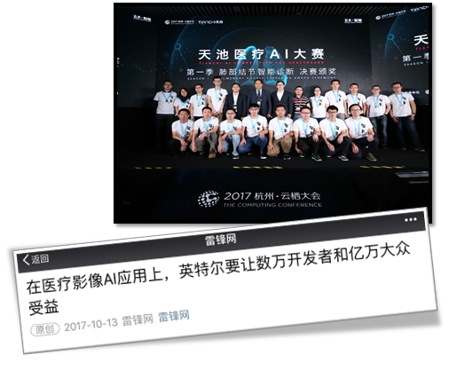

- Lung Nodule Detection
	- [Alibaba Tianchi Medical AI Competition 2017](https://tianchi.aliyun.com/getStart/introduction.htm?raceId=231601)
	- [LUNA'16](https://luna16.grand-challenge.org/)
	- [Kaggle DSB](https://www.kaggle.com/c/data-science-bowl-2017 )
- [Breast Cancer Screening](https://arxiv.org/abs/1703.07047)
- [Cancer Metastases Detection](https://arxiv.org/abs/1703.02442)
- ...

## DL Medical Image Diagnosis brings new challenges to platform

Medical image analysis is different from well-studied image analysis problems like ImageNet/Microsoft COCO.

- Medical images are often bigger
	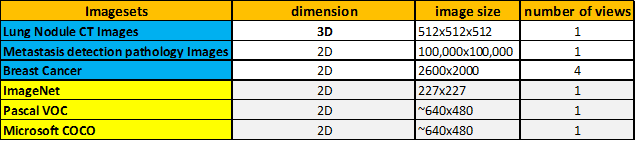

- The objects are smaller and often subtle
	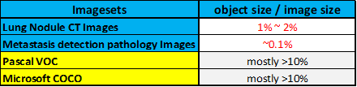

 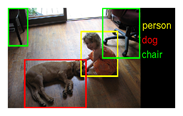 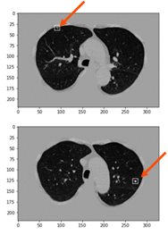

Based on above, Medical AI is not only a computation intensive but also a memory intensive workload.

- Higher data dimension calls for higher-dimension analysis, like 3D model for lung nodule detection.
- Higher data resolution poses higher memory requirements. 

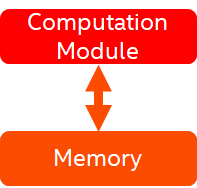

## The Limitation of GPU-centric solution

For GPU-centric solution’s memory limitation, currently researchers must make compromises, and these compromises finally hurts effects.

- Down sample images to fit GPU memory $\to$ hurt algorithm effect
- Split images to fit GPU memory $\to$ increase time-to-train and the time & cost of data collection
- Use very small batch (e.g. 1~4) to fit GPU memory $\to$ hurt algorithm effect and increase time-to-train

## CPU-centric Platforms unleash Medical AI Explorations

Intel Xeon & Xeon Phi supply best capability to handle computation- & memory-intensive workloads and make best flexibility on Medical AI explorations.

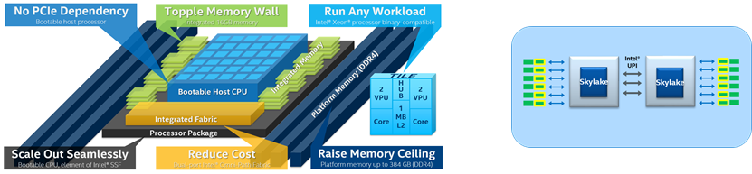

> **Case Study**
> - Resolution Matters in Medical AI 
> 
>	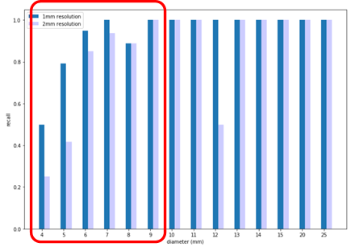
>
>   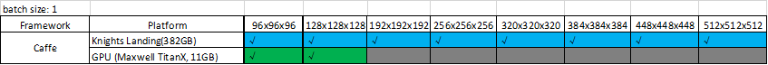
> 
> - Batch Size Matters in Medical AI
> 
>   ](assets/platform-challenges-for-medical-analysis/image-9.png)
>   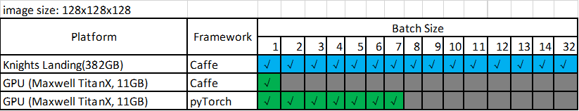

## A bigger picture

### Segmented AI Workloads Call for Diversified Platforms

As AI workloads are getting more and more segmented and thus more and more performance characteristics are disclosed, more and more diversified platforms need to be considered in order to get best effect/performance/cost.
- Medical AI – Memory & Computation Intensive 
	- Training: Xeon Phi
	- Inference: Xeon / Xeon Phi
- Big Data Analytics – IO & Memory Intensive  
	- Xeon/Xeon Phi (+ high-bandwidth memory + high-performance storage)
- Sparse Machine Learning
	- Xeon (+ FPGA)
- ...

### AI Cloud Services Can and Should Leverage a Broader Platform Portfolio

CSPs have convergence power to handle the broader platform platform. It's an opportunity. In PC era, it's hard to do that because every user need handle the diversity of the HWs and distributions, now CSPs can handle it and deliver an unified service to users transparently.

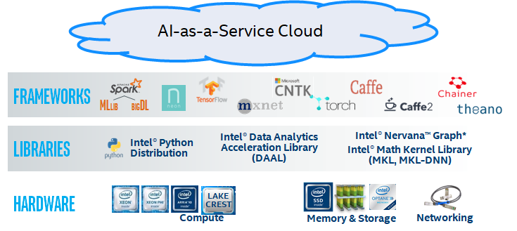

*写于 2017 年 10 月*

> **后记** *(2022/11/08)*
> 5 年之后再回头看这个材料，整个领域似乎变了，又似乎没变。
> 变了的是，NV GPU 在内存带宽和内存容量上持续改善，到 H100 已经演变成聚合带宽为 `3.35TB/s` 的 `80GB` 大容量 HBM3 了。这些改变，是因应推荐系统、3D 分析、大规模语言模型（LLM）这些应用需求，逐渐拓宽 GPU 对这些领域的适用区间的努力。变了的还有，在短短 5 年的时间里，CUDA 生态已经发展成深度学习甚至是高性能计算领域的 by-default，现在很多 data scientists 也会读一些、写一些甚至改一些 CUDA 代码了，围绕着这个生态也催生了 Triton 这种更利于小白 data scientists 的 CUDA 代码生成工具。传统的围绕 CPU 编程的高性能计算生态护城河终究是被跨过了。可见生态从来是 power 的附庸，只要你有压倒性的 power，整个生态就愿意去适应你、完善你，最后甚至变成你的。Intel 因其庞大的组织和决策结构，拖累了其在新领域快速创新并建立护城河的能力，被颠覆性创新者推进了创新者的窘境，成为创新者的窘境的另一个生动实例。
> 
> 没有变的是，application 还在那儿，application 的需求还在那儿，NV 似乎正在从屠龙少年变成龙，我们正见证旧瓶新酒的商业宣传，关于 "GPU can do all"，这个故事 Intel 也讲过，只不过当年的主语是 CPU。这符合一鸡多吃的商业利润最大化的动机，是个无可厚非的商业故事。
>
> 
>
> 但回到技术的语境里，当我们抛弃其他的上下文，有时候我们会觉得目前 NV 的努力可能只是缓解措施，并没有从根本上解决问题。在 Xeon Phi 被 Intel 放弃之后，业界依旧认可 `scale + vector + tensor + spatial` 的聚合微架构是有前途的最终解决路径之一。之前，我们寄希望于 Xeon Phi 用 `Atom + AVX512QFMA` 及其后续演进在原编程模型的框架下完成这次新计算模式的纳入，最终完成统一与收敛，维护昔日帝国的辉煌。而如今，新的先驱如 Tenstorrent 以及 Esperanto 们，以 `RISC-V + domain specific extensions` 为新的武器，继续前行在这条道路上。
> 
> 如果我们是牧村浪潮（Makimoto’s Wave）的信徒，那我们会相信 convergence，是谁摘得桂冠，我们需要耐心等待。
> 
> 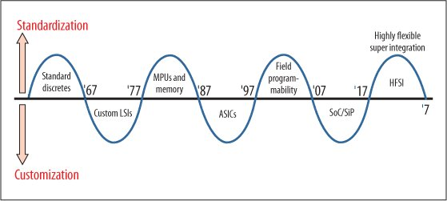
> 
> 是为记。

## References
1. [How Makimoto’s Wave Explains the Tsunami of New AI Processors](https://www.extremetech.com/computing/287137-how-makimotos-wave-explains-the-tsunami-of-specialized-ai-processors-headed-for-market)