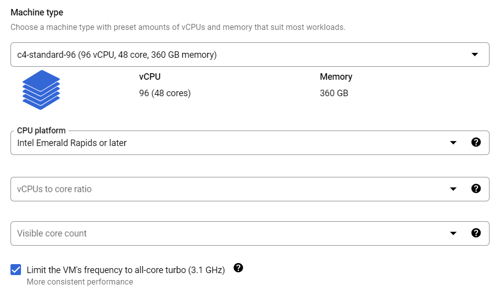
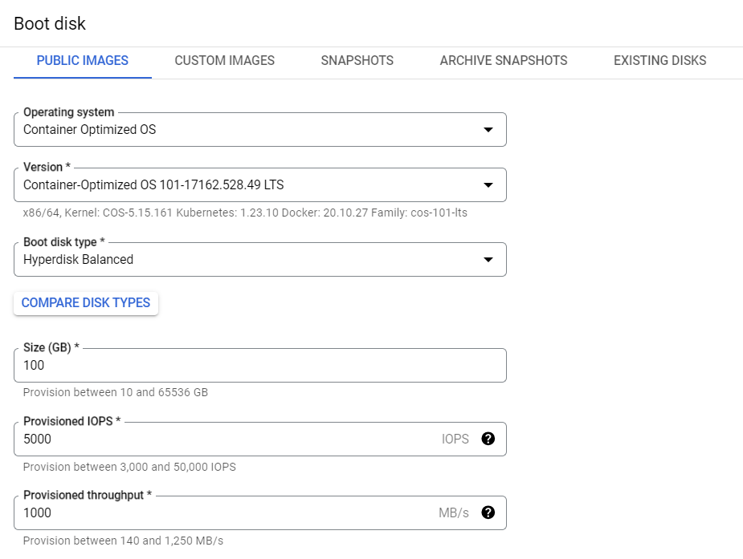
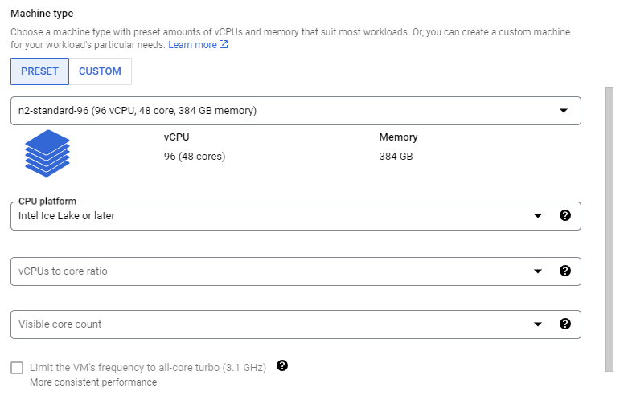
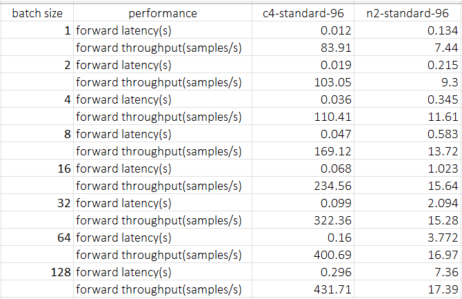
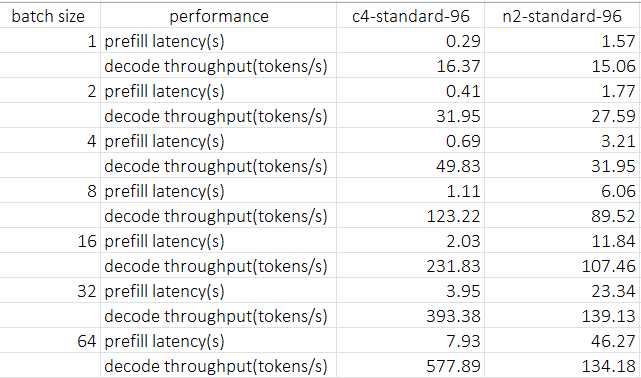

# LLM Benchmark btw GCP C4 and N2

## Instance Set up
### C4
1. go to [google cloud console](https://console.cloud.google.com/) and cleck `create a VM` under your project
2. pick C4 in `Machine configuration` tab, and specify `Machine type` as `c4-standard-96` which coresponding to one socket. And you'd better set `CPU platform` and trun on all-core turbo as below:
   
3. Configure `OS and storage` tab as below:
   
4. Keep other configurations as default
5. Press `CREATE` button, then you'll have a C4 instance

### N2
1. pick N2 in `Machine configuration` tab, and specify `Machine type` as `n2-standard-96` which coresponding to one socket. And you need set `CPU platform` as below:
    
1. Configure `OS and storage` tab as below:
   
2. keep other configurations as default
3. press `CREATE` button, then you'll have a C4 instance

## Benchamrk
### Text Embedding
We use `optimum-benchmark` to benchmark `WhereIsAI/UAE-Large-V1` embedding model across batch size 1 to 128, to compare the performance of C4 and N2 instance.

#### Steps
##### setup env
1. SSH connect to instance
2. `$ git clone https://github.com/huggingface/optimum-benchmark.git`
3. `$ cd ./optimum-benchmark/docker/cpu`
4. `$ sudo docker build . -t <your_docker_image_tag>`
5. `$ sudo docker run -it --rm --privileged -v /home/<your_home_folder>:/workspace <your_docker_image_tag> /bin/bash`
6. `$ cd /workspace/optimum-benchmark`
7. `$ apt update; apt install vim`
8. `$ pip install huggingface-hub==0.24.7` # to workaround a latest version hf hub bug
9. `$ pip install -e .[ipex]`
10. `export OMP_NUM_THREADS=48`
11. `export KMP_AFFINITY=granularity=fine,compact,1,0`
12. `export KMP_BLOCKTIME=1`

##### set config
update `examples/ipex_bert.yaml` as below to benchmark `WhereIsAI/UAE-Large-V1`. change numa binding to `0,1` because GCP C4 and N2 has 2 numa domains per socket, you can double check with `lscpu`. 

```
--- a/examples/ipex_bert.yaml
+++ b/examples/ipex_bert.yaml
@@ -11,8 +11,8 @@ name: ipex_bert
 launcher:
   numactl: true
   numactl_kwargs:
-    cpunodebind: 0
-    membind: 0
+    cpunodebind: 0,1
+    membind: 0,1
 
 scenario:
   latency: true
@@ -26,4 +26,4 @@ backend:
   no_weights: false
   export: true
   torch_dtype: bfloat16
-  model: bert-base-uncased
+  model: WhereIsAI/UAE-Large-V1
```

##### run benchmark
`$ optimum-benchmark --config-dir examples/ --config-name ipex_bert`

##### results


### LLM Text Generation

We use `optimum-benchmark` to benchmark `meta-llama/Meta-Llama-3-8B` LM across batch size 1 to 64, to compare the performance of C4 and N2 instance.

##### set config
update `examples/ipex_llama.yaml` as below to benchmark `meta-llama/Meta-Llama-3-8B`. change numa binding to `0,1` because GCP C4 and N2 has 2 numa domains per socket, you can double check with `lscpu`. 

```
--- a/examples/ipex_llama.yaml
+++ b/examples/ipex_llama.yaml
@@ -11,8 +11,8 @@ name: ipex_llama
 launcher:
   numactl: true
   numactl_kwargs:
-    cpunodebind: 0
-    membind: 0
+    cpunodebind: 0,1
+    membind: 0,1
 
 scenario:
   latency: true
@@ -34,4 +34,4 @@ backend:
   export: true
   no_weights: false
   torch_dtype: bfloat16
-  model: TinyLlama/TinyLlama-1.1B-Chat-v1.0
+  model: meta-llama/Meta-Llama-3-8B
```

##### run benchmark
`$ optimum-benchmark --config-dir examples/ --config-name ipex_llama`

##### results
We can see c4 has 5.4x prefill latency improvement than n2, benefiting from AMX and memory bandwidth improvement. And for throughput driven batch size as 64, We can get 4.3x boost in decoding throughput.

