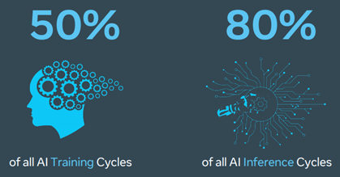
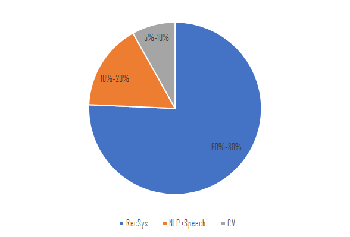

# 推荐系统推理优化

## 推荐系统（RecSys） - “沉默的大多数”

### 互联网企业
- [“在阿里和很多互联网企业中有一个“沉默的大多数”的应用，就是推荐系统：它常常占据了超过 80% 甚至 90% 的机器学习算力。”](https://mp.weixin.qq.com/s?__biz=MzIzOTU0NTQ0MA==&mid=2247490092&idx=1&sn=e8fa9b319e3ba36c3c8b0a3cce73dc90&chksm=e9292723de5eae35462361046e687a605323c4519642b46bf82d2d9450a8dbdd851c2a853e54&scene=21#wechat_redirect)

- Facebook AI cycles allocation
  推荐系统占据了Facebook `50%` 的 AI 训练算力，`80%` 的 AI 推理算力。
  

### 算力提供商
- Intel CSP Representative Workload Mix
     
- [NV CSP Representative Workload Mix](https://www.globenewswire.com/news-release/2018/03/27/1453943/0/en/NVIDIA-Expands-Its-Deep-Learning-Inference-Capabilities-for-Hyperscale-Datacenters.html)
	

## RecSys黑盒

### 输入-输出

在给定用户和用户上下文（如入口、时间、地域、用户的人口统计学数据等）的情况下，计算用户与库存（如商品、文章、用户等）发生交互（如点击、购买、连接等）的概率，并筛选最有可能 `$k$` 个库存推荐给用户，促成交互和转化。

### KPI
- 算法 KPI - `开源`
  提高用户对推荐结果的交互率和转化率。这个是算法研究的范畴。

- 性能 KPI - `可用 + 节流`
  `Latency-Bound Throughput`，在满足要求的延时 `SLA（Service Level Agreement）`的条件下，提高系统的吞吐。这个是系统的范畴。
  
    
  如：

    

## RecSys 算法模型

### RecSys 算法分类

算法设计上，大致可以按下图来划分。目前主流工业使用以 DNN model 为主，这也是本文的目标 workload。

### DNN RecSys 模型范式

**`DNN RecSys Model = Feature Engineering + Feature Interaction + Predictor DNN`**

不同的 feature engineering，feature interaction 和 predictor DNN 选型造就了不同的模型和 workload 特性。

### 典型 DNN RecSys 模型
- Wide and Deep Learning（WDL）
- Deep Interest Network（DIN）
- Deep Interest Evolution Network（DIEN）
- Deep Learning Recommendation Model（DLRM）

#### WDL
- 算法主要思路

    Wide for memorization, deep for generalization
- 选型
    

	- Feature Engineering
		- embedding_lookup
		- hash bucketing
		- slice（tensor manipulation）
		- concat（tensor manipulation）
		- dense fc
	- Feature Interaction
		- concat（tensor manipulation）
		- MLP（Multi-Layer Perception）
	- Predictor DNN
		- fc

#### DIN
- 算法主要思路

    Attention, weighting interaction influence with similarity
- 选型
    
	- Feature Engineering
		- embedding_lookup
		- concat（tensor manipulation）
	- Feature Interaction
		- batch matrix multiplication
		- sum pooling（tensor manipulation）
		- concat（tensor manipulation）
	- Predictor DNN
		- MLP

#### DIEN
- 算法主要思路

    Introduce time-decay effect to attention
- 选型
 	
	- Feature Engineering
		- embedding_lookup
		- concat（tensor manipulation）
	- Feature Interaction
		- GRU（Gated Recurrent Unit）
		- concat（tensor manipulation）
	- Predictor DNN
		- MLP

#### DLRM
- 算法主要思路
  
    Interaction using auto-correlation
- 选型
    
	- Feature Engineering
		- embedding_lookup
		- sum pooling (tensor manipulation)
		- fc
	- Feature Interaction
		- batch matrix multiplication
	- Predictor DNN
		- MLP

## DNN RecSys 模型特征

### `Small Tensor + Big Model`
 - Each record of Criteo TeraByte Dataset

   `13 numerical features + 26 categorical feature = 156B`
 - DLRM open-source Model

	`~26 billion parameters = ~104GB`, most of them are embedding tables

It leads to lower Computational Intensity than CNN workloads.

### Tensor Operations matter

Tensor operations which are Embedding Lookup & Tensor Manipulation occupy a non-negligible part. 

### Workload Heterogeneity
Diverse combinations of `Feature Engineering : Feature Interaction : DNN Predictor` lead to workload heterogeneity.

<!-- AdIndexer is RM1, AdFinder is RM2, Feed is RM3 -->

## RecSys workload 性能优化

### Overview

其中，模型优化专注于优化模型自身的性能，部署优化专注于优化模型在部署环境尤其是混部环境下的性能。

### 模型优化

#### 优化 principles
- #1. Minimize system（HW/SW）overheads
	- minimize scheduling overhead
		- minimize function calls
		- use thread pool
		- use big thread（i.e. graph fusion/stitching）
	- [accelerator cases] minimize kernel launch overhead
		- use big kernel（i.e. graph fusion）

- #2. Roofline analysis driven TFLOPS improvement
	-  improve attainable TFLOPS
    $$\small \begin{align*}
         &attainable\_TFLOPS = min\{peak\_TFLOPS, Computational\_Intensity \times peak\_memory\_BW\} \\
	     &Computational\_Intensity = \frac{\#ADD + \#MUL}{(\#LOAD + \#STORE)\times word\_size}
    \end{align*}$$

	-  improve actual TFLOPS
        

    #2.1. improve computational intensity by decreasing $(\#LOAD + \#STORE)\times word\_size$
    
    #2.2. improve attainable TFLOPs by improving peak memory BW
    
    #2.3. improve actual TFLOPS

#### Tensor Operation Sub-graph

##### 主要优化方法

graph fusion/stitching

##### 涉及的优化 principles

- [#1] minimize kernel launch overhead
- [#1] minimize unnecessary bad argument check
- [#2.2] in-register/cache computing
- [#2.3] more parallelism

##### Case Studies

- embedding_lookup fusion

    Facebook multiple `embedding_lookup` fusion brings `7x` unit level performance improvement.

	

- tensor manipulation sub-graph fusion

    Feature engineering sub-graph fusion brings `2x` unit level performance improvement w/ XLA `CPUInstructionFusion` pass.

	

#### FC & Attention Sub-graph

##### Sub-graph fusion

###### `MatMul + BiasAdd + Activation`

`MatMul + BiasAdd + Activation` 是 FC 子图中的典型子图，也是 graph optimization（如 TF Grappler 等）一般都会实现的 graph optimization pass。目前主要是基于模板匹配的方式来实现。

在 RecSys 中的一个复杂性在于，对于同一个 `MatMul + BiasAdd + Activation` 语义，经常会有不同子图形式，下面给出两种：

可以看到，虽然上述两个子图语义上仍然是 `MatMul + BiasAdd + Activation`, 但由于形式上已经产生变化，基于模板匹配的子图融合 pass 对它们并不能正确地辨识和融合，需要使用更高抽象度的融合 pass 去辨识。实践也表明，增强的 pass 会给线上 inference 带来 `20%` 左右的 latency 减少。
 
<!-- in an online env where 40 W&D models are served concurrently -->

###### Multi-Head Attention
Multi-Head Attention 作为 attention 结构的基本子图，仔细分析并做极致优化是非常有必要的。

<!-- 55% latency improvement@single core-->

#### Operator optimization

##### Increase Computation Intensity
- reduce precision: FP32 → BF16
- reduce data traffic
	- FC：keep packed weight to amortize weight packing traffic
	- DLRM batchMatMul：only load A while compute $AA^{T}$ by leveraging HW transposer 
	- DLRM index：de-duplicate indices
       remove $\small output = input[ : , indices\_x, indice\_y]$ data traffic

##### Increase Peak Memory BW
- Improve cache residence

##### Example
> 
>  |假想系统参数| |
>  |  ----  | ----  |
> | L2$ peak BW(TB/s) | 4 |
> | HBM2e peak BW(TB/s) | 0.8 |
> | BF16 peak TFLOPS | 512 |

<!-- FP32 peak TFLOPS | 8 -->
<!-- L2 peak BW = 256 x 1GHz x16 = 4 TB/s -->

### 部署优化

#### Problem statement

Mixed deployment brings deployment optimization 
- Model co-location brings performance variance（noisy neighbors）
- Optimal hardware varies across dynamic batch size（[1, 100]）& different models

#### 优化实践

##### Facebook

Facebook proposed DeepRecSched to search good deployment configurations with dry-run. Facebook 的实验报告了在 CPU 上 ~2x 的 QPS，在 GPU 上 ~5x 的 QPS。

##### 其他

其他实践可见[深度学习推理性能优化](https://zhuanlan.zhihu.com/p/18014735226)的部署优化部分。

## Micro-Architecture 探索

主要有两个方向：

- 近内存计算
代表性的工作有 Facebook 的 NMP（Near Memory Processor），主要是通过把 `embedding_lookup_reduction` 操作放到内存模组里面来完成，从而在不提高内存的物理带宽的前提下提高有效带宽。Facebook 报告了 `9.8x` 的延时减少和 `4.2x` 的吞吐提高，基于内部的 `embedding-dominated` 的模型族。
	

-  data pipeline in SoC
	- Intel

		Intel 计划在 Sapphire Rapids CPU 中引入一些 data accelerator IP，如 [DSA(Data Streaming Accelerator)](https://www.intel.com/content/www/us/en/newsroom/opinion/updates-next-gen-data-center-platform-sapphire-rapids.html)。把 memory intensive 的部分从 CPU 指令中解放出来，offload 到一个专门的 IP 中来实现。这为实现片上 data pipeline、提高 workload 吞吐提供了一种可能。
		
		
	- Others
	
		在 GPU 设计中，可以讲 L2 cache 设计成具备 `embedding_lookup_reduction` 的功能。（DMRED ISA: near memory computing for reduction）
	
		

## References

1. [DeepRecSys: A System for Optimizing End-To-End At-scale Neural Recommendation Inference](https://arxiv.org/pdf/2001.02772.pdf)
2. [The Architectural Implications of Facebook’s DNN-based Personalized Recommendation](https://arxiv.org/pdf/1906.03109.pdf)
3. [Deep Learning Inference in Facebook Data Centers: Characterization, Performance Optimizations and Hardware Implications](https://arxiv.org/pdf/1811.09886.pdf)
4. [Cross-Stack Workload Characterization of Deep Recommendation Systems](https://arxiv.org/pdf/2010.05037.pdf)
5. [High-performance, Distributed Training of Large-scale Deep Learning Recommendation Models](https://arxiv.org/pdf/2104.05158.pdf)
6. [Accelerating the Wide & Deep Model Workflow from 25 Hours to 10 Minutes Using NVIDIA GPUs](https://developer.nvidia.com/blog/accelerating-the-wide-deep-model-workflow-from-25-hours-to-10-minutes-using-nvidia-gpus/)
7. [Applying the Roofline Model for Deep Learning performance optimizations](https://arxiv.org/pdf/2009.11224.pdf)
8. [RecNMP: Accelerating Personalized Recommendation with Near-Memory Processing](https://arxiv.org/pdf/1912.12953.pdf)
9. [MicroRec: Efficient Recommendation Inference by Hardware and Data Structure Solutions](https://arxiv.org/pdf/2010.05894.pdf)
10. [AI Matrix: A Deep Learning Benchmark for Alibaba Data Centers](https://sc19.supercomputing.org/proceedings/tech_poster/poster_files/rpost194s2-file3.pdf)
11. [Deep Learning Recommendation Model for Personalization and Recommendation Systems](https://arxiv.org/pdf/1906.00091.pdf)
12. [Download Terabyte Click Logs](https://labs.criteo.com/2013/12/download-terabyte-click-logs-2/)
13. [Roofline: An Insightful Visual Performance Model for Floating-Point Programs and Multicore Architectures](https://people.eecs.berkeley.edu/~kubitron/cs252/handouts/papers/RooflineVyNoYellow.pdf)
14. [Roofline Model](https://www.sciencedirect.com/topics/computer-science/roofline-model)
15. [GPU Performance Background User Guide](https://docs.nvidia.com/deeplearning/performance/dl-performance-gpu-background/index.html#understand-perf)
16. [Matrix Multiplication Background User Guide](https://docs.nvidia.com/deeplearning/performance/dl-performance-matrix-multiplication/index.html)
17. [推理性能提升一倍，TensorFlow Feature Column性能优化实践](https://zhuanlan.zhihu.com/p/372382922)
18. [Accelerate INT8 Inference Performance for Recommender Systems with Intel® Deep Learning Boost (Intel® DL Boost)](https://software.intel.com/content/www/us/en/develop/articles/accelerate-int8-inference-performance-for-recommender-systems-with-intel-deep-learning.html)
19. [Optimizing Recommendation System Inference Performance Based on GPU](https://sc19.supercomputing.org/proceedings/tech_poster/poster_files/rpost118s2-file3.pdf)
20. [Deep Learning: It’s Not All About Recognizing Cats and Dogs](https://ece.princeton.edu/events/deep-learning-its-not-all-about-recognizing-cats-and-dogs)
21. [深度学习推理性能优化](https://zhuanlan.zhihu.com/p/18014735226)
22. [Recommendation Systems Algorithms,Challenges,Metrics, and Business Opportunities](https://www.mdpi.com/2076-3417/10/21/7748/pdf)