# Res-Family: From ResNet to SE-ResNeXt

## ResNet-v1（2015 Dec）

### Paper

[*Deep Residual Learning for Image Recognition*](https://arxiv.org/abs/1512.03385)

### Network Visualization

https://dgschwend.github.io/netscope/#/preset/resnet-50

### Problem Statement

A paradox between neural network depth and its representation capability.
- **Intuition**:
  - deeper the network, stronger the representation capability
- **Observation** 
  - network performance will **degrade** while network is deeper

      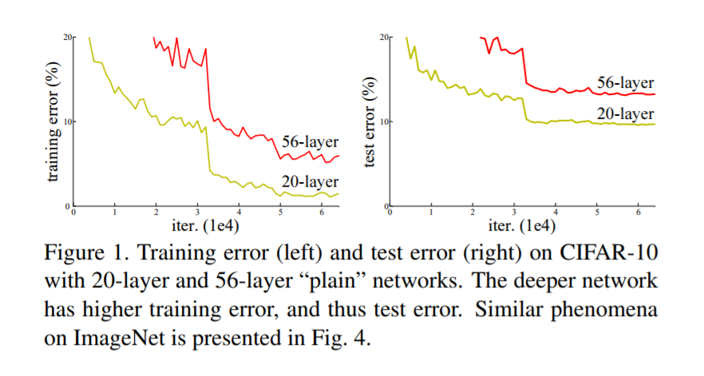

### Why

- ~~Overfit~~
- ~~Gradient Vanish~~ checked back propogated diff, also BN can secure this. 
- **Conjecture**: deep plain nets may have exponentially low convergence rate, which impact the reducing of the training error.

### Conclusion

Current plain network design impede us pursue bigger representation capability through make network deeper.  

### How to Solve it

可以通过构造性方法，构造出一个性能至少与对应的浅层模型相等的深度模型。当 `add-on block` 输出为 `0` 时，这个 `deeper net` 的性能与 `shallower net` 的性能一致。

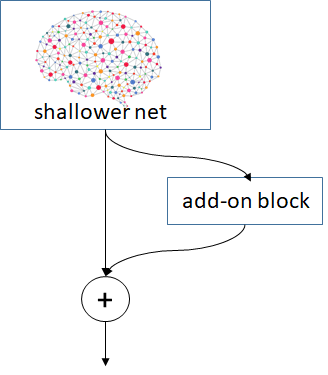

从函数逼近的角度，假设我们需要逼近函数 $f(x)$，`shallower net` 给出了一个 $\hat{f}(x)$，那 `add-on block` 可以看作在逼近 $f(x)-\hat{f}(x)$，即残差（residual），这本质上是残差学习（residual learning）或者是 `boosting` 的想法。这也是 `ResNet` 的基本想法。

### Breakdown

#### Residue Module

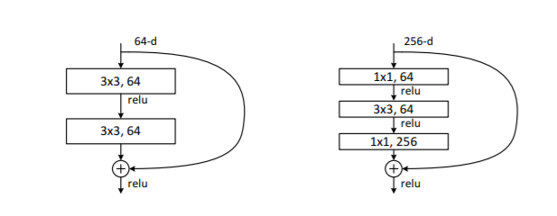

the right block is called **bottleneck** architecture.

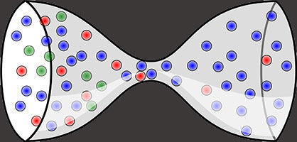

#### Identity Shortcut and Projection Shortcut

下面的 topology 图中，实线即表示 `identity shortcut`，虚线即表示 `projection shortcut`。出现 `projection shortcut` 的原因是该 module 内部的操作改变了 feature map 的 dimension（height, width, channel），我们需要一个 projection 来 match dimension。下图中的 $f$ 指该模块的输出 channel 数。

  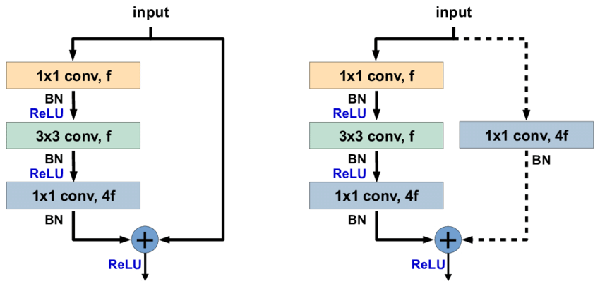

#### Tricks

`h` & `w` 和 `c` 的关系是：spatial 每做一次 1/2 down-sample，`c` 就乘以 2，即：

$$h \times w \times c = constant$$

### Optimization Opportunities

1. 对 `ResNet-50` inference 有哪些适用的优化策略？
   - operator fusion
      - vertical fusion
        - BN folding
          - conv + BN + ScaleShift -> conv
        - conv + relu
        - conv + relu + pooling
        - conv + eltsum + relu
       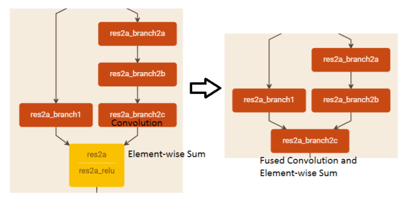
      - horizontal fusion
        - multi-branch fusion
             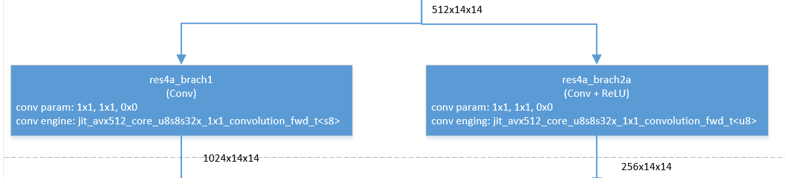
    - advanced tech
		 - lossless topology compression
         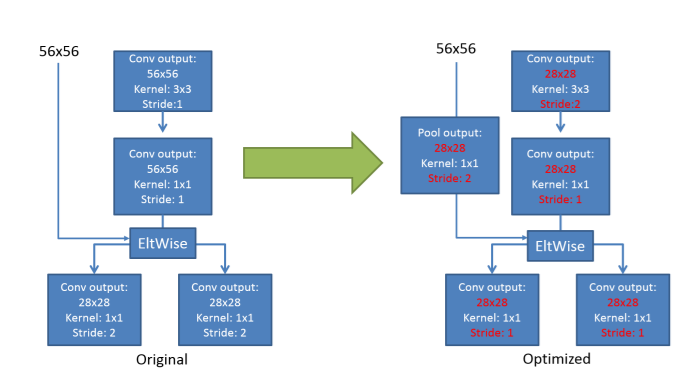
	- other potentials
		 - kernel = 1 pooling optimization
         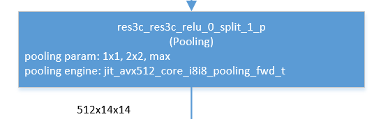
 
### Another Perspective

We can treat ResNet as a **Stacked Boosting Ensemble**.

## ResNet-v1.5

The difference between `v1` and `v1.5` is that, in the bottleneck blocks which requires down-sampling, v1 has `stride = 2` in the first `1x1` convolution, whereas `v1.5` has `stride = 2` in the `3x3` convolution.

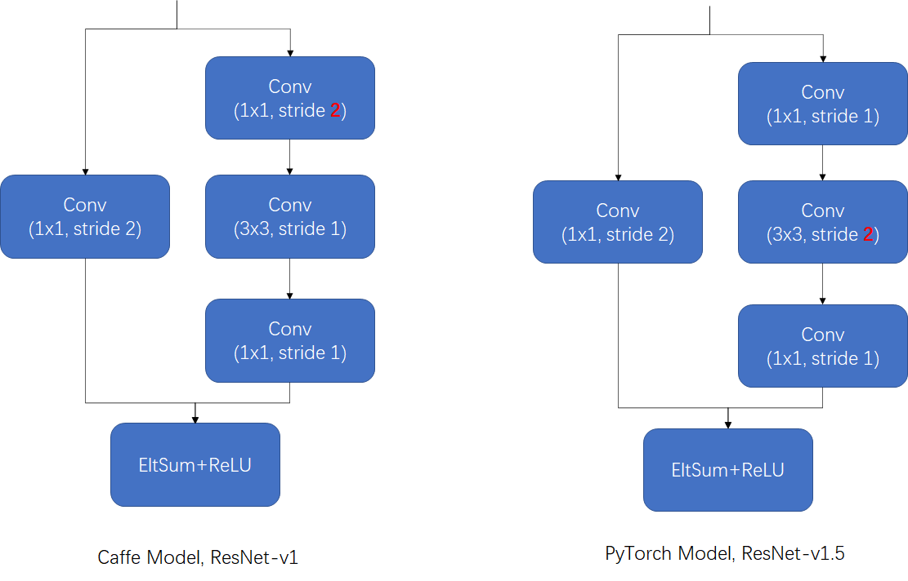

## ResNet-v2（2016 Jul）

### Paper

[*Identity Mappings in Deep Residual Networks*](https://arxiv.org/abs/1603.05027)

### Network Visualization

http://dgschwend.github.io/netscope/#/gist/6a771cf2bf466c5343338820d5102e66

### Motivation
When we express ResNet as a general formula: 

$$y_l=h(x_l)+F(x_l, W_l) \\\ x_{l+1} = f(y_l)$$

在 ResNet 中 $h(x_l)=x_l$，所以称为 shortcut。另一个叫法就是 highway，因为 $x_l$ 的信息在这条路径上可以无衰减地传输，就像一个高速公路一样。但在 ResNet 中因为 $f$ 是一个 `ReLU` 会损失掉一部分 $x_l$ 信息，所以 $x_l$ 的无衰减传输只能限于本 block，并不能在整个网络中无衰减地传下去。现在的猜想是：**如果我们把 $f$ 也变成一个 identity mapping，这个 highway 会更加顺畅，效果会不会更好？**

### The Ways

#### The Importance of Identity Shortcut
作者尝试了很多种方式与 identity shortcut 作了对比，发现效果都没有 identity shortcut 好。

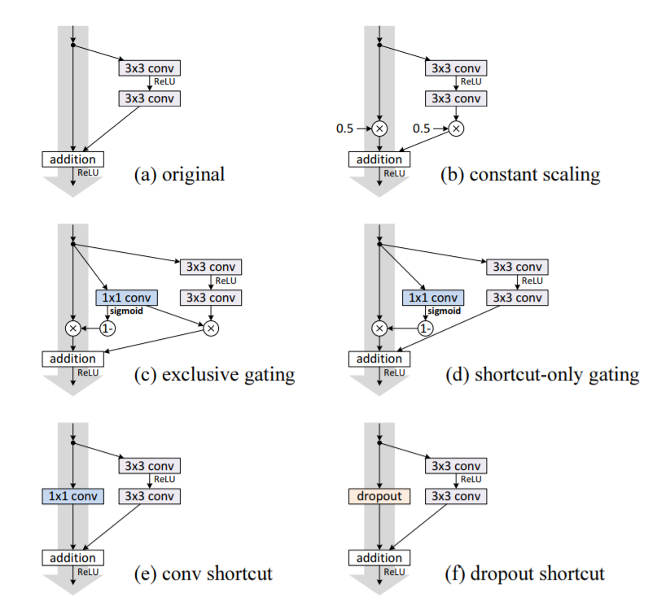

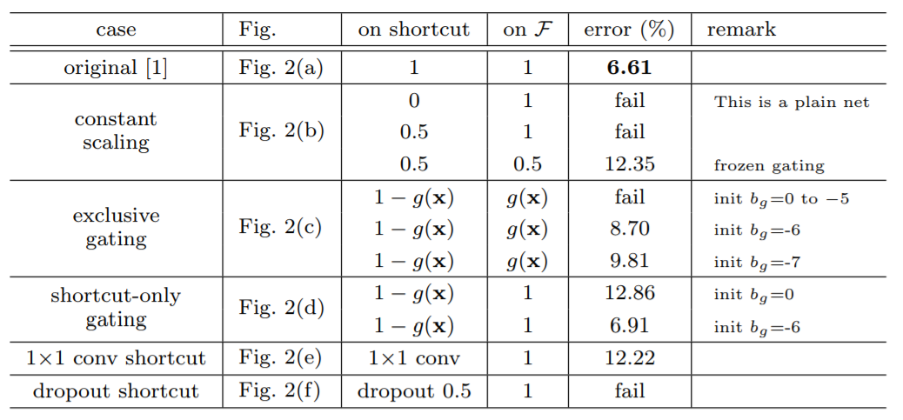

#### Proposed Architecture

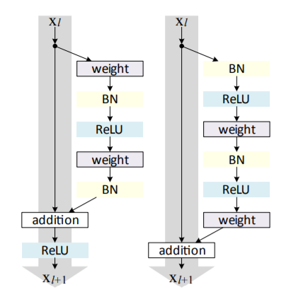

上述结构称为 pre-activation residual module，因为与以前的 residual block 是 `CBR（Conv + BN + ReLU）`结构，而这个是 `BRC（BN + ReLU + Conv）`结构，activation 在 conv 之前，所以称为 `pre-activation` 结构。

因此，ResNet-v2 可以表示为如下形式：

$$ y_l=x_l+F(x_l, W_l) \\\ x_{l+1} = y_l $$

即 $x_{l+1}=x_l+F(x_l, W_l)$，把递归式展开，有：

$$ x_L = x_l + \sum_{i=l}^{L-1}F(x_i, W_i) $$

这是一个纯的 additive model，比 ResNet 更像 stacked boosting。效果如下图：

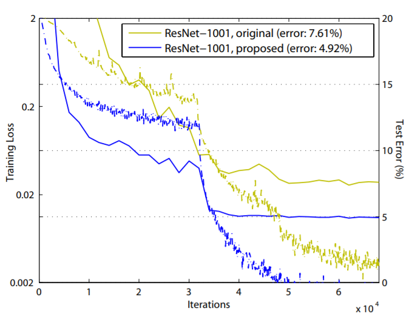

### Mind Experiment
1. ResNet-v2 在 inference 优化上与 ResNet 有什么不同的地方？
	- New Vertical Fusion
		- BN + ReLU
		- Conv + eltsum

2. 有同学会觉得上面的 b 图中的两个 branch 因为 scaling 都是 `0.5`，与原始 Residual Block 相比只相当于把 $y_l$ 再乘个 `0.5`，在数学上是等价的，为啥效果会差很多呢？这句话对了一半，就单个 module 而言，确实如此。

    但一旦把 module 串联起来形成网络，事情发生了质的变化。不失一般性，我们如下形式化 constant scaling module（这里为了简化推导我把 `relu` 换成了 `identity`，不会影响最终结论）：

    $$ x_{l+1} = 0.5(x_l + F(x_l, W_l)) $$
    
    把递归式展开后为：

    $$ x_L = 0.5^{L-l}x_l +\sum_{i=l}^{L-1}0.5^{L-i}F(x_i, W_i) $$

    可以看到与原展开式 $x_L = x_l + \sum_{i=l}^{L-1}F(x_i, W_i)$ 相比，constant scaling 对输入特征进行了指数式衰减，两者是完全不等价的。

## ResNeXt（2017 Apr）

### Paper

[*Aggregated Residual Transformations for Deep Neural Networks*](https://arxiv.org/abs/1611.05431)

### Network Visualization

https://chakkritte.github.io/netscope/#/preset/resnext-50

### Motivation

随着 deep learning 的兴起，视觉识别中的研究已经从 feature engineering 转向了 network engineering，即设计 topology。而随着深度的增加，topology 中超参数（如卷积核大小，stride，channel 数等）越来越多，很难确定。VGG 和 ResNet 的成功表明通过堆叠相同形状的 block 的方法不仅可以显著减少超参数的数量，而且能取得 SOTA 的结果，是非常有前途的方向（这个感觉跟分形的想法很类似）。这是方向一。

而以 `GoogleNet/GoogleNet-v2/Inception` 为代表的实践也表明，通过 `split-transform-merge` 策略进行精细的网络设计也能达到非常好的结果。这是方向二。

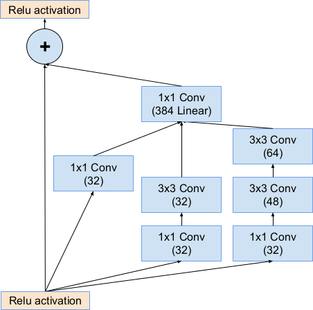

`ResNeXt` 的想法是把这两种好的想法揉到一起，看效果会不会更好。

> "In this paper, we present a simple architecture which adopts VGG/ResNets' strategy of repeating layers, while exploiting the split-transform-merge strategy in an easy, extensible way."

### The Ways

#### 美来自简单的重复

如果像 GoogleNet 系那样做 `split-transform-merge`（如上图），因为每个 branch 都需要设计卷积核的超参，以及 branch 的深度，所以超参会迅速膨胀。所以，要想个办法，既做了 `split-transform-merge`，有没有多少超参量的增加，这个时候其实还是利用“重复大法”来达成。我们先看一下 `ResNeXt` 的设计：

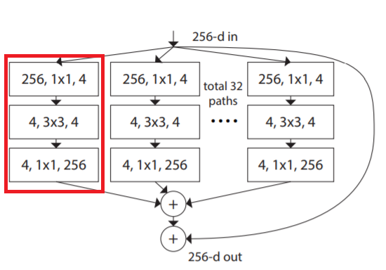

可以看到这个结构是一个单元重复 `32` 次然后再相加的结果。每个单元是一个 `bottleneck` 结构：先把输入 `feature map` 通过 `1x1` 卷积 `embedding` 到 `4` channel 的 `feature map`，然后做 `3x3` 卷积，然后再 `expand` 回去。我们把这个结构叫做 `32x4d` 结构。其中 `32` 是 `ResNeXt` 引入的新的自由度，称为 **cardinality**。`ResNeXt` 的名字也源于此，`X` 指的就是 `neXt dimension`。最后，不要忘了 `residual shortcut`。

#### C 和 d 的确定

为了得到与对应的 ResNet 参数量相当的 ResNeXt，我们可以按照如下公式确定 ResNeXt block 的 `C` 和 `d`:

$$C \times (256 \times d + 3 \times 3\times d \times d + d \times 256) = 对应ResNet\ module的参数量$$

#### One more thing

进一步地，通过等效变形，可以把 ResNeXt 看成是囊括了 `GoogleNet/group convolution/ResNet` 的一种范型。

这样，ResNeXt 论文的层次就超脱了只是 ResNet 的优化了。

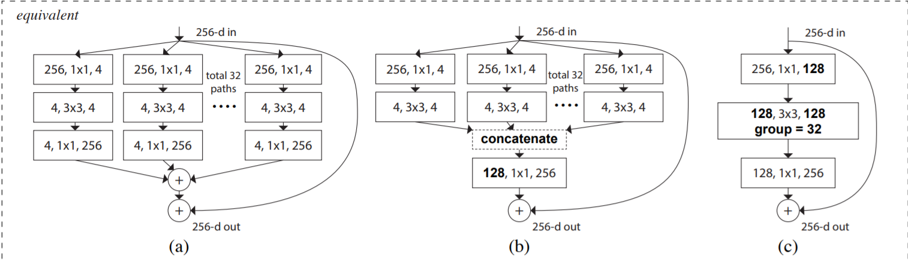

上图 a 是 ResNeXt module 的原始形式，b 是 googlenet 形式的等价型，c 是 group convolution 的等价型。从性能（速度）的角度看，c 的最好。

#### 效果

最后作者给出了 top-1 error，可以看到确实有较明显的提升。

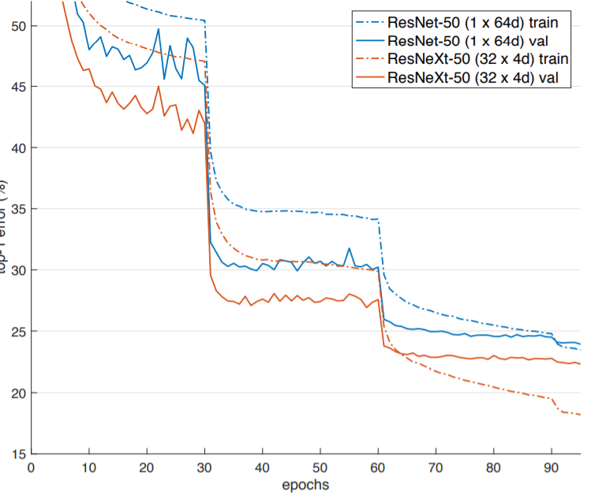

### Mind Experiment

1. ResNeXt 从最终实现上来看与 ResNet 基本相同，唯一区别是 residual module 中的 `3x3` convolution 被换成了 group convolution。

## SE-ResNet, SE-ResNeXt（2018 Apr）

### Paper

[*Squeeze-And-Excitation Networks*](https://arxiv.org/abs/1709.01507)

### Network Visualization

http://dgschwend.github.io/netscope/#/gist/4a41df70a3c7c41f97d775f991f036e3

### Motivation
2017 年开始，Google 说 *Attention is all you need*，天下豪杰竞相响应。2018 的很多工作的都是基于 Attention 机制的进展。这篇文章也可看作其中之一，因为我们可以把 SENet 看成是 channel-wise 的 attention。如下图，SENet 在常规动作后增加了一条专门计算 channel-wise scale 的 branch，然后把得到的值乘到相应的 channel 上。

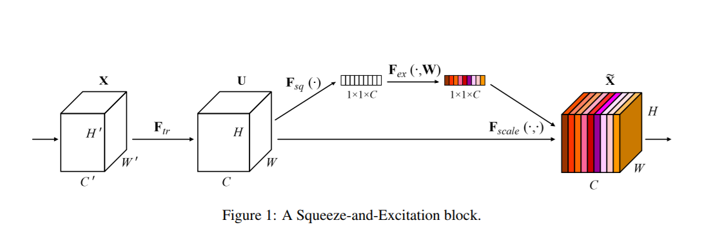

### How it works

SENet 计算 channel-wise attention，分为两个步骤：

- Squeeze: 如下图的红框。把每个 input feature map 的 spatial dimension 从 `H * W` squeeze 到 1。这里是通过 global average pooling 完成的。

    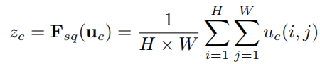

- Excitation: 如下图的绿框。通过一个 bottleneck 结构来捕捉 channel 的 inter-dependency，从而学到 channel 的 scale factor（或者说是 attention factor）。
    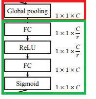

下图是 SE-ResNet，可以看到 SE module 被 apply 到了 residual branch 上。

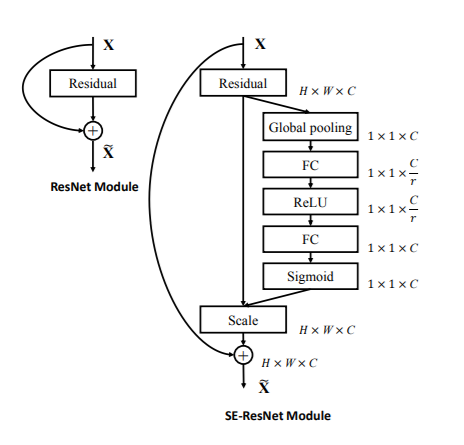

下图是网络配置，这里 FC 后边的方括号里面的数表示 $\frac{C}{r}$ 和 $C$。

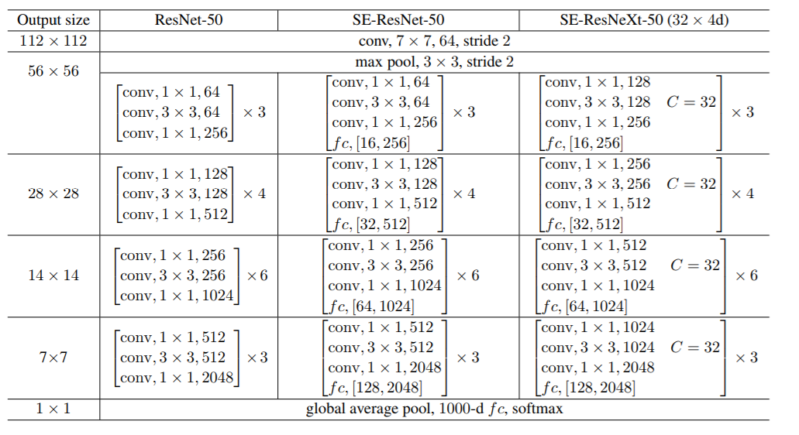

最后是效果，可以看到 SENet 在收敛速度和 accuracy 上都有提高。

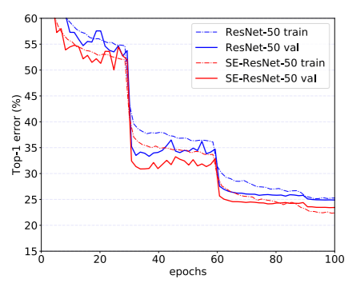

### Implementation Notes

1. SENet 的 FC 等效于 `1x1`的 convolution，可以用`conv1x1` 来代替。
2. `channel-wise scale + eltsum`可以 fuse 成 channel-wise axpy。

### Mind Experiment
1. **Q**：SE module 最终实现上其实是 channel-wise 的scale，这个在数学操作上与BN是一样的。那 SE module 为什么不能被 BN 代替呢？
    **A**: 
    - BN 只建模了 spatial 内的 dependency，而 SE module 不仅建模了 spatial dependency 还建模了 inter-channel 的 dependency。
    - BN 建模的是整个数据集的统计特征，而 SE module 建模的是本条数据（如图像）的统计特征。

<!-- ## ResNeSt (2020 Apr)-->
<!-- ### Paper-->
<!--[ResNeSt: Split-Attention Networks](https://arxiv.org/pdf/2004.08955.pdf)-->
<!--### Network Visualization -->

*写于 2018 年 7 月*

