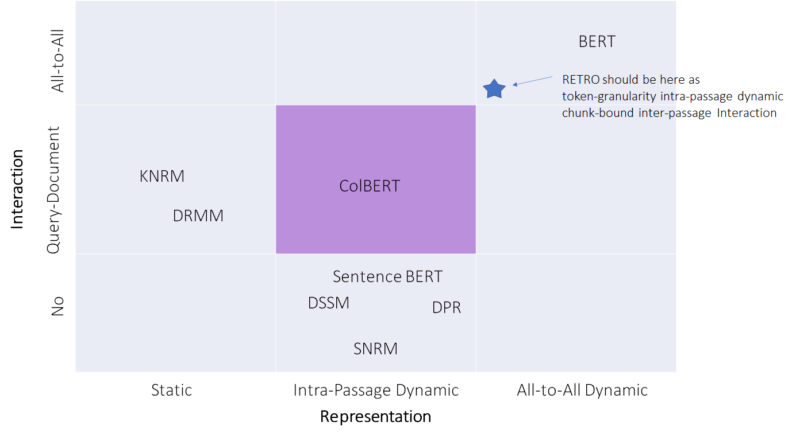

# RETRO

## Info Card
> - **full name**
> 
>  `R`etrieval `E`nhanced `TR`ansf`O`rmer
> - **paper**
> 
>    [Improving language models by retrieving from trillions of tokens](https://arxiv.org/pdf/2112.04426.pdf)
> - **year**
> 
>   2022
> - **from**
> 
>   DeepMind
> - **repo**
> 
>   [un-official](https://github.com/lucidrains/RETRO-pytorch)

## Basic Idea

RETRO is a neural language model. 

Comparing w/ existing language models like GPT, it separates memorization and generalization, so memorize the world knowledge w/ **Retrieval**, while learn the language structure w/ **Model**.

> General auto-regressive language model 
> 
> $$ L(X|\theta) \triangleq \sum_{i=1}^{n}l_{\theta}(x_i|(x_j)_{j<i})$$
> 
> RETRO's chunked retrieval enhanced model
> 
> $$ L(X|\theta, \mathcal D) \triangleq  \sum_{u=1}^{l} \sum_{i=1}^{m}l_{\theta}(x_{(u-1)m+i}|(x_j)_{j<(u-1)m+i}, (RET_{\mathcal D}(C_{u'}))_{u'<u})$$

- Any benefits?

    Democratization $\to$ fast/cheap and good
	- Fewer parameters: 25x fewer parameters lead to much lower computation requirement for training and serving; 
	- SOTA accuracy: show better perplexity on LM and SOTA accuracy on downstream tasks e.g., question answering;

Below diagram from [1] is not the whole picture of RETRO. It's just the retrieval part.

## How Does it Work

### Step-1: Retrieve Nearest Neighbors and Encode them

- Points
	- retrieve the top-k nearest neighbors in **chunk** granularity, neither **passage** granularity as sentence BERT nor **token** granularity like ColBERT
	- each of top-k token sequence = concat(neighbor chunk, continuation chunk)
	- each token sequence is encoded w/ bi-directional transformer encoder, optionally w/ self-attended query as k/v

### Step-2: Decode Causally

- CCA(Chunked Cross Attention)
	

- Points
	- both attention and CCA are causal, to make it auto-regressive

## Results
### Language Model
Pretty good bits-per-byte even 23+ times smaller size.

### Downstream Task: QA
Not really so good, considering the 7.5B model size. And inferior accuracy than FiD, they blame the encoder weight not enough in current model.

## Application on ODQA domain
###  Pipeline Comparison
- `dense retriever + neural ranker` 
E.g.,
	- Single Retrieval Encoder:  SentenceEmbedding Retriever + ColBERT Ranker
	- Dual Retrieval Encoder: DPR Retriever + ColBERT Ranker

	
- `RETRO`
  
	

We can see that RETRO can easily fit as a `dense retriever + neural ranker` ODQA pipeline. It can be viewed as `single-encoder dense retriever + neural ranker` , and the ranker is compute-heavier than ColBERT, both because of model size and the ranker doc encoder cannot be pre-computed.

### To put RETRO into the map of ODQA paradigms

## References
1. [RETRO Is Blazingly Fast](http://mitchgordon.me/ml/2022/07/01/retro-is-blazing.html)
2. [The Illustrated Retrieval Transformer](http://jalammar.github.io/illustrated-retrieval-transformer/)

*写于 2022 年 7 月*