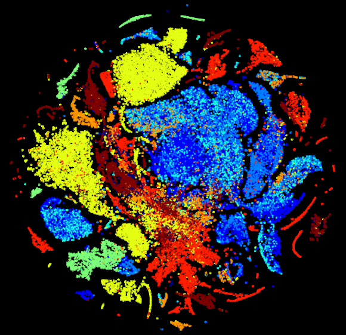

# 有监督机器学习之分类

## 定义
>机器学习是从**数据**出发，提取数据的特征，通过一定的**算法**归纳出数据的**模型**，并将模型应用到对新数据的分析和预测中去的过程。
>  

鉴于此，我们可以得到机器学习三要素：
1. 数据
2. 模型
3. 算法

 

我们知道人类习得新的知识主要是循**归纳**和**演绎**两条路径，而目前的机器学习方法主要发力在**归纳**这条路径，从统计角度对数据的模式进行归纳和总结，因此目前的机器学习基本上等同于统计建模。基于此，不难知道它能起作用的基本前提是：

1. 有数据，有一定量的数据，数据太稀疏了不行。
2. 数据中确实存在一定的统计规律性，这保证了我们可以找到一个模型比随意猜测的结果好。
3. 数据是总体数据（population）的有效采样，其统计规律性与总体数据一致（diversity）。 

统计学习自 20 世纪早中期发轫以来（有兴趣的同学可以看看《女士品茶》一书，这本书较好地介绍了统计学习的发轫史。），一直比较不尴不尬。直到 21 世纪初，随着互联网的兴起，重新以“大数据”的艺名出现，真正一鸣惊人成为 `buzz word`，颇有点 *“昔日龌龊不足夸，今朝放荡思无涯。春风得意马蹄疾，一日看尽长安花。”* 的意味。戏谑之外，我们应该看到其中的必然性：
1. 互联网时代的数据前所未有地易得（availability）和海量（scale）。 网络技术的发展使得通信成本大幅降低，这直接导致了我们可以轻易地传输各种我们感兴趣的数据。智能手机以及各种传感技术的普及，使得数据获取变得容易和无所不在。这么多和多样化的数据使得单靠人力已经完全不可能胜任分析的工作了，使用机器学习手段作为主要手段第一次变得这么迫在眉睫。

2. 计算技术和架构的发展使得计算和存储能力前所未有扩展。Google 开天辟地的三驾马车论文使得由廉价机器组成的某种架构能够提供原本专用刀片计算集群才能提供的能力，随后 Hadoop 的开源使得开发和部署这套系统变得简单。以及后续 GPU 的引入都使得以前我们不可想象的模型求解工作变得可实现。

最后我们吃颗定心丸，看一下机器学习的理论保证：

> **泛化误差上界定理**
>   对二类分类问题，当假设空间是有限个函数的集合 $\mathcal{F} = \{f_{1}, f_{2},...,f_{d}\}$ 时，对任意一个函数 $f \in \mathcal{F}$，至少以概率 $1-\delta$，以下不等式成立
> $$R(f) \leq \hat{R}(f) + \varepsilon(d, N, \delta)$$ 
> 其中，$\varepsilon(d, N, \delta) = \sqrt{\frac{1}{2N}(\log{d} + \log{\frac{1}{\delta}})}$

对上面这个定理的简单解释就是：在训练数据越来越大的情况下，我们在训练集上的误差是无限逼近我们在真实数据上的误差表现的。也就是说在一定程度上，我们可以用训练误差来估计泛化误差。

机器学习的工程实践过程是一个迭代的过程。

下面的内容分别从三要素的角度来认识一下机器学习。

## 数据
信息论有个铁律 `Garbage in, garbage out`，需要做机器学习的同学如法奉行。在拿到任何一个需求的时候，首先要搞清楚两点：

- 问题是什么？ 这个可以用一个 `I/O` 模型来搞定，也就是要搞清楚需求方有哪些数据，他希望从这些数据中获得什么产出。

  
  <!--这里可以请大家举几个项目中在做的例子，我们来抽象一下-->
- 数据有效吗? 考察当前数据的体量，有效性，覆盖度是否足以支撑这个需求。 主要可以从以下四个方面（**4C**）来评估：
   - 完整性（Complete）
   - 准确性（Correct）
   - 自洽性（Coherent）
   - 可解释性（aCcountable）

有不少从事机器学习的工程师问过这个问题：很多时候，我发现算法线下测试上效果很好，但是一旦上线效果就会下降很多，为什么？ 这种情况下，我一般会问他两个问题：
	1. 你偷窥测试数据（[data snooping][1]，其实就是刷榜）了吗？
	2. 你的数据的 diversity 足够吗？

> **例 1 盖洛普的成功和文学摘要的失败**
>
>1936 年，民主党人艾尔弗雷德·兰登（Alfred Landon）与时任总统富兰克林·罗斯福（Franklin Roosevelt）竞选下届总统。《文学文摘》（The Literary Digest）这家颇有声望的杂志承担了选情预测的任务。之所以说它“颇有声望”，是因为《文学文摘》曾在 1920 年、1924 年、1928 年、1932 年连续 4 届美国总统大选中，成功地预测总统宝座的归属。
>1936 年，《文学文摘》再次雄赳赳、气昂昂地照办老办法——民意调查，不同于前几次的调查，这次调查把范围拓展得更广。当时大家都相信，数据集合越大，预测结果越准确。《文学文摘》计划寄出 1000 万份调查问卷，覆盖当时四分之一的选民。最终该杂志在两个多月内收到了惊人的 240 万份回执，在统计完成以后，《文学文摘》宣布，艾尔弗雷德·兰登将会以 55 比 41 的优势，击败富兰克林·罗斯福赢得大选，另外 4% 的选民则会零散地投给第三候选人。
>然而，真实的选举结果与《文学文摘》的预测大相径庭：罗斯福以 61 比 37 的压倒性优势获胜。让《文学文摘》脸上挂不住的是，新民意调查的开创者乔治·盖洛普（George Gallup），仅仅通过一场规模小得多的问卷——一个 3000 人的问卷调查，得出了准确得多的预测结果：罗斯福将稳操胜券。盖洛普的 3000 人“小”抽样，居然挑翻了《文学文摘》240 万的“大”调查，实在让专家学者和社会大众跌破眼镜。
>显然，盖洛普有他独到的办法，而从数据体积大小的角度来看，“大”并不能决定一切。民意调查是基于对投票人的大范围采样。这意味着调查者需要处理两个难题：样本误差和样本偏差。
>在过去的 200 多年里，统计学家们总结出了在认知数据的过程中存在的种种陷阱（如样本偏差和样本误差）。如今数据的规模更大了，采集的成本也更低了，“大数据”中依然存在大量的“小数据”问题，大数据采集同样会犯小数据采集一样的统计偏差。我们不能掩耳盗铃，假装这些陷阱都已经被填平了，事实上，它们还都在，甚至问题更加突出。
>盖洛普成功的法宝在于，科学地抽样，保证抽样的随机性，他没有盲目的扩大调查面积，而是根据选民的分别特征，根据职业、年龄、肤色等在3000人的比重，再确定电话访问、邮件访问和街头调查等各种方式所在比例。由于样本抽样得当，就可以做到“以小见大”、“一叶知秋”。
>《文学文摘》的失败在于，取样存在严重偏差，它的调查对象主要锁定为它自己的订户。虽然《文学文摘》的问卷调查数量不少，但它的订户多集中在中上阶层，样本从一开始就是有偏差的（sample bias），因此，推断的结果不准，就不足为奇了。而且民主党人艾尔弗雷德·兰登的支持者，似乎更乐于寄回问卷结果，这使得调查的错误更进了一步。这两种偏差的结合，注定了《文学文摘》调查的失败。
>我们可以类比一下《文学文摘》的调查模式，试想一样，如果在中国春运来临时，在火车上调查，问乘客是不是买到票了，即使你调查1000万人，这可是大数据啊，结论毫无意外地是都买到了，但这个结果无论如何都是不科学的，因为样本的选取是有偏的。
 
> **例2 幸存者偏差**
> 
> 二战期间，统计者发现，飞回来的飞机翅膀中弹特别严重，机舱弹孔反而没多少，就决定要加固翅膀。
> 当然不对，事实上，恰恰应当加固机舱和发动机装甲。因为“飞回来的飞机”翅膀弹孔多，正说明了，打中翅膀了飞机还能回来，可打中机舱飞机就没救了，直接坠毁，根本不给你机会数弹孔。——后来的实践证实了这一点。他们加固了机舱装甲，果然，飞机坠毁率下降了。
> 这种“死人不会说话”的偏差，就叫做幸存者偏差。

下面按照先后顺序说明，我们拿到数据应该做的事情。

### Data Preparation / Data Wrangling / ETL

#### 缺失值处理 (Missing Value)
- Just assign a symbol/value to it
  
  如果确实数据的条数比较多，我们可以直接分配一个值来表示缺失数据。如：
  
  （男， 女） -> (男， 女， 其他)
- Pick a value from set and assign to it
  
  根据对数据的理解，可以使用下面三个统计量其中之一来替代缺失数据。
	- 均值 mean
	- 中位数 median
	- 众数 mode
- Train a predictor to predict it
  
  更合理的方法是用已有数据训练一个预测器来预测这个缺失值：
  $$ x_{miss} = f_{\theta}(x_{miss}|x)$$
- 基于最近邻方法
  
  In this method of imputation, the missing values of an attribute are imputed using the given number of attributes that are most similar to the attribute whose values are missing. The similarity of two attributes is determined using a distance function. It is also known to have certain advantages & disadvantages.
	- Advantages
		* k-nearest neighbour can predict both qualitative & quantitative attributes
		* Creation of predictive model for each attribute with missing data is not required
		* Attributes with multiple missing values can be easily treated
		* Correlation structure of the data is taken into consideration
	- Disadvantage
		* KNN algorithm is very time-consuming in analyzing large database. It searches through all the dataset looking for the most similar instances.
		* Choice of k-value is very critical. Higher value of k would include attributes which are significantly different from what we need whereas lower value of k implies missing out of significant attributes.

#### 异常值处理（Outlier）
N/A

#### 采样与 Shuflle
N/A

### Data Exploration
#### 变量种类
变量种类可以分为以下两类：
- 数值型（numerical）
	- 连续数值型数据：如商品的价格，GPS 卫星的信噪比，人的身高，血压 etc.
	- 离散数值型数据：如每周的工作天数，GPS 卫星的颗数 etc.
- 类别型（categorical）
	- 无序型（nominal）：如颜色，词包，人的性别，婚姻状态 etc. 
	- 有序型（ordinal）：与无序型在表示形式上比较像，但在数值意义上又跟数值型比较像。常见的如工作满意度调查中的：非常满意，满意，不满意。

#### 数据自洽性校验
数据的自洽性校验是根据我们对业务的理解对手头上的数据进行简单的验证，主要是为了保证数据的有效性。如果我们发现得到的数据与我们对业务的了解不一致或者矛盾，我们需要首先与业务沟通。

下面给出了一个我遇到过的一个数据不自洽的例子。这个需求来源于某在线旅游网站，经过分析后把该问题建模为预测酒店剩余房率（酒店剩余的房间数除以该酒店的总房间数）的回归问题。问题确定后，我们首先对数据进行了自洽性校验。下面的材料摘自于当时的报告。

>[*这里 holdTotal 是指在线旅游网站在该酒店预先保留房间的总数，holdRate 是指保留房间数占该酒店总房间数的比例，roomTotal 是指该酒店的总房间数，y 是指该酒店的剩余空房间数。*]
>
>**二.  数据校验**
>
>问题建模完成后，首先是观察数据，确保数据的正确性和可用性。这里使用了简单的数据校验方法：
>1. 当 holdTotal 不为 0 时，holdRate 也不应为 0。
>
>       发现有 holdTotal = 8，但 holdRate = 0 的记录。按照 holdRate 保留两位小数的情况看。如果是精度问题，则该酒店的房间总数应为 800 间以上。需要拿着这个数据取跟采集方确认，是否是精度问题还是其他问题。为不影响本次任务，因为这种数据量比较小，仅一条，模型训练时可以删去该记录。
>2. roomTotal >= y
>
>       毋庸置疑， 房间总数应该大于剩余房间数。 roomTotal 的计算公式为：`roomTotal = ceil(holdTotal / holdRate)`。经校验后发现，大量实例不符合这个要求。对数据采集的正确性和有效性产生怀疑。停止建模，需要跟采集端确认。

因为数据是由人写的代码采集的，而人是很有可能出错的。所以在进行后续的建模工作之前一定要做数据校验工作，保证我们是在正确的数据集上工作的。这个是程序设计上的 `defensive programing` 的出发点是一样的。

#### 数据描述性统计
对数据形态的分析有助于对数据的感性认识，为后续特征工程提供直觉灵感和支撑。一般我们对数据的分析包括：
- 连续型/离散型数值变量
	- 中心趋势（Central Tendency）
		- 均值（mean）
		    $$\bar{x} = \dfrac{\sum_i{x_i}}{N}$$
		- 中值（median）
		- 最大值（max）
		- 最小值（min）
		- 众数（mode）
	- 发散程度（Spread）
	    - 方差（variance）
	        $$m_2 =\dfrac{\sum_i(x_i - \bar{x})^2}{N}$$ 
		- 斜度（skewness）
		    $$m_3 = \dfrac{\sum_i(x_i - \bar{x})^3}{N}$$
		- 峭度（kurtosis）
		    $$\begin{aligned} &m_4=\dfrac{\sum_i(x_i - \bar{x})^4}{N} \\ &kurt=\dfrac{m_4}{m_2^2}-3 \end{aligned}$$
		- 分位数（quartile）& IQR（Inter Quartile Range）
	- 可视化
		- box plot
        
          
        - histogram
  - 离散型/类别型变量
	  - 频率
		  - 计数
	  - 分布
		  - 百分比
	  - 可视化
		  - bar chart

### Feature Engineering
在大多数场合，数据并不是特征。把数据变成特征需要一个过程，这个过程我们叫特征抽取过程。特征抽取过程是工程中非常重要的过程，需要工程师深刻的领域知识，智力，有时候还需要绝妙的直觉。 我们甚至把 Udi Manber 的名言 "The three most important algorithms at Yahoo were hashing, hashing, and hashing."改写成 "The three most important things for machine learning is feature, feature, feature"。如果说模型对 performance 的影响是个位数的，而 feature 对 performance 的影响是十位数的。

现在，虽然DL（Deep Learning）在NLP（Natural Language Processing）、speech、vision 领域开始接管人类工程师的工作，但这并不意味着人对特征的工作不重要了。原因有三：
1. DL 在上述三种领域外进展有限，不是所有的应用场景都符合层次化的抽取框架的。
2. DL 算法除了在 vision 和 image 上有生物学的依据之外，在其他领域尚无 solid 的解释，缺乏 explain-ability 以及 bad case 的处理能力，而这个在业务上是很重要的。
3. DL 的性能取决于 net 结构，而 net 结构是极端依赖于工程师的能力的。
如上所述，feature engineering 是domain by domain，目前还没有一些统一的方法论，后续我们会通过各个不同的 case 来感受一下。

#### Variable Transformation
抽取到变量后，很多场合我们可以直接使用这些特征；但还有很多场合我们需要对抽取到的数据进行合适的数值化才能使用。比如说，我们选取星期几作为特征，但是如何用数来表示这个特征呢？这就是 Variable Transformation 需要解决的问题。

#### 数值型

##### Normalization
- Min-Max Normalization
  $$x' = \dfrac{x - x_{min}}{x_{max} - x_{min}}$$ 
- z-score
  $$x' = \dfrac{x - \bar{x}}{std(x)}$$

##### Others
  - Logarithm
	$$\log(1 + x)$$
  - Square/Cubic root
    $$\sqrt{x}$$
    $$\sqrt[3]{x}$$
  - Square/Cubic
    $$x^2$$
    $$x^3$$
  - Reciprocal
    $$\frac{1}{x}$$
  - Binning

#### 类别型

##### One-hot encoding
One-hot encoding is to scatter a category to a vector which only has one bin with 1(a.k.a *hot*) while the others are 0(a.k.a *cold*).

color | representation
 :----:|:------:
  red | 001 
  green | 010  
  blue | 100

##### transform to numeric
- Positive Rate
    $$p(y = 1|x = x_i) = \frac{\#(y = 1|x=x_i)}{\#(x=x_i)}$$
- WoE(Weight of Evidence)
    $$woe(x_i) = log\frac{p(y=1|x=x_i)}{p(y=0|x=x_i)} $$

#### 有序型

##### One-hot encoding
satisfaction | representation
 :----:|:------:
  bad | 001 
  normal | 010  
  good | 100

##### Enhance one-hot encoding
satisfaction | representation
 :----:|:------:
  bad | 001 
  normal | 011  
  good | 111

##### 隶属度函数

#### Feature/Variable Creation
N/A

#### Feature Selection

##### Filter
Filter 方法希望通过一些方法度量变量间的冗余关系，具体主要有三种方法。
- 相关系数
  
  Pearson 相关系数可用于度量变量间的线性相依关系。
  
  $$r = \dfrac{\sum_{i}{[(x_i - \bar{x})(y_i - \bar{y})]}}{\sqrt{\sum_{i}{(x_i-\bar{x})^2}}\sqrt{\sum_{i}{(y_i-\bar{y})^2}}}$$

- 互信息量
  $$I(X;Y) = H(X) - H(X|Y)$$
  $$NI(X;Y) = \frac{I(X;Y)}{H(X) + H(Y)}$$

##### Wrapping
Wrapping 是以实际 loss 为目标，通过迭代的方式不断地增减特征，并观察特征集与 loss 的变化关系来最终选定特征集的方法。这种方法迭代次数多且与模型和 loss 高度相关，所以实际用处并不大，在高维特征的场景下尤其不适用。

##### Embedding
Embedding 方法充分利用了某些正则化方法本身的特征选择能力，把特征选择内嵌到模型求解的过程中去。如 L1 正则化具有天生的使参数稀疏化的能力。

#### Feature Dimension Reduction

##### PCA(Principle Component Analysis)
主成份分析适用于数值型的特征。PCA 的主要特征是：
- 保守方差是最大的
- 最终的重构误差是最小的

##### LDA(Linear Discriminant Analysis)
找到一个线性变换使得类间距离最大且类内距离最小。

##### Feature Hashing
Feature hashing 主要用在广告等场合，此类场景的特点是类别型特征和有序型特征占主体，无法用 PCA/LDA 来降维。因此采用大多数 CS 同学比较熟悉的 hashing 方法来做。

#### Feature Combination

##### Decision Tree & Variants (Random Forest, GBDT)
决策树具有天然的特征选择能力，这种选择能力是由其层次结构和数据不纯度度量函数共同赋予的。

##### Factorization Machine
Steffen Rendle 于 2010 年提出了 FM 方法用于类别型特征的二阶特征挖掘，使得二阶特征挖掘得以自动化。

$$\hat{y}(\boldsymbol{x}) := w_{0} + \sum_{i=1}^{n}w_ix_i + \sum_{i=1}^{n}\sum_{j=i+1}^{n}<\boldsymbol{v_i}, \boldsymbol{v_j}>x_ix_j$$

##### Feature Hashing
Feature hashing 也可以起到 feature combination 的作用。

##### Neural Network (ANN/DNN/CNN)
神经网络兴起的一大推动力是它解放了一部分人工 feature engineering 的痛苦。

### 数据可视化 
t-SNE（t-Distributed Stochastic Neighbor Embedding）是我们常用的用于可视化数据的一种方法，它是流形学习的一种。流形学习用一句话概括就是“找到一个低维空间的点集使得该点集与高维空间点集的距离矩阵差不多”。

## 模型
机器学习数学化后最终都可以建模为如下风险（Risk）最小化问题：

$$argmin_\theta[\dfrac{1}{N}{\sum_{i = 0}^{N}loss(h_\theta(x^{(i)}) - y^{(i)})} + regulator]$$

下面从以下三个方面进行阐述：
- 模型 $h_\theta(x)$
- Loss
- 正则化（Regularizer）

### 单分类器

#### 基于检索的方法 - kNN
kNN 本质上是个无模型的基于检索思路的分类器，它基于一个朴素的想法：“物以类聚，人以群分”。所以一个实例的类是由与它最近的 k 个邻居投票来决定的。
  
**kNN的三要素是**：
- 距离度量
- k 值的选择
  
  k 值小时，模型更复杂，容易有过拟合风险。k 值大时，模型更简单，容易有欠拟合风险。通常由交叉验证来选择最优的 k。
- 分类决策规则
  
  多数表决。
  
**kNN 需要解决的焦点问题**是如何快速地检索到任一输入实例的最近的k个实例，从而有效避免维度灾难（Curse of Dimensionality）。

具体方法有：

##### Tree

###### K-D tree

- 适用距离
  
  $$d = (\sum_{i=0}^{n}|x_i - y_i|^{p})^{\frac{1}{p}}$$ 
  称为 $L_p$ 距离（Minkowski 距离）。当 $p=1$ 时叫曼哈顿距离（Manhattan Distance），当 $p=2$ 时叫欧氏距离（Euclidean Distance）。
- 形式
  
    K-D tree 形式如下：

    
- 算法

    

##### Hash

###### LSH (Locality-Sensitive Hash)
>有 $d_1 < d_2$, $p_1 > p_2$，哈希函数 $h \in \mathcal{F}$：
>- 如果 $d(p, q) \le d_1$，则 $p( h(p) = h(q) ) >= p_1$
>- 如果 $d(p, q) \ge d_2$，则 $p( h(p) = h(q) ) <= p_2$
>  
>则函数集 $\mathcal{F}$ 称为 $(d_1, d_2, p_1, p_2)$ 敏感哈希 

- 适用距离
	- Cosine 距离
      $$d = 1 - sim(A, B) = 1 - \frac{A \bullet B}{|A||B|}$$
	- Jaccard 距离/Hamming 距离
  
      当使用 one-hot encoding 的时候 Jaccard 距离等价于 Hamming 距离。

      $$d = 1- sim(\mathcal{A}, \mathcal{B}) = 1 - \frac{||\mathcal{A} \cap \mathcal{B} ||}{||\mathcal{A} \cup \mathcal{B} ||}$$ 

> **应用**
> 
> **1. MinHash - Google用于新闻推荐**
> 
> MinHash is an LSH function for the Jaccard similarity. MinHash is defined as follows:
> 
> pick a random permutation $\pi$ from the ground universe $\mathcal{U}$, and define $h(\mathcal{A}) = min_{a \in \mathcal{A}}\pi(a)$. It's easily shown that $P(h(\mathcal{A}) = h(\mathcal{B})) = sim(\mathcal{A}, \mathcal{B})$. Given the $K$ hash values of two sets, the Jaccard similarity is estimated as $\frac{1}{K}\sum_{k=1}^{K}\delta[h_k(\mathcal{A})=h_k(\mathcal{B})]$, where each $h_k$ corresponds to a random permutation that is independently generated.

> **2. SimHash - Google用于网页去重**
> 1. Pick a random unit vector $\mathbf{r}$
> 2. Hash each vector $\mathbf{x}$ by computing sign<$\mathbf{x}$, $\mathbf{r}$>
> 3. Can also pick each entry of $\mathbf{r}$ from $N(0,1)$ and normalize

#### 基于模型的方法
接着我们看下有模型的分类器。有模型的分类器林林总总有很多，其实我们从模型的发想来分主要可以分为两类：传统的基于距离的模型和比较近的基于概率的模型。从最终形式来看也主要是两类：线性模型(包括对数线性模型)和树模型。

##### 基于距离的模型
感知机和SVM的模型形式都是：

$$f(x) = sign(w \bullet x + b)$$

但它们的优化目标不同。

###### 感知机/Neural Network
优化目标是误分类点到分离超平面的平均函数距离最小化。

$$loss = -\sum_{x_i \in M}{y_i(w \bullet x_i+b)}，M 为误分类点的集合$$

###### SVM
优化目标是所有分类点到分离超平面的最小几何距离最大化。最终模型形式为：

$$f(x) = sign(\sum_{i=1}^{N}\alpha_i y_i(x \bullet x_i) + b)$$

根据 KKT（Karush-Kuhn-Tucker）条件，其中 $\alpha_i$ 满足：

$$\begin{align*}a_i = 0 \Rightarrow y_i(w \bullet x_i +b) > 1 \\
a_i = C  \Rightarrow y_i(w \bullet x_i +b) < 1 \\
0 < a_i < C  \Rightarrow y_i(w \bullet x_i +b) = 1\end{align*}$$

**核技巧**
> **核函数**
> 
> 设 $\mathcal{X}$ 是输入空间（欧氏空间），又设 $\mathcal{H}$ 为特征空间（希尔伯特空间），如果存在一个从 $\mathcal{X}$ 到 $\mathcal{H}$ 的映射
> $$\phi(x): \mathcal{X} \mapsto \mathcal{H}$$
> 使得对所有 $x, z \in \mathcal{X}$，函数 $K(x, z)$ 满足条件
> $$K(x,z) = \phi(x) \bullet \phi(z)$$
> 则称 $K(x, z)$ 为核函数，$\phi(x)$ 为映射函数。

常用核函数：
- 多项式核函数
  $$K(x, z) = (x \bullet z + 1)^p$$
- 高斯核函数（径向基核函数）
  $$K(x, z)=e^{-\frac{||x-z||^2}{2\sigma^2}}$$

##### 基于概率的模型
基于概率的模型本质上是为了估计 $X$ 和 $Y$ 的联合概率 $P(X, Y)$ 。但这个模型的假设空间太大，很容易稀疏，所以利用条件概率公式和一些先验条件来缩小假设空间。

$$\begin{align*} P(X, Y) = P(X)P(Y|X)\\=P(Y)P(X|Y) \end{align*}$$

###### 生成模型（Generative Model）
生成模式假设观察 `X` 产生于依赖于 label `Y` 的某个生成分布 `P(X|Y)`。下面各种方法都是对该分布进行建模。只最大化 `P(X|Y)` 叫最大似然模型，最大化 `P(X|Y)P(Y)` 叫最大后验模型。
- Naive Bayes
    
    NB 不对分布函数形式作假设，只做“条件独立假设”，可以归为无参数估计范畴。

    $$P((x^{(0)}, x^{(1)}, ..., x^{(n)}) | y) = p(x^{(0)}|y)p(x^{(1)}|y)...p(x^{(n)}|y)$$

    在该假设下，问题退化为 $p(x^{(i)}|y)$，大大降低了训练规模和难度。

    NB 需要解决的一个重要问题是“如何处理未在训练数据中出现的特征”。常用方法有：

	- Laplace Smoothing
      $$\varphi_j = \frac{r_j + 1}{N + k}$$
	- Good-Turing Estimate
      $$\varphi_j = \begin{cases}
        \frac{r_j}{N}& r_j \ge T\\
        (r_j + 1) * \frac{N_{r_j+1}}{N_{r_j}}* \frac{\sum_{i=1}^{i=T-1}rN_r}{N}& T > r_j \ge 0
        \end{cases}$$

- GMM（Gaussian Mixture Model）

  GMM 假设分布函数的形式为一个混合高斯模型，并使用 EM（Expectation-Maximum）方法来求解模型的最大似然估计。
  $$\begin{align*}&p(x|y) = \sum_{i = 0}^{M}w_ig(x| \mu_i, \Sigma_i) \\
  &g(x| \mu_i, \Sigma_i) = \dfrac{1}{(2\pi)^{D/2}|\Sigma_i|^{1/2}}e^{-\dfrac{1}{2}(x - u_i)'\Sigma_i^{-1}(x - \mu_i)}\end{align*}$$
- HMM（Hidden Markov Model）

  HMM 认为观察到的数据来自于一个序列发生器，HMM 对这个序列发生器作了两个基本假设：
	- 齐次 Markov 性假设
	- 观测独立性假设
    
  这两个假设简化了假设空间，使得模型求解成为可能。

###### 判别模型（Discriminative Model）
判别模型直接粗暴地建模 `P(Y|X)`。

- 决策树（Decision Tree）

    优化目标是树的叶子节点的纯度最大化。
	- C4.5
        
        C4.5 的节点不纯度度量是信息增益比（Information Gain Ratio, IGR）:

        $$ igr = \dfrac{I(Y) - I(Y|X)}{I(Y)}$$
	- CART（Classification And Regression Tree）
  
        CART 的节点不纯度度量是基尼系数(Gini Index):

        $$ gini = \sum_{k = 0}^{K}p_k(1-p_k) = 1- \sum_{k = 0}^{K}p_k^2 $$

- Logistic Regression
  
  二分类 Logistic 判别函数为：

  $$P(y = 1|x) = \dfrac{1}{1 + e^{-w^Tx}}$$

  函数图像为：

   
  
  推广到多分类就是所谓的 Softmax:

  $$\begin{align*}&P(Y = k|X = \mathbf{x}) = \dfrac{e^{\mathbf{w_k}^T \mathbf{x}}}{1 + \sum_{k = 1}^{K-1}e^{\mathbf{w_k}^T \mathbf{x}}}, k = 1. 2. ..., K - 1 \\ &P(Y = K|X) = \dfrac{1}{1 + \sum_{k = 1}^{K-1}e^{\mathbf{w_k}^T \mathbf{x}}} \end{align*}$$

- Maximum Entropy
  
    最大熵模型认为在满足既有约束的条件下，在所有可行解中选择熵最大的解是最好的。

    问题的建模为：
    > 假设满足所有约束条件的模型集合为：
    > $$\mathcal{C} \equiv \{P \in \mathcal{C} | E_P(f_i)  = E_{\tilde{P}}(f_i), i = 1,2,3...,n\}$$
    > 定义在条件分布 $P(Y|X)$ 上的条件熵为
    > $$H(P) = -\sum_{x,y}\tilde{P}(x)P(y|x)log(y|x)$$
    > 则模型集合 $\mathcal{C}$ 中条件熵 $H(P)$ 最大的模型称为最大熵模型，这里对数为自然对数。
    
    最终模型形式为：

    $$\begin{align*}&P_w(Y = k|X = \mathbf{x}) = \dfrac{1}{Z_w(\mathbf{x})}e^{\mathbf{w}^{T} \mathbf{f({x, k})}} \\ 
    &Z_w(x) = \sum_k e^{\mathbf{w}^{T} \mathbf{f({x, k})}} \\
    & \mathbf{f({x, k})} 是一个 n 维的特征函数 \end{align*}$$
    
    不难看出，它也是个对数线性模型。请特别注意它的模型形式与 Softmax 的区别。

- CRF（Conditional Random Field）
  
  CRF 在中文分词领域有比较成功的应用，著名的 Stanford 分词器就是使用的 CRF 模型。

### 损失函数（Loss）

#### 0-1 Loss
$$loss = \dfrac{1}{N}\sum_{i=1}^{N}\delta(sign(f(x_i)) = y_i) \\
\delta(x) = \begin{cases}
1& x = 0\\
0& otherwise
\end{cases} $$

#### Log loss (Cross Entropy)
$$loss = -\dfrac{1}{N}\sum_{i=1}^{N}\sum_{j=1}^{M}y_{i,j}log(p_{i,j})$$

#### Hinge loss
$$loss = \dfrac{\sum{[1 - y_i*f(x_i)]_+}}{N}$$

### Regulator

#### 为什么要正则化

正则化是遵循 `Occam's Razor` 训言（如无必要，勿增实体）的表现。用一句话来归纳就是：简单的模型更具表现力。正则项的存在就是为了对复杂的模型给予一定的惩罚。

#### 常见的正则化方法

主要有下面几个正则化方法：
- L1 regulation（LASSO: Least Absolute Shrinkage and Selection Operator）
  $$regulator= \lambda\sum_i{|w_i|}$$
- L2 regulation（Ridge）
  $$regulator= \lambda\sum_i{w_i^2}$$
- L1-L2 regulation（Elastic Net）
  $$regulator= \lambda_1\sum_i{w_i^2} +  \lambda_2\sum_i{|w_i|}$$
 
#### 超参数 $\lambda$ 的历程 - Bias-Variance trade-off

超参数的选择过程可以通过上图表现出来。这里，test error 其实指的是 validation 数据集的误差。随着正则系数 $\lambda$ 的减小，我们对于复杂模型的惩罚减少，得到的模型越复杂。模型越复杂，训练误差越小，测试误差会经历一个先减少后增大的过程 `（under-fit -> determined -> over-fit or high bias -> balance -> high variance）`。在测试误差的最小值处，我们认为此时的正则系数平衡了训练误差和测试误差，是最佳的。
  
### 模型选择

#### AIC / BIC

##### Akaike’s Information Criterion
$$AIC = -2ln(L) + 2k$$

##### Bayesian Information Criterion
$$BIC = -2ln(L) + kln(n)$$

#### Cross Validation
交叉验证是最常用的模型选择方法，我们可以把手头上的数据分为：训练集，验证集，测试集三个部分。其中训练集是用于训练模型参数，验证集用于超参的选择（如正则系数），测试集用于度量所得模型的泛化误差。交叉验证的做法中最常用的是 `k-fold` 交叉验证。下图给出了一个 `5-fold` 交叉验证方法的数据划分。

 

### 模型评价
超参数确定后，我们想知道我们选择的模型是否恰当，怎么办？

#### Bias-Variance Trade-off Curve
我们可以画出当前模型的训练误差和测试误差（这边的测试误差是真实的测试集的误差，而不是前面的验证集）随着训练实例数的变化曲线。如下：

欠拟合的 learning curve 形态如下：

过拟合的 learning curve 形态如下：

### 集成学习（Ensemble Learning）
在实际应用中，使用单分类器很难获得 state-of-art 的结果，这从直觉上也很容易理解，单从一个角度的性能是有限的，如果从多个角度性能提高的可能性比较大。这就是我们平常所说的“三个臭皮匠，赛过诸葛亮”。

模型增强的理论基础是 Valiant 和 Kearns 提出的 PAC（Probably Approximately Correct）理论：
> 1984 年，Valiant提出了 PAC（Probably Approximately Correct）学习模型。同时，Valiant 和 Kearns 提出了弱学习和强学习的概念：识别错误率小于 1/2，也即准确率仅比随机猜测略高的学习算法称为弱学习算法；识别准确率很高并能在多项式时间内完成的学习算法称为强学习算法。同时，Valiant 和 Kearns 首次提出了 PAC 学习模型中弱学习算法和强学习算法的等价性问题，即任意给定仅比随机猜测略好的弱学习算法，是否可以将其提升为强学习算法？如果二者等价，那么只需找到一个比随机猜测略好的弱学习算法就可以将其提升为强学习算法，而不必寻找很难获得的强学习算法。1990 年，Schapire 用构造性方法证明了：如果一个概念是弱可学习的，充要条件是它是强可学习的。

#### 乘性模型
表示成复合函数：

$$F^{*}(\mathbf x) = f_1\circ f_2 \circ ... \circ f_m(\mathbf x)$$

##### stacking & blending
Stacking 的基本想法如其名就是堆栈，把分类器以堆栈的形式组合，并把前一层的分类器输出作为后一层分类器的输入。因为只有第一层的输入是训练数据，后面几层的输入都为前面的分类器的分类结果，所以把后面的分类器叫“元分类器”，很像级联型的滤波器。其每一层是组合是多个不同的分类器（互相独立）得到的。

#### 加性模型
$$F^{*}(\mathbf x) = \sum_{m=1}^{M}f_m(\mathbf x)$$

##### bagging（Bootstrap AGGregatING） 
相同的分类器，各个分类器是独立的；使用同一个算法对样本多次训练，建立多个独立的分类器；最终的输出为各个分类器的投票（用于分类）或取平均值（用于数值预测）。其每个分类器的训练数据来自于训练数据总体的一个有放回抽样（这个抽样既包含行抽样也包含列抽样）。

##### boosting
相同的分类器，各个分类器不是独立的；使用同一个算法对样本迭代训练，后建立的分类器关注于先前建立的分类器性能，去做前一级没能做好或者做完的事，最终的输出为各个分类器的加权投票。

###### AdaBoost
基本想法是: 后一级专注于解决前面未能正确分类的那些样本，给那些样本增加权重。

###### GBDT（Gradient Boosting Decision Tree）
基本想法是：后一级专注于优化前面几级与目标值的残差。

## 求解算法
有了模型，我们怎么求解这些模型的参数呢？

### 解析解
定理 1：
>**多元函数极值定理(充分条件)**
> 
>设函数 $f(x, y)$ 在点 $(x_0, y_0)$ 的某邻域内连续且有一阶及二阶连续偏导数，有 $f_{x}(x_0, y_0) = 0, f_y(x_0, y_0) = 0$，令：
>$$f_{xx}(x_0, y_0) = A, f_{xy}(x_0, y_0) = B, f_{yy}(x_0, y_0) = C$$
>则 $f(x, y)$ 在 $(x_0, y_0)$ 处是否取得极值的条件如下：
>1. $AC-B^2 > 0$ 时，具有极值，且当 $A < 0$ 时有极大值，当 $A > 0$ 时有极小值；
>2. $AC-B^2 < 0$ 时，没有极值；
>3. $AC-B^2 = 0$ 时，可能有极值，也可能没有极值，还需另作讨论。

定理 2：
>**多元函数极值定理(必要条件)**
> 
>设函数 $f(x, y)$ 在点 $(x_0, y_0)$ 具有偏导数，且在点 $(x_0, y_0)$ 处有极值，则它在该点的偏导数必然为零：
>$$f_{x}(x_0, y_0) = 0 \\f_y(x_0, y_0) = 0$$
                  

#### 拉格朗日乘子法
>**Lagrange 乘子法**
> 
>求目标函数 $f(\mathbf x)$ 在约束条件
>$$G(\mathbf x) = 0 \\ H(\mathbf x) = 0$$
>下的极值，可构造 Lagrange 函数
>$$L(\mathbf(x)) = f(\mathbf x) - \lambda G(\mathbf x) - \mu H(\mathbf x)$$
>则条件极值点就在方程组
>$$ \begin{cases} L_{\mathbf x} = f_{\mathbf x} - \lambda G_{\mathbf x} - \mu H_{\mathbf x} = \mathbf 0\\ G(\mathbf x) = 0\\ H(\mathbf x) = 0 \end{cases}$$
>的所有解 $\mathbf x_0$ 中。

### 数值解

我们来回顾一下 Taylor 展式：

$$f(x, y) = f(x_0, y_0) + \left[  \begin{smallmatrix} x -x_0 & y - y_0 \end{smallmatrix} \right] \left[ \begin{smallmatrix} \dfrac{\partial{f}}{\partial{x_0}} \\ \dfrac{\partial{f}}{\partial{y_0}} \end{smallmatrix} \right] +  \left[  \begin{smallmatrix} x - x_0 & y - y_0 \end{smallmatrix} \right]  \left[ \begin{smallmatrix} \dfrac{\partial^2{f}}{\partial{x_0^2}} & \dfrac{\partial^2{f}}{\partial{x_0}\partial{y_0}}  \\ \dfrac{\partial^2{f}}{\partial{y_0}\partial{x_0}} & \dfrac{\partial^2{f}}{\partial{y_0^2}}  \end{smallmatrix} \right]  \left[  \begin{smallmatrix} x - x_0 \\ y - y_0 \end{smallmatrix} \right] + o(\rho^2)$$

其中，$\left[ \begin{smallmatrix} \dfrac{\partial^2{f}}{\partial{x^2}} & \dfrac{\partial^2{f}}{\partial{x}\partial{y}}  \\ \dfrac{\partial^2{f}}{\partial{y}\partial{x}} & \dfrac{\partial^2{f}}{\partial{y^2}}  \end{smallmatrix} \right]$ 叫 Hessian 矩阵，记为 $H$，而 $\left[ \begin{smallmatrix} \dfrac{\partial{f}}{\partial{x}} \\ \dfrac{\partial{f}}{\partial{y}} \end{smallmatrix} \right]$ 为一阶导数向量，记为 $g$。

这个公式说明了求解函数最值的两种方式。事实上，做机器学习和计算机视觉的人对 Taylor 展式并不陌生，基本上很多东西归结到最后都可以看到它的影子。

#### 梯度下降法
把 Taylor 展式展开到一阶就是梯度下降法。以一元函数为例：

$$f(x^{(k)} + s) = f(x^{(k)}) + s \dfrac{\partial{f}}{\partial{x}}$$

我们要使 $f(x^{(k)} + s)  < f(x^{(k)})$，即 $s\dfrac{\partial{f}}{\partial{x}} < 0$，只要保证 $s$ 与梯度方向相反即可。

梯度下降法取了：

$$s = -\eta\nabla{f(x^{(k)})}$$

##### 步长 $s$ 的选取
解决 $x_{t+1} = x_t + s$ 中 $s$ 的确定问题。$s$ 太大可能会导致目标函数无法收敛，$s$ 太小会导致收敛过慢以及更容易收敛到局部极值。所以一个好的 $s$ 选取方案很关键。

#### 牛顿法
把 Taylor 展式展开到二阶就是牛顿法。

先对 $f(x)$ 以 $x^{(k)}$ 为中心点作二阶 Taylor 展式，再对等式两边求导可得：

$$\nabla{f(x)} = g_k + H_k(x - x^{(k)})$$

假设 $f(x^{(k + 1)})$ 为最小值，由最值的必要条件 $\nabla{f(x^{(k+1)})} = 0$，在 $x^{(k + 1)}$ 点取值为：

$$g_k + H_k(x^{(k + 1)} - x^{(k)}) = 0$$

因此：

$$\begin{align*}&x^{(k + 1)} = x^{(k)} + p_k \\ &H_kp_k = -g_k\end{align*}$$

其中，对 $p_k$ 的求解直接求 $H_k^{-1}$ 的叫牛顿（Newton）法，不求海塞矩阵的逆而是用其他方法近似的叫拟牛顿（Quasi Newton）法。

## 效果评估（Benchmark）
最后，从业务的角度，我们如何评价模型的性能。

### 排序指标
排序更看重预测值和实际值之间的保序程度，对于预测值与实际值的绝对差并不关心。这个对于某些应用场景如广告 CTR 预估是非常关键的，对某些 ad market 而言，CTR 估计的数值准确性并没有其顺序准确性来得重要。

#### Accuracy
对二分类，主要有：
- 查全率（recall）
  $$recall = \frac{TP}{TP + FN}$$
- 查准率（precision）
  $$precision = \frac{TP}{TP + FP}$$
- 等错率（Equal Error Rate）
  $$\begin{align*} &eer = 1 - recall \\  &\ \ s.t. \ recall = precision \end{align*} $$
- F score
  $$F_\beta = (1 + \beta^2) * \dfrac{precision * recall}{(\beta^2*precision) + recall}$$
  特别地，当 $\beta = 1$ 时，称为 `F1 score`，其本质上是调和平均数。
 
对多分类，可以使用 mP(mean Precision)。

$$mP = \sum_{i = 1}^{C}\frac{1}{w_i}p_i$$

#### ROC Curve & PR Curve
分类问题的性能往往受到 threshold 的影响导致分类器间的总体性能无法 apple-to-apple 地对比。
- ROC（Receiver Operator Characteristic）曲线和 PR（Precision-Recall）曲线提供了一种思路。

    | | X轴| Y轴
    :----:|:------:|:------:
    PR| $recall = \frac{TP}{TP+FN}$ | $precision=\frac{TP}{TP+FP}$
    ROC| $FPR =\frac{FP}{FP+TN}$ | $TPR = \frac{TP}{TP+FN}$

     
	
    那么什么时候使用 PR 曲线，什么时候使用 ROC 曲线呢？PR 曲线更适合正类别比负类别更重要的任务，或者说正例数目比负例数目小得多的任务。信息检索、欺诈检测就是它的典型应用领域。另一方面，ROC 曲线对分类器的一般效果提供了一个更好的描绘。

- AUC（Area Under Curve）度量了 ROC 曲线的面积，提供了一个无 threshold 的单数值度量方法。

- mAP

#### Confusion Matrix
用于多分类问题，基本形态如下：

### 数值指标

#### Log loss（Cross Entropy）
$$logloss = -\dfrac{1}{N}\sum_{i=1}^{N}\sum_{j=1}^{M}y_{i,j}log(p_{i,j})$$

对 2 分类问题，有：

$$logloss = -\frac{1}{N}\sum_{i=1}^{N}(y_ilog(p_i) + (1-y_i)log(1-p_i))$$

## 参考书目
[1] 李航，统计学习方法，2012.
[2] Pedro Domingos，A few useful things to know about machine learning，2012.

[1]: http://data-snooping.martinsewell.com/

*写于 2016 年 5 月*