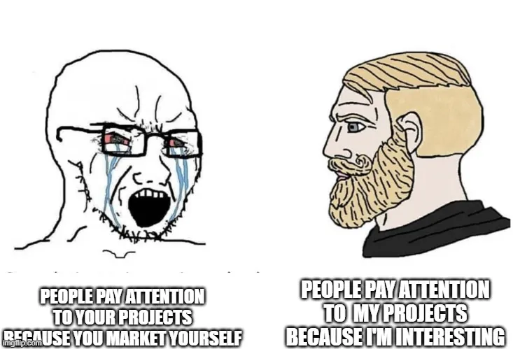

# HuggingFace 🤗 的崛起
一场关于财富和认同的剧本杀
-----

## 异化

从外人的角度来看，人们可以通过共同的集体行为来识别一个社群，这个共同集体行为可以是俚语、服装抑或是共有价值观。

你如何解读下图中的外套？为了增加实境感，想象一下图片中的人戴着蓝色工卡，头向下微倾，似乎在试图避免目光接触。再闭上眼睛，想象一下他们正在咖啡馆里用贴有公司贴纸的银色 MacBook 为自己的私活编写代码。正值周末，下一个成功人士有可能就在他们之中。

在任意一个正常人看来，他们确实看起来一模一样。

## 对意义的追寻

我们在现实世界中小心翼翼地藏起自己的与众不同，然后将其恣意挥洒至网络世界。昔日的超级英雄已死，我们不需要一位披着斗篷的斗士来保护我们免受暴政的侵害，我们需要[一位风险投资人来扮演市长以帮我们更好地管理城市的衰落](https://www.piratewires.com/p/extract-or-die)。危险藏在过程之中，它不来自于我们的敌人，我们渴望命运的波澜，并从古人的智慧中寻求庇护。拯救我们的不是超人，而是[林迪之神](https://en.wikipedia.org/wiki/Lindy_effect)。

那么救赎之道又在何方呢？为什么很多聪明人既富有又被疏远？这是最好的时代，史上首次，书呆子可以得到如此丰厚的报酬，但似乎还少些什么。也许，为了这些财富搬到半个地球外的一居室公寓里住并不值得。他们该如何满足自己的安全需求？做白日梦或是让自己保持忙碌这两种方法的效果都比不上为社区做贡献。

那么，当别人的、跟我们相同的项目变得比我们自己的项目规模更大时，为什么我们会感到不安呢？嫉妒是否背叛了我们的初心？我们为什么要使用软件工具呢？

## 软件工具即实现

人们使用软件不仅仅是因为它解决了业务问题，还因为它解决了核心情感需求。

> Mark Saroufim 
> 流行开发工具不仅仅解决问题，它们解决核心情感需求。
> * HuggingFace 让你感觉自己很聪明
> * Unity 让你回到童年
> * Github 让你感觉自己被看见
> * Fastai 让你有归属感
> * VSCode 让你感觉自己像个匠人
>
> 3:54 上午 ∙ 2021 年 4 月 4 日
> 202 点赞 17 转发

解决技术问题意味着你的用户会用金钱来换取该问题的解决方案。

解决情感问题意味着你的用户会成为社区成员，他们将贡献代码、想法、博文、视频以及伴随关注而来的一大堆“身外之物”，从而将你推向成功。

> 不久的将来，成功的开发工具都将是社区。

有多少企业可以声称能够帮你解决心理和自我实现需求？其市值将是国家、宗教以及娱乐业的历史总和。

然而，由于未能满足这些情感需求，大多数机器学习初创公司很难取得任何广泛的成功。

## AI 的商业模式
> AI 可以告诉我们应该投资哪些项目吗？

AI 不会帮你实现产品市场契合（PMF，Product Market Fit），但一旦你找到了 PMF，它可以帮你将业务拓展到前所未有的高度。

机器学习初创企业的商业模式传统上分为五大阵营，我按照盈利能力的提高对这五大阵营进行了分类。

**服务**
- 模式：按推理向用户收费
- 优点：商业模式清晰
- 缺点：模型蒸馏使护城河无法筑就，一篇论文就可以将其颠覆
- 代表：Clarif.ai

**咨询**
- 模式：帮助没有机器学习专业知识的企业使用机器学习
- 优点：唾手可得的成果很多，而且上升空间很大
- 缺点：只有当机器学习持续高门槛时才可持续（不太可能）。绝大多数机器学习初创公司都是咨询公司。
- 代表：大多数 ML 初创公司
- 例外：如果你是 Geoffrey Hinton 级别的人物，可以创办一家公司，然后被收购，这样可以免于你像我们这些普通人一样只是被雇佣。

**媒体**
- 模式：发表精彩论文并引起广泛关注
- 优点：你可以从事任何你想从事的工作，并雇佣最优秀的人才
- 缺点：当且仅当你超有才或超有钱
- 代表：OpenAI
- 注意：OpenAI 最难估值，因为 AGI 满足可能性小，回报无限的条件。因此，如果成功了，这些人就会与爱因斯坦和牛顿这些伟人齐名；如果失败了，这就会成为庞氏骗局。

**平台**
- 模式：人们在你的平台上构建自己的服务
- 优点：很好估值，其价值是构建在其之上的所有东西的价值乘以一个百分比。
- 缺点：把平台搭建起来很难
- 代表：Weights and Biases

**社区**
- 内容：平台 + 强大的社群认同
- 优点：平台、媒体、宗教三合一
- 缺点：超难搭建起来
- 代表：Hugging Face

了解自己在哪个阵营对你的成功至关重要。如果你自认正在搭建一个平台，但实际上你在创建一个媒体业务，那么你不仅要与你的平台竞争对手竞争，还要与最好的媒体对手竞争。

如果你的目标客群是传统金融机构，那么开放性和新颖性就是负担。

传统的企业销售会让你弄出一些有用的东西，然后尝试将其出售给那些较大的云公司，这些公司的 ML 建模流水线一般如下图所示。

这些大公司不需要你的服务、媒体、咨询服务以及平台，因为每一块他们都有很多内部版。对于机器学习初创公司来说，当你的目标客户是大型企业时，上面绝大部分的价值定位仿佛都失效了。

唯一可以让大型机器学习公司陷入困境的是大型社区，出于生存的需要，他们最终不得不支持这些社区。

拥抱、扩展、消灭是对抗强大社区的唯一制胜策略，但该策略仍有无法保证致命一击的风险。

## 梅特卡夫定律

梅特卡夫定律是为盈利之前的社交网络估值的一个很好的方法。社区的价值随着用户数量的平方而增加。同时，一个由创造者而非消费者组成的社区会将这个指数提高得更多。

我之前称 OpenAI 是一家媒体公司，但这一观点被广泛误解。我应该说的是，学术界属于媒体行业，其产出会争夺所有研究人员有限的注意力。OpenAI 恰好在这方面做得最好。

> 媒体是新的营销和招聘策略，但如果没有平台或社区的支撑，它的潜在能量就无法物化为更大的东西。

## 反身性 

你是如何与 🤗 开始第一次亲密接触的？克隆一份他们某个项目的代码库？

如是说 ——

> [“我认为，如今机器学习面临的一大挑战是，大部分权力都集中在几家大机构手中，”他说，“一直都有大型科​​技公司和其他公司向我们表达出收购兴趣，但我们认为拥有一家独立的公司是件好事 —— 这就是我们正在努力做的事情。”](https://venturebeat.com/2021/03/11/hugging-face-triples-investment-in-open-source-machine-learning-models/)

> Hugging Face 是剧本杀吗？

是的！对于任何以线上为先的社区来说，这都是一个特别有效的策略。反身性意味着如果有足够多的人相信某件事，那么它就更有可能成为现实。

2021 年，反身性已成为媒体上一个流行且反复出现的话题。只需购买特斯拉和比特币，就意味着你的表现优于大多数对冲基金。反身性如此强大，以至于像 WallStreetBets 这样的线上群组可以通过 💎🙌 来协调，发起一场反对现有金融体系的全球和平革命。

“如果有足够多的人相信某件事，那么它就会变成事实” 这句话最终和“人多力量大”一起进入了主流词典。

如果 Hugging Face 相信自己将是属于未来的机器学习公司，那么无论事实如何，世界都会变得更加有趣。他们越是坚信这一点，像我这样的人就越有可能相信这一点，撰写有关他们的文章，然后反馈循环就会继续下去。

我们都渴望好的故事。

## FOMO 保险

HuggingFace 将自己定位为机器学习领域的 npm[译者注：npm（Node Package Manager）是 Node.js 的默认安装包管理器]，但他们真正卖的是什么？他们不是云提供商，所以他们卖的不是请求；他们把算法全部开源了，所以他们卖的也不是算法。

> HuggingFace 卖的是 FOMO 保险

FOMO（Fear of Missing Out，错失恐惧） 是真正困扰你的情感问题，它迫使你下注，以逃离无休止的分析麻痹的折磨，但这些局面需要很长时间、很多教育和很大勇气才能看透。此时，Hugging Face 给你一个拥抱并告诉你一切都会好起来。

如果我是他们，我会这么推销 Hugging Face：“不要担心你需要了解或支持哪种 transformer 架构的具体细节，我们会为你实现它们，并告诉你哪种架构最适合你。某一天，当你找到合适的数据集，开始创业或得到晋升，我们可以向你保证，到那时，我们为你提供的数据集加载器将是最佳选择。”

“百利而无一害”是一个很诱人的价值主张。特别是如果 transformer 模型已成为通用计算引擎的话。当然，在我看来，上述说法暂无定论。

但即使没有定论，反身性仍然可能使 transformer 模型成为解决大多数问题的最佳架构。硬件将针对它们进行超优化并报告其在公开基准上的表现，编译器工程师将一展他们的各种 IR、融合、递降技巧，以使其成为运行 transformer 模型的最佳选择。从当前的情况而言，即使长远来讲是其他某个技术最终胜出，我们也需要付出很多努力才能摆脱这种局部最优。

## 精益创业再度回归

精益创业方法论认为，打造一家成功公司的最佳方式是弄清楚用户想要或需要什么，并帮他们做出来。但对于开发工具，我们人为地将用户在个人层面上想要的东西与他们在专业层面上想要的东西区分开来。

TensorFlow 于 2016 年发布，得到了史上最大的公司之一的支持，在 Github 上有大约 15.5 万星。Hugging Face 是一个由几名研究人员发起的项目，拥有 4.48 万星。

> Github 星是衡量任意开发工具 PMF 的最佳指标

PMF 并不能保证你能够取代科技巨头，但缺乏 PMF 则保证你无法取代科技巨头。如果你无法说服任何人免费使用你的产品，你又如何说服他们付费呢？

再举一个例子：编程语言 Julia 之所以能快速运行程序，是因为有两个核心特性：多分派和 Julia 社区。

多分派可以帮助你编写运行速度快的通用代码。而因为有了社区，如果你在任何地方公开宣布 Julia 运行缓慢，就会有一个 Julia 社区成员重写你的整个代码库，并纠正你的说法。

## Historical Fiction
> 历史是从最擅长讲故事的人的角度讲述的。

你会如何从业务角度为一个社区估值？无限？零？还是介于两者之间？

如果当前的为企业估值的模型未能体现出 Github 星或 Twitter 粉丝等指标的重要性，那么我们不应该大喊“泡沫”，而应当承认，我们现有的解释体系和叙事结构并不能充分解释 Hugging Face 的崛起。

17 世纪持续 6 个月之久的郁金香狂热把我们吓怕了，使我们无法认识到范式转变何时发生。

> HuggingFace 的护城河是社区而不是源代码

## OSS 的宗教

宗教可以说是解决情感问题的最佳结构。最好的 OSS 与宗教有很多相似之处。
- 创立时刻：第一次签入代码
- 经文：Git 历史
- 牧师：PR 合入者
- 见习牧师：PR 提交者
- 关注者：用户、博主、粉丝

未来的每家公司都将是一个社交网络，通过聚拢受众，他们可以创建更加紧密的社群身份。

## 修补与改进

举个例子，如果我真的想看到石榴糖浆可乐上市，我就需要赢得一些可口可乐比赛，可能会有大量参赛者，可口可乐高管之间会举行幕后会议，整个供应链需要协调一长串复杂的命令。无论我多么努力，我最多也只能是一个可口可乐消费者，而不是社区成员。

也许马克思说过的唯一明智之言就是他的异化理论，该理论认为，工人如果被剥夺了思考和参与产品设计的权利，就一定会感到被异化。OSS 社区通过让一切都可自省、可混编、可改进来解决这一问题。

下次你拖延回答 Github 问题或项目上的 PR 时，请考虑一下另一端的真人是否希望引起你的注意，是否会因未得到你的注意而感到沮丧或不安。如果你投入更多时间和精力，这个人可能会成为项目的维护者。我们都需要我们钦佩的人的鼓励，因此请帮助初次维护者划定他们的贡献，不要吹毛求疵，让他们感到被重视和赞赏，即使这个贡献很简单。

## 薛定谔的基准

> 如果你发布的基准测试暗示某个数据库公司或硬件供应商的东西速度很慢，他们会直接起诉你

- 开源公司：开个 Github 问题并提高产品性能

- 闭源公司：起诉那些说它性能差的人

闭源基准测试可能快也可能慢，这取决于运行这些基准的人希望它快还是慢。

而开源产品则在不断的用户反馈中变得更加强大。

## 招聘人员的困境

1. 我们只招最优秀的人

2. 最优秀的都有 offer 了

3. 😢

我从招聘经理那里听到最多的抱怨就是他们找不到好的候选人。我的看法是，这是自找的，失败的原因他们对于好的定义过于狭隘，即：在更有名的竞争对手那里工作。

拥有强大社区的开源产品意味着你可以聘请最优秀的人才而无需支付高薪，而且你将免费获得源源不断的贡献和错误修复。

社区是招聘人员的妙招，聘请主要贡献者担任软件工程师，聘请最佳文档写手担任营销人员，聘请解 bug 的人担任产品经理。他们是近在眼前的满分员工，给他们一份湾区薪资，告诉他们可以远程工作，这样你就有了一名优秀而忠诚的员工。

这一策略大大降低了公司的招聘风险，同时Hugging Face 没有适合他们的职位，这也为候选人提供了一个好的对冲。如果你告诉全世界，他们获得 6 位数 ML 工作的最佳路径是为 Hugging Face 做出贡献，那么很多人都会为 Hugging Face 做出贡献，其中一小部分人可能会非常优秀。Hugging Face 生态系统和技能组合对其他科技公司来说会变得更有价值。

## 一切都很棒！

那么，为什么所有 ML 初创公司都会发布教程和博客文章呢？这不是因为他们想这样做，而是因为他们不得不这样做。他们也试图以剧本杀的方式进入社区，但却没有获得共鸣。有点像你父母的怪朋友，认真建议你什么是真正的生活，而你只是礼貌地点头，心早就飞到了九霄云外。

“内容营销”在很大程度上过于安全，它就像一种经过精心加工的香草味冰淇淋，只会被尽可能少的人讨厌，但几乎没人喜欢。你很棒，你的竞争对手很棒，一切都很棒！

你无法通过在产品之上强行制定“内容策略”来建立社区。Hugging Face 会与用户进行个人、频繁且公开的互动。无需薪水或股权，你就会支持项目和创始人。

一个社区只有接受被讨厌，才能建立强大的社群认同感。游戏开发者非常了解这一点。社区需要具备说我不喜欢某款产品或某家公司的能力。

举个例子，DOTA 2 中最令人讨厌的角色永远不会从游戏中移除。Techies 是一个在地图上放炸弹的角色，它可以触发炸弹杀死地图另一侧的游戏中几乎任何英雄。Techies 可以让 DOTA 游戏从平均 30 分钟拖到 90 多分钟。但玩 Techies 的少数玩家非常喜欢他，他们经常只玩这个英雄。

## 总结

1. 在线社区正在取代宗教
2. 开发工具需要成为开放的在线社区
3. Hugging Face 是机器学习初创企业的一个极好的可复制案例
4. 玩得开心，结交朋友，玩更多剧本杀

## 结尾

上述大多数想法在游戏开发者中广为人知，但最近在开源社区中也越来越明显。Hugging Face 可能是最接受上述所有想法的 ML 公司。

我一直想写更多关于游戏开发者的文章，以及我们在开创其他类型的软件业务时可以从他们身上学到什么。所以请继续关注，如果觉得不错的话一定要订阅。

## 致谢

感谢 sudomaze、oiboimishka 和 mczuggins 在我在 twitch.tv/marksaroufim 上直播写这篇文章时陪伴我。

Ainur Smagulova、Jason Antic、Hamel Husain、Adam Nemecek 和 Andrew Carr 提供了宝贵的反馈。

和往常一样，Robot Overlord Discord社区是我最近许多想法的策源地。

> 英文原文: <url> https://marksaroufim.substack.com/p/huggingface </url>
> 原文作者：Mark Saroufim
> 原文发表时间：2021 年 4 月 27 日
> 译者: Matrix Yao (姚伟峰)