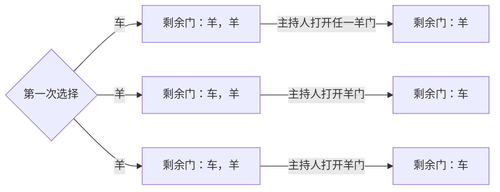
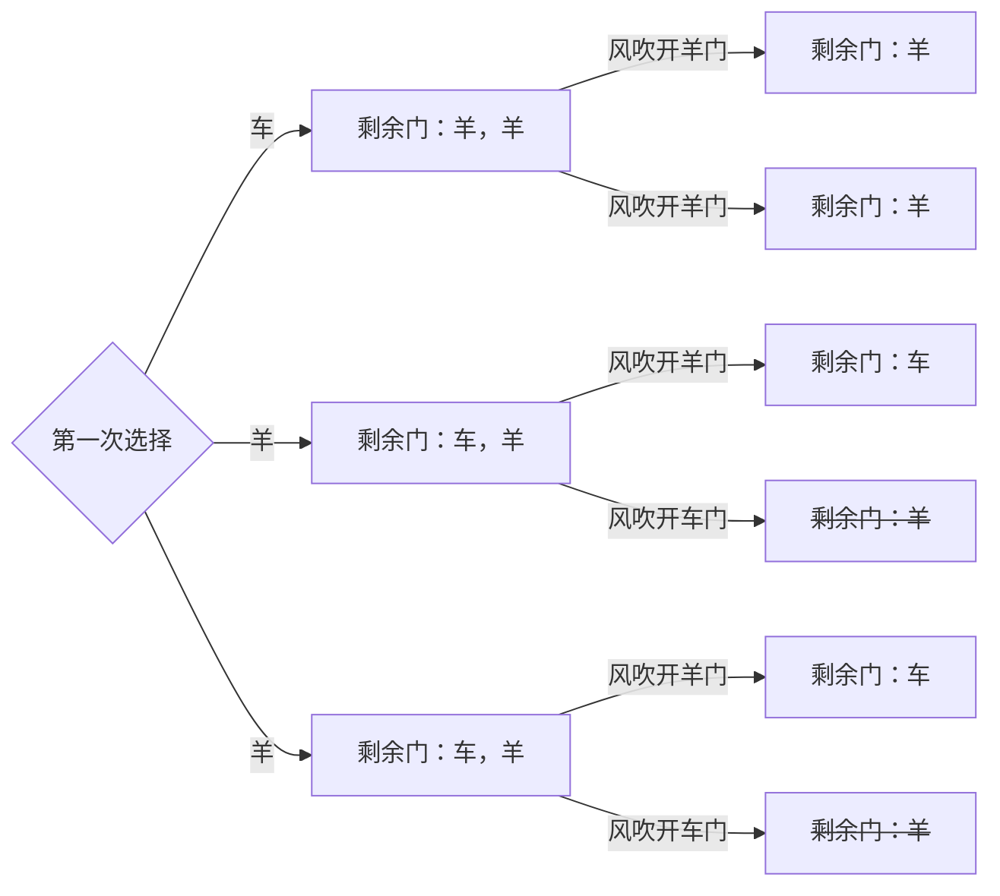

# 三门问题

## 问题

在某个电视节目比赛环节中，参赛者会看见三扇关闭了的门，其中一扇的后面有一辆汽车，选中后面有车的那扇门可赢得该汽车，另外两扇门后面则各藏有一只山羊。参赛者选定了一扇门，但未开启它，随后节目主持人蒙提霍尔（Monty Hall）开启剩下的两扇门中有山羊的一扇，此时主持人会给予选手重新选择的机会。问题是：此时参赛者换另一扇门会否增加赢得汽车的机率？

## 分析与解答

### 第一次选择

参赛者第一次选择时，其面对的概率空间为：`{（羊，羊，车）}`，用球罐模型来建模，即有 1 个球罐，球罐内每个样本等可能。

所以其选到车的概率为：$p(车) = \frac{1}{3}$

### 第二次选择

主持人开启剩下的门中有羊的一扇门后，概率空间有没有发生变化？

可以看到，`主持人打开羊门`后，此时，关闭的门的概率空间发生了变化，为：`{（车，羊），（羊，车），（羊，车）}`。用球罐模型来建模，即有 3 个球罐，每个球罐等可能，且任一球罐内每个样本等可能。在此概率空间，参赛者已拥有每个球罐的第一个样本，其为车的概率为：

$$p(车) = \frac{1}{3} * 1 + \frac{1}{3} * 0 + \frac{1}{3} * 0  = \frac{1}{3}$$

剩余样本为：`{（羊），（车），（羊）}`，其为车的概率为：

$$p(车) = \frac{1}{3} * 0 + \frac{1}{3} * 1 + \frac{1}{3} * 1  = \frac{2}{3}$$

因此，在`主持人打开羊门`这一确定事件后，剩下的那扇门内有车的概率为 $\frac{2}{3}$，大于已选门内有车的概率 $\frac{1}{3}$。

综上，应该换门。

## 变形：如果是风吹开了随机一扇门，而恰巧那扇门后是样呢？

### 第一次选择

参赛者第一次选择时，跟原问题一样，用户有 1 个球罐，球罐内样本为 `{（羊，羊，车）}`，且每个样本等可能。

所以其选到车的概率为：$p(车) = \frac{1}{3}$

### 第二次选择

风吹开羊门后，概率空间的变化如下：

可以看到，`风吹开羊门`后，关闭的门的概率空间变成了：`{（车，羊），（车，羊），（羊，车），（羊，车）}`。用球罐模型来建模，即有 4 个球罐，每个球罐等可能，且任一球罐内每个样本等可能。在此概率空间，参赛者已拥有每个球罐的第一个样本，其为车的概率为：

$$p(车) = \frac{1}{4} * 1 + \frac{1}{4} * 1 + \frac{1}{4} * 0 + \frac{1}{4} * 0 = \frac{1}{2}$$

剩下样本的概率空间为：`{（羊），（羊），（车），（羊）}`，其有车的概率为：

$$p(车) = \frac{1}{4} * 0 + \frac{1}{4} * 0 + \frac{1}{4} * 1 + \frac{1}{4} * 1 = \frac{1}{2}$$

因此，在`风吹开羊门`这一随机事件后，剩下的那扇门有车的概率为 $\frac{1}{2}$，换门无益无害。

综上，可换可不换。
